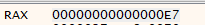
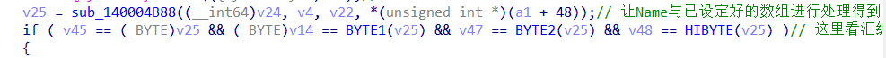

# 010editor 最新V12版本逆向算法以及暴力破解


网上和论坛全是32位 老版本的010 editor破解的教程，没有64位版本，自己也需要用，可是软件太贵了，于是自己尝试了一下暴力和算法逆向写注册机两种方法进行破解。使用的版本是v12.0.1 64bit，在该博客发表时还是官网最新版。

该博客仅用作个人技术学习交流，勿用于其余用途，请在自己经济条件允许的情况下支持正版。

#### 0x00 爆破法

把010 editor放入x64dbg运行起来，然后在tool->register处随意输入序列号，此时会弹出对话框，再到x64dbg中搜索该字符串，于是可以跳转到认证序列号的代码处。

如下图所示，当我们在使用该字符串的地址处打上断点，再次check license后就会在断点处停止


在图中指令 mov edx,90 的上一条指令为jmp指令，如果程序从该指令以上执行下来的话便不会再执行图中的指令，那么我们可以推测程序存在某处跳转，让程序从mov edx,90指令 开始执行，如是查看 mov edx,90的交叉引用，如下图所示


在地址7FF7F967574F处存在jne 7FF7F9675819，即跳转到mov edx,90处的指令

那么继续往上看，地址7FF7F967574F处的jne是判断那两个数据不相同时才跳转


如上图所示，若ebx不等于93那么就会跳转至弹出序列号不正确的代码处，如果相等则会判断edi是否等于73，如果等于则会弹出提示“密码正确，试用期延长”的窗口。我们在地址7FF7F967574F处打上断点，查看各使用的寄存器的值，以此判断是在哪些地方发生了跳转


可以发现，edi = 117 != ED != 20C因此会直接运行到cmp ebx,93处，而此时ebx=E7 !=93，因此发生了跳转，而且edi = 117 !=71，但cmp edi,71处的跳转到的代码并不是我们所期望的，因此我们进追踪ebx有关的代码

同时在地址7FF7F9675731处的上一条指令为jmp ，且跳转到我们并不需要的代码段处，因此可以判断该jmp在此次运行中并不会执行，那么就存在某处的jxx指令跳转到了地址7FF7F9675731，同样的查找交叉引用，发现地址7FF7F967559B处存在指令jne 7FF7F9675731，如下图所示


可见在地址7FF7F967559B处 会判断edi是否等于EB,等于则会表明序列号正确，否则就会跳转至提示序列号错误的代码处。

其实在这里我们就可以破解了，只需要在此处将edi改为DB即可，但这样我们每次都需要点击check license才行。

再看地址7FF7F967558C处的 mov edi,eax 可以推测为前面的call 的函数的返回值给了edi用来判断是否等于DB，那么进入该函数分析一下，在函数开头打上断点，再次在010 editor 点击checklicense，发现程序并没有在该函数处停下来，那么我们的推测是错误的，那么就在地址7FF7F967558E与7FF7F9675595打上断点，并再次运行，会发现程序停在了7FF7F9675595处，那么肯定是存在跳转指令让程序跳转至此，直接查找交叉引用，我们可以溯源到如下图所示的代码处


这里有两条跳转的指令，打上断点运行，判断是在从哪里跳转的


我们需要让其在cmp edi,DB 处edi等于DB，使其不发生跳转，从而执行序列号判断正确的部分的代码，我们是从cmp edi,DB追踪edi到此，而在上图我们可以看到 在7FF7F967544A call的函数后 mov edi,eax 将返回值给了edi，那么这个edi是否就是后面cmp edi,DB会用的edi？我们打上断点，看看是否会运行这句，如果运行，该edi就会被用到cmp edi,DB，因为我们是从这里一路追踪，也只有该处更改了edi的值。

经过测试，程序确实停在mov edi,eax处，如下图


那么进入 7FF7F967544A处 call的函数进行分析即可




此时RAX=E7，那么程序会跳转至7FF7F97CAE2C，那么我们查看该处代码


可以发现这里的 eax = 177，与之前我们获取的edi = 177相同，那么此处也会存在 mov eax,DB的指令


显然就是若该函数跳转至此那么就能使edi = DB，而跳转到该处的代码为下图


那么我们只需要把7FF7F97CAD9D处的指令由je改为 jmp即可


验证结果如下


接着打补丁即可。

#### 0x01 逆向算法

从爆破法的破解过程我们可以发现关键函数，并且要求关键函数返回0xDB，进入关键函数查看，函数内部如图


只有当地址7FF5EF9AD95处call的函数返回值为0x2D才能让该关键函数返回值为0xDB，那么推测序列号加密算法以及判断序列号是否正确的代码就在该7FF75EC118函数里。进入函数进行查看。

在后面的调试可以发现在如下指令下进行了判断Name字符串以及Password字符串是否为空，寄存器rax+4分别保存着Name和Password两个字符串的长度数据，可以看到分别为0x3，0x18，转为十进制后大小与实际字符串长度相同


并且进入地址7FFC6C84CA341处call的函数调试可知，其两个两个的取出了Password中的字符串进行运算，运算结果保存在了rdx的地址中，在之后会使用。

可以判断该处代码正在进行Password的编码，那么该处大概率进行序列号正确的判断，进入函数7FF6C8185650进行调试，发现由两部分代码都是在重复的做某件事，

第一部分


进入图中 call的9QByteRef函数进行查看，可以发现这部分代码就是在判断Password每间隔4个字母是否为“-”，还可以发现这部分代码只有mov dword ptr ss:[rbp-18],X,不同，并且每次都是以大小5的幅度增加，由0x4增加到0x13，刚好判断了4个“-”


继续往下调试会发现在做着重复的事情的第二部分代码


进入函数BQBytreRef，跟踪调试，会发现其读取Password的数据存储在eax中，那么该函数的功能就是读取Password的单个字母


再进入7FF6C818A1DC函数进行查看调试，会发现该函数根据al和dl寄存器的值（最初的值就是取出的Password的字母）进行判断，然后执行一些加减运算再存入eax中


接着处理后的字母数据存入ebx，再执行shl bl,4，即把bl左移4位，接着再次调用BQByteRef的函数取出下一个Password的字母，然后对该字母再次通过函数7FF6C818A1DC对该字母进行处理，然后与上一次处理的字母以十六进制方式相加，并保存在rdi寄存器的地址中。

该两部分代码都是在对Password进行编码处理，处理结果保存在rdi寄存器所保存的地址里。回到调用处理Password函数的代码处，即地址7FFC6C84CA341。

我们将经算法处理后的Password数据定义为key[10]

后面的汇编代码过于复杂，打开ida查看该处反编译得到的C代码会更容易分析。

ida查找到该处也是先找到关键字符串所在位置，即序列号识别成功后弹框的字符串，该部分代码如下图


那么跳转至该处的关键为v17是否等于219，也就是0xDB，而v17变量值的来源如下图的函数


进入sub_140084F4函数，会发现只有当v6 = 0x2D时才会返回219，因此可以判断该函数就为在x64dbg中我们所发现的关键函数，该函数在ida如下


再进入sub_140006118函数查看，前面说到判断Name和Password的长度对应在C代码为


a1+8 为Name字符串数据的保存地址，a1+8+4就为Name的长度的数据，a1+16为Password字符串数据的保存地址，al+16+4就为Password的长度

在x64dbg中地址为7FFC6C84CA341的call的函数对应到ida的函数为


观察后面的do-while循环，我看不出这里做了什么，但是这里用到了对Password处理后的数据，似乎是在检验处理后的Password数据是否符合规定。因为这部分用到的变量并不影响后面的核心算法，因此不再分析。

再看后面的赋值代码，由前面处理Password后的数据存放在&v41这个信息，以及根据ida创建变量时给的注释（v41 = [rbp-20h],v43 = [rbp-1eh]），我们可以判断Password处理后得到的数据以数组形式保存，数组起始地址为&v41，&v41-&v50为连续的地址，且都保存着相应地址上的处理后的数据，这也就是为什么之前我们定义为key[10]数组的原因。因此v13-v18就直接保存了经Password编码算法处理后得到的数据。


为了验证，我们在x64dbg中查看程序运行到该处时的rbp-20h的数据，从dump中可以看到此处的数据与我们所推测的相同


将Password通过编码算法处理后得的数据定义为key[10]数组，那么上述赋值就为v13 = key[7], v14 = key[5],v15 = key[2], v16 = key[1],v17 = key[0],v18 = key[3]

再看switch(v44) 语句，可以判断只有当key[3]为0x9c，0xfc和0xac时才能进入第二段算法，因为该函数需要返回0x2D才能让关键函数返回0xBD，因此我们只关注能返回0x2D的分支。

若要返回0x2D，那么该分支会跳转至LABEL_33处，那么0xfc的分支可以直接排除掉；0x9c分支并未使用key[8]与key[9]的数据，因此可以推断该分支只生成8Byte的Password；而0xac的分支使用了key[8]与key[9]，因此是可以生成10Byte的Password，我们只需分析其中一个分支就可以，这里我们分析key[3]=0xac的情况。


这部分流程就是通过一些对key的一些数据进行计算后获取v23和v29两个主要变量，其中v23-1<=0x3E7，因此v23取值范围必须为[0x1,0x3E7]

接着跳转到LABEL_26继续分析


LOBYTE(v4)我们可以通过查看对应的汇编代码来理解其作用，这里0x0Fc是-4，那么就是使用rdx的低八位与-4相比较，如果不相等就将rsi的低八位置0。


然后对Name进行一些格式的处理后保存在v24上，在函数sub_140004B88中传入了v24，推测是对Name字符串进行一些算法处理，进入该函数调试发现，该函数确实将Name的每个字符都进行了一些处理，并且还有一个很大的数组dword_140B34AD0保存着用来编码处理Name的数据。


回到调用编码Name字符串函数的代码处继续分析，


对于第一个if，我们对照汇编代码来理解，可以发现BYTE1、BYTE2、HIBYTE都是对v25进行右移后再判断


第二个if，v18 == -100 ( 0x9c)，而我们执行的分支为v18 = 0xac因此不进入该if，同样对于if( v18 == -4 (0xfc))也跳过，因此该分支将会直接执行else if(v29)的代码，又因为我们必须渠道LABEL_33才能返回0x2D，因此v29必须大于v35


我们追溯v35的值，发现其为加密算法函数的第三个传入参数，一直追溯到该函数调用时的汇编代码，我们可以发现，该函数的第三个参数大小为常数0x49C7


因此v29需要大于0x49C7。

那么以上就分析完了010 editor的算法流程

#### 0x02 注册机代码

在上述算法流程的分析过程我们可以发现两部分算法，第一部分是先对Password进行第一步处理获得key，然后判断key的第四个元素是不是0xac，是才能进入下一部分算法，第二部分算法先通过两个对key数据处理后得到两个变量，这两个变量再传入对Name编码的函数，这样Name和Password就产生了关系。

我们需要反过来求key值，首先总结一下第二部分算法使用到的key值

第一个算法为


```c
a1 = ((v23*0xb ^ 0x3421) - 19760)^0x7892
a1 = ((key[5]^key[2])+((key[7]^key[1])<<8))
```

第二个算法为


```c
a1 = (((((v29*0x11) ^ 0xffe53167) + 180597) ^ 0x22c078) ^ 0x5B8C27) & 0xffffff
a1 = (key[6]^key[0])+((key[5]^key[9])<<16)+((key[8]^key[4])<<8)
```

再看对Name进行编码的算法函数使用的参数为v24(转换格式后的Name字符串)、v4 = 1(因v18!=-4)、v22 = v29、(a1+48)=v23，并且编码后的数据赋予v25，然后在判断v25的低8位、低16位、高32位、高64位是否分别等于key[4]、key[5]、key[6]、key[7]，



而我们所执行的分支要求必须相等，因此我们也就可以对Name编码后求出key[4 - 7]的数据。

当我们获得key[4 - 7]的数据后，就可以再通过逆向求解对key数据编码的两个算法就能获得其余key的数据，但是这里有一个问题，就是我们缺少v29 以及 v23两个关键数据进行算法逆向计算。

在之前的流程分析，我们可以发现v23的取值在[0x1,0x3E7]之间，v29必须大于0x49C7，那么我们只需要在两个变量的取值范围随机取值即可，可以给两个变量赋符合条件的常数，也可以通过rand() % 0x3E7获得v23，rand() + 0x49C8获得v29。在这里我们直接给常数即可。

到后面我发现v23 变量是一对Name和Password可以使用的用户数量，v29是和使用期限有关的数据。

综上，注册机的思路理清，那么就可以开始写代码了。

在此之前我们需要获取Name编码时所需要的大数组数据，我们通过x64dbg调试到编码Name的函数里(因为我们填的Name以及Password不能让程序执行到这，因此需要手动更改程序跳转条件，让程序能够执行到编码Name的函数)。我们在ida查看该数组会发现后面还接了0x34大小的0数据，因此我们在复制的时候还需要考虑这个细节。


首先是对Name编码的算法，我们直接参照ida反编译的代码进行编写

```c
DWORD LockName[] = {
0x39CB44B8, 0x23754F67, 0x5F017211, 0x3EBB24DA, 0x351707C6, 0x63F9774B, 0x17827288, 0x0FE74821,
0x5B5F670F, 0x48315AE8, 0x785B7769, 0x2B7A1547, 0x38D11292, 0x42A11B32, 0x35332244, 0x77437B60,
0x1EAB3B10, 0x53810000, 0x1D0212AE, 0x6F0377A8, 0x43C03092, 0x2D3C0A8E, 0x62950CBF, 0x30F06FFA,
0x34F710E0, 0x28F417FB, 0x350D2F95, 0x5A361D5A, 0x15CC060B, 0x0AFD13CC, 0x28603BCF, 0x3371066B,
0x30CD14E4, 0x175D3A67, 0x6DD66A13, 0x2D3409F9, 0x581E7B82, 0x76526B99, 0x5C8D5188, 0x2C857971,
0x15F51FC0, 0x68CC0D11, 0x49F55E5C, 0x275E4364, 0x2D1E0DBC, 0x4CEE7CE3, 0x32555840, 0x112E2E08,
0x6978065A, 0x72921406, 0x314578E7, 0x175621B7, 0x40771DBF, 0x3FC238D6, 0x4A31128A, 0x2DAD036E,
0x41A069D6, 0x25400192, 0x00DD4667, 0x6AFC1F4F, 0x571040CE, 0x62FE66DF, 0x41DB4B3E, 0x3582231F,
0x55F6079A, 0x1CA70644, 0x1B1643D2, 0x3F7228C9, 0x5F141070, 0x3E1474AB, 0x444B256E, 0x537050D9,
0x0F42094B, 0x2FD820E6, 0x778B2E5E, 0x71176D02, 0x7FEA7A69, 0x5BB54628, 0x19BA6C71, 0x39763A99,
0x178D54CD, 0x01246E88, 0x3313537E, 0x2B8E2D17, 0x2A3D10BE, 0x59D10582, 0x37A163DB, 0x30D6489A,
0x6A215C46, 0x0E1C7A76, 0x1FC760E7, 0x79B80C65, 0x27F459B4, 0x799A7326, 0x50BA1782, 0x2A116D5C,
0x63866E1B, 0x3F920E3C, 0x55023490, 0x55B56089, 0x2C391FD1, 0x2F8035C2, 0x64FD2B7A, 0x4CE8759A,
0x518504F0, 0x799501A8, 0x3F5B2CAD, 0x38E60160, 0x637641D8, 0x33352A42, 0x51A22C19, 0x085C5851,
0x032917AB, 0x2B770AC7, 0x30AC77B3, 0x2BEC1907, 0x035202D0, 0x0FA933D3, 0x61255DF3, 0x22AD06BF,
0x58B86971, 0x5FCA0DE5, 0x700D6456, 0x56A973DB, 0x5AB759FD, 0x330E0BE2, 0x5B3C0DDD, 0x495D3C60,
0x53BD59A6, 0x4C5E6D91, 0x49D9318D, 0x103D5079, 0x61CE42E3, 0x7ED5121D, 0x14E160ED, 0x212D4EF2,
0x270133F0, 0x62435A96, 0x1FA75E8B, 0x6F092FBE, 0x4A000D49, 0x57AE1C70, 0x004E2477, 0x561E7E72,
0x468C0033, 0x5DCC2402, 0x78507AC6, 0x58AF24C7, 0x0DF62D34, 0x358A4708, 0x3CFB1E11, 0x2B71451C,
0x77A75295, 0x56890721, 0x0FEF75F3, 0x120F24F1, 0x01990AE7, 0x339C4452, 0x27A15B8E, 0x0BA7276D,
0x60DC1B7B, 0x4F4B7F82, 0x67DB7007, 0x4F4A57D9, 0x621252E8, 0x20532CFC, 0x6A390306, 0x18800423,
0x19F3778A, 0x462316F0, 0x56AE0937, 0x43C2675C, 0x65CA45FD, 0x0D604FF2, 0x0BFD22CB, 0x3AFE643B,
0x3BF67FA6, 0x44623579, 0x184031F8, 0x32174F97, 0x4C6A092A, 0x5FB50261, 0x01650174, 0x33634AF1,
0x712D18F4, 0x6E997169, 0x5DAB7AFE, 0x7C2B2EE8, 0x6EDB75B4, 0x5F836FB6, 0x3C2A6DD6, 0x292D05C2,
0x052244DB, 0x149A5F4F, 0x5D486540, 0x331D15EA, 0x4F456920, 0x483A699F, 0x3B450F05, 0x3B207C6C,
0x749D70FE, 0x417461F6, 0x62B031F1, 0x2750577B, 0x29131533, 0x588C3808, 0x1AEF3456, 0x0F3C00EC,
0x7DA74742, 0x4B797A6C, 0x5EBB3287, 0x786558B8, 0x00ED4FF2, 0x6269691E, 0x24A2255F, 0x62C11F7E,
0x2F8A7DCD, 0x643B17FE, 0x778318B8, 0x253B60FE, 0x34BB63A3, 0x5B03214F, 0x5F1571F4, 0x1A316E9F,
0x7ACF2704, 0x28896838, 0x18614677, 0x1BF569EB, 0x0BA85EC9, 0x6ACA6B46, 0x1E43422A, 0x514D5F0E,
0x413E018C, 0x307626E9, 0x01ED1DFA, 0x49F46F5A, 0x461B642B, 0x7D7007F2, 0x13652657, 0x6B160BC5,
0x65E04849, 0x1F526E1C, 0x5A0251B6, 0x2BD73F69, 0x2DBF7ACD, 0x51E63E80, 0x5CF2670F, 0x21CD0A03,
0x5CFF0261, 0x33AE061E, 0x3BB6345F, 0x5D814A75, 0x257B5DF4, 0x0A5C2C5B, 0x16A45527, 0x16F23945,
0x00000000, 0x00000000, 0x00000000, 0x00000000, 0x00000000, 0x00000000, 0x00000000, 0x00000000,
0x00000000, 0x00000000, 0x00000000, 0x00000000, 0x00000000 };

int __fastcall EncodeName(const char * a1,char a3,char a4)
    
{
    int v5; // ebp
    int v6; // rax
    int v7; // r13
    int v8; // rbx
    unsigned __int8 v9; // r14
    unsigned __int8 v10; // si
    unsigned __int8 v11; // r15
    unsigned __int8 v12; // di
    int v13; // eax
    int v14; // r9
    int v15; // er11
    int v16; // r10
    int v17; // ebp
    int v18; // rcx
    int v19; // rax

    v5 = 0;
    v6 = -1;
    int lenOfname = 0;
    // 计算Name字符串长度
    for (; a1[lenOfname]; lenOfname++);
    v7 = lenOfname;
    v9 = 0;
    v10 = (15 * a4)&0xff; //v10为8位整型，因此通过&0xff可取出低八位的数据
    v11 = 0;
    v12 = (17 * a3)&0xff;
    for (int i = 0; i < v7; i++) {
        v13 = toupper(a1[i]);
        v14 = LockName[v12];
        v15 = v5 + LockName[v13];
        v16 = LockName[v10];
        //这里只写了a2==1的分支，是因为我们所执行的分支中a2只会等于1
        // ida反编译得到的代码转化成了unsigned __int8，因此这里也要&0xff取低八位
        v17 = LockName[(v13 + 13) & 0xff];
        v18 = (v13 + 47) & 0xff;
        v19 = v9;
        v12 += 9;
        v10 += 13;
        v9 += 19;
        v11 += 7;
        v5 = v16 + v14 + LockName[v19 ] + LockName[v18 ] * (v15 ^ v17);
    }

    return v5;
}
```

当我们把Name编码并将数据返回给v25后，就可以通过key[4 - 7]与v25的关系求出key[4 - 7]

```c
char key[10];
key[3] = 0xac;
//int v23 = rand() % 0x3E8; //al_48 = v23,而v23需要在[0x1，0x3E7]之间,我觉得给个常数就够了，并不需要rand
int v23 = 0x89; //可使用该账号的人员数量
//int v29 = rand() + 0x49c8; //v29要大于v35 即49C7，也可以用一个满足要求的条件代替
int v29 = 0xffff; //一对Name和Password可使用的期限
char Name[100] = { 0 };
printf("Name: ");
scanf_s("%s", Name, 100);
int v25 = EncodeName(Name,v29,v23);
//通过 (v45 == (_BYTE)v25 && (_BYTE)v14 == BYTE1(v25) && v47 == BYTE2(v25) && v48 == HIBYTE(v25)) = 1 关系求解key[4 - 7]
for (int i = 0; i < 4; i++)
{
    key[4 + i] = (v25 >> (i * 8)) & 0xff;
}
```

求出key[4 - 7]后就可以把其余的key算出来了，我们先看第一个对key编码的算法，

```c
a1 = ((v23*0xb ^ 0x3421) - 19760)^0x7892
a1 = ((key[5]^key[2])+((key[7]^key[1])<<8))
```

通过第一个等式我们可以直接求出a1

```c
int fircall_var = (((v23 * 0xb) ^ 0x3421) - 19760) ^ 0x7892;
```

观察第二个等式我们可以发现，key[5] ^ key[2] 为a1的低八位，且key[5]是已知的，而key[7] ^ key[1]则左移8位到了高八位，且key[7]已知，可通过如下方法求出key[2]与key[1]

```c
key[2] = (fircall_var & 0xff) ^ key[5];
key[1] = ((fircall_var >> 8) & 0xff) ^ key[7];
```

对待第二个对key编码的算法同理，这就不再赘述，直接放代码

```c
int seccall_var = ((((v29 * 0x11) ^ 0xffe53167 )+ 180597) ^ 0x22c078 ^ 0x5b8c27) & 0xffffff;
key[0] = (seccall_var & 0xff) ^ key[6];
key[8] = ((seccall_var >> 8) & 0xff) ^ key[4];
key[9] = ((seccall_var >> 16) & 0xff) ^ key[5];
```

那么注册机代码编写就完成了，结果如下


#### 0x03 忽略网络验证

我们会发现通过逆向得到的正确的Password 会失效，会弹出如下提示，


并且我们再次进入x64dbg中发现的关键函数会发现程序的执行分支改变了


程序在地址7FF79246AD83处并未发生跳转，并且eax = 113，退出该函数继续跟踪，我们会发现这样一个程序执行到了这样一个函数


我们进入该函数，并且ida也跳转至该函数进行查看

ida查找该函数也是先搜索程序提示的字符串，然后发现进入该分支需要v19 = 0，因此给v19赋值的函数就为我们在x64dbg发现的函数，进入该函数分析，找到返回值为0以及返回值大于0的分支


在该函数中关键的代码为下面几个if，


第一个if条件为a2，但是我们发现a2传入的时候为0，且在函数内一直没被更改，因此第一个if并不执行，而return 0xffffffff 又是小于0的数，那么我们只需确保不会进入第二个if，并把0xffffffff 改为 0x1即可

那么进入sub_14000AEED函数中，直接把返回值改为1，并把return 0xffffff改为0x1即可。


更改完成后继续跟踪会发现程序将运行到一个分支跳转处，若该分支不跳转则会出现网络验证失败的警告。我们单步调试发现此处跳转了，如果我们之前并不更改网络验证的返回值为大于0的数，那么此处不会发生跳转。

我们往下看，在地址7FF792315587处call了7FF7921284F4函数，这个函数就是前面需要返回0xDB的关键函数，此时发生跳转后将会再次执行该函数。


调试进入关键函数，会发现他仍然执行了mov eax,113的指令，如果继续运行程序，那么程序将会弹出Password是无效错误的警告。解决该问题的办法就是在这个地方直接返回0xDB，因此我们直接将mov eax,113 改为 mov eax,0xDB即可.


打上补丁再次运行即可忽略网络验证，并继续使用了。


