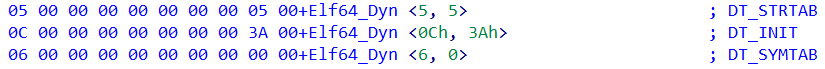

# 136字节大小的so文件如何执行藏匿于程序头的汇编指令


#### 0x0 前言

在之前复现CVE-2021-3060时，搜索到[POC](https://forum.spacehey.com/topic?id=83646)，在里面发现了POC作者使用了如 图0-1 所示的so文件配合openssl的engine参数进行了root权限的获取。

<div><!--块级封装-->
    <center><!--将图片和文字居中-->
    
    <br>  <!--换行-->
    图 0-1 目标so文件 <!--标题-->
    </center>
</div>

在图0-1中被白框框住的数据为汇编指令，其汇编指令内容如下 图0-2 所示，该汇编指令的作用就是通过execve的系统调用运行/tmp/hax脚本。

<div><!--块级封装-->
    <center><!--将图片和文字居中-->
    
    <br>  <!--换行-->
    图 0-2 so文件中的汇编指令 <!--标题-->
    </center>
</div>

图 0-1 的so文件并不是通过gcc或者其他编译器编译生成，而是直接通过webshell使用echo指令将数据写入空白文件生成。

这里以如 图 0-3 所示的hax脚本内容进行演示

<div><!--块级封装-->
    <center><!--将图片和文字居中-->
    
    <br>  <!--换行-->
    图 0-3 hax脚本内容 <!--标题-->
    </center>
</div>

因为POC是通过openssl的engine参数加载的so，经过调试发现openssl的engine参数最终会调用dlopen来将so文件载入，因此下面的演示会通过openssl以及如下代码进行演示。如下代码会编译成runlib可执行程序，目标so文件命名为lib.so。

```c
#include <stdio.h>
#include <dlfcn.h> 

int main(){
    void *handle;

    handle = dlopen("/home/kali/lib.so",RTLD_LAZY);

    return 0;
}
```

使用openssl的engine参数载入目标so文件，与通过dlopen函数载入目标so文件的效果如下 图 0-4 所示，因此通过dlopen函数载入该so文件可以执行 图 0-1 白框内的汇编代码。

<div><!--块级封装-->
    <center><!--将图片和文字居中-->
    
    <br>  <!--换行-->
    图 0-4 so文件的汇编指令执行的演示结果 <!--标题-->
    </center>
</div>

那么就引出了该博客的核心问题，为什么使用dlopen函数可以执行该so文件中的汇编指令？

对于so文件来说，第一次被载入后会执行.init节的代码指令，程序执行完成后会执行.fini节的代码指令。但该畸形so文件并不存在.init节，并且唯一存在的节头类型为NULL，虽然该节头的文件偏移数据刚好为0x3A，也即图0-1中白框汇编指令的起始地址，但NULL类型的节，其数据被视为无意义的。同时，该so文件的ELF文件头的e_entry数据，也即程序入口的虚拟地址为0x2，也与汇编指令的无关。

那么dlopen是如何能够执行这段汇编指令的？

#### 0x1 分析思路

首先直接给出结论，dlopen在载入so文件时，会调用call_init执行.init节的代码。这个so文件里的汇编指令会被执行也就是利用了该机制。

那么问题就来了，为什么能确定dlopen将这段汇编指令视作.init节的内容呢？并且这个so文件又是如何做到能让这段汇编指令被dlopen视为.init节的代码呢？

##### 0x10 为什么能确定这段汇编指令被视作.init节的内容？

由于dlopen源码存在调用链，整体的代码量比较大，并且较为复杂，那么首先就是确认dlopen函数执行后进入的哪个函数将so文件的汇编执行了，然后逆着分析经过的哪些函数获取了so文件中的哪些必要的数据。

因为已经给so文件中的汇编指令的第一个字节改为0xCC，因此直接让程序跑到中断处，再查看backtrace即可，如图1-1所示。

<div><!--块级封装-->
    <center><!--将图片和文字居中-->
    
    <br>  <!--换行-->
    图 1-1 backtrace <!--标题-->
    </center>
</div>

由图1-1可知，进入call_init后，so文件中的汇编指令就会被执行了，如图1-2所示，此时程序执行到了int 3中断处，并且RIP寄存器指向的指令的二进制数据刚好为图0-1白框内的数据。

<div><!--块级封装-->
    <center><!--将图片和文字居中-->
    
    <br>  <!--换行-->
    图 1-2 程序中断后的现场 <!--标题-->
    </center>
</div>

那么接下来就是分析call_init和_dl_init两个函数的源码，分析这两个函数做了什么事情。

首先，在_dl_init函数的调试中，程序会进入call_init，但_dl_init源码中存在两处调用了call_init，因此需要确定调用的是何处的call_init，用来确定_dl_init的执行路径。

跟踪_dl_init源码中的preinit_array和preinit_array_size变量发现，这两个变量影响了_dl_init函数的主要执行路径，因此在动态调试时需要关注这两个变量的数据。这两个变量影响的代码如下所示

```C
  ElfW(Dyn) *preinit_array = main_map->l_info[DT_PREINIT_ARRAY];
  ElfW(Dyn) *preinit_array_size = main_map->l_info[DT_PREINIT_ARRAYSZ];
  struct r_debug *r;
  unsigned int i;

  if (__builtin_expect (GL(dl_initfirst) != NULL, 0))
    {
      call_init (GL(dl_initfirst), argc, argv, env);
      GL(dl_initfirst) = NULL;
    }

 /* Don't do anything if there is no preinit array.  */
  if (__builtin_expect (preinit_array != NULL, 0)
      && preinit_array_size != NULL
      && (i = preinit_array_size->d_un.d_val / sizeof (ElfW(Addr))) > 0)
    {
      ElfW(Addr) *addrs;
      unsigned int cnt;

      if (__builtin_expect (GLRO(dl_debug_mask) & DL_DEBUG_IMPCALLS, 0))
	_dl_debug_printf ("\ncalling preinit: %s\n\n",
			  main_map->l_name[0]
			  ? main_map->l_name : rtld_progname);

      addrs = (ElfW(Addr) *) (preinit_array->d_un.d_ptr + main_map->l_addr);
      for (cnt = 0; cnt < i; ++cnt)
	((init_t) addrs[cnt]) (argc, argv, env);
    }
```

上面的代码做的事情就是从main_map中获取.preinit节的信息，并存放在preinit_array中。dl_initfirst变量在_dl_map_object_from_fd函数中被赋值，表示需要被预先初始化的共享库，存在则调用call_init来执行该库的初始化函数。接着获取preinit_array对应的初始化函数的地址addrs，并调用执行。

接着重新调试dlopen，并在_dl_init函数打上断点，并查看main_map与preinit_array的数据。

如图1-3所示，首先是preinit_array和preinit_array_size的数据皆为0，因此在_dl_init函数中就不会去调用preinit相关的初始化函数，因此只会调用会执行so文件中的汇编指令的call_init函数。同时经过调试dl_initfirst变量无法直接在gdb使用print命令查看，提示该符号不存在上下文中，因此从汇编代码获取该值为0，因此也不会调用最开始的call_init函数。 

<div><!--块级封装-->
    <center><!--将图片和文字居中-->
    
    <br>  <!--换行-->
    图 1-3 preinit_array变量数据 <!--标题-->
    </center>
</div>

继续分析

因为源码与汇编执行不同步，因此我采取了汇编与反编译得到的c代码进行对比分析。

如图1-4所示，_dl_init执行的call call_init指令附近存在sub rbx，8 ，并且由ida反编译得到C代码存在v11 -= 8的语句，并且ida将汇编与反编译的C代码同步显示时，call call_init指令与result = call_init()语句刚好同步高亮，因此可以确定_dl_init调用的call_init函数位于源码中的while循环中。第一个调用的call_init与变量dl_initfirst有关，而汇编执行的路径并没有执行到该语句对应的汇编指令。

<div><!--块级封装-->
    <center><!--将图片和文字居中-->
    
    <br>  <!--换行-->
    图 1-4 call_init调用确定 <!--标题-->
    </center>
</div>

对应到_dl_init的源码就是如下代码所示

```c
 /* Stupid users forced the ELF specification to be changed.  It now
     says that the dynamic loader is responsible for determining the
     order in which the constructors have to run.  The constructors
     for all dependencies of an object must run before the constructor
     for the object itself.  Circular dependencies are left unspecified.

     This is highly questionable since it puts the burden on the dynamic
     loader which has to find the dependencies at runtime instead of
     letting the user do it right.  Stupidity rules!  */

  i = main_map->l_searchlist.r_nlist;
  while (i-- > 0)
    call_init (main_map->l_initfini[i], argc, argv, env);
```

这里根据注释的意思就是，获取main_map中依赖的共享库数量，然后循环调用call_init函数来执行依赖库中的初始化函数。

在动态调试时，已经确定了在此处调用call_init后，就会去执行so文件中的汇编指令，因此需要注意main_map的数据。

如图1-5所示，main_map->l_searchlist.r_nlist值为1，main_map->l_initfini[i]为0x5555555592c0，并且为link_map结构体。

<div><!--块级封装-->
    <center><!--将图片和文字居中-->
    
    <br>  <!--换行-->
    图 1-5 调用call_init需要的值 <!--标题-->
    </center>
</div>

**----------------**

这里解释一下link_map结构体的作用。link_map结构体用于描述so文件信息，其中l_next与l_prev成员将多个so库链接起来，因此也是链表形式。其余的成员都用于保存so文件的各种数据。这里需要特别关注如下的成员：

l_addr保存的是so文件加载的基地址，l_ld保存的是dynamic段加载地址，l_name为该。

l_info[DT_NUM + DT_THISPROCNUM + DT_VERSIONTAGNUM + DT_EXTRANUM + DT_VALNUM + DT_ADDRNUM]这个数组保存了Dynamic段的信息，之后会使用到，到时就会知道保存了哪些信息。

**----------------**

接着查看main_map的数据，如图1-6所示，main_map也为link_map结构，并且由l_name成员可知，main_map描述的正是目标so文件。l_addr为基址在图中是十进制显示，转化为十六进制就是0x7ffff7f7c2000。

<div><!--块级封装-->
    <center><!--将图片和文字居中-->
    
    <br>  <!--换行-->
    图 1-6 main_map部分成员 <!--标题-->
    </center>
</div>

在_dl_init函数中调用call_init函数的代码中，传入call_init的参数为main_map->l_initfini[0]，在图1-5中，打印的main_map->l_initfini[0]值为0x5555555592c0，这地址正好为main_map的地址，如图1-7所示，因此call_init执行的正是lib.so的初始化函数，也就是目标so文件lib.so的.init节的代码。

<div><!--块级封装-->
    <center><!--将图片和文字居中-->
    
    <br>  <!--换行-->
    图 1-7 main_map地址与l_initfini指向的地址相同 <!--标题-->
    </center>
</div>

有的朋友可能到这还有个疑问，你怎么知道call_init会执行.init节的代码呢？

请接着看0x11节的内容。

##### 0x11 这个so文件是如何设计让这段汇编代码刚好为.init节呢？

首先我们直接看call_init函数的关键函数，如下代码所示，其中l就是mian_map->l_initfini[0]，也即main_map本身。该段代码首先判断l->l_info[DT_INIT]是否为空，不为空则使用so文件载入内存的基址加上l->l_info[DT_INIT]->d_un.d_ptr，也就是加上.init节的起始地址。因此init保存了.init节的起始地址，并紧接着就调用了.init节的代码。那么重点就是l_info的数据是如何获取了。

```C
if (l->l_info[DT_INIT] != NULL)
    {
      init_t init = (init_t) DL_DT_INIT_ADDRESS
	(l, l->l_addr + l->l_info[DT_INIT]->d_un.d_ptr);

      /* Call the function.  */
      init (argc, argv, env);
    }
```

第一个问题就是，dlopen是如何找到.init节的起始地址呢？也就是l_info中的数据？

在dlopen的调用链中，调用的函数_dl_map_object_from_fd会根据程序头表的类型进行不同的处理，如下代码所示对于Dynamic段的处理就是获取其p_vaddr赋值给l->l_ld，此时l->l_ld保存的就是Dynamic段的虚拟起始地址。

```C
case PT_DYNAMIC:
	l->l_ld = (void *) ph->p_vaddr;
	l->l_ldnum = ph->p_memsz / sizeof (ElfW(Dyn));
	break;

```

在_dl_map_object_from_fd函数中调用了elf_get_dynamic_info函数，该函数对dynamic段的数据进行了读取。如下代码所示，首先将Dynamic段的起始地址l->ld给dyn指针，然后判断dynamic段中的每个项的d_tag数据是否满足下面的if条件，如果满足则将dyn变量，也即该项的起始地址(因为dyn++，因此每次++，都会指向下一个项)写入以该项的d_tag数据作为索引的l->l_info的数组中。

以.init段为例，.init段的d_tag为12，而DT_NUM定义为34，因此满足第一个if的条件，因此为info[0xC] = .init节的起始地址。

```C
  ElfW(Dyn) *dyn = l->l_ld;
  ElfW(Dyn) **info;

#ifndef RTLD_BOOTSTRAP
  if (dyn == NULL)
    return;
#endif

  info = l->l_info;

  while (dyn->d_tag != DT_NULL)
    {
      if (dyn->d_tag < DT_NUM)
	info[dyn->d_tag] = dyn;
      else if (dyn->d_tag >= DT_LOPROC &&
	       dyn->d_tag < DT_LOPROC + DT_THISPROCNUM)
	info[dyn->d_tag - DT_LOPROC + DT_NUM] = dyn;
      else if ((Elf32_Word) DT_VERSIONTAGIDX (dyn->d_tag) < DT_VERSIONTAGNUM)
	info[VERSYMIDX (dyn->d_tag)] = dyn;
      else if ((Elf32_Word) DT_EXTRATAGIDX (dyn->d_tag) < DT_EXTRANUM)
	info[DT_EXTRATAGIDX (dyn->d_tag) + DT_NUM + DT_THISPROCNUM
	     + DT_VERSIONTAGNUM] = dyn;
      else if ((Elf32_Word) DT_VALTAGIDX (dyn->d_tag) < DT_VALNUM)
	info[DT_VALTAGIDX (dyn->d_tag) + DT_NUM + DT_THISPROCNUM
	     + DT_VERSIONTAGNUM + DT_EXTRANUM] = dyn;
      else if ((Elf32_Word) DT_ADDRTAGIDX (dyn->d_tag) < DT_ADDRNUM)
	info[DT_ADDRTAGIDX (dyn->d_tag) + DT_NUM + DT_THISPROCNUM
	     + DT_VERSIONTAGNUM + DT_EXTRANUM + DT_VALNUM] = dyn;
      ++dyn;
    }
```

**----------------**

这里需要补充一下dynamic段的数据的组成。
dynamic段的内容为结构体数组，结构体的声明如下。d_tag大小为8字节，d_val or d_ptr也为8字节，因此每个结构体为16字节。dynamic段就有该结构体组成的数组构成。

```C
typedef struct {
    Elf32_Sword d_tag;
    union {
        Elf32_Word d_val;
        Elf32_Addr d_ptr;
    } d_un;
} Elf32_Dyn;
extern Elf32_Dyn _DYNAMIC[];
```

**----------------**

那么再回到上面的代码,l->l_addr + l->l_info[DT_INIT]->d_un.d_ptr计算刚好是.init节载入到内存后的地址。

```C
 init_t init = (init_t) DL_DT_INIT_ADDRESS
	(l, l->l_addr + l->l_info[DT_INIT]->d_un.d_ptr);
```

我们现在再回到该so的二进制数据进行查看dynamic段的数据，如图1-8所示，可以看到dynamic段的p_vaddr为0x58，以0x58开始，每16字节为一个Elf32_Dyn项，那么第二项的前8个字节d_tag为0xC，代表了.init节，后8个字节为0x3A，正好是汇编代码起始的地址。

<div><!--块级封装-->
    <center><!--将图片和文字居中-->
    
    <br>  <!--换行-->
    图 1-8 dynamic段数据 <!--标题-->
    </center>
</div>

因为目标so文件是畸形的，无法使用IDA以ELF格式打开，因此我把一个正常的so文件的dynamic段的数据按照目标so的dynamic段的数据修改后得到图1-9所示，可以看到0xC正好是DT_INIT，0x5为DT_STRTAB，0x6为DT_SYMTAB，这三个类型对于so文件来说都是必须存在的。

<div><!--块级封装-->
    <center><!--将图片和文字居中-->
    
    <br>  <!--换行-->
    图 1-9 dynamic段的内容 <!--标题-->
    </center>
</div>

为了更进一步证明结论，再次回到gdb将关键数据进行打印。如图1-10所示，目标so载入内存后的基址l_addr为0x7ffff7f7c2000，dynamic段的虚拟地址为0x7ffff7fc2058，这与图1-9中的dynamic段的p_vaddr=0x58是相同的。main_map->l_info[DT_INIT(0xC)]保存的值为0x7ffff7fc2068，在图1-9中的dynamic段内容的第二项起始地址正是0x68。该项的d_tag为0xC也即.init段，d_ptr为0x3A，正好是汇编指令起始的地址。

<div><!--块级封装-->
    <center><!--将图片和文字居中-->
    
    <br>  <!--换行-->
    图 1-10 程序运行时关键数据的值 <!--标题-->
    </center>
</div>

综上，通过dlopen函数打开目标so文件会执行藏匿于0x3A的汇编指令，正是因为该so文件的设计让汇编指令正好为.init段的内容，因此会被执行。

#### 0x2 额外的问题

最开始的问题确实是为什么这个so文件的汇编指令会被执行，但是在证明的过程中，又引出了其他的问题。为什么我更改dynamic段的文件偏移p_offset的值为0x58后再次载入该so文件会出错，为什么dynamic段的d_tag=0x5项的d_ptr更改为其他的值就会出错，这个项指向的地址根本是无意义的啊。同理d_tag=0x6的为什么也不能更改呢？

为什么将0x18更改会导致载入错误，这是因为0x18刚好是ELF文件头中e_phoff的值(ELF文件头和程序头表部分重合)，这个数据表示程序头表的文件偏移。由于载入so文件到内存中并不需要dynamic段的文件偏移，因此这个数据可以不准确。

对于so文件这种DSO(Dynamic shared object)来说，d_tag=0x5代表的是DT_STRTAB，也就是指向了.dynstr节区，该节区保存了动态符号字符串，d_tag=0x6代表的是DT_SYMTAB，指向了.dynsym节区，该节区保存了动态符号的信息，这些符号的名称字符串正是保存到了.dynstr节区中，因为涉及到动态符号的信息，因此会在解析和重定位时需要这些信息，所以对于DSO来说，DT_STRTAB和ST_SYMTAB两个类型的项是一定需要有的。

那为什么d_tag=0x5后面的d_ptr=0x5更改后载入会出错呢？因为dynamic段的每个项指向的还是一个节区的内容，在该so中，虽然是NULL类型的节区，但是该节的文件偏移数据s_offset为0x3A，指向的也是汇编指令，而d_ptr=0x5刚好与该节头的属性s_flag重合，而s_flag=0x5则刚好是可写可执行属性，这样才可执行那段汇编指令。有的朋友又要问了，不是说dlopen获取的大部分数据都是虚拟地址吗，怎么这里又看文件偏移了？这是因为只有存在于磁盘上的ELF文件才说section节，在磁盘时，这段汇编指令属于该NULL类型的节的内容，属性为可写可执行。如果把d_tag=0x6的d_ptr=0x0更改并不会导致该so文件载入错误。

还有一个问题该so文件是否可以作为模板使用呢？因为汇编指令只从0x3A到0x4F，如果更长呢？使用jmp跳到最后面继续添加指令，这个文件是否还能正常运行？

如图2-1所示，将汇编指令分割，并将后面部分的指令写到so文件末尾，再通过jmp指令将两块指令连接起来。这样做的目的是为了后续若需要嵌入更长的汇编代码时，可以保证扩写后还能正确执行。

<div><!--块级封装-->
    <center><!--将图片和文字居中-->
    
    <br>  <!--换行-->
    图 2-1 验证该so文件是否可作为模板 <!--标题-->
    </center>
</div>

如图2-2所示再用dlopen和openssl载入更改后的so文件，可以发现该so文件被载入并且执行了汇编指令。因此该so文件可以作为模板使用。

<div><!--块级封装-->
    <center><!--将图片和文字居中-->
    
    <br>  <!--换行-->
    图 2-1 修改后so文件载入情况 <!--标题-->
    </center>
</div>

