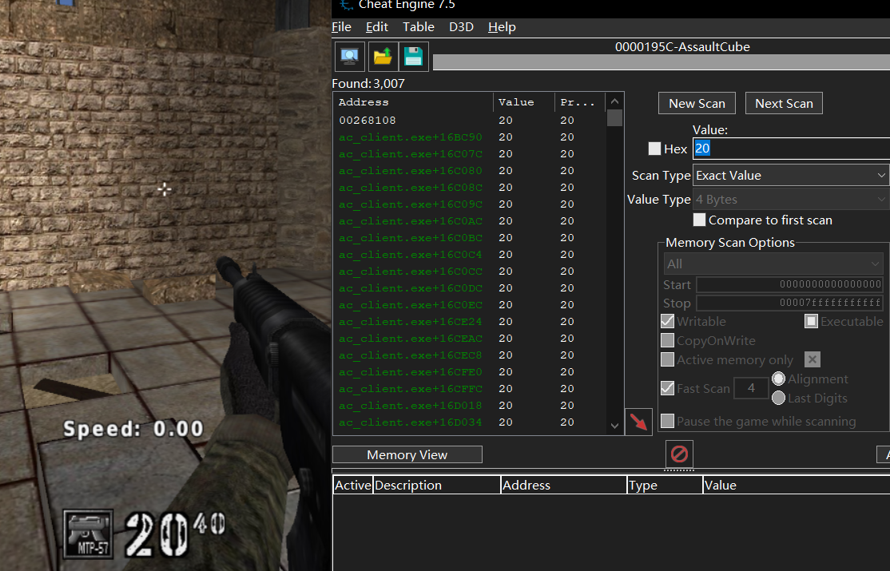
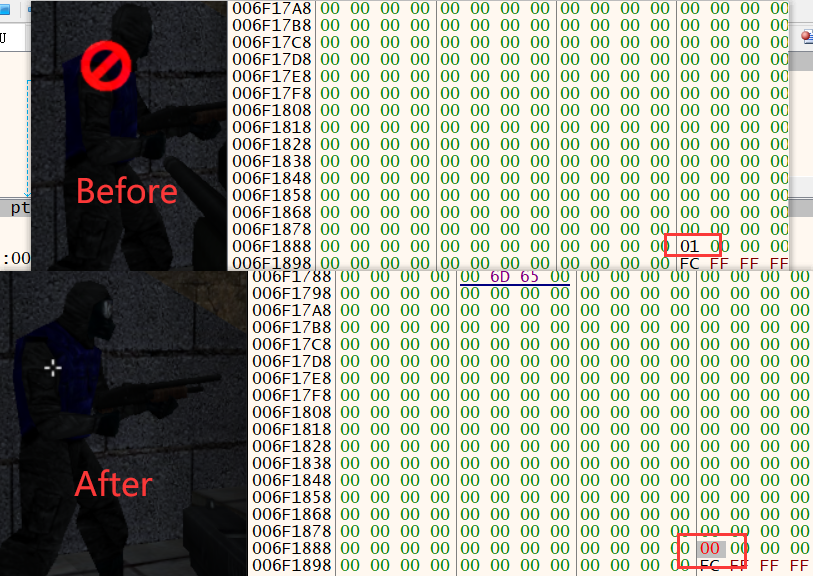
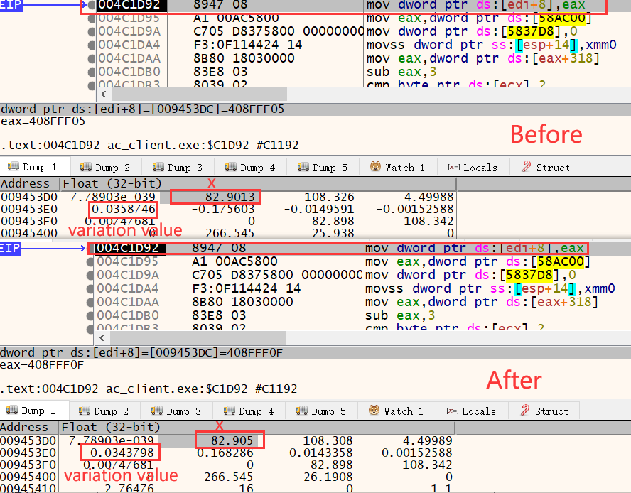

# Guide to make a game hack - HackForAssaultCube


#### 0x00 Introduction

This blog is written to record how i got started making a game hack. And this is my first time to write a blog in English, so There must be a lot of mistakes. **I apologize for my poor English writing skill**.

The game hack i made is for hacking a FPS game, which is named AssaultCube v1.3.0.2. you can download this game from [here](https://github.com/assaultcube/AC)

You can access [my github repository](https://github.com/Mrsdwang/HackForAssaultCube) to get all code of the game hack.

The project code is compiled to DLL, So it need DLL injection to inject it to the game.

This game hack's function includes wall hack, no recoil, infinite life, infinite ammo, triggerbot, aimbot, internal esp and external esp.

<div><!--块级封装-->
    <center><!--将图片和文字居中-->
    
    <br>  <!--换行-->
    Picture 0-1 <!--标题-->
    </center>
</div>

#### 0x10 WallHack

WallHack is a hack which allows us to see other players through the wall.

There are a lot of mathods to implement wallhack. We choose to make use of the external graphics library render function to implement it.

As we know, most games use external graphics library to render various models in game, different graphics librarise use different functions to render.

So why cann't game player see the things behind the wall? The answer of this problem is also the  priciple of why this method can implement wallhack.

The graphics library use the "Depth testing" to determine which model should be rendered in front of the other models. You can think of the "Depth testing" is a kind of priority detection. If it "test" a model is high priority than other model, then render it to in the front.

 Now we can determine the resolution process. we first need to ensure which kind of graphics library is used in the game, then find which render function is used, and finally hook the render function and disable the "Depth testing".

##### 0x11 Ensuring Graphics Library

Open the game and use x32dbg to attach it.

Since the graphics library is loaded, Select the *Symbols* tab and search the "direct" and "opengl", then you can find the opengl32.dll like in the picture 1-1. So we can conclude that the game is using OpenGL to rend.

 <div><!--块级封装-->
    <center><!--将图片和文字居中-->
    
    <br>  <!--换行-->
    Picture 1-1  <!--标题-->
    </center>
</div>

##### 0x12 Ensuring the Render Function

OpenGL has several rendering approaches, and different games will use different approaches. For example, older games may use glBegin, glVertex, and glEnd; some games may use glDrawArrays; and others may use glDrawElements. Some even use a combination of these approaches to render different aspects, such as glDrawElements for player models and glBegin for screen effects like blood.

All the functions mentioned above can be searched in the right of *Symbols* tab, so we need to locate which render funtion is used.

To determine which function is used,we can take  "set breakpoint" approach. set the breakpoint on the first instruction of these function one by one.If the function is used, the breakpoint will be hit, and program will stop running.

In the Picture 1-2, When I set the breakpoint on the *glDrawElements*, the breakpoint is hit right away, so We can determine that the function is used.

 <div><!--块级封装-->
    <center><!--将图片和文字居中-->
    
    <br>  <!--换行-->
    Picture 1-2  <!--标题-->
    </center>
</div>

After testing, *glbegin*, *glDrawElements*, *glVertex* functions are all used.

To further guarantee whether these functions are used for render graphics, we can change their first instruction to *ret x* (x is the last *ret* instruction's Immediate value, In the picture 1-2, x is 10), then see whether the game grapics is normal.

After modifying the functions，I get the result below.

modify the glDrawElements:

from picture 1-3, we can find the guns and shadow disappear, but when you shoot, the gun appear for a while.

 <div><!--块级封装-->
    <center><!--将图片和文字居中-->
    
    <br>  <!--换行-->
    Picture 1-3  <!--标题-->
    </center>
</div>

modify the glbegin:

from picture 1-4, we can find the text and picture such as HP, ammo amount and shadow disappear. And the sky is a mess, just like ike a picture being layered repeatedly.

 <div><!--块级封装-->
    <center><!--将图片和文字居中-->
    
    <br>  <!--换行-->
    Picture 1-4  <!--标题-->
    </center>
</div>

if modify the glVertex, the effect is same as modifying the glbegin, but the menu can't display when the "ECS" button pressed.

In conclusion, three functions are all used to render graphics, but they all can't influence the wall and character model.

However, our target is to hook the render functions to disable the Depth testing.So we can use one of these function. Here i choose glDrawElements to hook, because the impact of this function is smaller than the other two functions. This can keep game running correctly.

##### 0x13 Disable Depth Testing

notice the picture 1-5. Coming back to the part of glDrawElements, and analysing the instruction, we find that this function will carry the instruction **call esi** . That means the function are preparing to invoke the esi when it store the function address in the esi register.So we can hook the instruction which stores invoked function in esi.The target instruction address is 0x50846006.

the call in the 0x50846011 is an empty call, because there is only one **ret 0** instruction in this function.

 <div><!--块级封装-->
    <center><!--将图片和文字居中-->
    
    <br>  <!--换行-->
    Picture 1-5  <!--标题-->
    </center>
</div>

Now we has located the hook address, we should determine how to disable the depth testing.

After studying the opengl, I find a function named *glDepthFunc* can be used to modify the depth comparisons rule. The rule can be controlled by changing the function parameter value.The ones we are interested in are GL_LEQUAL (draw if the element is in front of another element) and GL_ALWAYS(draw always).So it's clearly now, we can invoke glDepthFunc(GL_ALWAYS) to disable depth testing.

##### 0x14 Coding

For hooking glDrawElements function, we need to get the loaded address of opengl32.dll, then get the address of glDrawElements. But there is a problem, we can't determine when the opengl32.dll will be loaded in game. So we need to write a while loop to get the address continuously.

When we get glDrawElements address, the address needs to add 0x16 to point the hook address. then modify the priority to rewrite the instruction on the hook address. New instruction needs to jump to the detour function, therefore, instruction should be **jmp detour_address**.

Since we can't guarantee whether the detour address is far away from hook address or near, it's better to use far jump instruction which hexadecimal data is 0xE9. However, the Immediate value of 0xE9 jump instruction is not the destimation address. The Immediate value of 0xE9 jump instruction needs to be calculated by such a formula:  The Immediate value = The destination address - current instruction address - 0x5 (0x5 is the length of 0xE9 jmp instruction);

So we can write down the following code:

```C
wallHack_hook_address = 0x50846006;
while (true) {
 if (OpenGLHandle == NULL) {
     OpenGLHandle = GetModuleHandle(L"opengl32.dll"); 
 }
 if (OpenGLHandle != NULL) {
     glDepthFunc = (void(__stdcall*)(unsigned int))GetProcAddress(OpenGLHandle, "glDepthFunc");
     wallHack_hook_address = (unsigned char*)GetProcAddress(OpenGLHandle, "glDrawElements");
     wallHack_hook_address += 0x16;

     DWORD old_protect;
     VirtualProtect((void*)wallHack_hook_address, 5, PAGE_EXECUTE_READWRITE, &old_protect);
     *wallHack_hook_address = 0xE9;
     *(DWORD*)(wallHack_hook_address + 1) = (DWORD)&wallHack_detour - (DWORD)wallHack_hook_address - 5;
     *(wallHack_hook_address + 5) = 0x90;

     wallHack_jmpBack_address = (DWORD)(wallHack_hook_address + 0x6);
     break;
    }
    Sleep(1);
}
```

After hooking, it's time to write the detour function. The principle to struct the detour function is try your best to keep program running as before. So the old instructions that are overwritten by jmp instruction should be completely rewritten in the detour function.

before invoking glDepthFunc, we should store all the register. And before jumping back to the glDrawElements, restore all the register.

Now the last problem is how do we call the glDepthFunc when we only have it's address and code in C++.

In C++, using the function address to call it requires to declare the function pointer, such as:

the declaration of glDepthFunc is:

```C++
typedef unsigned int GLenum;
void glDepthFunc(GLenum func);
```

It's function pointer should be declared like this:

```C++
void (*glDepthFunc)(unsigned int) = NULL;
```

but if the code is build, we will get the following error:

```C++
error C2440: '=': cannot convert from 'FARPROC' to 'void (__cdecl *)(unsigned int)'
    message : This conversion requires a reinterpret_cast, a C-style cast or function-style cast
```

so we should declare the function pointer of glDepthFunc to this:

```C++
void (__cdecl *glDepthFunc)(unsigned int) = NULL;
```

When the declaration is correct, the function pointer can be used to call glDepthFunc as following:

```C++
(*glDepthFunc)(GL_ALWAYS);
```

In conclusion, The detour function should be constructed as following:

```C++
#define GL_ALWAYS 0x0207

__declspec(naked) void wallHack_detour() {
    __asm {
        pushad
    }
    if (IsGameStart(match_type_address) && menu.IsEnable(menu.WALLHACK)) {
        (*glDepthFunc)(0x207);
    }
    __asm {
        popad
        mov esi, dword ptr ds : [esi + 0xA18]
        jmp wallHack_jmpBack_address
    }
}
```

I guess you might be confused about __declspec(naked). So Let's ask chatgpt.

 The __declspec(naked) prefix declares that this function doesn't contain the regular entry and exit instruction such as store/restore the register, return back to where calls this function and so on. So if you use this prefix, you need to write assemblely code manually to handle the parameters and return values of the function.

That also means if you want to implement high-performance,low-latency operations or that interact directly with hardware, you can use it!

However, if we build the code and inject the code to the game, we will see an error :

 <div><!--块级封装-->
    <center><!--将图片和文字居中-->
    
    <br>  <!--换行-->
    Picture 1-6  <!--标题-->
    </center>
</div>

The reason of this error is wrong declaration of glDepthFunc. If you remove the invoke of glDepthFunc, game no longer crashes.

Following into the gl.h, the complete declaration of glDepthFunc is :

```C+=
GLAPI void APIENTRY glDepthFunc (GLenum func);
```

You will find the define of APIENTRY is a reference for WINAPI, and WINAPI is a reference for __stdcall, if you go through the [Microsoft's documentation on data types](https://learn.microsoft.com/en-us/windows/win32/winprog/windows-data-types)

So the correct declaration of glDepthFunc's function pointer is :

```C++
void (__stdcall *glDepthFunc)(unsigned int) = NULL;
```

After we get the address of glDepthFunc from the return value of GetProcAddress, it's necessary to cast the return value as (void(__stdcall*)(unsigned int)):

```C++
glDepthFunc = (void(__stdcall*)(unsigned int))GetProcAddress(openGLHandle, "glDepthFunc");
```

Calling conventions control how parameters are handled by functions when called. There are many different types. So it requires the calling convention must be correct when you invoke a function by function pointer.

##### 0x15 Hack Result

 <div><!--块级封装-->
    <center><!--将图片和文字居中-->
    
    <br>  <!--换行-->
    Picture 1-7  <!--标题-->
    </center>
</div>

It seems we complement Wallhack, but it's not completely complement.

The character models are only seen at the edge of the wall. if we are not at the edge of the wall like picture 1-8, we can't seen the character through the wall.

 <div><!--块级封装-->
    <center><!--将图片和文字居中-->
    
    <br>  <!--换行-->
    Picture 1-8  <!--标题-->
    </center>
</div>

I think the problem occurs because of the order of rendering. Because of diabling the depth testing, all the models are rendered with the same priority, therefore, the previously rendered models will be overwritten by the later rendering model.

#### 0x20 Memory Hack

This part will analyze the implementation principles of functions including triggerbot, infinite life, infinite ammo and no recoil, which share the same implementation principles.

The prerequisite for implementing these function is to find the base address of all characters.

character's life and ammo are stored in the character structure. recoil will change the location and view of character which also are stored in the character structure.

In most FPS games, when you hover over a player, games's crosshair will change to a different color or shapes, and some even display the name of player. So by using these changes, it's possible to determine whether the enemy has been targeted and automatically fire. To implement the triggerbot, we need to read the relevant data stroed in the character structure.

To sum up, For implementing all of these functions, we need to find the base address of all characters first.

The memory scanner *cheat engine* can be used to help us locate the base address of all characters.

First of all, you should set the bot to be idle. You can press "ESC" to open the menu, then choose "Singleplayer -> bot settings -> idle bot" to get the settings in the picture 2-0. You can also lenthen the time of bot match to 60 minutes, which will help us to debug.

 <div><!--块级封装-->
    <center><!--将图片和文字居中-->
    
    <br>  <!--换行-->
    Picture 2-0  <!--标题-->
    </center>
</div>

##### 0x21 Use CheatEngine

In this blog, it's enough for you to only know three functions of CheatEngine to search the data.
They are *First scan*, *Next scan*,*Find out what accesses this address*.

We can determine that the name of character must be stored in the structure of character. I will use CheatEngine to search the name as an example to demonstrate how to use CheatEngine.

When you hover over the character in the game , you can find his name is displayed in the screen:

 <div><!--块级封装-->
    <center><!--将图片和文字居中-->
    
    <br>  <!--换行-->
    Picture 2-1  <!--标题-->
    </center>
</div>

Change th *Value Type* to String, Search the name displayed in the CheatEngine, then click the *First Scan* :

 <div><!--块级封装-->
    <center><!--将图片和文字居中-->
    
    <br>  <!--换行-->
    Picture 2-2  <!--标题-->
    </center>
</div>

In the picture 2-2, the address where the string stored will be display in the left of CheatEngine.

Chosing any address and right clicking , you can find the option *Find out what accesses this address* :

 <div><!--块级封装-->
    <center><!--将图片和文字居中-->
    
    <br>  <!--换行-->
    Picture 2-3  <!--标题-->
    </center>
</div>

This option will display which instructions accessed the string stored at that address

Now move your corsshair not to target the character, use the *Find out what accesses this address* option ,then hover over the character again. If the new instructions are displayed, these instructions might be in the range of the code to diplay the name in the screen. However, not all the addresses are accessed, so we need to filter.

For example :

when you not target a character, some instructions are diaplayed :

 <div><!--块级封装-->
    <center><!--将图片和文字居中-->
    
    <br>  <!--换行-->
    Picture 2-4  <!--标题-->
    </center>
</div>

when you hover over a character, origin and new instructions are diaplayed :

 <div><!--块级封装-->
    <center><!--将图片和文字居中-->
    
    <br>  <!--换行-->
    Picture 2-5  <!--标题-->
    </center>
</div>

It's obvious that when you hover over a character from targeting nothing, the new addresses are displayed.

If you need to find a data's address, and there are a lot of data are same as this data, you can use *First scan* to find all the data with the same value, then change this data's value and ues *Next scan* to filter the value that have not changed. The remaining data will be more fewwer.

I am going to use the ammo as an example to demonstrate.

first, there are 20 bullets left in the gun. We choose *4 Bytes* value type(game is 32bit),and *Exact Value* scan type, then enter 20 and click the *First Scan*, result is following:

 <div><!--块级封装-->
    <center><!--将图片和文字居中-->
    
    <br>  <!--换行-->
    Picture 2-6  <!--标题-->
    </center>
</div>

Take a shoot in the game, enter 4 and click the *Next Scan*, the result change:

 <div><!--块级封装-->
    <center><!--将图片和文字居中-->
    
    <br>  <!--换行-->
    Picture 2-7  <!--标题-->
    </center>
</div>

Take a shoot again, you will find some value change, and others won't change.

 <div><!--块级封装-->
    <center><!--将图片和文字居中-->
    
    <br>  <!--换行-->
    Picture 2-8  <!--标题-->
    </center>
</div>

To sum up, there is quite possible that the 0x008D1050 address is the address of ammo.

##### 0x22 Locate the Base Address of Character Structure

From 0x21 we find some instructions access the name of character, that's will be the beginning to find base address of character.

When I search the name of character, I find there exits the differece between teammate and enemy.

For example:

do not target character:

 <div><!--块级封装-->
    <center><!--将图片和文字居中-->
    
    <br>  <!--换行-->
    Picture 2-9  <!--标题-->
    </center>
</div>

target character:

 <div><!--块级封装-->
    <center><!--将图片和文字居中-->
    
    <br>  <!--换行-->
    Picture 2-10  <!--标题-->
    </center>
</div>

Comparing picture 2-9 with 2-10, We can find when hover over the enmey character, the enemy's scanning result adds some instructions in the teammate scanning result when not target the character(the second to seventh instructions). And when hover over the character, Regardless of whether it is an enemy or a teammate, new instructions appear(the last three instructions).We assume the last three instructions are related to display the name to the screen.

Don't forget our main task is to find the base address of all characters.

After I continue scanning all the character, I find all the teammates' and my name will be accessed by the second to the seventh insructions in the picture 2-10 if you target a teammate. And when hover over the enemy, the enemy's name is accessed but the teammates' name won't. So I boldly guess, these instructions traverse and read the names of all the teammate if you target a teammate. When you hover over a enemy, these instructions only access the name of targeting enemy.

Next, we should analyze these instuctions.Because these instuctions are close, so we start from the instruction where is at 0x00481A67.

The instructions nearby are as follows:

 <div><!--块级封装-->
    <center><!--将图片和文字居中-->
    
    <br>  <!--换行-->
    Picture 2-11  <!--标题-->
    </center>
</div>

You can target nothing, target enemy and target teammate, then set breakpoint on 0x481A5B "cmp esi,ecx". You will find when you target a character, the instruction "je 0x481A9F" at 0x481A5D won't jump, and the instruction "add ecx,205" at 0x481A5F will store my player's name in ecx.

Can we boldly assume that the ecx stores the base address of mine? And the 0x205 is the offset of the name. To determine this, we should continue to analyze upwards to find out what is stroed in the ecx, and under what conditions will the je instruction jump.

In the picture 2-11, the instruction "lea ebx,dword ptr ds"[esi+205]" at 0x481A49 stored the name in ebx register. If you don't target character, the name stored in [esi+0x205] is my player name, here my player name is "me". If you target a teammate, the name in the [esi+0x205] is all the teammate's and mine. If you target an enemy, [esi+0x205] only store my name and targeting enemy's name.

 <div><!--块级封装-->
    <center><!--将图片和文字居中-->
    
    <br>  <!--换行-->
    Picture 2-12  <!--标题-->
    </center>
</div>

the instruction "mov ecx, dword ptr ds:[58AC00]" at 0x481A3D handles the ecx register, it reads the data from a static address 0x58AC00. We have determine that the base address of mine is stored in the ecx, and ecx register is only changed here. Therefore the base address of my player character structure is stored in the 0x58AC00.

If we target a character, the esi won't store my player base address, but rather other character's. therefore esi and ecx are different, and je instruction won't jump.

after determining the base address of my player structure at 0x58AC00, we need to locate the other characters' base address.

In the games, to find base address of the character structure , the base address should be stored in a static address. In this game, the base address of my player structure store in a static address 0x58AC00

As I said earlier, when you hover over a teammate, teammates' name will be traverse. So somewhere aroud here should access the linked list of teammate. and the beginning address of linked list should also be stored in a static address.

Let's step debug and continue the analysis.

at the 0x481AD4 and 0x481AE0, we can find two static address 0x58AC0C and 0x58AC04:

 <div><!--块级封装-->
    <center><!--将图片和文字居中-->
    
    <br>  <!--换行-->
    Picture 2-13  <!--标题-->
    </center>
</div>

Notice the instructions at 0x481AD4, 0x481B29 and 0x481B2A. "mov edi, dword ptr ds:[58AC0C]" reads the data from 0x58AC0C, and stores it in the esi register. "inc esi" adds 1 to the value that is stored in the esi. "cmp esi,edi" compares the values of esi and edi to see whether they are equal. If the value of esi is less than edi's value, the instruction "jl 0x481AE6" will jump back to 0x481AE6.

If we set a breakpoint on "mov edi, dword ptr ds:[58AC0C]", then step. We will find edi stores the player number of current game.

 <div><!--块级封装-->
    <center><!--将图片和文字居中-->
    
    <br>  <!--换行-->
    Picture 2-14  <!--标题-->
    </center>
</div>

So we can determine that player number of current game is stored in 0x58AC0C.

Next, the instruction "add ecx, 205" at 0x481AF7 gets my attention. we met this instruction before, and we find the base address of my player structure by this instruction. The conclusion we have drawn is that ecx stores base address of character structure, and 0x205 is offset of name.

Set a breakpoint on 0x481AFD, then continue running the game, we will find ecx will store the names of all the character. We can assume that there is one instruction reads the linked list of player, and other one stores the member of linked list in the ecx.

So the key is to find out how the ecx get the value. We can eazily notice the instruction "mov ecx,dword ptr ds:[ebx+esi*4]" at 0x481AE6. And ebx stores the data stored in 0x58AC04.

Because the ecx will store all the names of characters after "add ecx,205", so ebx stores the beginning address of linked list, and esi is the index of linked list. esi*4 moves the pointer to point next member.

In conclusion, We have located the base address of my character structure is **0x58AC00**, the beginning address of character structure(except my character structure) linked list is **0x58AC04**, and **0x58AC08** stores the player number of current game.

 <div><!--块级封装-->
    <center><!--将图片和文字居中-->
    
    <br>  <!--换行-->
    Picture 2-15  <!--标题-->
    </center>
</div>

if we check the address stored in the 0x58AC04, We will find the first member of linked list is 0, and next members are the base address of other character structure.

 <div><!--块级封装-->
    <center><!--将图片和文字居中-->
    
    <br>  <!--换行-->
    Picture 2-16  <!--标题-->
    </center>
</div>

##### 0x23 TriggerBot

We have notice that when we target a character, his name will diplay on the screen. And in the picture 2-10, there are some instructions(last three instructions) read the targeting character's name and print it. So can we use this feature to implement the triggetbot.

The idea is that we hook the instructions that will be excuted when target a character, then write the detour code which excutes the fire operation. So when we target a character, we shoot automatically.

You might think that it will also shoot if I target a teammate. That's right, but the instruction reads the name of character, so we can also read the team infomation of character.

If you set a breakpoint on the instruction "cmp byte ptr ss:[ebp],al" at 0x46DDEE of the picture 2-10, then continuely run the game, you will find ebp stores the text that is displayed on the screen. Such as "FPS 200","50:55" and so on.

If you target a character, you will see the name stored in the ebp also.

So I can determine the code here is to print texts on the screen. And there is a branch to see if you target a character before here, that's because the code needs to read the targeting character's name.

Continue to analyse the above the code. Our task is to find the branch which jump condition is on whether you target the character.

after analysing, there is no jump instruction before the "cmp byte ptr ss:[ebp],al", so this branch isn't in this function.

Through setting a breakpoint on 0x46DD20 where is the beginning of this function, We can get return address from the top of stack. From the picture 2-17, the return address is stored in the 0x19F7D0, and return address is 0x460807.

<div><!--块级封装-->
    <center><!--将图片和文字居中-->
    
    <br>  <!--换行-->
    Picture 2-17  <!--标题-->
    </center>
</div>

Go to the 0x460807, and analyse the above the code again.

The mathod to find the branch which jump condition is to see whether you target a character or not is to set the breakpoint on the next instruction of every jump instruction. If breakpoint is hit without targeting a character, this branch is not what we want. If breakpoint is hit when target a character, the branch should be analysed to determine.

If you go through the whole function, you will be afraid of it huge amount of code. Don't worry, though the code is a lot, not all the code will be excuted.

If you set the breakpoint on 0x46063F and 0x460644, you will find this instruction won't be excuted, but the next instruction at 0x460644 is excuted. We can determine that there must be a jump instruction that is excuted and jump to 0x460644.

 <div><!--块级封装-->
    <center><!--将图片和文字居中-->
    
    <br>  <!--换行-->
    Picture 2-18  <!--标题-->
    </center>
</div>

Right click the instruction at 0x460644, and choose *Find Reference to* and *Selected address* to find where the jump to this location is from. This jump instruction is located at 0x4600D1.

Starting at 0x4600D1, continue to analyse the above of the code with the same method.

I finally determine the branch that we want is at 0x45FD48. In the picture 2-19, the instruction "mov ecx dword ptr ss:[esp+10]" at 0x45FD42 stores the base address of the targeting character structrue to the ecx if you target a character. otherwise, the [esp+10] is 0, and ecx will also be 0, the "je 0x45FD90" will be token.

 <div><!--块级封装-->
    <center><!--将图片和文字居中-->
    
    <br>  <!--换行-->
    Picture 2-19  <!--标题-->
    </center>
</div>

When you target a teammate, the ecx store his character structure:

 <div><!--块级封装-->
    <center><!--将图片和文字居中-->
    
    <br>  <!--换行-->
    Picture 2-20  <!--标题-->
    </center>
</div>

Now the way to implement the triggetbot is clear. The ecx will store the base address of targeting character, so we hook the instructions at 0x45FD42 and 0x45FD46.

The thought of implementing detour function is determine whether the ecx is NULL first, then simulating the left mouse button pressed to shoot. Finally restore the hooked instructions and jump back.

```C++
PlayerInfo* target = NULL;

__declspec(naked) void TriggerBot_detour() {
    __asm {
        mov ecx, dword ptr ss : [esp + 0x10]
        pushad
        mov ecx_value, ecx
    }
    target = (PlayerInfo*)ecx_value;
    
     TriggerBotExecute(ecx_value);
    
    __asm {
        popad
        test ecx, ecx
        jmp triggerBot_jmpBack_address
    }
}

```

Here we use the variable *target* and ecx_value to store the base address of targeting character structure.

The function *TriggerBotExecute(ecx_value)* is to check whether the ecx_value is NULL, if not, then simulate to shoot.

```C++
PlayerInfo* me = (PlayerInfo*)(ReturnMeAddress());
bool isMyDown = true;
void TriggerBotExecute(DWORD IsTarget) {
    if (IsTarget != 0) {
        if (!IsTeamMate(me->team, target->team)) {
            input.type = INPUT_MOUSE;
            input.mi.dwFlags = MOUSEEVENTF_LEFTDOWN;
            SendInput(1, &input, sizeof(INPUT));
            if (isMyDown) {
                isMyDown = !isMyDown;
            }
        }
    }
    else if(!isMyDown){
        input.type = INPUT_MOUSE;
        input.mi.dwFlags = MOUSEEVENTF_LEFTUP;
        SendInput(1, &input, sizeof(INPUT));
        isMyDown = !isMyDown;
    }
}
```

the pointer structure *me* stores my character structer data, and the pointer structure *target* stores targeting character structer data. The function *IsTeamMate()* is to check whether targeting character is teammate, if he isn't, then shoot.

However, there is a shortcoming in this way to implement triggerbot. the variable *isMyDown* is to solve it. If you target nothing, and press the left mouse button, the code in the "else" will be excuted without the variable *isMyDown*, then you can't keep shooting, because after you press the button, the code in the "else" will tell the computer your left mouse button has been up.

use the variable *isMyDown* to ensure that we are not interrupted when we are shooting actively. According to this logic, only after we are not targeting an enemy, the code in the "else" will be excuted.

##### 0x24 Locate Team and Death Infomation

We know all the information of character is stored in the character structure. Now we should determine how can we get the team infomation from the character structure.

we have located that the address of my character structure is at 0x58AC00, then check the dump of the address stored in 0x58AC00, then you can find your character name.

 <div><!--块级封装-->
    <center><!--将图片和文字居中-->
    
    <br>  <!--换行-->
    Picture 2-21  <!--标题-->
    </center>
</div>

In the game, you can press the ecs to open the menu, and chose the settings -> Gameplay settings -> change to the enemy team. Then you can watch the dump data to find out which data is changed. The data might be 0 or 1, and change between 1 and 0.

after many attempts, this data absorbs my interest, because when I use *Change to the enemy team*, it changes to 0 :

 <div><!--块级封装-->
    <center><!--将图片和文字居中-->
    
    <br>  <!--换行-->
    Picture 2-22  <!--标题-->
    </center>
</div>

Now I modify it to 0 manually, the crosshair will change when I target a teammate before:

 <div><!--块级封装-->
    <center><!--将图片和文字居中-->
    
    <br>  <!--换行-->
    Picture 2-23  <!--标题-->
    </center>
</div>

Trough the change of crosshair, we can determine that our team is changed. So this data is declared the team of character, its offset is 0x30C.

In the meanwhile, I also find the data of death. When you change your team, the character die, there is a data changing to 1. After the character Resurrection, this data change to 0 again. It's offset is 0x318. You can check it out like we located the team infomation.

##### 0x25 Infinite Life

Use Cheat Engine to scan the life data like we did before, and find a way to decrease the life, then we can find such instruction:

 <div><!--块级封装-->
    <center><!--将图片和文字居中-->
    
    <br>  <!--换行-->
    Picture 2-25  <!--标题-->
    </center>
</div>

The first and second instructions catch my attention. The value stored at the address obtained by adding 0xEC to the base address of the character structure is exactly the value of character's health points.

In the picture 2-26, 0x64 = 100 , 0x43 = 67. It's equal with HP. So We can locate that the HP offset is 0xEC.

 <div><!--块级封装-->
    <center><!--将图片和文字居中-->
    
    <br>  <!--换行-->
    Picture 2-26  <!--标题-->
    </center>
</div>

In the picture 2-25, the instruction at 0x41C223 and 0x47D1A8 will be excuted when you are damaged. Hp is decreased after being damaged, so the instruction "sub [ebx+0x4],esi" catches more of my attentsion.

I assume that esi stores the damage value. We can set the breakpoint on 0x41C223, then damage our character. The breakpoint will be hit.

When I check the ebx, I find ebx stores an address which is in the address range of my character structure, and ebx+0x4 is just the address which stores the HP of the character.

 <div><!--块级封装-->
    <center><!--将图片和文字居中-->
    
    <br>  <!--换行-->
    Picture 2-27  <!--标题-->
    </center>
</div>

here the esi stores the value 0x2D, So the HP should be 22 after being damaged. we cancel the breakpoint,then run the game again to check.

 <div><!--块级封装-->
    <center><!--将图片和文字居中-->
    
    <br>  <!--换行-->
    Picture 2-28  <!--标题-->
    </center>
</div>

This situation meets our expectation.

I think the way to implement the infinite life is clear now. We just need to modify the esi to zero like the picture 2-29. We can test this thought.

 <div><!--块级封装-->
    <center><!--将图片和文字居中-->
    
    <br>  <!--换行-->
    Picture 2-29  <!--标题-->
    </center>
</div>

After modifying, you will find that the enemy won't be damaged either. If you set the breakpoint on 0x41C223, and active the bot, the breakpoint will be hit when bot shoots. Therefore, the bot and our character use the same code to compute the damage value.

However, the ebx stores the address which is in the address range of the character structure, So we can compute the base address of this character structure which one of address is stored in the ebx and compare this base address with our character structure's base address. If it's our character's , we can modify the esi to zero.

The hook code is as following:

```C++
static unsigned char* infiniteLife_hook_address = (unsigned char*)0x41C223;
DWORD infiniteLife_jmpBack_address = 0;
void InfiniteLife() {
    DWORD old_protect;
    VirtualProtect((void*)infiniteLife_hook_address, 6, PAGE_EXECUTE_READWRITE, &old_protect);
    *infiniteLife_hook_address = 0xE9;
    *(DWORD*)(infiniteLife_hook_address + 1) = (DWORD)&InfiniteLife_detour - (DWORD)infiniteLife_hook_address - 5;

    infiniteLife_jmpBack_address = (DWORD)(infiniteLife_hook_address + 0x5);
}
```

The Detour function code is as following. "sub ebx,0xE8" is to compute the base address, then compare with my character structure's base address :

```C++
DWORD ebx_value = 0;

__declspec(naked) void InfiniteLife_detour() {
    __asm {
        pushad
        sub ebx,0xE8
        mov ebx_value,ebx
    }
    if (ebx_value == (DWORD)ReturnMeAddress()) {
        __asm {
            popad
            sub dword ptr ds:[ebx+0x4],0
            jmp infiniteLife_jmpBack_address
        }
    }
    else {
        __asm {
            popad
            sub dword ptr ds:[ebx+0x4],esi
            mov eax,esi
            jmp infiniteLife_jmpBack_address
        }
    }
}
```


##### 0x26 Infinite ammo

In the picture 2-24, Use Cheat Engine to scan the ammo data like we did before, and shoot, we can find such instruction:

 <div><!--块级封装-->
    <center><!--将图片和文字居中-->
    
    <br>  <!--换行-->
    Picture 2-24  <!--标题-->
    </center>
</div>

the instruction at 0x4C7288 and 0x4C73EF will be excuted when you shoot.

I boldly assume that, the instruction "cmp dword ptr [eax],00" is to check if the ammo is empty and "dec [eax]" is to decrease the ammo.

The method to examine is the same as we used to implement the infinite life. Set a breakpoint on 0x4C73EF, then shoot. After the breakpoint is hit, check the address stored in the eax, then nop this instruction. After this instruction is nopped, the number of ammo shouldn't be changed after shooting.

When the breakpoint is hit, the eax stores the 0x14 which is 20 in decimal. This value is the same as our number of ammo in the game. And the address of this value stored in is in the address range of our character structure. In the picture 2-30, we can find that this value change when the ammo is changed, and they are the same value all the time.

 <div><!--块级封装-->
    <center><!--将图片和文字居中-->
    
    <br>  <!--换行-->
    Picture 2-30  <!--标题-->
    </center>
</div>

So we can determine that this address stores the ammo of current gun.

If you nop the instruction "dec [eax]", the number of ammo won't decrease after shooting. Therefore this instruction is our target to hook.

However, it's the same as infinite life, this instruction is also used by bots. If you set a breakpoint here, then active the bots, the breakpoint is hit.

because the eax stores an address which is in the address range of character structure, we can compute the base address of this character structure. Then compare this address with our character structure's base address.

The hook code should be as following:

```C++
DWORD infiniteAmmo_jmpBack_address = 0;
static unsigned char* infiniteAmmo_hook_address = (unsigned char*)0x4C73EF;
void InfiniteAmmo() {
    DWORD old_protect;
    VirtualProtect((void*)infiniteAmmo_hook_address, 6, PAGE_EXECUTE_READWRITE, &old_protect);
    *infiniteAmmo_hook_address = 0xE9;
    *(DWORD*)(infiniteAmmo_hook_address + 1) = (DWORD)&infiniteAmmo_Detour - (DWORD)infiniteAmmo_hook_address - 5;
    *(infiniteAmmo_hook_address + 0x5) = 0x90;
    infiniteAmmo_jmpBack_address = (DWORD)(infiniteAmmo_hook_address + 0x6);
}
```

The detour function should be as following:

```C++
DWORD eax_value_ammo = 0;
__declspec(naked) void infiniteAmmo_Detour() {
    __asm {
        pushad
        mov eax_value_ammo,eax
    }
    if (IsMyInfo()) {
        __asm {
            popad
            lea eax,dword ptr ss:[esp+0x1C]
            jmp infiniteAmmo_jmpBack_address
        }
    }
    else {
        __asm {
            popad
            dec dword ptr ds:[eax]
            lea eax,dword ptr ss:[esp+0x1C]
            jmp infiniteAmmo_jmpBack_address
        }
    }
}
```

The function IsMyInfo() is to compare whether the computed base address is equal with base address of our character structure. The code is as following:

```C++
bool IsMyInfo( ) {
    for (DWORD i = 0; i < 6; i++) {
        if ((eax_value_ammo - (0x140 - (i * 4))) == (DWORD)ReturnMeAddress()) {
            return true;
        }
    }
    return false;
}
```

You might be confused about why the variable eax_value_ammo substract the "(0x140 - (i*4))" in the code "(eax_value_ammo - (0x140 - (i * 4))) == (DWORD)ReturnMeAddress()".

This is because different guns use different address to store their ammo, but these address is consecutive. It may be an array, and the name of gun is as index of array.

There are six guns in the game, and 0x140 offset is the last element of the array. Every element is 4 Bytes, So we use 0x140 to substract i*4. If one is equal with base address of our character structure, the function return true which means this ammo data is ours.

In the picture 2-31, We change gun to submachine gun and pistol, the ammo address change.

 <div><!--块级封装-->
    <center><!--将图片和文字居中-->
    
    <br>  <!--换行-->
    Picture 2-31  <!--标题-->
    </center>
</div>

##### 0x27 NoRecoil

Every time we shoot, the character is pushed back and the angle of view rises. This is recoil.

Because the recoil appears after shooting, the code to compute the recoil should be around the code of decreasing the ammo.

The angle of view in the game use two variables yaw and pitch to represent. The location of character uses coordinate to represent.

Press "`" to open the command terminal and enter "dbgpos 1" to print the angle of view and location like the picture 2-32.

 <div><!--块级封装-->
    <center><!--将图片和文字居中-->
    
    <br>  <!--换行-->
    Picture 2-32  <!--标题-->
    </center>
</div>

In the 0x26 infinite ammo section, we have located the instruction which is used to decrease the ammo. Because the angle of view and location are all float type, We should find the instructions which handle the float computing.

After analysing, not far away from the instruction "dec [eax]", I find a lot of instructions to handle the float computing, and the last instruction call a function.

 <div><!--块级封装-->
    <center><!--将图片和文字居中-->
    
    <br>  <!--换行-->
    Picture 2-33  <!--标题-->
    </center>
</div>

before 0x4c738A, the instructions might prepare for this call. in this function, there are still a lot of instructions handling the float computing. So these code should be analysed carafully.

When we shoot, we can find the view of angle and location change smoothly, so the code to compute the view of angle and location can't be this which use the view of angle and location to add a variation value directly. They should add or substract the value which becomes smaller constantly. So the variation value should be stored somewhere.

You might think of that we can use Cheat Engine to find the instructions which only are excuted after shooting. However this method is useless now, because there aren't such instructions. I will take the variable yaw as example, You can see the picture 2-34, there are new instructions.

 <div><!--块级封装-->
    <center><!--将图片和文字居中-->
    
    <br>  <!--换行-->
    Picture 2-34  <!--标题-->
    </center>
</div>

If you scan the variable x of coordinate, you will get a lot of instructions, and don't know how to filter :

 <div><!--块级封装-->
    <center><!--将图片和文字居中-->
    
    <br>  <!--换行-->
    Picture 2-35  <!--标题-->
    </center>
</div>

If you try to analyse the whole instructions which computing the float data, you will also can't find the clue to locate where handles the recoil.

Experience from the above analysis, we should pay more attention to the data which in the character structure.

After analysing, I find the following instructions write some float data into the character structure, the eax here stores the base address of our character structure:

 <div><!--块级封装-->
    <center><!--将图片和文字居中-->
    
    <br>  <!--换行-->
    Picture 2-36  <!--标题-->
    </center>
</div>

The addresses are written is following the data of the x,y and z axes in the coordinate.

 <div><!--块级封装-->
    <center><!--将图片和文字居中-->
    
    <br>  <!--换行-->
    Picture 2-37  <!--标题-->
    </center>
</div>

Because the value of x will change smoothly and the printed the value of x is changed in real time after shooting, the value of x will be written many times. 

To determine whether this data is used as the variation value which is add or substract by x value, we can set the hardware breakpoint on 0x9453D4 where is the value of x stored. The condition for this breakpoint hit is when this address is written the data.

Continue to run the game, the breakpoint will be hit many times on one instruction. If you constantly run, you will find the value of x is changing bit by bit and when the value of x changes by a certain value, the data written to the eax+10 is change also. Please check the picture 2-38:

 <div><!--块级封装-->
    <center><!--将图片和文字居中-->
    
    <br>  <!--换行-->
    Picture 2-38  <!--标题-->
    </center>
</div>

Although the magnitude changes of the value of x and variation value aren't consistent. If you run the game continuely, you will find the value of x won't change when the variation value is small enough.

Therefore I boldly assume this variation value influence the value of x. We can try to change the instruction "movss dword ptr ds:[eax+0x10], xmm0" at 0x4C8DD2 to "mov dword ptr ds:[eax+0x10], 0", then shoot inthe game to check wheter the value of x will change.

The result is the value of x won't change:

 <div><!--块级封装-->
    <center><!--将图片和文字居中-->
    
    <br>  <!--换行-->
    Picture 2-39  <!--标题-->
    </center>
</div>

So we can determine the data whose offset is 0x10 in the character structure will influence the value of x after shooting.

Come back to the picture 2-36, the value of y and z are the same. The value in the eax+0x14 will influence the value of y, and the value of eax+0x18 will influence the value of z.

So I will only show the code which handles the value of x.

The hook code is following:

```c++

void NoRecoil() {
     static unsigned char* shootPushBackx_hook_address = (unsigned char*)0x4C8DD2;
     DWORD shootPushBackx_jmpBack_address = 0;
    DWORD old_protect;
    VirtualProtect((void*)shootPushBackx_hook_address, 6, PAGE_EXECUTE_READWRITE, &old_protect);
    *shootPushBackx_hook_address = 0xE9;
    *(DWORD*)(shootPushBackx_hook_address + 1) = (DWORD)&shootPushBackx_Detour - (DWORD)shootPushBackx_hook_address - 5;
    shootPushBackx_jmpBack_address = (DWORD)(shootPushBackx_hook_address + 0x5);
}
```

The Detou function is following. comparing the address stored in the eax with the base address of our character structure is to avoid to influence the bots:

```C++
__declspec(naked) void shootPushBackx_Detour() {
    __asm {
        pushad
        mov eax_value,eax
    }
    if (eax_value == (DWORD)ReturnMeAddress()) {
        __asm {
            popad
            mov dword ptr ds:[eax+0x10],0
            jmp shootPushBackx_jmpBack_address
        }
    }
    else {
        __asm {
            popad
            movss dword ptr ds : [eax + 0x10] , xmm0
            jmp shootPushBackx_jmpBack_address
        }
    }
}
```

After hook, you will find we won't be pushed back after shooting, but the angle of view still rise.

Continue to analyse, there is an instruction "movss dword ptr ds:[eax+40],xmm2" at 0x4C8E52 writing the data to the character structure, and the address which stores this data is behind the value of yaw and pitch:

 <div><!--块级封装-->
    <center><!--将图片和文字居中-->
    
    <br>  <!--换行-->
    Picture 2-40  <!--标题-->
    </center>
</div>

So the method to examine is the same as when we examine the x. I won't represent it again.

The hook code is following:

```C++
static unsigned char* shootPitchUp_hook_address = (unsigned char*)0x4C8E52;
DWORD shootPitchUp_jmpBack_address = 0;
void NoRecoil() {
    VirtualProtect((void*)shootPitchUp_hook_address, 6, PAGE_EXECUTE_READWRITE, &old_protect);
    *shootPitchUp_hook_address = 0xE9;
    *(DWORD*)(shootPitchUp_hook_address + 1) = (DWORD)&shootPitchUp_Detour - (DWORD)shootPitchUp_hook_address - 5;
    shootPitchUp_jmpBack_address = (DWORD)(shootPitchUp_hook_address + 0x5);
}
```

The detour funtion is following:

```C++
__declspec(naked) void shootPitchUp_Detour() {
    __asm {
        pushad
        mov eax_value, eax
    }
    if (eax_value == (DWORD)ReturnMeAddress()) {
        __asm {
            popad
            mov dword ptr ds : [eax + 0x40] , 0
            jmp shootPitchUp_jmpBack_address
        }
    }
    else {
        __asm {
            popad
            movss dword ptr ds : [eax + 0x40] , xmm2
            jmp shootPitchUp_jmpBack_address
        }
    }
}
```

So far, this part is over.

#### 0x30 Aimbot And Esp

In this hack, Esp has two types. One is internal Esp which uses the internal function of game to print the information, and the algorithm to compute the location of printed information is the same as aimbot which need to compute the location of character's head. the other one is external Esp, which converts the coordinates of characters in the game into the coordinates of screen, then draw the rectangle and print the information on the certain coordinates of screen.

##### 0x31 Aimbot

It's obvious that we need all the enemies' coordinates, so we need to traverse all the enemies's structure to read value of coordinates. We can discriminate whether current character is enemy by comparing the team infomation. And we should aim automatically when we shoot, not always. Of cause, we shouldn't aim automatically when we can't see the enemy or enemy all die and shoot.

According to the above thought, we can write such codes.

```C++
void AimBot() {

	PlayerInfo* me = (PlayerInfo*)(ReturnMeAddress());
	MathMatics math = MathMatics();
	while (TRUE) {
        if (IsGameStart(match_type_address)) {
            math.InitData();
            for (DWORD i = 1; i < ReturnPlayerNum(player_number_address); ++i) {
                if (!IsGameStart(match_type_address)) {
                    break;
                }
                DWORD* others_address = (DWORD*)(ReturnOthersListAddress() + (i * 4));
                PlayerInfo* others = (PlayerInfo*)(*others_address);
                if (others != NULL) {
                    if (!others->dead && !IsTeamMate(me->team, others->team)) {
                        // 计算要瞄准的人物头部坐标
                        math.CalcutationForYawPit(me, others, EspInfo, i);
                        EspInfo.print_text[i] = print_info(others);
                    }
                    if (others->dead) {
                        EspInfo.print_text[i] = "";
                    }
                }
            }
            // 检测到鼠标左键按下，并且游戏中敌人没有全部死亡并且能看见 就自动瞄准
            if (GetAsyncKeyState(VK_LBUTTON) & 0x8000) {
                if (!IsAllEnemyDie() && IsSeen(math.closest_player)) {
                    math.WriteClosestYawPit(me);
                }
            }
        }
		Sleep(1);
	}
}
```

The main algorithm is in the function "CalcutationForYawPit()", so we enter the function to analyse.

Operations in 3D space are expensive to compute, To decrese the comsumption of calculating in the 3D game, our character will always be placed at the origin (0,0,0) and all the distance and angles for objects can be calculated by just retrieving that object's coordinates instead of having to substract the object's position from the player's position.

Take an example, when we target the enemy, the x and y axes of coordinates should be like picture 2-41.

 <div><!--块级封装-->
    <center><!--将图片和文字居中-->
    
    <br>  <!--换行-->
    Picture 3-1  <!--标题-->
    </center>
</div>

But like we analysed before, In the picture 2-37,our character's value of coordinates isn't at the origin (0,0,0).

The actual situation should be like the picture 2-42.

 <div><!--块级封装-->
    <center><!--将图片和文字居中-->
    
    <br>  <!--换行-->
    Picture 3-2  <!--标题-->
    </center>
</div>

In the game, value of yaw is in the range of 0 to 360, if we set the positive axis of x is 0, the negtive axis of x is 180. So if we calculate the value of θ in the picture 2-42, we can determine the value of yaw.

Luckily, we can retrieve the coordinates of our character and enemise, so we can compute the absolute distances between our character and enemise.

Through trigonometric function, we can compute the arctangent value of θ whose result is the ratio between opposite and adjacent. But, we still need to convert the result to degree from radian, then the arctangent can be represent the angle we need to set to our character's yaw to aim at an enemy.

The code to compute the yaw is following:

```C++
    vec3d abspos = { 0,0,0 };
    abspos.x = others->x - me->x;
    abspos.y = others->y - me->y;
    abspos.z = others->z - me->z;

    float abs_distance = GetDistance_2d(abspos.x, abspos.y);

    float temp_closest_distance = abs_distance;

    float arctan_yx = atan2f(abspos.y, abspos.x);
    float temp_closest_yaw = ((float)(arctan_yx * (180.0 / PI))) + 90;
```

you might be confused about why it adds the 90 in the code "float temp_closest_yaw = ((float)(arctan_yx * (180.0 / PI))) + 90;". This is because the game defaults to 90 as the center which is character facing straight ahead. If you enter the game first time, you will find the character's starting yaw is 90. So we should add 90 to compensate this setting.

After finishing the calculation of yaw, we need to calculate the pitch. We choose y and z axies of coordinates to compute. The computing principle is the same as computing yaw, which just change the oppsite side to z from y axis and adjacent size to y from x axis, the result is also the arctangent value of θ.

However, there should handle a extra situation. When you are close enough to the enemy, the arctangent value should be bigger if result is bigger than 0 or smaller if result is smaller than 0, and this will cause you suddenly aim straight up or straight down. This is because when you are close to a character, the value of y will be small, the ratio between z and y will be bigger. We can solve this problem by replacing the value of y with the value of x.

If I am close to a character from the direction which makes my y value the same as testing character's y value, the coordinates data is in the picture 2-43.

 <div><!--块级封装-->
    <center><!--将图片和文字居中-->
    
    <br>  <!--换行-->
    Picture 3-3  <!--标题-->
    </center>
</div>

In this situation, replacing the value of y with x will conpensate the computing error. However, this method is rough, the variation value of x can also be small which causes the arctangent value is also wrong. So you can sometimes find you can't aim right in the game, and you will aim the above of the character.

the code to compute the pitch is below:

```C++
    float arctan_zy = atan2f(abspos.z, abspos.y);
    float temp_closest_pit = (float)(arctan_zy * (180.0 / PI));
```

To aim the closest character, in the process of calculation, we should store the calculation result of the current closest character.

```C++
    if (closest_distance == -1.0f || abs_distance < closest_distance) {
        closest_player = others;
        closest_distance = abs_distance;
        closest_yaw = temp_closest_yaw;
        closest_pit = temp_closest_pit;
    }
```

then If we press the left mouse button and the closest character doesn't die and can be seen, we write the calculated result to our character's yaw and pitch data.

```C++
if (menu.IsEnable(menu.AIMBOT) && (GetAsyncKeyState(VK_LBUTTON) & 0x8000)) {
    if (!IsAllEnemyDie() && IsSeen(math.closest_player)) {
        math.WriteClosestYawPit(me);
    }
}
void MathMatics::WriteClosestYawPit(PlayerInfo* me) {
    me->yaw = closest_yaw;
    me->pit = closest_pit;
}
```
now the aimbot part is all analysed.

##### 0x32 Internal Esp

The Internal Esp and Aimbot use the same algorithm, So we just need to add some codes in the "CalcutationForYawPit()" function to implement the calculation.

The Internal Esp use the internal print function to print the information of character, so the first step should find this internal function.

In the "main menu" -> "Help" -> "AssaultCube reference" -> "Heads-Up Displayer" -> "ShowSpeed", we can print the speed of our character on the screen:

 <div><!--块级封装-->
    <center><!--将图片和文字居中-->
    
    <br>  <!--换行-->
    Picture 3-4  <!--标题-->
    </center>
</div>

The method to locate the print function is to search the string "Speed:", then find its reference. The step is represent in the picture 2-45 and 2-46.

 <div><!--块级封装-->
    <center><!--将图片和文字居中-->
    
    <br>  <!--换行-->
    Picture 3-5  <!--标题-->
    </center>
</div>

 <div><!--块级封装-->
    <center><!--将图片和文字居中-->
    
    <br>  <!--换行-->
    Picture p3-6 <!--标题-->
    </center>
</div>

We can see the string "Speed:" is pushed in stack which is as the parameter of function at 0x46E640. If you change the first instruction "push 708" to "push 100", you can find the location of string "Speed:" changes : 

 <div><!--块级封装-->
    <center><!--将图片和文字居中-->
    
    <br>  <!--换行-->
    Picture 3-7  <!--标题-->
    </center>
</div>

So we can determine this function is what we want to find.

Then we should learn how to convert the coordinates of the game to the screen coordinates.

Why should we do this? why can't we print the information on the location of character directly? That's because the print function prints on the screen, not in the game. The first and second "push" instructions in the picture 2- 46 push the printed location in the game's window.

So the location is influenced by the game's resolution ratio. we will learn to convert the coordinates on the 1024 * 768 resolution.

In the game's window, the most left is 0, and the most right is 1024. If a character which in our view is targeted by us, the pixel is just 512. If the character is on the most left, we can assume he is on the pixel where is 10. If the character is on the most right, we assume he is on the pixel where is 1000.

But in the print function, we find the value of eax is 0x4B0 in the instruction "push eax". And 0x4B0 in decimal is 1200 which is the horizontal center of the game's window. This is because Games will often make use of a "virtual" screen that will always be an identical size regardless of the resolution.

After changing the some value of "push 708", I determine the vertical center is 900. So the virtual screen resolution is 2400 * 1800

We can enumerate the following equations to calculate a suitable formula to achieve coordinate conversion, so that the printed information follows the movement of the character :

```C++
1200 = 1200 + (V * S)
100 = 1200 + (V * S)
2400 = 1200 + (V * S)
```

The V is a variable which represents how far the character away from our view center. The S is a static scalling value. When we target a character, the V should be 0. If the character is on the left of view center, the value of (V\*S) should less than 0, and if on the right, the value of (V\*S) is bigger than 0.

Because the variable V represents how far the character away from out view center, so V = our yaw - the yaw where character locates. We can debug our code to watch the value of V.

the code is following:

```C++
    float arctan_yx = atan2f(abspos.y, abspos.x);
    float temp_closest_yaw = ((float)(arctan_yx * (180.0 / PI))) + 90;
        
    float absyaw = me->yaw - temp_closest_yaw;
```

after debugging, I get the result of the picture 2-48. The first value of absyaw is calculated in the situation that we target the character. The second value of absyaw is calculated in the situation that the character is on the most left screen. The last value of absyaw is calculated in the situation that the character is on the most right screen.

 <div><!--块级封装-->
    <center><!--将图片和文字居中-->
    
    <br>  <!--换行-->
    Picture 3-8  <!--标题-->
    </center>
</div>

Round off the value of absyaw and Substitute it into equation "100/1200/2400 = 1200 + (V * S)", then the result of S is below:

```C++
// target the character
1200 = 1200 + (0 * S) 
// the character is on the most left of screen
100 = 1200 + (38 * S) => S = -29
// the character is on the most right of screen
2400 = 1200 + (-40 * S) => S = -30
```

We chose the S = -30. So the equation is :

```C++
x = 1200 + (absyaw * (-30))
```

If you watch a character in some angle, when debug the variable absyaw, you will find the value of absyaw is bigger than the 180, which is obviously wrong.

 <div><!--块级封装-->
    <center><!--将图片和文字居中-->
    
    <br>  <!--换行-->
    Picture 3-9  <!--标题-->
    </center>
</div>

This is Because our view port can never show more than 180 degrees of the screen. So if absyaw is bigger than 180 degress, the infomation will display incorrectly.

 <div><!--块级封装-->
    <center><!--将图片和文字居中-->
    
    <br>  <!--换行-->
    Picture 3-10  <!--标题-->
    </center>
</div>

There is a easy method to solve this problem. We just need to substract 360 when absyaw is bigger than 180 and add the 360 when absyaw is smaller than -180. This method ensures the absyaw is in the range of -180 to 180.

```C++
if (absyaw > 180) absyaw -= 360;
if (absyaw < -180) absyaw += 360;
```

The x-axis coordinate in screen coordinates finishes to compute. The principle to compute the y-axis in screen coordinate is the same, so I won't demonstrate again.

The equation of y axis is : y = 900 + (V \* S), You can debug the value of V to compute the S like we did before. The debug code is below:

```C++
    float arctan_zy = atan2f(abspos.z, abspos.y);
    float temp_closest_pit = (float)(arctan_zy * (180.0 / PI));

    float abspit = me->pit - temp_closest_pit;
```

After debugging, the value of S is 25.

all of this will only display one character's information, if you want to display all the infomation of enemies, you can use an array to store the data.

```C++
EspInfo.x_val[i] = (1200 + (absyaw * (-30)));
EspInfo.y_val[i] = (900 + ((abspit) * 25));
EspInfo.print_text[i] = print_info(others);
```

After the data is prepared, hook the print function then pass the information to the function.

```C++
__declspec(naked) void InternalEsp_detour() {

    __asm {
        sub esp, 4
        push empty_text
        call InternalEsp_print_address
        pushad
    }
    //internal esp
    for (DWORD i = 1; i < *player_number_address; i++) {
        print_text(EspInfo.x_val[i], EspInfo.y_val[i], EspInfo.print_text[i].c_str());
    }
    
    __asm {
        popad
        jmp internalEsp_jmpBack_address
    }
}

void InternalEsp() {        sub esp, 4

	DWORD old_protect;
	VirtualProtect((void*)InternalEsp_hook_address, 6, PAGE_EXECUTE_READWRITE, &old_protect);
	*InternalEsp_hook_address = 0xE9;
	*(DWORD*)(InternalEsp_hook_address + 1) = (DWORD)&InternalEsp_detour - (DWORD)InternalEsp_hook_address - 5;

    internalEsp_jmpBack_address = (DWORD)(InternalEsp_hook_address + 0x5);
}

```

##### 0x33 External Esp

When I first time to implement this function, I used the window of game to draw the rectangle directly. However, it worked incorrectly. The rectangle was drawn in the back of the game screen:

 <div><!--块级封装-->
    <center><!--将图片和文字居中-->
    
    <br>  <!--换行-->
    Picture 3-11  <!--标题-->
    </center>
</div>

But I can't find out why this problem happens.

After knowing that the windows can create the transparent window, I decide to create an transparent window and draw rectangle and print the infomation on this window.

Therefore, this method need to convert the game coordinates to screen coordinates. You can use the method we used in the Internal ESP, but I will introduce another method which is more accurate.

This game uses the opengl graphic library, So there should be a method to convert the coordinate of game to screen coordinate.

After consulting the official document, I know the "glGet()" series functions will be used to read the matrix which is used to compute the conversion of coordinates.

In the game, it uses the glGetFloatv() which is one of glGet() series function to read needed matrix.

The glGetFloatv() function is declared to be :

```C++
void WINAPI glGetFloatv(
   GLenum  pname,
   GLfloat *params
);
```

And pname parameter specifies the type of matrix queried, and the params parameter is a pointer to GLfloat type array that stores the return matrix.

When I set a breakpoint on the glGetFloatv() function. The breakpoint is hit. When I jump back to the return address, I find glGetFloatv() function is invoked two times.

The first time it passes the 0xBA6 as the pname parameter, and the second time passes the 0xBA7 as the pname parameter:

 <div><!--块级封装-->
    <center><!--将图片和文字居中-->
    
    <br>  <!--换行-->
    Picture 3-12  <!--标题-->
    </center>
</div>

The 0xBA6 is defined as GL_MODELVIEW_MATRIX, and 0xBA7 is defined as GL_PROJECTION_MATRIX.

So glGetFloatv() function will query the modelview matrix and projection matrix. Then use these two matrices to multiply and store the result in the 0x57DFD0 address. You can find the process of multiplying the matrix and the instructions which store the result in the 0x57DFD0.

As I said before, These two matrices are used to compute the conversion of coordinates.

So why can these matrices do this? What's it principle? How do these matrices compute?

The graphic library opengl uses the OpenGL rendering pipeline to convert the data of the game to image. The OpenGL rendering pipeline principle is following:

 <div><!--块级封装-->
    <center><!--将图片和文字居中-->
    
    <br>  <!--换行-->
    Picture 3-13  <!--标题-->
    </center>
</div>

The MC is input which means the model coordinate, WC is the world coordinate, VC is the View coordinate and DC is device coordinate. We can understand it as the screen coordinate.

In the before, the program have stored the multiplication result of modelview matrix and projection matrix in 0x57DFD0. The matrix stored in the 0x57DFD0 is a matrix called MVP matrix, which is the multiplication result of model matrix, view matrix and projection matrix. You can understand it by the following picture:

 <div><!--块级封装-->
    <center><!--将图片和文字居中-->
    
    <br>  <!--换行-->
    Picture 3-14  <!--标题-->
    </center>
</div>

So after we get the MVP matrix, we already have converted the local Space to Clip space. Then we want to convert the character's coordinate data on the local space into clip space.

The equation of conversion is *clip = MVP \* Vertex*, The vertex is the character's coordinate data. But because the MVP matrix is a four columns and four rows matrix, the character's coordinate data is only three elements x,y,z. So we need to convert it to homogeneous coordinate, the coordinate data should be (wx,wy,wx,w), here the w is equal with 1.

So the clip coordinate data should be computed like:

```C++
    clipCoords.x = feet_pos.x * (*matrix.get()) + feet_pos.y * (*(matrix.get()+4)) + feet_pos.z * (*(matrix.get() + 8)) + (*(matrix.get() + 12));
    clipCoords.y = feet_pos.x * (*(matrix.get() + 1)) + feet_pos.y * (*(matrix.get() + 5)) + feet_pos.z * (*(matrix.get() + 9)) + (*(matrix.get() + 13));
    clipCoords.z = feet_pos.x * (*(matrix.get() + 2)) + feet_pos.y * (*(matrix.get() + 6)) + feet_pos.z * (*(matrix.get() + 10)) + (*(matrix.get() + 14));
    clipCoords.w = feet_pos.x * (*(matrix.get() + 3)) + feet_pos.y * (*(matrix.get() + 7)) + feet_pos.z * (*(matrix.get() + 11)) + (*(matrix.get() + 15));

    // smaller than 0 is out of the range of Visual cone, don't need to compute
    if (clipCoords.w < 0.1f) {
        return false;
    }
```

Because our character's coordinate only has three elements, we should convert the homogeneous coordinate into it's 3D coordinate. The Computing code is :

```C++
    NDC.x = clipCoords.x / clipCoords.w;
    NDC.y = clipCoords.y / clipCoords.w;
    NDC.z = clipCoords.z / clipCoords.w;
```

NDC（Normalized Device Coordinates) is a normalized device coordinates which is used to described the position of 3D objects in the screen space. The data of NDC is in the range of -1 to 1. If we want to convert the NDC into the screen coordinate, there are still some work we should do.

Because the screen coordinate data is in the range of 0 to it's width and it's height. So the NDC data should be adjusted to map the range of screen coordinate.

The origin point of NDC is on the center of screen, and the origin point of screen is on the left upper corner. 

The x of NDC should add 1 to adjust, because the positive of x axies in the NDC and in the screen coordiante are the same. The x will be in the [0,2].

The y of NDC should be substracted by 1. This is because the positve y axis in the screen coordinate is exactly oppsite to the positive y axis in the NDC. The y will be in the [0,2].

Because the origin point of NDC is on the center of screen, the NDX data is still need to multiply the 0.5.

Why? I understand it like thie, when the ndc_x is in the range of [0,1], it should be mapped on the right of screen. Therefore, the value of ndc_x should be mapped based on the width/2 which is the location of the width center. Otherwise the object will be mapped out of the scree, if use width not width/2.

The code to compute is following:

```C++
    NDC.x = clipCoords.x / clipCoords.w;
    NDC.y = clipCoords.y / clipCoords.w;
    NDC.z = clipCoords.z / clipCoords.w;

    screen.x = (windowWidth / 2 * NDC.x) + (NDC.x + windowWidth / 2);
    screen.y = -(windowHeight / 2 * NDC.y) + (NDC.y + windowHeight / 2);
```

When we get the screen coordinate, we can draw the rectangle and print the information now.

The code to create a transparent window and draw the rectangle is easy, you just need to know how to use some windows API which is demonstrated clear by the official ducument.

Here I will illustrate the code to compute the location of rectangle.

```C++
    vec4d Rect = { 0 };
    Rect.w = 1100 / distance;
    Rect.z = 2000 / distance;
    Rect.x = (screen.x - (Rect.w / 2));
    Rect.y = screen.y - Rect.z;
```

The variable Rect has four elements, the w and z mean the height and width of rectangle, where x and y represent the location of the upper left corner of the rectangle in the screen coordinate. The variable distance is the 3D distance between your character and other character.

The data stored in the variable screen is character's coordinate data. So this rectangle is a rectangle centered on the target character. The width of this rectangle is 1100/distance, and the height is 2000/height. The calculation method of Rect.x is based on the position of the target character in the screen coordinate system, offsetting half the width of the rectangle to the left, while the calculation method of Rect. y is based on the position of the target character in the screen coordinate system, offsetting the height of the rectangle upward.

So you can adjust the rectangle height and width by changing the 1100 and 2000.

#### 0X40 Conclusion

I didn't write this blog in particular detail. The best way to understand is to read the code and reverse the game by yourself.

I use the internal print function which is used by the internal esp to print the menu of hacks on the left upper corner of game window. You can analyse the code easily.

This is my first time to write the English blog, it's hard for me. I'm sorry for the things that I didn't express clearly.


