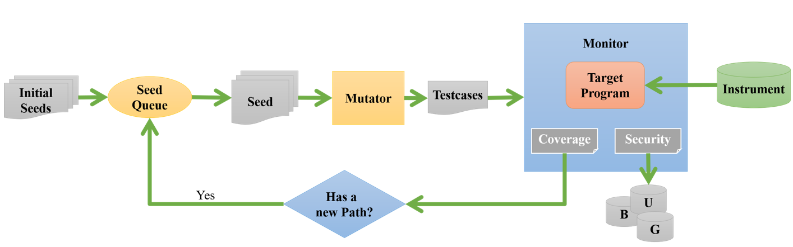
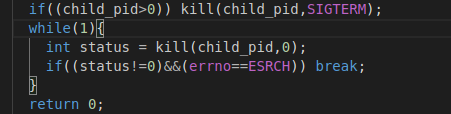
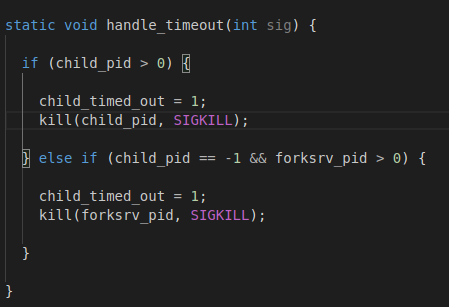
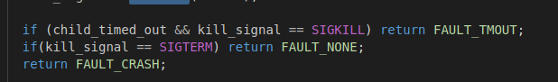
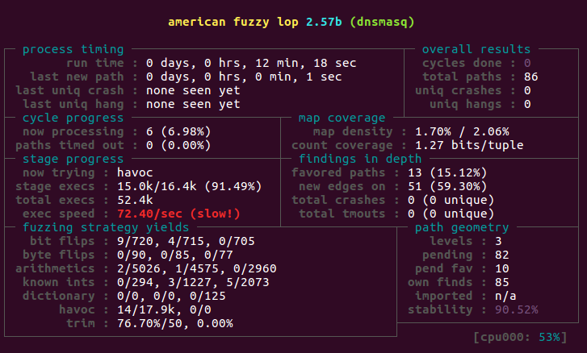

# AFL添加socket发包功能

任务：给AFL添加socket发包功能，使其支持测试DNS协议

参考代码：

因为不太方便直接贴出源码，所以就说明一下思路，记录一些实现 时遇到的错误。

主要的问题有：

1. 写了发包的函数，需要在哪里调用？
2. 如何解决超时的问题？如何及时杀死子进程？
3. 如何配置dnsmasq？？？？？？？？？（弄这玩意给我重装系统了）

需要了解的知识点：

1. AFL大概的执行流程
2. AFL的从哪里获得输入文件
3. AFLmain函数的死循环在执行什么
4. target如何获取输入文件
5. fuzz dns的结果afl是通过什么 途径获取的
6. 管道的概念

afl的main函数大概执行流程：

通过read_testcases从输入文件夹读取所有文件，然后进行排队进行测试，然后调用add_to_queue函数创建queue_entry结构体作为输入文件队列，通过perform_dry_run函数第一次运行测试样例。进入死循环就循环将输入队列当前的输入文件丢入fuzz_one函数处理，该处理就是将种子变异并添加到输入队列里去。

run_target函数就是fork出一个子进程(fuzz的目标程序)进行fuzz。那么socket发包函数的调用就需要在这个位置。run_target函数被调用的地方存在于main函数死循环中的多个函数中，有calibrate_case函数等。

socket发包函数就在定时器设定好后面加即可。原因会在后面信号处理相关解释。

既然要通过socket发送输入文件，那么从哪里获取输入文件呢？

write_to_testcases函数就是用来写入到输入文件中的，该函数的参数为void *mem 和 u32 len，那么就定义两个个全局变量用来获取mem和len来给socket发送即可。

socket发包函数就是普通的socket client的代码，要注意的就是发送了输入文件后，就应该终止该子进程了，那么如何关闭呢？

下面是对信号及信号量处理的解释（这是避免超时的解决办法）

SIGTERM：

程序结束信号，与SIGKILL不同的是，该信号可以被阻塞和处理，通常用来要求程序自己正常退出。

下面这段程序是在socket发包程序当中的。是在关闭了socket后，才运行来结束子进程的。

第一个if用来判断子进程是否还存在，存在则通过kill函数传递SIGTERM信号告诉进程运行完了就快结束。

while（1）作用是用来检验子进程是否还在运行，kill函数的第二个参数为0时，说明没有任何信号发送出去，但是系统会执行错误检查，通常利用第二个参数为0来检验某个进程是否在执行.当kill错误执行就会返回-1，并且errno会被赋值为ESRCH，即目标进程或进程组不存在。

所以当发包，关闭socket后，执行该终止子进程的语句才能避免超时，才能在第一次perform_dry_run顺利通过。

问题：但是如果没能杀死子程序不久进入死循环了吗？

答：这就是后面设置定时器的原因，SIGTERM不一定能杀死程序，所以设置定时器来SIGKILL 子进程

为什么send_over_network 要放在runtarget 设置好定时器后。

因为AFL中定义了进程接收到信号SIGALRM后会执行的函数为

即超时后会给子进程发送SIGKILL信号进行终止运行。而send_over_network 发包目标是子进程(target)，因此需要先设置好定时器，在子进程创建和运行超时时能及时kill掉避免过长时间的运行影响整体FUZZ的速度

在run_target中还添加了

第二个if，获取子进程终止的信号，因为我们在send_over_network中添加了kill 子进程的信号为SIGTERM 所以加入了这一句 FAULT_NONE，否则他将会直接返回FAULT_CRASH会产生错误的结果

该次任务 只是实现了TCP的socket发包，那如果添加TCP和UDP的两种选项呢。

有一种思路就是通过getopt添加命令行选项，并在case中添加相应的执行语句即可。例如输入参数为TCP:127.0.0.1，那么添加命令行选项-N ，那么命令行输入-N TCP:127.0.0.1 在case执行自己的拆解字符串的函数即可。socket发包的代码段添加if进行分支执行即可。

最后结果：

