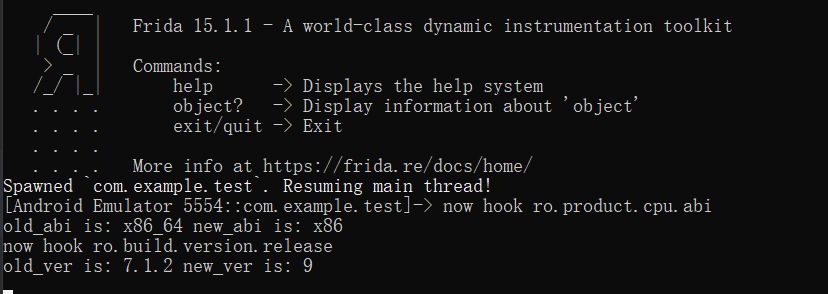

# B站1024逆向题


***第五题：***

**任务：**找到FLAG，也就是APP正确的账号密码

**步骤：**

 先打开APP看看运行出现的东西，


 将apk用jadx打开，并查看com.example.test.MainActivity的代码


 其中可以发现关键的函数，即Encrypt.b ，Encrypt.a，getBytes

 后面的if中调用equals函数可知，该代码的作用就是对输入的账号密码通过Encrypt类的a和b函数进行加密，然后与正确的加密后的账号密码比对是否相等。

 那么只需要将bArr以及第一个equals中new byte[]的字节数组进行解码即可。

 首先查看Encrypt类


 加密的方法很简单，先将输入的账号密码和 i 进行异或，在调用Base64的库函数进行Base64编码。

 那么获得正确的账号密码的方法就很明显了，直接将程序中列出来的两个字节数组先进行Base64的解码，在和 相同的 i 进行异或即可。

 这里通过java来进行解密，还需了解一下 Base64库的decode函数的使用，就是喂一个字节数字数组，通过Base64加密返回一个 字节字符数组。

 JAVA解密代码如下：

```java
package com.example.helloworld;
import java.util.Base64;
public class HelloWorld {
    public static void main(String[] args) {
        Base64.Decoder decoder = Base64.getDecoder();
        byte[] data = {78, 106, 73, 49, 79, 122, 65, 51, 89, 71, 65, 117, 78, 106, 78, 109, 78, 122, 99, 55, 89, 109, 85, 61};
        byte[] data1 = {89, 87, 66, 108, 79, 109, 90, 110, 78, 106, 65, 117, 79, 109, 74, 109, 78, 122, 65, 120, 79, 50, 89, 61};

        byte[]bArr = decoder.decode(data);
        byte[]bArr1 = decoder.decode(data1);
        System.out.println();

        int length = bArr.length;
        for (int i2 = 0; i2 < length; i2++) {
            bArr[i2] = (byte) (bArr[i2] ^ 3);
            bArr1[i2] = (byte) (bArr1[i2] ^ 3);
        }
        String res = new String(bArr);
        String res1 = new String(bArr1);
        System.out.println(res);
        System.out.println(res1);
    }
}
```

 程序输出得到：

```c
516834cc-50e448af
bcf9ed53-9ae4328e
```

 提交FLAG时需合并成：

```c
516834cc-50e448af-bcf9ed53-9ae4328e
```


***第六题：***

 一开始看到第六题的网址和第五题一样，还以为是网址放错了，但是几天后还没有更新，于是就考虑到是不是第六题的flag也在第五题给的APP中，于是反编译该app，得到的lib文件中存在libMylib.so文件，于是推测第六题flag在so文件里。

 我一开始打算用IDA动态调试so文件，但是一attach进程，APP就会直接关闭，我怀疑APP用了什么反调试方法，于是直接IDA打开so文件，查看是否有相关的反调试代码，结果并没有发现，反而发现了关键的产生flag的代码。

 用IDA打开libMylib.so文件，并查看EXPORTS窗口，导出的函数如下：


 双击JNI_Onload，并且翻到最顶，查看如下注释：


 查看标黑的，可以看到该so文件依赖了以上几个so库，并且这个so文件的名字为libMylib.so。我们需要注意libc.so这个依赖库，因为关键的函数从这个库里调用的。

 再次回到JNI_OnLoad函数处，将汇编转为C语言，如下：


 可以看到，该函数注册了MainActivity，并且在下面调用了一个all的函数，双击进去，会发现还有一个all函数被调用，再次进入，我们就能得到如下代码(只截图关键部分)


 第一个if，判断条件虽是数字，但其实是ASCII码，其意思就是判断abi是否是’x86‘，release-version是否为’9‘，接着打开了/data/2233文件，并且后面需要a+的权限，结合后面的fput，应该是要把一些数据写入该文件，那么还需要再/data处创建2233文件，此处需要root才能访问，也需要APP获得root权限才能写入。

 那么关键的就是如何绕过第一个if了，v16，v17的值为__system_property_get函数的返回值，因此我们需要对该函数进行hook，更改其返回值即可。

 因为hook需要知道该函数所在so文件，我们查看IMPORT窗口


 可以看到__system_property_get是从libc.so导入的。

 那么接下来用frida进行hook注入，注入代码如下：

```javascript
function main() {
    Java.perform(function(){
        var str;
        var arg;
        //findExportByName是获得__system_property_get函数再libc.so中的地址
        Interceptor.attach(Module.findExportByName("libc.so", "__system_property_get"), {
            onEnter: function (args) { //此处的args为函数调用时传入的参数
                str = Memory.readCString(args[0]); //获得abi或version
                arg = args[1]; //保存返回值的变量
                if(str.indexOf('ro.product.cpu.abi')!=-1||str.indexOf('ro.build.version.release')!=-1){
                    //如果有这两个字符串
                console.log("now hook "+str)
                }
            },
            onLeave: function (retval) {
                if(str.indexOf('ro.product.cpu.abi')!=-1){
                    var old_abi = Memory.readCString(arg);
                    Memory.writeUtf8String(arg, "x86"); //直接向内存地址写入x86
                    var new_abi = Memory.readCString(arg);
                    console.log('old_abi is:',old_abi,'new_abi is:',new_abi);
                }else if(str.indexOf('ro.build.version.release')!=-1){
                    var old_ver = Memory.readCString(arg);
                    Memory.writeUtf8String(arg, "9"); //直接向内存地址写入9
                    var new_ver = Memory.readCString(arg);
                    console.log('old_ver is:',old_ver,'new_ver is:',new_ver);
                }
            }
        });
    });
}
setImmediate(main);
```

 打开APP，然后在命令行执行

```shell
frida -U --no-pause -f com.example.test -l hook.js
```

 frida运行后得到如下结果：



 检验是否hook成功，打开2233文件查看，结果如下：


 总共16行，那么根据第五题的结果，可以推测出flag为4行一组，’-‘隔开，结果为：

```c
b13981f4-5ae996d4-bc04be5b-34662a78
```
