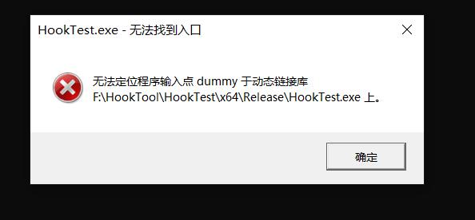

# 常用DLL注入技术解析


#### 0x0 前言

纸上得来终觉浅，DLL注入光听书中说总是不过瘾，于是自己动手写一写代码。这也是我第一次写Windows编程，虽然都是C语言，但变量类型，API却一点也不了解。可是做Windows逆向不会Windows编程怎么行呢？于是这个小项目也用来入门Windows编程，熟悉一些常用写法和API。后面在实现API Hook时，我也是通过这个DLL 注入工具进行HOOK测试。

这个小项目是参考了injectAllTheThings项目，以及《核心原理》DLL注入部分内容编写完成的，其中的反射式DLL注入是参考了作者stephenfewer开源代码完成。参考项目链接都放在后面了。

我实现了五种注入方法，如下图所示


同时还实现了向全进程注入以及卸载DLL的功能。

为了再次强化学习DLL注入的知识，再加上网上对这个技术分析的文章质量实在不敢恭维，因此自己就想把自己的学习过程以及对这个技术的理解尽可能高质量的清晰地写出来。

该博客里的代码并不完整，可以将项目的代码对着博客理解。

项目地址：

 [DllInJectionTool](https://github.com/Mrsdwang/LittleDllInjectionTool)

参考项目：

  [injectAllTheThings](https://github.com/DanielRTeixeira/injectAllTheThings)

  [ReflectiveDLLInjection](https://github.com/stephenfewer/ReflectiveDLLInjection)

#### 0x1 何为DLL注入

先简单介绍一下什么是DLL, DLL(Dynamic Linked Library，动态链接库)的存在是为了解决因库函数多次被程序加载至内存导致内存浪费的情况。当一个DLL首次被进程加载后，该DLL的代码以及资源就可以实现共享，允许其他的进程使用。

DLL还有一个特性，当DLL被加载到进程内存空间后会自动执行DllMain()函数，只要将想要程序执行的代码写入DllMain函数中，当该DLL被加载后这些代码就会自动执行，这也就是DLL注入的原理。

因此DLL注入聚焦于如何让已经运行的程序加载外部DLL。同时，会在最后更改PE文件数据，通过静态方法让PE文件在启动时自动加载目标DLL。

#### 0x2 CreateRemoteThread, RtlCreateUserThread and NtCreateThreadEx

##### 0x2.1CreateRemoteThread

通过CreateRemoteThread函数来实现DLL注入是非常经典的方法。该方法的实现思路如下，首先为DLL路径字符串申请内存空间，将DLL路径写入目标进程的内存中，并通过GetProcAddress获得LoadLibrary函数地址，最后通过CreateRemoteThread函数在目标进程创建一个线程，这个线程函数就是LoadLibrary，而DLL路径字符串作为线程函数的参数传入。那么就能让目标进程运行LoadLibrary函数加载目标DLL，从而实现DLL注入。

流程图如下：


核心代码如下:

```c
// 获取目标进程句柄
hProcess = OpenProcess(dwDesireAccess, FALSE, dwPID);
// 申请DLL路径字符串长度的内存空间
pRemoteBuf = VirtualAllocEx(hProcess, NULL, dwBuffSize, MEM_COMMIT | MEM_RESERVE, PAGE_READWRITE);
// 将DLL路径字符串写入申请的内存空间中
WriteProcessMemory(hProcess, pRemoteBuf, (LPCVOID)szDllPath, dwBuffSize, NULL);
// 获取LoadLibrary函数地址
hMod = GetModuleHandle(L"kernel32.dll");
hThreadProc = (LPTHREAD_START_ROUTINE)GetProcAddress(hMod, "LoadLibraryW");
// 创建远程线程运行LoadLibrary函数实现DLL的加载
hThread = CreateRemoteThread(hProcess, NULL, 0, pThreadProc, pRemoteBuf, 0, NULL);
```

##### 0x2.2 RtlCreateUserThread

我并没有在MSDN中查找到这个函数的定义，在网上搜索得到的信息说这个函数是未公开的。因此只能通过网上流出的该函数的信息进行定义后使用，也可自己去逆向出该函数的参数等一些信息。

RtlCreateUserThread函数与CreateRemoteThread函数类似，最终都会调用NtCreateThreadEx函数来创建进程实体。

因此该函数实现流程与CreateRemoteThread无异，但因为其是未导出的函数，我们无法直接调用RtlCreateUserThread函数，需要自己定义RtlCreateUserThread函数，并且需要通过GetProcAddress函数获得其地址后才能调用。

流程图如下:


首先定义RtlCreateUserThread函数:

```c
typedef DWORD(WINAPI* pRtlCreateUserThread)(
	IN HANDLE 					ProcessHandle,
	IN PSECURITY_DESCRIPTOR 	SecurityDescriptor,
	IN BOOL 					CreateSuspended,
	IN ULONG					StackZeroBits,
	IN OUT PULONG				StackReserved,
	IN OUT PULONG				StackCommit,
	IN LPVOID					StartAddress,
	IN LPVOID					StartParameter,
	OUT HANDLE 					ThreadHandle,
	OUT LPVOID					ClientID
	);
```

核心代码如下:

```c
// 获取目标进程句柄
hProcess = OpenProcess(dwDesireAccess, FALSE, dwPID);
// 申请DLL路径字符串长度的内存空间
pRemoteBuf = VirtualAllocEx(hProcess, NULL, dwBuffSize, MEM_COMMIT | MEM_RESERVE, PAGE_READWRITE);
// 将DLL路径字符串写入申请的内存空间中
WriteProcessMemory(hProcess, pRemoteBuf, (LPCVOID)szDllPath, dwBuffSize, NULL);
// 获取LoadLibrary函数地址
hMod = GetModuleHandle(L"kernel32.dll");
hThreadProc = (LPTHREAD_START_ROUTINE)GetProcAddress(hMod, "LoadLibraryW");
// 获取RtlCreateUserThread函数的地址
RtlCreateUserThread = (pRtlCreateUserThread)GetProcAddress(GetModuleHandle(L"ntdll.dll"), "RtlCreateUserThread");
// 调用RtlCreateUserThread函数
Status = (BOOL)RtlCreateUserThread(
	hProcess,
	NULL,
	0,
	0,
	0,
	0,
	hThreadProc,
	pRemoteBuf,
	&hRemoteThread, //通过RtlCreateUserThread创建的线程句柄
	NULL);
```

##### 0x2.3 NtCreateThreadEx

前面两个函数CreateRemoteThread 以及 RtlCreateUserThread 都是 NtCreateThreadEx函数的封装。经过调试会发现CreateRemoteThread函数与RtlCreateUserThread函数执行最后，都进入了NtCreateThreadEx函数，并在该函数通过SYSENTER指令进入了内核模式。

在Windows vista以后，Windows对系统服务和登录用户进行了会话隔离，即系统服务属于会话0，第一个登陆系统的用户为会话1。如果会话1的用户尝试向会话0的进程创建远程进程就会失败。原因是在Windows XP以后，CreateRemoteThread内部实现算法采取了挂起模式。当会话0的进程被创建远程线程时，会采取挂起模式创建，然后会进行判断被创建远程线程的进程是否属于会话0并且发起注入的进程和目标进程是不是属于同一个会话。如果不属于相同的会话，那么对会话0创建的远程线程就不会被CsrClientCallServer函数进行登记的操作，这就导致挂起创建的进程不会恢复运行，而是直接返回错误，这就是利用CreateRemoteThread函数对会话0的进程进行注入会失败的原因。

通过调试CreateRemoteThread函数可知，当执行完NtCreateThreadEx后，会创建出线程句柄，并且该函数会根据第七个参数的值来决定该线程是否以挂起模式创建。当通过CreateRemoteThread函数向会话0进程创建远程线程操作中，当调用NtCraeteThreadEx函数时，第七个参数为TRUE，即以挂起模式创建，因此必须通过在KernelBase!CreateRemoteThreadEx中的CsrClientCallServer 以及 ZwResumeThread 函数唤醒线程。如果直接通过NtCreateThreadEx函数不以挂起模式(第七参数为FALSE)创建线程，那么就能跳过会话隔离造成的注入失败情况。

NtCreateThreadEx函数同样是未公开的函数，有可能会在以后被改变，因此之后该方法有可能失效。同RtlCreateUserThread函数一样，我们需要定义NtCreateThreadEx函数，方法也是网上搜集信息或者自己逆向出来。

流程图:


对NtCreateThreadEx函数的定义如下(32位以及64位不同)：

```c
// 64位用
typedef NTSTATUS(WINAPI* LPFUN_NtCreateThreadEx)(
	PHANDLE hThread,
	ACCESS_MASK DesireAccess,
	LPVOID ObjectAttributes,
	HANDLE ProcessHandle,
	LPTHREAD_START_ROUTINE lpstartAddress,
	LPVOID lpParameter,
	ULONG CreateThreadFlags,
	SIZE_T ZeroBits,
	SIZE_T StackSize,
	SIZE_T MaximumStackSize,
	LPVOID lpBytesBuffer
	);
	
// 32位用
typedef NTSTATUS(WINAPI* LPFUN_NtCreateThreadEx)(
	PHANDLE hThread,
	ACCESS_MASK DesireAccess,
	LPVOID ObjectAttributes,
	HANDLE ProcessHandle,
	LPTHREAD_START_ROUTINE lpstartAddress,
	LPVOID lpParameter,
	BOOL CreateSuspended,
	ULONG StackZeroBits,
	ULONG SizeOfStackCommit,
	ULONG SizeOfStackReserve,
	LPVOID lpBytesBuffer
	);	
```

核心代码：

```c
// 获取目标进程句柄
hProcess = OpenProcess(dwDesireAccess, FALSE, dwPID);
// 申请DLL路径字符串长度的内存空间
pRemoteBuf = VirtualAllocEx(hProcess, NULL, dwBuffSize, MEM_COMMIT | MEM_RESERVE, PAGE_READWRITE);
// 将DLL路径字符串写入申请的内存空间中
WriteProcessMemory(hProcess, pRemoteBuf, (LPCVOID)szDllPath, dwBuffSize, NULL);
// 获取LoadLibrary函数地址
hMod = GetModuleHandle(L"kernel32.dll");
hThreadProc = (LPTHREAD_START_ROUTINE)GetProcAddress(hMod, "LoadLibraryW");
// 获取NtCreateThreadEx函数地址
pFunc = GetProcAddress(GetModuleHandle(L"ntdll.dll"), "NtCreateThreadEx");
// 调用NtCreateThreadEx函数
((LPFUN_NtCreateThreadEx)pFunc)
			(&hThread,
			0x1FFFFF,
			NULL,
			hProcess,
			pThreadProc,
			pRemoteBuf,
			FALSE, // 该参数决定了是否以挂起模式创建线程.1挂起,0运行.
			NULL,
			NULL,
			NULL,
			NULL);
```

#### 0x3 QueueUserAPC

APC(异步调用过程)是一种软中断机制，当一个线程从等待状态苏醒时就会检测是否有APC交给自己，如果有就会优先执行APC过程。利用这种机制，我们通过向线程添加APC过程，从而让程序执行实现DLL注入的函数。我们通过QueueUserAPC函数向线程添加APC过程，而我们的APC过程执行函数为LoadLibrary，传入的参数为DLL路径字符串。

那么这里就有一个问题，我们没有办法保证一个线程一定会有可唤醒状态，因此为了提高调用几率，我们需要向目标进程的所有线程都添加该APC过程。而这又引起了一个问题，就是会导致DLL会被多次注入，那么当我们卸载DLL时也需要卸载相同次数。

流程图：


核心代码:

```c
// 获取目标进程句柄
hProcess = OpenProcess(dwDesireAccess, FALSE, dwPID);
// 申请DLL路径字符串长度的内存空间
pRemoteBuf = VirtualAllocEx(hProcess, NULL, dwBuffSize, MEM_COMMIT | MEM_RESERVE, PAGE_READWRITE);
// 将DLL路径字符串写入申请的内存空间中
WriteProcessMemory(hProcess, pRemoteBuf, (LPCVOID)szDllPath, dwBuffSize, NULL);
// 获取LoadLibrary函数地址
hMod = GetModuleHandle(L"kernel32.dll");
hThreadProc = (LPTHREAD_START_ROUTINE)GetProcAddress(hMod, "LoadLibraryW");
// 获取系统全线程的快照
hSnapShot = CreateToolhelp32Snapshot(TH32CS_SNAPTHREAD, NULL);
// 遍历全线程找到属于目标进程的线程
for (; ThreadEnd; ThreadEnd = Thread32Next(hSnapShot, &te))
	{
    	// dwPID 为目标进程pid
		if (te.th32OwnerProcessID == dwPID)
		{
			ThreadID = te.th32ThreadID;
			// 获取线程句柄
			hThread = OpenThread(THREAD_ALL_ACCESS, FALSE, te.th32ThreadID);
            // 向目标进程的线程添加APC过程,APC执行的是LoadLibrary函数，参数为DLL路径字符串
			QueueUserAPC((PAPCFUNC)hThreadProc, hThread, (ULONG_PTR)pRemoteBuf);
            // Counter用来记录注入了多少次，便于卸载
			Counter++;
			CloseHandle(hThread);
			}
		}
	}
```

#### 0x4 SetWindowsHookEx

该DLL注入方法与Windows系统中的消息机制有关。Windows消息钩取原理如下图所示:

( 图源自《核心原理》)


结合该图我们先了解一下Windows的消息机制。

Windows是以事件驱动为工作方式，其维护着一个OS message queue的消息队列。当发生事件时，该事件对应的消息会被添加到OS message queue中，然后OS判断哪个应用发生了该事件，然后就从OS message queue 中取出该消息发送给应用的message queue中。

在这个过程中，我们可以添加钩子，在消息传给应用的消息队列前钩取，由此可以读取、拦截以及修改消息。

我们通过SetWindowsHookEx函数注册钩子，要了解如何通过SetWindowsHookEx注册的钩子实现DLL注入，我们需要先了解该函数的参数的意义。

```c
HHOOK SetWindowsHookEx(
  [in] int       idHook,
  [in] HOOKPROC  lpfn,
  [in] HINSTANCE hmod,
  [in] DWORD     dwThreadId
);
para1: idHook是事件类型，例如键盘输入事件
para2: lpfn是钩子过程(Hook Procedure),即事件发生后要执行的函数
para3: hmod是包含lpfn函数的DLL
para4: dwThreadId是想要被挂钩的线程ID，即事件发生后，需要勾取的线程
```

当我们通过SetWindowsHookEx函数注册好钩子后，当想要被挂钩的线程所属的进程发生指定事件后，操作系统会将相关的DLL文件强制注入到目标进程中，然后调用钩子过程。

因此我们需要将我们希望程序执行的代码，即钩子过程(Hook Procedure)，写入DLL的导出函数中，如此才能在注入器中通过GetProcAddress函数获得钩子过程的地址。

流程图：


核心代码：

```c
// 获得目标进程当前的线程ID
DWORD ThreadID = GetThreadID(dwPID);
// 加载目标DLL，但在加载以及卸载的时候不会执行DllMain函数(参数3定义的)
HMODULE dll = LoadLibraryEx(szDllPath, NULL,DONT_RESOLVE_DLL_REFERENCES);
// 获取钩子过程(hook procedure)的地址，DLL文件中钩子过程的函数名需要为"Poc"
HOOKPROC addr = (HOOKPROC)GetProcAddress(dll, "Poc");
// 注册钩子
// 触发HOOK事件为键盘输入，addr为钩子过程，dll为钩子过程所在的DLL，ThreadID为目标进程的线程ID
HHOOK handle = SetWindowsHookEx(WH_KEYBOARD, addr, dll, ThreadID);
// 通过getchar()函数让钩子能等待事件触发再脱钩
getchar();
// 注销钩子(脱钩)
UnhookWindowsHookEx(handle);
```

#### 0x5 Reflective Injection

这个反射式注入方法较前面几种方法更加隐蔽，其是通过手动方式将DLL文件加载至目标进程内存中，而不是通过LoadLibrary，因此没有向进程注册目标DLL，所以例如Process explore这样的程序也无法检测到该DLL。

该方法通过手动让DLL文件加载到内存中，相当于手动实现了PE加载器的功能，因此我们可以从该注入方法可以强化对PE文件结构的了解，并能学到PE加载器的实现过程，PE文件如何实现重定位，以及PE文件查看器的实现思路(即如何取出PE文件中的不同数据)。

该方法我们需要在目标DLL中实现一个名为ReflectiveLoader的导出函数，并在注入器中实现我们的LoadRemoteLibraryR函数来替代原LoadLibrary，来完成DLL的加载。

该注入技术的代码每一行都已经注释在项目代码中。

反射式DLL注入方式的总体流程图:


注入器实现流程图:


在注入器的实现中，必须清楚一点，我们是先把DLL文件读入注入器的堆空间中，不是目标进程的内存空间。

同时，我们打开的是DLL文件在磁盘的文件结构，因此当我们读取DLL文件结构中保存的是相对虚拟地址的数据时，我们需要转化成文件偏移才能正确获取数据。只有当文件以Image结构存在与内存中时，才不需要将相对虚拟地址转换成文件偏移。

注入器核心代码：

```c
// 打开目标DLL文件
hFile = CreateFileW(cpDllFile, GENERIC_READ, 0, NULL, OPEN_EXISTING,FILE_ATTRIBUTE_NORMAL, NULL);
// 获取目标DLL文件大小
dwLength = GetFileSize(hFile, NULL);
// 在注入器中分配目标DLL文件大小的堆空间
lpBuffer = HeapAlloc(GetProcessHeap(), 0, dwLength);
// 向申请的堆空间写入DLL文件
ReadFile(hFile, lpBuffer, dwLength, &dwBytesRead, NULL);
// 获取目标进程句柄
hProcess = OpenProcess(PROCESS_ALL_ACCESS, FALSE, dwPID);
// 调用ReflectiveLoader函数,实现目标DLL的加载至目标进程
hModule = LoadRemoteLibraryR(hProcess, lpBuffer, dwLength, NULL);
```

LoadRemoteLibraryR函数实现流程图:


LoadRemoteLibraryR核心代码:

```c
// 获取DLL中ReflectiveLoader函数的文件偏移地址
dwReflectiveLoaderOffset = GetReflectiveLoaderOffset(lpBuffer);
// 在目标进程申请DLL文件大小的内存空间
lpRemoteLibraryBuffer = VirtualAllocEx(hProcess, NULL, dwLength, MEM_RESERVE | MEM_COMMIT, PAGE_EXECUTE_READWRITE);
// 将DLL文件写入目标进程申请的内存空间中
WriteProcessMemory(hProcess, lpRemoteLibraryBuffer, lpBuffer, dwLength, NULL);
// 获取在目标进程中DLL文件写入到的内存空间中的ReflectiveLoader函数的文件偏移
lpReflectiveLoader = (LPTHREAD_START_ROUTINE)((ULONG_PTR)lpRemoteLibraryBuffer + dwReflectiveLoaderOffset);
// 通过函数RtlCreateUserThread创建远程线程来调用ReflectiveLoader函数(因此我们还需要定义RtlCreateUserThread函数)
RtlCreateUserThread = (PRTL_CREATE_USER_THREAD)(GetProcAddress(GetModuleHandle(TEXT("ntdll")), "RtlCreateUserThread"));
RtlCreateUserThread(hProcess, NULL, 0, 0, 0, 0, lpReflectiveLoader, lpParameter, &hThread, NULL);
```

在LoadRemoteLibraryR函数中调用了GetReflectiveLoaderOffset函数获取了ReflectiveLoader函数在目标DLL中的文件偏移地址。

GetReflectiveLoaderOffset流程图:


核心代码:

```c
// 获取DLL文件写入的内存堆的起始地址
uiBaseAddress = (UINT_PTR)lpReflectiveDllBuffer;
// 获取DLL文件的NT Header 的文件偏移，也就是PE签名开头的地址
uiExportDir = uiBaseAddress + ((PIMAGE_DOS_HEADER)uiBaseAddress)->e_lfanew;
// 获取可选头中的导出表地址
uiNameArray = (UINT_PTR) & ((PIMAGE_NT_HEADERS)uiExportDir)->OptionalHeader.DataDirectory[IMAGE_DIRECTORY_ENTRY_EXPORT];
// 将相对虚拟地址转为文件偏移是因为此时DLL文件在内存中的结构与在磁盘中的结构相同，并没有以Image结构存于内存中
// 获取IMAGE_EXPORT_DIRECTORY结构体的地址
uiExportDir = uiBaseAddress + Rva2Offset(((PIMAGE_DATA_DIRECTORY)uiNameArray)->VirtualAddress, uiBaseAddress);
// 获取DLL导出函数名称的数组文件偏移
uiNameArray = uiBaseAddress + Rva2Offset(((PIMAGE_EXPORT_DIRECTORY)uiExportDir)->AddressOfNames, uiBaseAddress);
// 获取DLL导出函数地址数组的文件偏移
uiAddressArray = uiBaseAddress + Rva2Offset(((PIMAGE_EXPORT_DIRECTORY)uiExportDir)->AddressOfFunctions, uiBaseAddress);
// 获取DLL导出函数Ordinals数组的文件偏移
uiNameOrdinals = uiBaseAddress + Rva2Offset(((PIMAGE_EXPORT_DIRECTORY)uiExportDir)->AddressOfNameOrdinals, uiBaseAddress);
// 获取导出函数的数量
dwCounter = ((PIMAGE_EXPORT_DIRECTORY)uiExportDir)->NumberOfNames;
// 遍历所有导出函数寻找反射加载器函数
while (dwCounter--)
{
	// 获取导出函数名称，导出函数名称数组保存的是函数名称字符串保存的相对虚拟地址，因此还需要第二次转换字符串保存的地址为文件偏移
	char* cpExportedFunctionName = (char*)(uiBaseAddress + Rva2Offset(DEREF_32(uiNameArray), uiBaseAddress));
	// 如果导出函数名称数组中能找到字符串"ReflectiveLoader"
	if (strstr(cpExportedFunctionName, "ReflectiveLoader") != NULL)
	{
		// 当找到反射加载器函数后，就获取函数地址表文件偏移
		uiAddressArray = uiBaseAddress + Rva2Offset(((PIMAGE_EXPORT_DIRECTORY)uiExportDir)->AddressOfFunctions, uiBaseAddress);
		// 以Orinal的值作为索引，从函数地址数组取出反射加载器函数的地址
         // DEREF_16和DEREF_32是一个宏，会将括号里的变量转化成16位或32位指针，然后取出指针的数据
		uiAddressArray += (DEREF_16(uiNameOrdinals) * sizeof(DWORD));
		// 将反射加载器函数的地址转为文件偏移地址
		return Rva2Offset(DEREF_32(uiAddressArray), uiBaseAddress);
	}
	// 如果没找到反射加载器的函数就把指针移动到下一个函数名称数组元素
	uiNameArray += sizeof(DWORD);
    // 函数名称数组每一个数据对应一个函数，以该函数在函数名称数组对应的索引作为NameOrdinal数组的索引取到的数据就为这个函数的Ordinal。再通过该Ordinal作为索引在函数地址数组取出该函数的相对虚拟地址。
	// 那么根据Ordinal数组的 Ordinal = 函数地址表的index 的形式同步函数名称数组移动，找到后即可从以Ordinal索引从函数地址数组取出相应函数的地址
	uiNameOrdinals += sizeof(WORD);
}
```

GetReflectiveLoader函数中使用到了RVA2Offset函数，该函数中判断RVA是否可以转化成文件偏移的条件是非常值得学习的细节。

RVA2Offset核心代码如下:

```c
// 相对虚拟地址和文件偏移转化是根据公式:
// offset = RVA - VirtualAddress + PointerToRawData
// 而VirtualAddress 和 PointerToRawData 为节区头的数据

// 获取NT头的地址，也就是PE签名开始的地址
pNtHeaders = (PIMAGE_NT_HEADERS)(uiBaseAddress + ((PIMAGE_DOS_HEADER)uiBaseAddress)->e_lfanew);
// 获取节区头开始的地址。计算方法为 addr(OptionHeader) + sizeof(OptionHeader)，就能跳过OpitionHeader区域，获得节区头地址
pSectionHeader = (PIMAGE_SECTION_HEADER)((UINT_PTR)(&pNtHeaders->OptionalHeader) + pNtHeaders->FileHeader.SizeOfOptionalHeader);
// 如果需要进行RVA转化成Offset的RVA小于第一个节区的文件起始地址，就返回。因为RVA小于，那么就不可能是节区的数据，不需要转换。
if (dwRva < pSectionHeader[0].PointerToRawData)
	return dwRva;
//以上就是获取节区地址
// 有多少节区就循环多少次
for (wIndex = 0; wIndex < pNtHeaders->FileHeader.NumberOfSections; wIndex++)
{
	// 如果要转换的RVA大于等于该节区在内存中的起始地址(RVA),并且需要转换的RVA小于节区在内存中的起始地址加上该节区在磁盘中的大小就返回转化值
	// 第二个条件，是因为VirtualSize要小于SizeofRawData才能避免转换到错误节区，因此这个条件是假设该节区Image的大小等于在文件的大小，最大程度确保转换的RVA在这个节区的地址范围里面
	if (dwRva >= pSectionHeader[wIndex].VirtualAddress && dwRva < (pSectionHeader[wIndex].VirtualAddress + pSectionHeader[wIndex].SizeOfRawData))
	// 根据计算公式 Offset = RVA - VirtualAddress + PointerToRawData
		return (dwRva - pSectionHeader[wIndex].VirtualAddress + pSectionHeader[wIndex].PointerToRawData);
}
```

以上过程就实现了调用ReflectiveLoader函数，通过这个函数将DLL文件转化成Image结构存在内存中，以此来完成DLL的加载。

那么接下来就对ReflectiveLoader函数进行分析，探究其是如何完成DLL加载的。

ReflectiveLoader实现流程图:


核心代码:

步骤1. 定位内存中的DLL基地址

```c
// _ReturnAddress函数内联化
// 但如果调用比内联化效果更好，则会调用而不是内联化
#pragma intrinsic( _ReturnAddress )
// 函数前的__declspec(noinline)是为了避免caller函数被编译器内联优化
// 如果内联化后返回的将是ReflectiveLoader函数的返回地址
// 没有被内联返回的将是caller函数的返回地址
__declspec(noinline) ULONG_PTR caller(VOID) { return (ULONG_PTR)_ReturnAddress(); }
// 获得caller函数的返回地址
uiLibraryAddress = caller();

// 定位DLL文件当前所在内存空间的基地址
while (TRUE)
{
	// 如果遍历地址找到了DLL文件的基址，也就是MZ签名处
	if (((PIMAGE_DOS_HEADER)uiLibraryAddress)->e_magic == IMAGE_DOS_SIGNATURE)
	{
		// 获取DLL文件的NT头起始地址，PE签名
		uiHeaderValue = ((PIMAGE_DOS_HEADER)uiLibraryAddress)->e_lfanew;
		// 一些x64的dll可能触发虚假的签名，因为pop r10的二进制表示为4D5A也即(MZ字符)的ASIIC编码，所以中途如果有pop r10则可能引起错误判断为MZ签名
		// 如果获取的NT头起始地址大于DOS头的大小，并且地址小于1024(D)=400(h)，即小于第一个节区开始的地址
		if (uiHeaderValue >= sizeof(IMAGE_DOS_HEADER) && uiHeaderValue < 1024)
		{
			// 如果找到了正确而不是加的MZ签名，那么此时uiHeaderValue为PE签名的RVA，而uiLibraryAddress为基址
			// 因此签名正确，则则满足下面的if，否则就退出，uiLibraryAddress继续减至基址
			uiHeaderValue += uiLibraryAddress;
            // 找到正确的PE和MZ签名后break
			if (((PIMAGE_NT_HEADERS)uiHeaderValue)->Signature == IMAGE_NT_SIGNATURE)
					break;
			}
		}
		// 没有找到MZ签名那就继续遍历地址
		uiLibraryAddress--;
	}
```

步骤2. 获取为了加载DLL所需要的函数。共需要四个函数，其中LoadLibrary、VirtualAlloc以及GetProcAddress三个函数在Kernel32.dll中，NtFlushInstructionCache函数在ntdll.dll中

核心代码:

```c
// 从PEB(进程环境块)中获取目标进程的已经加载了的DLL链
// 在64位系统中通过GS寄存器获取TEB(线程环境块),32位系统通过FS寄存器获取TEB
// 64位的TEB中0x60偏移数据为PEB入口地址,32为系统的TEB中0x30偏移数据为PEB入口地址
#ifdef _WIN64
	// 读取GS寄存器0x60偏移的数据
	uiBaseAddress = __readgsqword(0x60);
#else
#ifdef _WIN32
	// 读取FS寄存器0x30偏移的数据
	uiBaseAddress = __readfsdword(0x30);
#endif
#endif
```

这里需要插入对_PEB_LDR_DATA结构体的说明，才能明白后面的代码在干什么。可以先浏览后面的代码前面一部分，再回来看这里的知识可以更容易理解这部分内容的意义。

从PEB中获取的pLdr为结构体_PEB_LDR_DATA的入口地址。

_PEB_LDR_DATA结构体内容如下:

```c
typedef struct _PEB_LDR_DATA
{
	ULONG Length;                                 // +0x00
	BOOLEAN Initialized;                          // +0x04
	PVOID SsHandle;                               // +0x08
	LIST_ENTRY InLoadOrderModuleList;             // +0x0c 按照DLL加载的顺序建立的链表
	LIST_ENTRY InMemoryOrderModuleList;           // +0x14 按照DLL在内存中的顺序建立的链表
	LIST_ENTRY InInitializationOrderModuleList;   // +0x1c 按照DLL在初始化时的顺序建立的链表
 } PEB_LDR_DATA,*PPEB_LDR_DATA;
10 // 该结构体包含了三个双向链表(_LIST_ENTRY),它们分别指向了_LDR_DATA_TABLE_ENTRY结构体。
```

其中_LIST_ENTRY结构体内容如下:

```c
typedef struct _LIST_ENTRY //8字节大小
{
	struct _LIST_ENTRY *Flink;                    // +0x00
	struct _LIST_ENTRY *Blink;                    // +0x04
} LIST_ENTRY, *PLIST_ENTRY, *RESTRICTED_POINTER PRLIST_ENTRY;
// 这个双向链表指向了进程中加载的模块，结构中的每个指针，都指向了一个LDR_DATA_TABLE_ENTRY结构体。
```

每一个DLL模块对应一个LDR_DATA_TABLE_ENTRY结构体，该结构体成员如下

```c
typedef struct _LDR_DATA_TABLE_ENTRY
{
    LIST_ENTRY InLoadOrderLinks; 
    LIST_ENTRY InMemoryOrderModuleList;
    LIST_ENTRY InInitializationOrderModuleList;
    PVOID DllBase;                              // DLLImage基址
    PVOID EntryPoint;                           // 入口点
    ULONG SizeOfImage;                          // Image大小
    UNICODE_STRING FullDllName;                 // DLL全路径字符串
    UNICODE_STRING BaseDllName;                 // DLL名称字符串
    ULONG Flags;
    SHORT LoadCount;
    SHORT TlsIndex;
    LIST_ENTRY HashTableEntry;
    ULONG TimeDateStamp;
}LDR_DATA_TABLE_ENTRY, *PLDR_DATA_TABLE_ENTRY;
```

我们通过PEB_LDR_DATA结构体中的三个双向链表遍历DLL模块时，会有一个特点，他们总是指向下一个或上一个LDR_DATA_TABLE_ENTRY结构体相同的位置。

例如:

通过PPEB_LDR_DATA->InLoadOrderModuleList遍历时，Flink指针指向上一个或Blink下一个PLDR_DATA_TABLE_ENTRY->InLoadOrderList。

通过PPEB_LDR_DATA->InMemoryOrderModuleList遍历时，Flink指针指向上一个或Blink下一个PLDR_DATA_TABLE_ENTRY->InMemoryOrderModuleList。

对于InInitialZationOrderModuleList遍历同理。

因此这会影响读取LDR_DATA_TABLE_ENTRY结构体中其他成员时需要取的偏移。

该双向链表示意图如下图所示:


图中只画了InLoadOrderModuleList和InMemoryOrderModuleList的链表表现形式，但是InInitialZationOrderModuleList也是相同的。虽然图中画的InLoadOrderModuleList和InMemoryOrderModuleList两个链表顺序一致，但实际中链表的连接结构体顺序并不一定相同。这里只是示意图。

当我们弄明白DLL链后，再次回到核心代码进行分析，从DLL获取目标函数这一部分内容可以结合上述的内容进行理解。

核心代码(接上):

```c
// 获取目标进程加载的DLL链
uiBaseAddress = (ULONG_PTR)((_PPEB)uiBaseAddress)->pLdr;
// DLL链是一个双向链表
// 获取InMemoryOrderList 链表的第一个存储着DLL信息结构体的入口地址
uiValueA = (ULONG_PTR)((PPEB_LDR_DATA)uiBaseAddress)->InMemoryOrderModuleList.Flink;
while (uiValueA)
{
	// 这里的PEB_LDR_DATA结构体注释掉了第一个成员，那为什么BaseDllName还是原地址而不是前一个成员的变量呢？
	// 难道转换类型后不应该自动 的把结构体第一个成员保存着起始地址的数据吗，也就是InMemoryOrderModule的成员存的是InLoadLinks的数据
	// 解释是是因为字节对称，因此还是会保持原来的对应结构。也就是因为前面说的链表特性导致，我们通过InMemoryOrderList遍历时仍然会指向上一个或下一个DLL信息结构体的InMemoryOrderList。
	// 获取当前DLL的名称
	uiValueB = (ULONG_PTR)((PLDR_DATA_TABLE_ENTRY)uiValueA)->BaseDllName.pBuffer;
	// 获取DLL名称的长度
	usCounter = ((PLDR_DATA_TABLE_ENTRY)uiValueA)->BaseDllName.Length;
	// DLL计算出的Hash值保存在uiValueC中
	uiValueC = 0;
	// 计算DLL的Hash，下面的do-while就在进行Hash值的计算
	do
	{
		// 将uiValueC循环右移13位，是循环右移所以不会丢失数据
		uiValueC = ror((DWORD)uiValueC);
		// 把DLL名中的小写字母变大写，然后用uiValueC加上变化后的十六字节数据
		if (*((BYTE*)uiValueB) >= 'a')
				uiValueC += *((BYTE*)uiValueB) - 0x20;
			else
				uiValueC += *((BYTE*)uiValueB);
        	// 移动到DLL名称的下一个字母
			uiValueB++;
		} while (--usCounter);
	// 如果该DLL的Hash值与KERNEL32.DLL的相同
	if ((DWORD)uiValueC == KERNEL32DLL_HASH)
	{
		// 获取DLL的基址
		uiBaseAddress = (ULONG_PTR)((PLDR_DATA_TABLE_ENTRY)uiValueA)->DllBase;
		// 获取DLL的NT头
		uiExportDir = uiBaseAddress + ((PIMAGE_DOS_HEADER)uiBaseAddress)->e_lfanew;
		// 获取DLL的导出表入口地址
		uiNameArray = (ULONG_PTR) & ((PIMAGE_NT_HEADERS)uiExportDir)->OptionalHeader.DataDirectory[IMAGE_DIRECTORY_ENTRY_EXPORT];
		// 获取导出表的VA
		uiExportDir = (uiBaseAddress + ((PIMAGE_DATA_DIRECTORY)uiNameArray)->VirtualAddress);
		// 获取导出函数名称数组的起始地址
		uiNameArray = (uiBaseAddress + ((PIMAGE_EXPORT_DIRECTORY)uiExportDir)->AddressOfNames);
		// 获取导出函数Ordinals数组的起始地址
		uiNameOrdinals = (uiBaseAddress + ((PIMAGE_EXPORT_DIRECTORY)uiExportDir)->AddressOfNameOrdinals);
			// 这个3的是我们在KERNEL32.DLL中需要的函数的数量
		usCounter = 3;
		while (usCounter > 0)
		{
			// 计算函数名字符串的地址的Hash值
			dwHashValue = hash((char*)(uiBaseAddress + DEREF_32(uiNameArray)));
			// 如果找到了我们需要的函数，那么就获取他们的VA
			// 需要的函数有LoadLibraryA,GetProcAddress,VirtualAlloc
			if (dwHashValue == LOADLIBRARYA_HASH || dwHashValue == GETPROCADDRESS_HASH || dwHashValue == VIRTUALALLOC_HASH)
			{
				// 获得导出函数地址数组的地址
				uiAddressArray = (uiBaseAddress + ((PIMAGE_EXPORT_DIRECTORY)uiExportDir)->AddressOfFunctions);
				// 使用ordinal作为索引获取所需函数的地址
				uiAddressArray += (DEREF_16(uiNameOrdinals) * sizeof(DWORD));
				// 保存所需函数的虚拟地址
				if (dwHashValue == LOADLIBRARYA_HASH)
					pLoadLibraryA = (LOADLIBRARYA)(uiBaseAddress + DEREF_32(uiAddressArray));
				else if (dwHashValue == GETPROCADDRESS_HASH)
					pGetProcAddress = (GETPROCADDRESS)(uiBaseAddress + DEREF_32(uiAddressArray));
				else if (dwHashValue == VIRTUALALLOC_HASH)
					pVirtualAlloc = (VIRTUALALLOC)(uiBaseAddress + DEREF_32(uiAddressArray));
				// 找到需要的函数就将数量减一
				usCounter--;
			}
			// 如果不是目标函数，就取出下一个函数名称数组元素
			uiNameArray += sizeof(DWORD);
			// ordinals同步增长以便用作取出函数地址的索引
			uiNameOrdinals += sizeof(WORD);
		}
	}
	// 如果DLL的Hash值与ntdll.dll的相同
	// 下面的操作与kernel32.dll的相同就不再赘述
	else if ((DWORD)uiValueC == NTDLLDLL_HASH)
	{
		//该DLL中寻找NtFlushInstructionCache函数，过程与前面一模一样就不再赘述	
	}
		// 当找到所有需要的函数就停止
		if (pLoadLibraryA && pGetProcAddress && pVirtualAlloc && pNtFlushInstructionCache)
			break;
		// 双向链表，Flink为下一个DLL信息结构体节点的地址，而DEREF为*(UINT_PTR*)取Flink指针指向的地址的值，也就是下一个节点的地址
		uiValueA = DEREF(uiValueA);
	}
```

上面的整个过程就是遍历所有DLL找到Kernel32.dll和Ntdll.dll两个DLL，然后再遍历这两个DLL的导出函数找到目标函数。

步骤3: 为DLL的Image结构在目标进程中申请足够的内存空间，并将PE头先行复制该空间。因为PE头不需要进行大小变动。

核心代码：

```C
// 在前面定位目标DLL基地址时uiLibraryAddress被减到了DLL文件的基址
// uiHeaderValue 为要加载DLL的NT头地址
uiHeaderValue = uiLibraryAddress + ((PIMAGE_DOS_HEADER)uiLibraryAddress)->e_lfanew;
//我们可以在任何地址申请足够的DLL内存来加载DLL文件，因为我们将对Image重定位。将所有内存置零并设置可读写执行的权限避免可能的问题
//通过获取DLL文件的SizeOfImage来申请足够的内存
uiBaseAddress = (ULONG_PTR)pVirtualAlloc(NULL, ((PIMAGE_NT_HEADERS)uiHeaderValue)->OptionalHeader.SizeOfImage, MEM_RESERVE | MEM_COMMIT, PAGE_EXECUTE_READWRITE);
//获取PE头大小
uiValueA = ((PIMAGE_NT_HEADERS)uiHeaderValue)->OptionalHeader.SizeOfHeaders;
//此时为DLL文件基址
uiValueB = uiLibraryAddress; 
//为DLL文件Image申请的内存的基址
uiValueC = uiBaseAddress; 
// 从为Image申请的内存基址开始复制DLL的PE文件头
while (uiValueA--)
	*(BYTE*)uiValueC++ = *(BYTE*)uiValueB++;
```

步骤4:  将所有节区加载到为Image申请的内存空间中

核心代码: 

```c
// 获取第一个节区头的起始地址
uiValueA = ((ULONG_PTR) & ((PIMAGE_NT_HEADERS)uiHeaderValue)->OptionalHeader + ((PIMAGE_NT_HEADERS)uiHeaderValue)->FileHeader.SizeOfOptionalHeader);
// 获取节区数量
uiValueE = ((PIMAGE_NT_HEADERS)uiHeaderValue)->FileHeader.NumberOfSections;
while (uiValueE--)
{
	// 定位到为DLL文件申请的内存空间中的该节区的地址
	uiValueB = (uiBaseAddress + ((PIMAGE_SECTION_HEADER)uiValueA)->VirtualAddress);
	// 获取该节区的文件偏移
	uiValueC = (uiLibraryAddress + ((PIMAGE_SECTION_HEADER)uiValueA)->PointerToRawData);
	// 获取节区保存在文件时的大小
	uiValueD = ((PIMAGE_SECTION_HEADER)uiValueA)->SizeOfRawData;
	// 将节区数据复制到为DLL文件申请的内存中该节区的内存
	while (uiValueD--)
		*(BYTE*)uiValueB++ = *(BYTE*)uiValueC++;
	// 获取下一个节区头的起始地址
	uiValueA += sizeof(IMAGE_SECTION_HEADER);
}
```

步骤5: 修复IAT，让IAT数据为Image结构下的内容

核心代码:

```c
//获得保存导入表入口的地址
uiValueB = (ULONG_PTR) & ((PIMAGE_NT_HEADERS)uiHeaderValue)->OptionalHeader.DataDirectory[IMAGE_DIRECTORY_ENTRY_IMPORT];
// 假设存在导入表
// 获取导入表起始地址(IDT的地址)
uiValueC = (uiBaseAddress + ((PIMAGE_DATA_DIRECTORY)uiValueB)->VirtualAddress);
	// 遍历所有导入函数，如果函数没有名称则通过Ordinal导入
	while (DEREF(uiValueA))
	{
		// 因为一些编译器仅通过IAT导入，因此要对uiValueD进行健壮性检查
		// uiValueD不为空
		// IMAGE_ORDINAL_FLAGE = 0x80000000 ,而用户内存空间为0x0 - 0x7FFFFFFF，
		//规定如果PIMAGE_THUNK_DATA成员为Ordinal时，最高位为1且低16位为Ordinal，如果为AddressOfData，最高位为0
		// 因此如果用Ordinal与0x80000000相与不为0说明是Ordinal，为0说明是AddressOfData
		// 即如果该函数是通过Ordinal导入而不是名称导入
		if (uiValueD && ((PIMAGE_THUNK_DATA)uiValueD)->u1.Ordinal & IMAGE_ORDINAL_FLAG)
		{
			// 获取加载至内存的DLL文件的NT头地址
			uiExportDir = uiLibraryAddress + ((PIMAGE_DOS_HEADER)uiLibraryAddress)->e_lfanew;
			// 获得DLL导出表地址
			uiNameArray = (ULONG_PTR) & ((PIMAGE_NT_HEADERS)uiExportDir)->OptionalHeader.DataDirectory[IMAGE_DIRECTORY_ENTRY_EXPORT];
			// 获取DLL导出表的入口地址
			uiExportDir = (uiLibraryAddress + ((PIMAGE_DATA_DIRECTORY)uiNameArray)->VirtualAddress);
			// 获取导出函数地址数组地址
			uiAddressArray = (uiLibraryAddress + ((PIMAGE_EXPORT_DIRECTORY)uiExportDir)->AddressOfFunctions);
			// 通过Ordinal获取DLL导出函数地址,这里INT的Ordinal是在所有导入函数的序号，要变换到函数所在DLL的序号因此需要减Ordinal的Base
			uiAddressArray += ((IMAGE_ORDINAL(((PIMAGE_THUNK_DATA)uiValueD)->u1.Ordinal) - ((PIMAGE_EXPORT_DIRECTORY)uiExportDir)->Base) * sizeof(DWORD));
			// 获取函数地址并写入IAT中
			DEREF(uiValueA) = (uiLibraryAddress + DEREF_32(uiAddressArray));
		}
		// 如果函数是通过名称导入
		else
		{
			// 获取IAT的数组的起始位置
			uiValueB = (uiBaseAddress + DEREF(uiValueA));
			// 使用GetProcAddress函数从载入到uiLibraryAddress地址的DLL中获取该函数的地址，并写入IAT中
			DEREF(uiValueA) = (ULONG_PTR)pGetProcAddress((HMODULE)uiLibraryAddress, (LPCSTR)((PIMAGE_IMPORT_BY_NAME)uiValueB)->Name);
		}
		// IAT指针后移
		uiValueA += sizeof(ULONG_PTR);
		// INT指针后移
		if (uiValueD)
			uiValueD += sizeof(ULONG_PTR);
		// 因为在PE文件未被加载到内存前IAT和INT相同，当PE文件载入内存运行起来后INT和IAT不再一样,IAT保存导入函数地址，INT仍然是Ordinal或IIBN结构体
		}
	// 指针指向下一个IID结构体，每导入一个DLL文件就会有一个IID结构体，因此也是指向下一个DLL
	uiValueC += sizeof(IMAGE_IMPORT_DESCRIPTOR);
}
```

步骤6: 处理Image的重定位，计算基址增量并执行重定位，即使加载到了期望的Image基址。

在此之前我们需要先了解重定位对象，重定位原因以及重定位表。

对于普通EXE进程来说都会有自己独立的虚拟内存空间，不需要考虑重定位问题。对于系统DLL文件来说系统会将其加载至其固定好了的ImageBase处也不需要考虑重定位问题，只有我们自己写的DLL文件才需要考虑。

因为我们自己写的DLL文件使用的是其他进程的内存空间，因此会发生目标DLL的ImageBase地址处已经被其他数据占据的情况，所以我们需要给DLL的数据找片空余的空间存放。

在DLL文件编译过程中，会由连接器给出一个DLL的优先加载地址ImageBase，又因为在DLL文件中由连接器生成的指令中的地址在是在假设模块被加载到ImageBase的前提下生成的。因此当DLL文件没有加载到ImageBase处，这些地址就会出现错误，因此我们需要进行重定位，将使用的地址同步DLL基地址的改变而修正，而重定位表的作用就是用来修正这些因DLL重定位导致出错的地址。

因此重定位块中的每一个重定位项(TypeOffset低12位)中保存的就是文件中所有需要进行重定位修正的机器码的相对该重定位块指向的内存页的相对虚拟地址(加上重定位表的VirtualAddress就是相对虚拟地址，将该虚拟地址换算成文件偏移，就能获得要修改的机器码数据)，(这里需要的修正的机器码，就是之前通过ImageBase计算好的二进制数据地址)

我在这里对IMAGE_BASE_RELOCATION组成的数组称为重定位表，一个IMAGE_BASE_RELOCATION称为重定位块，一个TypeOffset称为重定位项


由上图我们可以看到IMAGE_BASE_RELOCATION结构体成员，

```c
typedef struct _IMAGE_BASE_RELOCATION {
DWORD VirtualAddress;  //重定位内存页的起始RVA，本块中所有重定位项中的12位地址加上这个起始地址后就得到了真正的RVA值
DWORD SizeOfBlock;     //重定位块的大小，从这个字段的值可以算出块中重定位项的数量
//WORD TypeOffset[1]  //重定位项数组，数组每项由2个字节组成，高四位代表重定位类型，低12位位需要修改的机器码的地址
} IMAGE_BASE_RELOCATION 
```

这里解释下，为什么TypeOffset低12位是需要修改的机器码的相对该重定位块指向的内存页的相对虚拟地址。

在我们调试的时候会发现，很多时候地址的高位都是不变的，一般都是地址的低位变化，高位地址还没开始变的时候程序就已经结束了，因此我们只需要一个VirtualAddress表示高位地址，然后TypeOffset低12位表示低位地址，这样就能最大程度节省空间。

那为什么是TypeOffset的低12位呢？当我们按照内存页来分割的时候，一个页中的寻址需要的指针位数为12位，2的12次方位4096，一页的大小也就4096字节，因此一个重定位块就指向一个内存页。VirtualAddress就是该重定位块指向的内存页的相对虚拟地址，而TypeOffset的第12位就是相对内存页的相对虚拟地址的相对地址。因此TypeOffset加上VirtualAddress就是需要修改的机器码所在的相对虚拟地址。

那为什么TypeOffset是两个字节，而不是只用12位呢？这和字节对齐有关，也就是按照两字节对齐，因此我们多定义一个4位数据为重定位类型。重定位类型我们只说常用的，在32位系统中，该值多为3，即IMAGE_REL_BASED_HIGHLOW类型，作用为重定位地址指向的双字的32位数据都需要被修正。在64位系统中，该值为A，作用为重定位地址指向的四字的64位数据都需要被修正。

综上我们可以获得一个重定位块的大小 sizeofblock =  4+4+2*n ，即(DWORD + DWORD + WORD * n)，这里的n为重定位项的个数。因此重定位项个数n = (sizeofblock - sizeof(IMAGE_BASE_RELOCATION))/2。因此当重定位项大于4个的时候，该方法就能节省空间。

当一个重定位项全为0的时候该重定位块就结束了。每个重定位块只负责重定位0x1000大小范围的数据，当要定位的范围超过时就会有多个重定位块存在。

这样说比较迷糊，我将通过项目中的TestDll.dll文件进行分析。

首先，我们需要定位到重定位表的地址，从DATA_DIRECTORY中获取，TestDll.dll的重定位表数据如下:


根据前面对重定位块的结构体定义，我们可以知道，VirtualAddress 为2000h，也就是该重定位块指向的内存页的相对虚拟地址为2000h，SizeOfBlock为28h = 40d，我们简要计算一下，(40 - 8)/2 = 16，从2808h开始到2827h结束，一共16个重定位项，包括最后全0的结尾重定位项。

我们以第一个重定位项为例，A0F0h，重定位类型为A，相对内存页相对虚拟地址的相对虚拟地址为0F0h，加上VirtualAddress 为20F0h，因此要修正的机器码的相对虚拟地址为20F0h，换算成文件偏移为14F0h，再查看数据如下:


这就是需要重定位修正的机器码数据，我们再查看TestDll.dll的ImageBase，


因此可以得出结论，需要重定位的机器码数据是以ImageBase计算出来的地址。

我们通过x64dbg将TestDll.dll载入后进行查看其是否重定位以及重定位情况


可以看到x64dbg给出的TestDll.dll重定位后的基址不为180000000h，我们将第一个重定位项中需要重定位修正的机器码的相对虚拟地址20F0h加上新的TestDll.dll基址7FFA05410000h，我们可以得到7FFA054120F0h地址，跳转此处查看，如下图所示:


会发现，该地址的数据很怪，这是因为反汇编器造成的对齐问题，但是可以发现低4位的301B与我们dll未加载前的低4位相同，我们可以推测得到低4位数据就是相对于为加载前定义的基址的相对虚拟地址。

我们根据公式：

```c
Uncorrect_code_addr - old_ImageBase = code_RVA
code_RVA + new_ImageBase = Correct_code_addr
```

计算该地址得到结果如下:

```c
7FFA05410000 + 180001B30 - 180000000 = 7FFA0541301B 
```

可以发现他和该地址处的机器码相同，我们将该区域机器码换成更方便观察的形式:


可以很明显发现，TestDll.dll发生重定位后的结果与我们推到计算的结果相同。其余的需要重定位修正的机器码同理。

有了上面的储备知识，我们回到对反射式DLL注入的代码继续分析

核心代码:

```c
// 为目标DLL文件申请的内存空间的基址 - 目标DLL文件的ImageBase
// 为什么是相减？根据公式(实际Image地址 + 需要重定位地址的值 - DLL默认ImageBase)，在这里需要重定位地址的值在后面才会得到，因此在这里先执行相减操作
// 这也是加载器的重定位时需要做的，加载器遍历重定位表,找到要修正的数据
uiLibraryAddress = uiBaseAddress - ((PIMAGE_NT_HEADERS)uiHeaderValue)->OptionalHeader.ImageBase;
// 获取重定位表地址
uiValueB = (ULONG_PTR) & ((PIMAGE_NT_HEADERS)uiHeaderValue)->OptionalHeader.DataDirectory[IMAGE_DIRECTORY_ENTRY_BASERELOC];
// 如果重定位表存在，Size就不为0
if (((PIMAGE_DATA_DIRECTORY)uiValueB)->Size)
{
	// 获取重定位块表起始地址
	uiValueC = (uiBaseAddress + ((PIMAGE_DATA_DIRECTORY)uiValueB)->VirtualAddress);
	// 遍历重定位块
	while (((PIMAGE_BASE_RELOCATION)uiValueC)->SizeOfBlock)
	{
		// 获取该重定位块的虚拟地址
		uiValueA = (uiBaseAddress + ((PIMAGE_BASE_RELOCATION)uiValueC)->VirtualAddress);
		// SizeOfBlock 是该重定位块的大小，包括IMAGE_BASE_RELOCATION结构体 + 记录偏移类型与偏移地址的TypeOffSet数组
		// TypeOffset 为2字节，高4位代表重定位类型，低12位代表偏移地址，偏移地址+VirtualAddress就为重定位的地址
		// [SizeOfBlock - 结构体的大小sizeof(IMAGE_BASE_RELOCATION)] / 两字节 = TypeOffset数组元素的数量
		uiValueB = (((PIMAGE_BASE_RELOCATION)uiValueC)->SizeOfBlock - sizeof(IMAGE_BASE_RELOCATION)) / sizeof(IMAGE_RELOC);
		// 获取当前重定位块的TypeOffset数组的第一个元素的地址
		uiValueD = uiValueC + sizeof(IMAGE_BASE_RELOCATION);
		// 遍历当前重定位块的所有TypeOffset数组元素
		while (uiValueB--)
		{
			// 执行重定位，可以跳过 IMAGE_REL_BASED_ABSOLUTE(重定位类型,无特别意义，只是为了让每个段4字节对齐，就是填充作用，里面并没有数据)
			// 不使用switch表达式来避免编译器构建一个位置不是那么独立的跳转表
            // switch汇编后会在.rdata节区处生成跳转表以供switch用来当作跳转参考
			//IMAGE_REL_BASED_DIR64(重定位类型,对指向的整个地址进行修正
			//(实际Image地址 - DLL默认ImageBase) + 重定位数据地址(RVA)
			// 这里uiLibraryAddress 为(实际Image地址 - DLL默认ImageBase),
			// 重定位数据地址(RVA) = uiValueA + uiValueD->offset = VirtualAddress + offset
			if (((PIMAGE_RELOC)uiValueD)->type == IMAGE_REL_BASED_DIR64)
				//就是 IMAGE_BASE_RELOCATION + offset = 重定位后的RVA地址，然后该RVA地址的值 + uiLibraryAddress = 重定位后在内存的VA
				*(ULONG_PTR*)(uiValueA + ((PIMAGE_RELOC)uiValueD)->offset) += uiLibraryAddress;
			// 同上，这两个重定位类型都是对指向的整个地址修正，一个x64一个x86
			// 也可以注意到不同的重定位类型只是影响地址取多少位
			else if (((PIMAGE_RELOC)uiValueD)->type == IMAGE_REL_BASED_HIGHLOW)
				*(DWORD*)(uiValueA + ((PIMAGE_RELOC)uiValueD)->offset) += (DWORD)uiLibraryAddress;
			else if (((PIMAGE_RELOC)uiValueD)->type == IMAGE_REL_BASED_HIGH)
				*(WORD*)(uiValueA + ((PIMAGE_RELOC)uiValueD)->offset) += HIWORD(uiLibraryAddress);
			else if (((PIMAGE_RELOC)uiValueD)->type == IMAGE_REL_BASED_LOW)
				*(WORD*)(uiValueA + ((PIMAGE_RELOC)uiValueD)->offset) += LOWORD(uiLibraryAddress);
			// 获取该重定位块的下一个TypeOffset数组元素
			uiValueD += sizeof(IMAGE_RELOC);
		}
		// 获取下一个重定位块
		uiValueC = uiValueC + ((PIMAGE_BASE_RELOCATION)uiValueC)->SizeOfBlock;
	}
}
```

步骤7 : 调用Dll的入口函数DllMain

核心代码:

```c
// uiValueA 为 DLL文件PE头记录的入口点地址
uiValueA = (uiBaseAddress + ((PIMAGE_NT_HEADERS)uiHeaderValue)->OptionalHeader.AddressOfEntryPoint);
// 必须刷新指令缓存来避免使用被我们在重定位过程更新的旧代码
// 就是程序的指令在编译后就不会改变，当我们向程序里面添加新的DLL后，程序就会增加新的指令
// 当程序的指令被更改后通过该函数可以刷新CPU，让CPU可以读取并执行新的指令
pNtFlushInstructionCache((HANDLE)-1, NULL, 0);
// 如果通过LoadRemoteLibraryR函数注入DLL，可以调用DllMain并通过DllMain的lpReserved参数传递我们的参数
((DLLMAIN)uiValueA)((HINSTANCE)uiBaseAddress, DLL_PROCESS_ATTACH, lpParameter);
// 调用反射加载器返回新的DLL入口地址以便能调用DllMain()
return uiValueA;
```

以上就是对ReflectiveLoader函数的解析，同时反射式DLL注入的技术分析也完成了。

这个技术通过手动将DLL从文件结构加载至内存称为Image结构，能学到的东西非常多。最重要的就是了解了一个PE文件加载至内存的步骤，在这过程中获得与操作PE结构里的各个数据的方法也就相当于做了一个PE查看器，只是缺少了一个printf将这些数据打印出来。同时，之前在学习PE文件结构的时候，我并没有学习重定位表，在学习该技术的时候，我也顺便把重定位表的结构，文件如何重定位给学习了。

该方法对于Windows逆向初学者来说非常值得学习。

#### 0x6 静态DLL注入

除了上述在进程运行途中注入DLL的方法，还可通过修改PE文件的导入表数据，让PE文件在运行时就自动把DLL加载。

原因是，在进程创建之初ntdll.dll就已经被映射到新进程中了，并且新进程创建后不会立马跳转到EXE文件的入口点执行代码。当我们用Windbg调试一个EXE程序时，我们会发现调试器首先暂停到了ntdll.dll内，因此我们可以判断，进程会首先进入ntdll.dll中。经过资料查找，当一个进程被创建后，它会首先执行ntdll.dll中的LdrInitializeThunk函数，该函数会调用LdrpInitializeProcess对进程一些必要内容进行初始化，然后LdrpInitializeProcess会调用LdrpWalkImportDescriptor对导入表进行处理，也即加载导入表中的DLL，并且更改进程IAT。

因此我们对PE文件的导入表添加我们的目的DLL，即可在进程创建后自动加载。

流程图:


以我自己写的测试用EXE为例，该EXE运行起来后程序会先停止等待用户按下任意键，然后弹出一个含有"test"字符串的窗口。TestDll.dll为了能保证顺利注入，需要在形式上保持完整性，也就是需要有导出函数，因此添加了如下导出函数。

```c
__declspec(dllexport) void dummy()
{
    return;
}
```

TestDll.dll的入口函数会弹出一个含有"Injection Success"字符串的窗口，说明注入成功。

我们首先检查其IDT所在空间是否还有空闲区域给我们添加目标DLL的IID结构体。


可以看到，全0的IID结构体后紧接着就是其余的数据了，因此该IDT所在空间已经没有空间让我们添加目标DLL的IID结构体了，因此我们需要将IDT转移到足够大的空余区域。

经过查看，发现在地址2240h以后有足够的区域，该区域在.data的virtualoffset + virtualsize里，因此能被加载至内存中。我们将IDT转移至该区域。


因为我们更改了IDT的位置，因此在DATA_DIRTECTORY[1]中的virtualAddress和size也需要更改。2240h转为RVA为3040h，size需要加14。更改后如下图：


接着检查该EXE是否有绑定导入表，用编辑器查看可以发现该EXE并不存在绑定导入表，即在DATA_DIRECTORY[11]的数据全为0，如下图:


现在就需要创建目标DLL的IID结构体了。我们选择文件偏移为2320h，2330h，2340h(RVA:3120h，3130h，3140h)分别为INT、Name、IAT的地址，然后如下图填入数据。


最后再更改IAT的属性值，赋予其可写权限，因为我们的IAT所在内存节区属于.data节区，所以我们要给.dara节区赋予可写权限，但是检查发现该节区已经拥有了可写属性。


最后保存，运行结果如下：


这里有个问题，也是在我做的时候碰到的问题。就是上述我给DLL添加的导出函数名称为dummy，但是我在_IMAGE_IMPORT_BY_NAME结构体的Name成员写入的不是dummy而是?dummy@@YAXXZ。如果写dummy的话就会出现如下图所示的警告



原因是在C++编译器编译的时候会根据函数定义的一些信息，例如函数类型和函数调用约定，给函数名称添加修饰字符。我们可以通过IDA查看dummy函数被编译后添加了那些字符串。


一般情况下，链接程序需要通过修饰字符来定位函数的正确位置，但一般情况下并不需要程序员知道函数的名字修饰，链接程序或其它工具会自动区分。在汇编程序调用C/C++函数就应该特别小心函数名称的修饰字符，因为函数名+修饰字符才能算是一个完整的函数，函数的任何相关属性改变都会导致名字修饰不再有效。这方面的知识也并不在该博客讨论的范围内，因此浅尝即止，但这个错误也让我学到了一个小知识，以及在修改导入表和导出表时需要注意这些细节。

#### 0x7 线程劫持注入(实现失败，并且未能找出问题所在)

这个注入方法实现失败，当我注入后，目标进程就会闪退，我尝试通过x64dbg进行调试，但是在这个情况下注入却能成功，目标DLL代码能执行，进程也不会闪退。但是离开了调试器，DLL代码就不会执行，并且进程闪退。我没能找出问题所在，但是它的思路的还是很值得学习，因此还是把这个方法的分析加进来。失败的代码也还存放在项目代码里。如果有大佬能指出问题所在，王某万分感谢。

该方法的实现就是先把Shellcode写好，shellcode执行的是调用LoadLibrary函数，参数为目标DLL地址，然后通过将线程挂起，将线程Context的Rip改为Shellcode的起始地址，然后就能执行Shellcode并加载目标DLL了。

流程图:


Shellcode1: 

```c
unsigned char ShellCode [] =
{ 
	0x50, // push rax (save rax)
	0x48, 0xB8, 0xCC, 0xCC, 0xCC, 0xCC, 0xCC, 0xCC, 0xCC, 0xCC, // mov rax, 0CCCCCCCCCCCCCCCCh (place holder for return address)
	0x9c,                                                                   // pushfq
	0x51,                                                                   // push rcx
	0x52,                                                                   // push rdx
	0x53,                                                                   // push rbx
	0x55,                                                                   // push rbp
	0x56,                                                                   // push rsi
	0x57,                                                                   // push rdi
	0x41, 0x50,                                                             // push r8
	0x41, 0x51,                                                             // push r9
	0x41, 0x52,                                                             // push r10
	0x41, 0x53,                                                             // push r11
	0x41, 0x54,                                                             // push r12
	0x41, 0x55,                                                             // push r13
	0x41, 0x56,                                                             // push r14
	0x41, 0x57,                                                             // push r15
	0x68, 0xef,0xbe,0xad,0xde,
	0x48, 0xB9, 0xCC, 0xCC, 0xCC, 0xCC, 0xCC, 0xCC, 0xCC, 0xCC, // mov rcx, 0CCCCCCCCCCCCCCCCh (place holder for DLL path name)
	0x48, 0xB8, 0xCC, 0xCC, 0xCC, 0xCC, 0xCC, 0xCC, 0xCC, 0xCC, // mov rax, 0CCCCCCCCCCCCCCCCh (place holder for LoadLibrary)
	0xFF, 0xD0,                // call rax (call LoadLibrary)
	0x58, // pop dummy
	0x41, 0x5F,                                                             // pop r15
	0x41, 0x5E,                                                             // pop r14
	0x41, 0x5D,                                                             // pop r13
	0x41, 0x5C,                                                             // pop r12
	0x41, 0x5B,                                                             // pop r11
	0x41, 0x5A,                                                             // pop r10
	0x41, 0x59,                                                             // pop r9
	0x41, 0x58,                                                             // pop r8
	0x5F,                                                                   // pop rdi
	0x5E,                                                                   // pop rsi
	0x5D,                                                                   // pop rbp
	0x5B,                                                                   // pop rbx
	0x5A,                                                                   // pop rdx
	0x59,                                                                   // pop rcx
	0x9D,                                                                   // popfq
	0x58,                                                                   // pop rax
	0xC3                                                                    // ret
// 上面的shellcode无非就是先保存现场，调用LoadLibrary，然后再还原现场，避免出错。
}
```

shellcode2:

```c
unsigned char ShellCode [] =
{ 
0x48,0x83,0xEC,0x28,   //sub rsp,28
0x48,0x89,0x44,0x24,0x18,  // mov rsp+18,rax
0x48,0x89,0x4C,0x24,0x10,  // mov rsp+10,rcx
0x48,0xB9,0x11,0x11,0x11,0x11,0x11,0x11,0x11,0x11,  //mov rcx,1111111111111111  (DLL路径)
0x48,0xB8,0x22,0x22,0x22,0x22,0x22,0x22,0x22,0x22,  //mov rax,2222222222222222  (LoadLibrary地址)
0xFF,0xD0, //call rax
0x48,0x8B,0x4C,0x24,0x10, // mov rcx,rsp+10
0x48,0x8B,0x44,0x24,0x18,  // mov rax,rsp+18
0x48,0x83,0xC4,0x28, // add rsp,28
0x49,0xBB,0x33,0x33,0x33,0x33,0x33,0x33,0x33,0x33,  //mov r11,3333333333333333  (返回地址)
0x41,0xFF,0xE3  // jmp r11
}
```

核心代码:

```c
// 为shellcode申请内存空间
ShellCodeAddr = VirtualAllocEx(hProcess, NULL, ScSize, MEM_COMMIT , PAGE_EXECUTE_READWRITE);
//获取线程ID
ThreadID = GetThreadID(dwPID);
//获取线程句柄
hThread = OpenThread(THREAD_ALL_ACCESS, FALSE, ThreadID);
// 将线程挂起
SuspendThread(hThread);
// 设置权限，如果获取线程前不这样做就会导致无法获得上下文数据，ctx.RIP读取为0
ctx.ContextFlags = CONTEXT_CONTROL;
// 获取线程上下文Context
GetThreadContext(hThread, &ctx);
//保存OldRip，并更改Rip为Shellcode地址，并修改上下文属性
OldRip = ctx.Rip;
ctx.Rip = (DWORD64)ShellCodeAddr;
ctx.ContextFlags = CONTEXT_CONTROL;
//将返回地址，DLL路径，以及LoadLibrary地址写入Shellcode的预留空间
// shellcode1
memcpy(ShellCode + 3, &OldRip, sizeof(OldRip));
memcpy(ShellCode + 41, &pRemoteBuf, sizeof(pRemoteBuf));
memcpy(ShellCode + 51, &pThreadProc, sizeof(pThreadProc));
// shellcode2
//memcpy(ShellCode + 52, &OldRip, sizeof(OldRip));
//memcpy(ShellCode + 16, &pRemoteBuf, sizeof(pRemoteBuf));
//memcpy(ShellCode + 26, &pThreadProc, sizeof(pThreadProc));

//将shellcode写入内存
WriteProcessMemory(hProcess, ShellCodeAddr, &ShellCode, ScSize, NULL);
//更新线程上下文
SetThreadContext(hThread, &ctx);
// 唤醒线程
ResumeThread(hThread);
//释放申请的内存
VirtualFreeEx(hProcess, ShellCodeAddr, ScSize, MEM_DECOMMIT);
// 关闭句柄
CloseHandle(hThread);
```

我们通过编写的注入器dll_inject.exe，以及测试用exe文件通过x64dbg联调。

首先用x64dbg加载测试用exe文件，再用x64dbg以以下命令行参数运行dll_inject.exe:

```c
"F:\dll_inject\dll_inject\x64\Release\dll_inject.exe" HookTest.exe -i 6 TestDll.dll
```

我们在测试用exe文件下图出停下，然后用注入器注入DLL


我们在线程劫持的主函数中的如下代码打上断点:

```c
ShellCodeAddr = VirtualAllocEx(hProcess, NULL, ScSize, MEM_COMMIT , PAGE_EXECUTE_READWRITE);
```

从而获取到Shellcode将要写入的内存空间中，该内存空间是目标进程里的空间，该次例子中的地址，以及该地址下的内容如下:


然后再将dll_inject.exe运行到如下代码处:

```c
WriteProcessMemory(hProcess, ShellCodeAddr, &ShellCode, ScSize, NULL);
```

当注入器像目标进程写入Shellcoide后我们再观察该区域，查看Shellcode的内容(我们以shellcode2为例)，如下:


我们可以看到地址13cc3c70018处将LoadLibraryW函数地址写入rax寄存器中，并接着调用了该函数。我们跳转至13cc3c60000地址处查看保存在rcx寄存器中的数据是什么，如下图：


可以发现其就是Dll的路径字符串。而在x86_64中，rcx为函数调用的第一个参数，因此该过程就是调用LoadLibraryW加载目标DLL。

再看地址13cc3c70032处保存于r11的地址，其实就是测试用exe文件暂停等待被注入器注入DLL的地址，可看上面截图测试用exe文件停止的地址。

此时我们再查看测试用exe的RIP寄存器的值，依然是测试用exe暂停的地址。


回到注入器，我们将代码执行到

```c
SetThreadContext(hThread, &ctx);
```

然后再次查看测试用exe的RIP的值


可以发现RIP地址已经改变，但是我们发现此时测试用exe并不能单步调试，我们需要让注入器先把线程唤醒，执行注入器代码到

```c
ResumeThread(hThread);
```

此时测试用exe就能继续单步调试了,然后再调用LoadLibrary的时候就发生了EXCEPTION_ACCESS_VIOLATION异常，发生异常处在下图:


但是未能找出原因，可以看到上面还调用了一个RtlGetFullPathName的函数，根据函数名推测其是获取DLL路径，接着判断返回值是否为有符号数，看我们触发异常的执行路径，返回值应该不为负数。通过MSDN查看该函数的返回值，获取成功后会返回字符串长度，失败则返回零，因此可以推测该函数已经获取到了DLL路径名，并返回大于0的数。但为什么会出现异常，我就不懂了。出现异常的那句指令的作用是传送对齐的封装好的单精度数，我现在的能力没能支持我找出出现异常的原因。

接下来我们通过Shellcode1再次进行分析。


Shellcode1是直接从InjectAllTheThing中写的Shellcode复制过来的，但是依然不能实现。并且这段Shellcode我有非常多不解的疑问，这里把返回地址写入rax寄存器，但是在没保存rax当前值的情况下又将LoadLibrary的地址写入rax，并且在将参数保存到rcx之前还push了一个dummy数据，结果调用LoadLibrary后马上又pop rax，也即将dummy数据存入rax中，这样一来返回地址就丢失了，虽然最后还原了初始rax，但是ret去的地址却不知道是哪里了的。

但是该shellcode1 依然在shellcode2出现EXCEPTION_ACCESS_VIOLATION的地方也出现了相同异常。


但是shellcode2的逻辑是很清晰，感觉也没有什么问题的，但依然也出现了错误。

在这测试样例情况下，此时r15值为全0，因此我更改成如下内容，让shellcode1更合理


这样ret就能ret到push r15的地址，也就是注入前的地址，再次唤醒线程执行，发现注入成功了


并且程序能继续正常运行到进程结束，


但是，脱离了调试器环境，再次实行注入就会发现注入依然失败(即不能在程序中查找到目标DLL)，并且注入后程序闪退。


我对该问题的推测，一个原因是，我在调试环境下让程序暂停在一个地址上，在该地址上注入，调用LoadLibray 以及还原现场都不会影响到原程序需要用的数据。而当我脱离了调试环境，程序会运行到system("pause")停下，并等待我反应。在这个情况下以这个Shellcode注入就会导致错误，例如原程序要用的数据被修改丢失等原因。

那么我们在测试用EXE程序执行到system("pause")停下后在进行注入

调试环境下，运行测试用EXE到system("pause")语句处，程序的RIP指向了下图所示区域


观察此时的寄存器，我们寻找到空值的寄存器，并将返回地址保存在空闲寄存器中，以便不造成影响入栈


我们将注入器的第一次修改的shellcode1中的r15寄存器用来保存返回地址，修改成r12用来保存返回地址。再次进行注入。

第二次修改Shellcode1:


运行到shellcode的起始地址，进入地址7FFDAACACDF4中查看，发现返回地址为一个ret，我们再查看此时的栈顶，栈顶存的地址也就是7FFDAACACDF4上ret将要返回的地址。


我们继续运行测试用EXE，查看是否注入成功，发现其又在前面异常的地方发生了异常,也就是调用LoadLibray函数便发生了异常，在该函数内部。


我之前也写过把返回地址不存入寄存器，而是存入栈里，依然会出现一样的问题。

并且前面通过r15保存返回地址，在调试环境下却能成功注入，而脱离调试环境却不能成功还会造成程序闪退。我唯一能想到的原因就是因为存入的返回地址导致原程序需要的数据被修改或丢失。但是我们办法证明这个推测的正确性。

因此该方法只能以失败告终。

#### 0x8 总结

这些技术都是好几年前的老技术了，现在很多检测与防御手段都可以轻松防御这些攻击手段。虽然技术老了，但是能学到的东西依然很多，技术本身很简单，但是亲自动手写代码，调试BUG，并在解决BUG的途中收获更多知识，才是学习的核心。反射式DLL注入是我收获最大的一项技术，这种技术需要对PE结构有非常详细的了解才能实现，这就促使我再次强化了PE文件的学习，并且还通过该方法掌握了重定位表的作用，线程劫持技术虽然没能实现成功，但是双调试器联调的经历确实非常宝贵的调试经验，个人的调试与分析汇编能力也得到进步提高。该项目会在后续有时间的时候不断完善更新，因为DLL注入技术还有非常多值得学习的。学海无涯，下次博客再见。


