# 常用Hook技术解析


#### 0x0 前言

既然前面我们都写了DLL注入工具，那当然得接着学习Hook技术了啊。使用我们写的DLL注入工具，在目标DLL里写上Hook代码，如此就能将DLL注入技术与Hook技术结合进行联合使用。

因为HOOK技术是有针对性的，因此该项目以MessageBox函数为例进行编写，项目中需要更改的地方都放在一起并且已经进行标注，当使用的时候可以按照标注更改为目标HOOK函数的信息即可。

代码中的标注如图1所示:

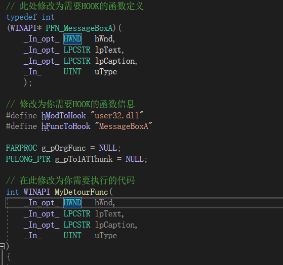

<center style="font-size:14px;color:#181818;text-decoration:underline">图1.代码标注示例</center> 

此项目一共实现了七种HOOK技术，如图2所示：

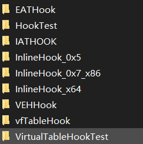

<center style="font-size:14px;color:#181818;text-decoration:underline">图2.Hook技术实现列表</center> 

该博客也就围绕这7种HOOK技术进行解析，其中HookTest 与 VirtualTableHookTest分别为测试用的Hook的目标程序以及测试用的虚表Hook的目标程序。

该项目参考《加密与解密》Hook技术章节代码而完成

项目地址:

[HookTechniques](https://github.com/Mrsdwang/HookTechniques)

#### 0x1 一些需要的概念

首先是通用的Hook流程，示意图如图3:

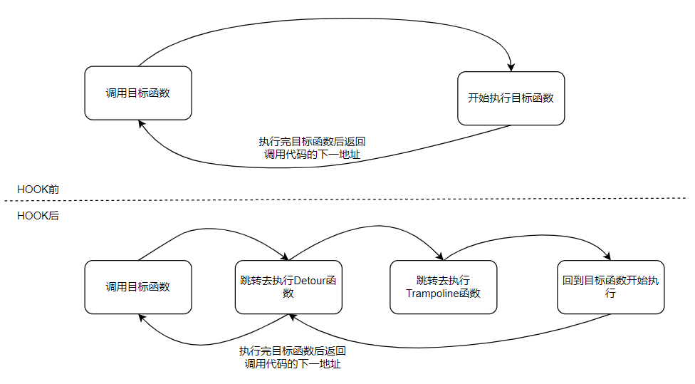

<center style="font-size:14px;color:#181818;text-decoration:underline">图3.通用Hook流程</center> 

从示意图我们可以很明确的得到一个信息，HOOK就是插入特定代码以干预程序的执行流程。在程序执行真正的目标函数前，先执行我们的代码，这样就获得了程序执行过程的决定权，这也就是HOOK的目的所在。

图中的Detour(翻译为绕道)函数，就是我们插入用来干预原执行流程的代码。Trampoline(翻译为跳板)函数，作用是还原并执行因跳转去执行Detour函数导致目标函数中没有被执行的指令，这样可以最大程度避免程序执行出错。

HOOK技术共可分为3类，第一类为 Address Hook，该类方法是通过修改数据进行Hook，但修改的数据多为函数的地址或其偏移量。当函数被调用时，函数的地址就会被保存在RIP寄存器中，因此我们将这些地址替换成Detour函数地址即可获得程序控制权。

第二类为InlineHook，该类方法是直接修改指令进行Hook，核心为通过jmp，call，ret之类的指令转移程序的执行流程，从而实现执行Detour函数获得程序控制权。

第三类为基于异常处理机制的Hook，该类方法是将Detour函数向目标进程注册为异常处理程序，然后手动触发异常或中断，让程序跳转至异常处理程序，这样也能让程序执行到Detour函数并获得程序控制权。

#### 0x2 Address Hook

##### 0x2.1 IAT Hook

在PE文件中，一个DLL对应一个IMAGE_IMPORT_DESCRIPTOR结构体，而该结构体又存在一个IAT，因此一个DLL对应一个IAT，IAT用于保存该DLL的导出函数的地址。又因为在PE文件加载过程中就会完成IAT的重建，因此修改IAT并不会影响原DLL的导出函数的地址，即IAT Hook不能拦截LoadLibrary或GetProcAddress的调用方式。

IAT Hook的原理很简单，遍历所有IMAGE_IMPORT_DESCRIPTOR结构体的Name成员，寻找属于目标函数所在的DLL的结构体，然后再遍历该结构体的IAT数组，寻找目标函数的地址，然后保存旧地址，更新新地址。

流程图：

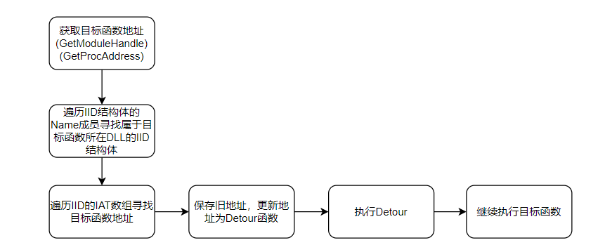

<center style="font-size:14px;color:#181818;text-decoration:underline">图4.IATHook流程图</center> 

核心代码:

```c
// 获取目标函数地址
g_pOrgFunc = (FARPROC)GetProcAddress(GetModuleHandle(hModToHook), hFuncToHook);

// 挂钩
// 遍历IID结构体
while (pImportDescriptor->Characteristics && pImportDescriptor->FirstThunk != NULL)
{
    // 如果IID结构体的Name成员值为目标函数所属DLL的名称
	szLibName = (LPCSTR)(uiBaseAddr + pImportDescriptor->Name);
	if (!_strcmpi(szLibName, szDllName))
	{
    	//获取IAT地址
		pThunk = (PIMAGE_THUNK_DATA)(uiBaseAddr + pImportDescriptor->FirstThunk);
        // 遍历IAT数组
		for (; pThunk->u1.Function; pThunk++)
		{
            // 判断IAT数组当前值是不是目标函数的地址
			lpAddr = (ULONG_PTR*)pThunk;
			if ((*lpAddr) == (ULONG_PTR)pfnOrg)
                {
                	// 让IAT所在内存获得可读写权限
                    MEMORY_BASIC_INFORMATION mbi;
                    VirtualQuery(lpAddr, &mbi, sizeof(mbi));
                    VirtualProtectEx(hProcess, mbi.BaseAddress, mbi.RegionSize, PAGE_EXECUTE_READWRITE, &dwOldProtect);
                	// 保存旧地址，更新为Detour函数地址
                	// 保存旧地址是为了能执行完Detour后还能继续执行目标函数，以及脱钩
                    g_pToIATThunk = lpAddr;
                    *lpAddr = (ULONG_PTR)pfnNew;
                	// 恢复内存权限
                    VirtualProtectEx(hProcess, mbi.BaseAddress, mbi.RegionSize, dwOldProtect, &dwOldProtect);
                    return TRUE;
                }
            }
        }
    	// 移动到下一个IID结构体判断
        else
            pImportDescriptor++;
}

// 脱钩
// 让IAT所在内存获得可读写权限
VirtualQuery((LPCVOID)g_pToIATThunk, &mbi, sizeof(mbi));
VirtualProtectEx(hProcess, mbi.BaseAddress,mbi.RegionSize, PAGE_EXECUTE_READWRITE, &dwOldProcetect);
*g_pToIATThunk = (ULONG_PTR)g_pOrgFunc;
// 恢复内存原权限
VirtualProtectEx(hProcess, mbi.BaseAddress, mbi.RegionSize, dwOldProcetect, &dwOldProcetect);

//测试用Detour
int WINAPI MyDetourFunc(
    _In_opt_ HWND   hWnd,
    _In_opt_ LPCSTR lpText,
    _In_opt_ LPCSTR lpCaption,
    _In_     UINT   uType
)
{
    int ret;
    WinExec("C:\\Windows\\System32\\calc.exe", SW_SHOW);
    ret = ((PFN_MessageBoxA)g_pOrgFunc)(
        hWnd,
        lpText,
        lpCaption,
        uType);
    return ret;
}
```

我们通过x64dbg来查看IAT的变化，首先是DLL注入前，IAT的数据如图5所示:

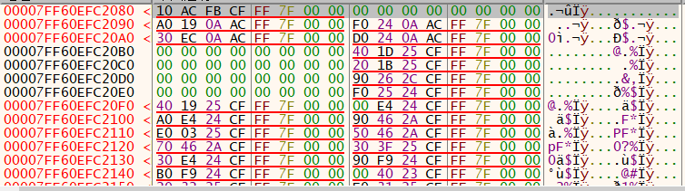

<center style="font-size:14px;color:#181818;text-decoration:underline">图5.IAT修改前</center> 

我们跳转至IAT数组第一个地址处

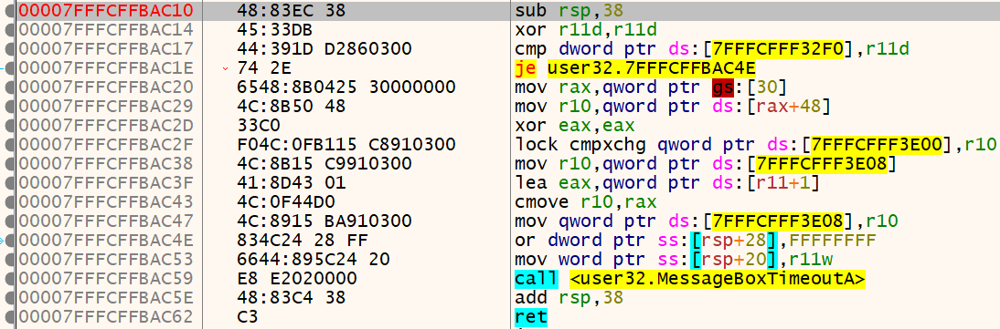

<center style="font-size:14px;color:#181818;text-decoration:underline">图6.IAT修改前的函数</center> 

可以看出目前该地址还是MessageBox的函数地址，现在我们将DLL注入，再次检查IAT

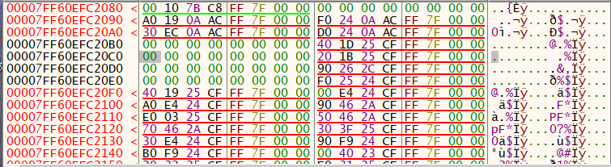

<center style="font-size:14px;color:#181818;text-decoration:underline">图7.IAT修改后</center> 

对比图5，我们发现IAT数组的第一个数据发生了变化，也就是我们改变了MessageBox函数的地址，我们查看该地址的数据，

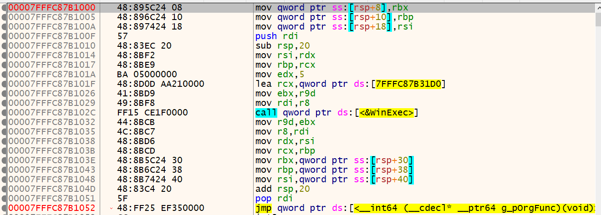

<center style="font-size:14px;color:#181818;text-decoration:underline">图8.IATHook的Detour函数</center> 

发现MessageBox函数的地址被改成了Detour函数的地址，该函数在最后又跳回到了原MessageBox函数，该函数地址保存在g_pOrgFunc全局变量中。

我们还能看到测试用exe文件的代码，原来是Call MessageBox，现在却变成了Call My_Detour函数，对比着看图9与图10：

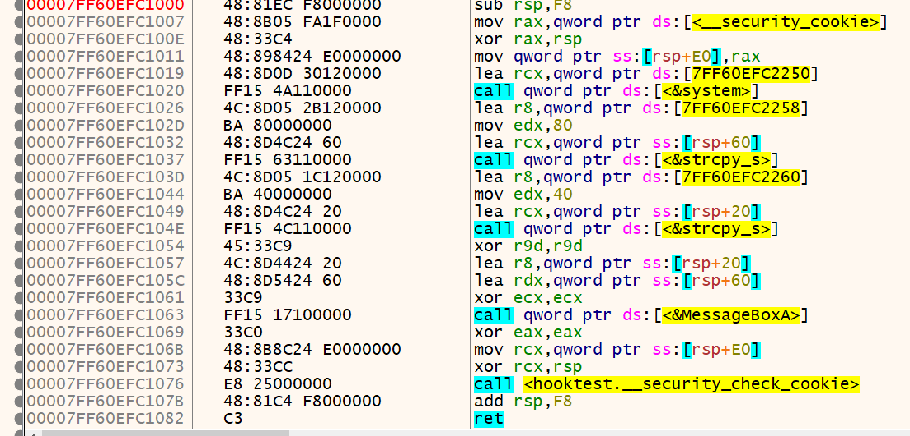

<center style="font-size:14px;color:#181818;text-decoration:underline">图9.IATHook改变前的代码</center> 

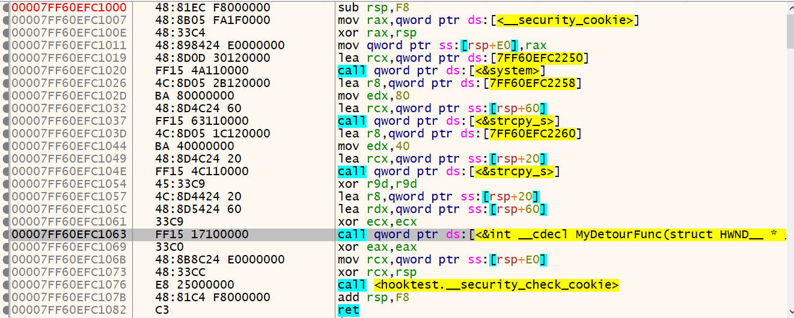

<center style="font-size:14px;color:#181818;text-decoration:underline">图10.IATHook改变后的代码</center> 

综上，IAT Hook的技术可以有效改变程序执行流程。

#### 0x2.2 EAT Hook

对比IAT Hook技术，EAT Hook就是更改目标DLL的导出函数的地址了。但是与IAT不同的是，EAT中的函数地址为相对DLL基址的RVA，因此我们写入Detour函数的地址时要减去DLL基址，再写入EAT中。

EAT Hook存在一个问题，当目标进程加载之内存时，就会重建IAT，将里面的数据更新为DLL的函数地址，而重建的数据就是通过DLL的EAT获取函数地址。因此只有进程在重建IAT之前HOOK或是HOOK之后，目标进程再次通过GetProcAddress获取函数地址，才会受到该HOOK技术的影响。因此该方法解决了IAT HOOK技术不能HOOK动态调用的函数的问题。

因此，测试用EXE文件中，需要通过GetProcAddress获取函数地址，并定义目标函数，通过函数地址进行调用目标函数才能测试是否HOOK成功

流程图:

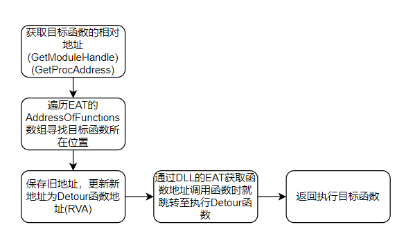

<center style="font-size:14px;color:#181818;text-decoration:underline">图11.EATHook流程图</center> 

核心代码:

```c
// 获取目标函数相对DLL基址的RVA
g_hModule = GetModuleHandle(hModToHook);
g_pOrgFunc = (ULONG_PTR)GetProcAddress(g_hModule, hFuncToHook);
g_pOrgFunc = (ULONG)(g_pOrgFunc - (ULONG_PTR)g_hModule);

// 挂钩
hProcess = GetCurrentProcess();
uiBaseAddr = (PBYTE)g_hModule;
// 获取EAT地址
uiNtHeader = uiBaseAddr + ((PIMAGE_DOS_HEADER)uiBaseAddr)->e_lfanew;
pExportDir = (PIMAGE_EXPORT_DIRECTORY)(uiBaseAddr + ((PIMAGE_NT_HEADERS)uiNtHeader)->OptionalHeader.DataDirectory[IMAGE_DIRECTORY_ENTRY_EXPORT].VirtualAddress);
FuncAddr = (PULONG)(uiBaseAddr + pExportDir->AddressOfFunctions);
// 遍历EAT中的AddressOfFunctions数组寻找目标函数所在位置
while (*FuncAddr)
{
   // 如果遍历到的值与目标函数的RVA相同     
   if (*FuncAddr == g_pOrgFunc)
   {
       // 修改EAT所在内存空间的权限为可读写
      MEMORY_BASIC_INFORMATION mbi;
      VirtualQuery(FuncAddr, &mbi, sizeof(mbi));
      VirtualProtectEx(hProcess, mbi.BaseAddress, mbi.RegionSize, PAGE_EXECUTE_READWRITE, &dwOldProtect);
       // 保存旧地址
      g_pToEATThunk = (PULONG_PTR)FuncAddr;
       // 更新为Detour函数的相对DLL基址的RVA
      *FuncAddr = (ULONG)((ULONG_PTR)pfnNew - (ULONG_PTR)g_hModule ) ;
       // 恢复内存原权限
      VirtualProtectEx(hProcess, mbi.BaseAddress, mbi.RegionSize, dwOldProtect, &dwOldProtect);     
   }
      else
        FuncAddr++;
}

// 脱钩
// 修改EAT所在内存空间的权限为可读写
VirtualQuery((LPCVOID)g_pToEATThunk, &mbi, sizeof(mbi));
VirtualProtectEx(hProcess, mbi.BaseAddress, mbi.RegionSize, PAGE_EXECUTE_READWRITE, &dwOldProcetect);
// 还原EAT
*g_pToEATThunk = (ULONG)g_pOrgFunc;
VirtualProtectEx(hProcess, mbi.BaseAddress, mbi.RegionSize, dwOldProcetect, &dwOldProcetect);
```

这里还存在一个问题，因为EAT中的AddressOfFunctions数组存的是为双字大小的RVA，因此会受到一些限制。再64位系统中，如果目标DLL的基址大于Detour函数的地址，这样求Detour函数的RVA就会出现负数，也即四字的RVA，若转换成双字后，RVA的值发生了变化，就会导致记录的Detour函数的RVA+DLL基址得到错误的Detour地址，这样就会导致跳转至错误地址导致崩溃。

举个例子：

在EATHook中计算Detour RVA的地方添加printf打印出实际Detour地址，DLL基址，以及计算得到的Detour RVA的数据，并再反过来计算Detour地址。结果如下:

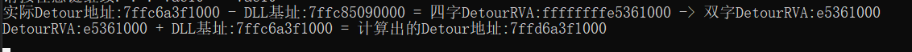

<center style="font-size:14px;color:#181818;text-decoration:underline">图12.EATHook中地址计算错误</center> 

如图12所示，当DLL基址大于实际Detour地址时，计算出的Detour 相对DLL基址的RVA是负数，并且在转化为双字的时候，Detour的RVA值发生了变化，变成了一个正数。并且逆向去计算Detour绝对地址时得到的结果与实际Detour地址不同。因此对于这种情况EATHOOK是失败的，并且会导致程序执行流发生错误。

因此在使用EAT的时候需要注意这个问题。

#### 0x2.3 VirtualTable Hook

在C++中存在虚函数以及重载的特性，对虚函数重载可以允许子类以相同的接口实现与基类不同的功能。实现这个特性就是通过一个叫虚地址表(Virtual Function Table)的东西来实现的。虚表中存储着虚函数的地址，最开始没有子类重载基类的虚函数时，该表存储的虚函数地址为基类中的虚函数地址，当子类重载基类的虚函数后，虚表存储的虚函数地址就会更改为子类重载后的函数地址。其实这个思路和HOOK的思路完全一样，也是替换地址。

因此通过这个特性，我们可以更改虚表中存储的虚表地址为我们的Detour函数地址，当调用该虚函数时就能执行到Detour函数，从而获取进程的控制权了。

存在虚函数成员的类中，类的第一个元素就是虚表的地址，即类起始地址就是虚表的地址。当HOOK代码通过DLL注入时，我们首先需要获得虚表的地址。我在VirtualTableHookTest代码中直接printf了虚表的地址，因此可以很方便的更改DLL写入的虚表地址。

流程图：

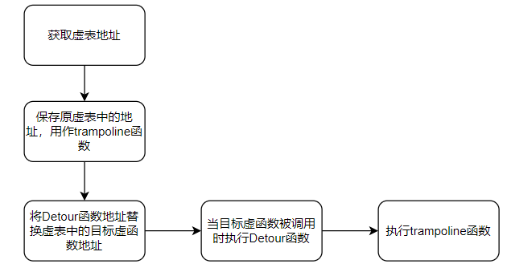

<center style="font-size:14px;color:#181818;text-decoration:underline">图13.vfTableHook流程图</center> 

核心代码:

```c
//获取目标虚函数所在类的虚表地址
PULONG_PTR pvfTableToHook = 目标虚函数所在类的虚表地址

// 挂钩
// 让Trampoline类的虚表所在内存获得可读写权限
ULONG_PTR* vfTableTrampoline = (ULONG_PTR*)*(ULONG_PTR*)&Trampoline;
VirtualQuery(vfTableTrampoline, &mbi, sizeof(mbi));
VirtualProtect(mbi.BaseAddress, mbi.RegionSize, PAGE_EXECUTE_READWRITE, &dwOld);
// 将原虚函数地址保存在Trampoline类虚表中
vfTableTrampoline[0] = pvfTableToHook[0];
// 恢复内存原权限
VirtualProtect(mbi.BaseAddress, mbi.RegionSize, dwOld, 0);
// 让目标虚函数所在类的虚表所在内存获得可读写权限
VirtualQuery(pvfTableToHook, &mbi, sizeof(mbi));
VirtualProtect(mbi.BaseAddress, mbi.RegionSize, PAGE_EXECUTE_READWRITE, &dwOld);
// 将目标类的虚表对应的虚函数地址替换为Detour类的虚表中保存的第一个函数地址
ULONG_PTR* vfTable = (ULONG_PTR*)*(ULONG_PTR*)&Detour;
pvfTableToHook[0] = (ULONG_PTR)vfTable[0];
// 恢复内存原权限
VirtualProtect(mbi.BaseAddress, mbi.RegionSize, dwOld, 0);

// 脱钩
// 让Trampoline类的虚表所在内存获得可读写权限
VirtualQuery(vfTableTrampoline, &mbi, sizeof(mbi));
VirtualProtect(mbi.BaseAddress, mbi.RegionSize, PAGE_EXECUTE_READWRITE, &dwOld);
// 获取原徐函数地址
OrigAddr = vfTableTrampoline[0];
// 恢复内存原权限
VirtualProtect(mbi.BaseAddress, mbi.RegionSize, dwOld, 0);
// 让目标虚函数所在类的虚表所在内存获得可读写权限
VirtualQuery(pvfTableToHook, &mbi, sizeof(mbi));
VirtualProtect(mbi.BaseAddress, mbi.RegionSize, PAGE_EXECUTE_READWRITE, &dwOld);
// 恢复虚表所存地址为原徐函数地址
pvfTableToHook[0] = OrigAddr;
// 恢复内存原权限
VirtualProtect(mbi.BaseAddress, mbi.RegionSize, dwOld, 0);
```

在测试Exe文件中，我直接print了目标虚函数所属类的虚表地址，但很多情况下要获取虚表的地址只能通过逆向分析获得。这里我们通过Windbg进行获取。

首先先简单看一下测试用Exe文件代码，

测试用Exe文件代码:

```c
class MyTest
{
public:
	virtual int Add(int a, int b);
	virtual void g() { cout << "test::g" << endl; };
	virtual void h() { cout << "test::h" << endl; };
	void novirtual() { cout << "test::not virtual" << endl; };

};
int MyTest::Add(int a, int b)
{
	printf("Test::Add\n");
	return a + b;
}

int main()
{
	MyTest test;
	MyTest* ptest = &test;
	ptest->Add(1, 2);
	ULONG_PTR vfTable = *(ULONG_PTR*)ptest;
	getchar();
	ptest->Add(1, 2);
	getchar();
	return 0;
}
```

从测试用代码可以test是类的对象，因此需要执行到定义对象后，通过对象指针获取虚表地址。

给代码第一个getchar()打上断点，然后执行于此，再查看test变量的值。

Windbg命令如下:

```c
bp <目的断点地址>
g
dv //查看变量名
dt <目标变量>
```

在windbg中即可获得虚表地址

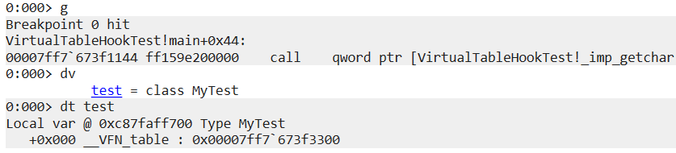

<center style="font-size:14px;color:#181818;text-decoration:underline">图14.Windbg中获取虚表地址</center> 

通过图14的结果可以看到test对象的起始地址即为_VFN_table，即虚表地址。测试用Exe也打印出了虚表的地址，如图15所示，两者相同，因此windbg获取到的虚表地址正确。

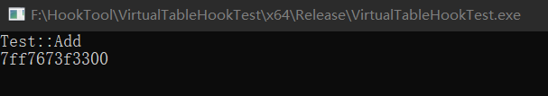

<center style="font-size:14px;color:#181818;text-decoration:underline">图15.测试Exe文件打印的虚表地址</center> 

在Windbg从内存窗口查看该地址的数据，得到图16的信息

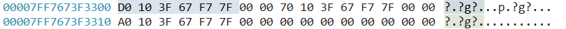

<center style="font-size:14px;color:#181818;text-decoration:underline">图16.HOOK前的虚表数据</center> 

可以看到该虚表中只有3个虚函数的地址，这与我们定义的基类里面的虚函数数量相同。又因为DLL的代码Hook的是虚表中保存的第一个函数地址，因此查看第一个函数地址是什么函数的。

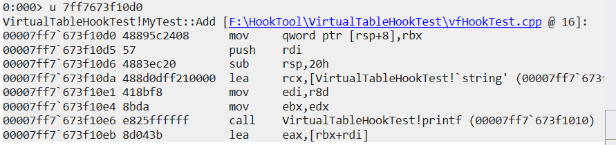

<center style="font-size:14px;color:#181818;text-decoration:underline">图17.HOOK前目标虚表保存的第一个函数地址是Add函数的</center> 

虚表将Add虚函数地址保存在第一个位置处，这与测试用Exe文件中基类里虚函数定义的顺序相同。

此时将虚表地址填入DLL中，

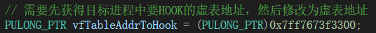

<center style="font-size:14px;color:#181818;text-decoration:underline">图18.DLL中修改虚表的地方</center> 

重新生成DLL后，在测试用Exe文件中第二次调用ptest->Add()代码处打上断点，然后注入DLL。

当DLL注入后，虚表保存的函数地址发生了改变，如图19所示，可以与图16对比查看

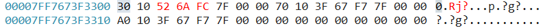

<center style="font-size:14px;color:#181818;text-decoration:underline">图19.Hook后的虚表数据</center> 

查看改变后的函数地址是哪个函数的

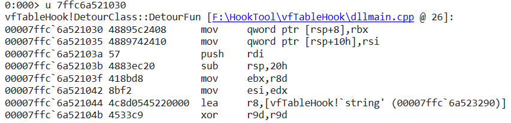

<center style="font-size:14px;color:#181818;text-decoration:underline">图20.Hook后的虚表存放的第一个函数地址是DetourFun函数的</center> 

当DLL注入后对虚表Hook成功，将程序执行完成可以发现，再次调用Add函数，执行流程从打印“Test::Add"变成了先弹出窗口再打印。

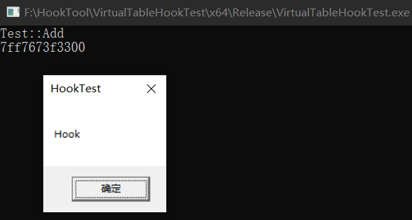

<center style="font-size:14px;color:#181818;text-decoration:underline">图21.Hook虚表后的结果1</center> 

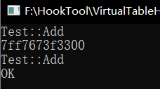

<center style="font-size:14px;color:#181818;text-decoration:underline">图22.Hook虚表后的结果2</center> 

综上，当C++程序中存在虚函数时，我们便可以通过虚表Hook技术获取程序控制权。

#### 0x3 Inline Hook

Inline Hook的原理是通过修改目标函数的指令为jmp、call、ret等类似指令跳转至Detour函数，因此实现该Hook有许多种方法。例如:

1. 直接jmp Detour地址；
2. push Detour地址 + ret进行跳转；
3. mov rax(eax)，Detour地址 + jmp rax(eax)；
4. 更改掉call 的地址；
5. Hotpatch 方式；

因为核心原理都相同，我只实现了三种。

##### 0x3.1 jmp Detour(5字节)

最简单以及最直观的Inline Hook方法就是直接将目标函数的第一条指令更改为jmp Detour地址指令，在执行Detour函数时，首先恢复目标函数被更改的指令，然后再执行目的代码，最后再挂钩便于重复HOOK。

流程图:

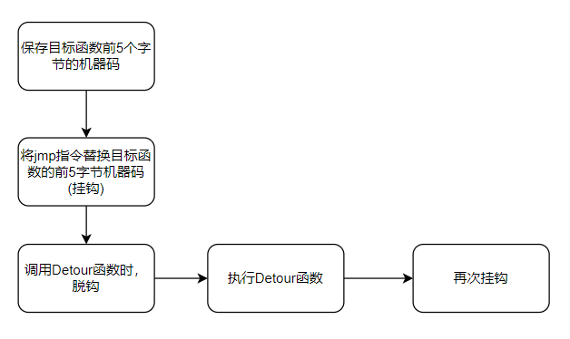

<center style="font-size:14px;color:#181818;text-decoration:underline">图23.5字节InlineHook流程图</center> 

核心代码:

```c
// 存储HOOK 前的代码
BYTE oldCode[5];
// 存储HOOK 后的代码
BYTE newCode[5] = {0xE9,0,};

// 挂钩
// 获取目标函数地址
HookData.HookAddr = (ULONG_PTR)GetProcAddress(GetModuleHandleA(HookData.szApiDllName), HookData.szHookApiName);
// 判断目标函数是否已经被Hook了
pByte = (PBYTE)HookData.HookAddr;
// 被Hook则不进行挂钩
if (pByte[0] == 0xE9)
	return FALSE;
// 将jmp指令与Detour函数地址写入目标函数的前五个字节
hProcess = GetCurrentProcess();
ReadProcessMemory(hProcess, (LPCVOID)HookData.HookAddr, HookData.oldCode, HookData.HookCodeLen, 0);
// 计算相对地址，公式为目标地址-当前地址-指令长度
* (ULONG*)(HookData.newCode + 1) = (ULONG)HookData.pfnDetourFun - (ULONG)HookData.HookAddr - 5;
WriteProcessMemory(hProcess, (LPVOID)HookData.HookAddr, HookData.newCode, HookData.HookCodeLen, 0);

// 脱钩
// 如果挂钩才进行脱钩，将原指令恢复
if (pByte[0] == 0xE9)
{
	WriteProcessMemory(GetCurrentProcess(), (LPVOID)HookData.HookAddr, HookData.oldCode, HookData.HookCodeLen, 0);
	return TRUE;
}

// Detour函数模板
Unhook() //脱钩
....  //执行目的代码
Hook() //挂钩
```

在5字节的Inline Hook方法中，我并没有直接定义Trampoline函数，而是通过先脱钩再执行目的代码的方法来代替trampoline函数的功能，但是挂钩再脱钩的方法比执行trampoline函数更麻烦也更容易出错，特别是在多线程的程序中，我们需要给目标函数挂钩，当一个线程调用挂钩的目标函数后会脱钩，此时另一个线程在脱钩后再次调用目标函数，此时后调用的线程就不会执行Detour函数，那么执行流程就出现了错误。

我们通过x64dbg进行调试观察该Hook方式。

首先是64位进程，Hook前 MessageBox函数指令如下图24所示:

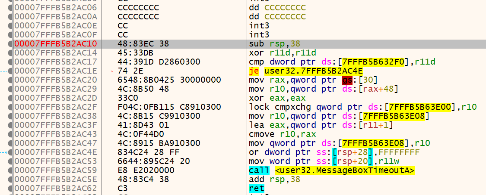

<center style="font-size:14px;color:#181818;text-decoration:underline">图24.5字节Hook前64位MessageBox函数</center> 

把DLL注入进目标进程中，进行挂钩，此时Hook后的MessageBox函数指令如下图25所示:

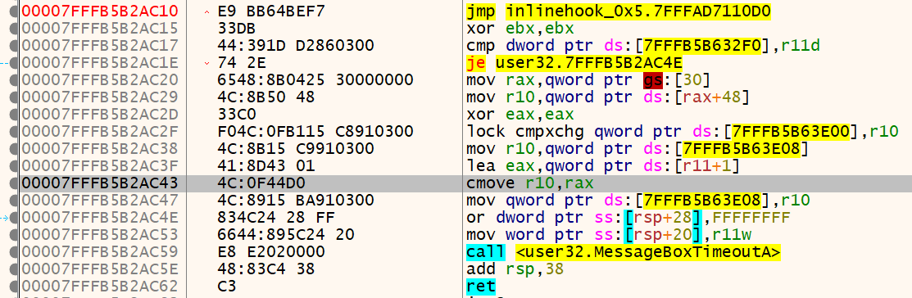

<center style="font-size:14px;color:#181818;text-decoration:underline">图25.5字节Hook后64位MessageBox函数</center> 

在地址7FFFB5B2AC10中，sub rsp,28指令变成了 jmp指令，并且jmp的地址正是Detour函数。

同时我们还会发现原7FFFB5B2AC14地址的xor r11d,r11d 变成了7FFFB5B2AC15地址的xor ebx,ebx，这是因为原来函数的起始地址为4字节，写入5字节的jmp指令打乱了原指令的字节对齐，导致产生了指令碎屑。但是因为我们执行原函数时已经脱勾还原，因此不会影响程序运行。如果我们使用trampoline函数，我们需要用nop将指令碎屑替代，并且将因更改指令，而变成指令碎屑的指令也写入trampoline函数中执行，以保证程序的完整性。

我们再看32位进程下该Hook技术的执行过程。

32位和64位环境下的MessageBox函数指令不相同，32位的指令如图26所示

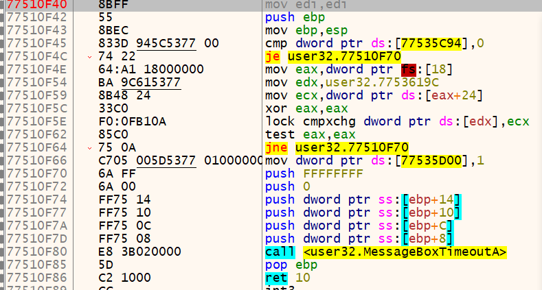

<center style="font-size:14px;color:#181818;text-decoration:underline">图26.5字节Hook前32位MessageBox函数</center> 

32位的MessageBox函数的前三行指令总长为5，这也是为什么会出现jmp Detour地址这种5字节的Inline Hook技术，因为最开始就是针对32位环境下的Windows系统库函数，一些库函数的起始指令就和MessageBox相同，mov edi,edi无意义直接，后两条指令就是建立栈帧，刚好5字节，因此可以不产生指令碎屑的替换。

将DLL注入后，再次查看指令的变化

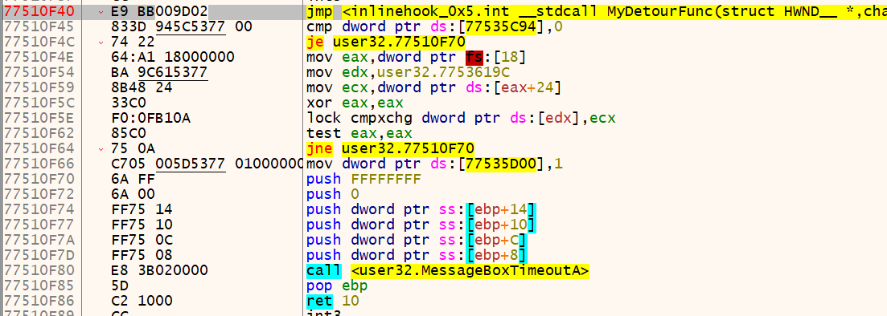

<center style="font-size:14px;color:#181818;text-decoration:underline">图27.5字节Hook后32位MessageBox函数</center> 

当前五指令替换后，并未产生指令碎屑，并且jmp跳转的也正是Detour函数。因为我们替换掉了建立栈帧的指令，如果继续执行原函数时不脱勾或者不执行trampoline函数保持原函数完整性，那么就会出错。因此在Hook的过程中最重要的就是保证指令运行的完整性。

#### 0x3.2 HotPatch

HotPatch(热补丁)修改的是7个字节的指令因此又称7字节代码修改技术。

为什么会出现修改7字节的指令的技术？我们可以先看看几个32位环境下的Windows库函数的起始地址前的指令。

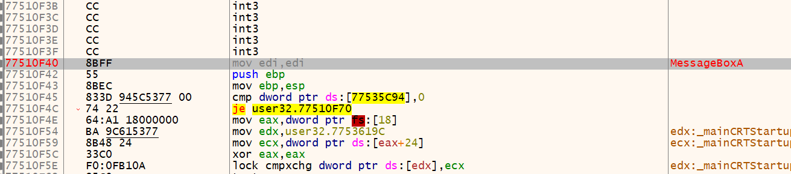

<center style="font-size:14px;color:#181818;text-decoration:underline">图28.32位MessageBox函数</center> 

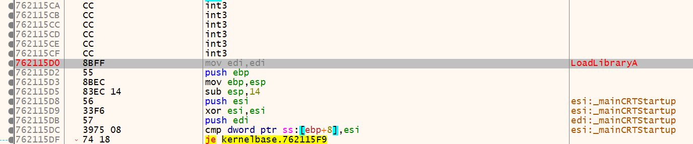

<center style="font-size:14px;color:#181818;text-decoration:underline">图29.32位LoadLibrary函数</center> 

可以看到这两个函数起始地址前都至少有5个0xCC的int3 指令，再加上两个字节的 mov edi,edi指令，一共7个字节。这7个字节对于原函数来说都是无意义的，更改这几个字节不会影响原函数指令的完整性就不会导致进程执行流异常或者崩溃，因此7字节的代码修改方法要比5字节的修改方法稳定得多。函数前留下无意义的指令就是为了能方便通过Hook打上补丁，又因为是在进程运行时打补丁，所以才被称为HotPatch(热补丁)。

但7字节代码修改方法要求也比5字节高，目标函数中必须在函数起始地址前存在5个无意义指令。

7个字节中，前5个字节是使用的Far jmp指令(E9 xxxxxxxx)，用于跳转至Detour函数，后两个字节使用的是Short jmp指令(EB F9)，用于跳转至前面的Far jmp指令。

为什么这里short jmp指令的相对地址写成了固定的F9？这是因为目标地址相对当前地址是固定的。根据相对地址的计算公式 相对地址 = 目标地址 - 当前地址 - 指令长度 => 相对地址 = (pFunc-5) - pFunc - 2 = -7 = 0xF9。

流程图：

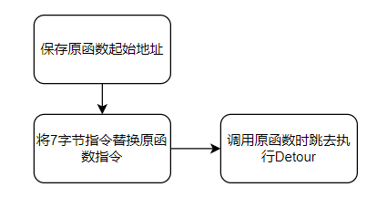

<center style="font-size:14px;color:#181818;text-decoration:underline">图30.InlineHook7字节流程图</center> 

核心代码:

```c
// 存储HOOK后第一个jmp
BYTE newJmp1[2] = { 0xEB,0xF9 };
// 存储HOOK后第二个jmp
BYTE newJmp2[5] = { 0xE9,0, };
// 存储HOOK前的Code
BYTE OldCode1[5] = { 0xCC,0xCC,0xCC,0xCC,0xCC };
BYTE OldCode2[2] = { 0x8B,0xFF };

// 挂钩
// 获取目标函数地址
HookData.HookAddr = (ULONG_PTR)GetProcAddress(GetModuleHandleA(HookData.szApiDllName), HookData.szHookApiName);
// 判断是否挂钩
if (pByte[0] == 0xEB)
   return FALSE;
hProcess = GetCurrentProcess();
// 计算Detour的相对地址并写入jmp指令中
*(ULONG_PTR*)(HookData.newJmp2 + 1) = HookData.pfnDetourFun - HookData.HookAddr;
// 将7字节指令替换原函数指令
WriteProcessMemory(hProcess, (LPVOID)(HookData.HookAddr - 5), HookData.newJmp2, HookData.HookCodeLen[0], 0);
WriteProcessMemory(hProcess, (LPVOID)HookData.HookAddr, HookData.newJmp1, HookData.HookCodeLen[1], 0);

// 脱钩
if (pByte[0] == 0xEB)
{
    // 恢复原函数指令
    WriteProcessMemory(GetCurrentProcess(), (LPVOID)(HookData.HookAddr - 5), HookData.OldCode1, HookData.HookCodeLen[0], 0);
    WriteProcessMemory(GetCurrentProcess(), (LPVOID)HookData.HookAddr, HookData.OldCode2, HookData.HookCodeLen[1], 0);
    return TRUE;
}

// Detour函数模板
// 如果需要在执行完目的代码后继续执行原函数
.... // 需要执行的目的函数
pFunc = GetProcAddress(GetModuleHandleA(HookData.szApiDllName), HookData.szHookApiName);
pFunc = pFunc + 2; //pFunc为原函数起始地址 + 2即跳过Short jmp到被替换指令的下一条指令
(定义的目标函数类型)pFunc(目标函数参数); //调用目标函数，从函数第二条指令开始执行函数
```

使用7字节代码修改方法，再次回到原函数继续执行时只需要将原函数起始地址+2，再通过地址调用原函数即可，这样执行的效果与调用原API效果相同。

通过x64dbg进行调试，查看该Hook技术的实现过程。

把DLL注入进测试用EXE，让其执行HOOK

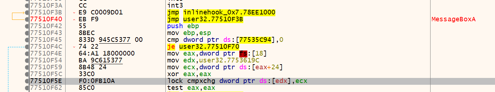

<center style="font-size:14px;color:#181818;text-decoration:underline">图31.7字节Hook后的32位MessageBox</center> 

对比图28，可以发现5个int3指令和mov edi,edi 都被替换成两个jmp指令了，并且Far jmp的目的地址正是我们的Detour函数。

我们再看下该方法在64位环境下的执行情况。

64位环境下的MessageBox函数代码已经截图为图24，我们直接看HOOK后的情况

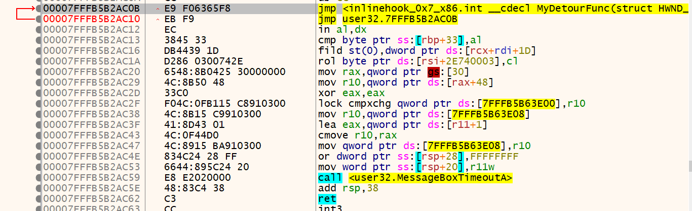

<center style="font-size:14px;color:#181818;text-decoration:underline">图32.7字节Hook后的64位MessageBox</center> 

可以看到前7个字节已经正常替换为我们希望替换的两条jmp指令，并且Far jmp的目的地址也为Detour函数。因为64位环境下的库函数第一条指令为sub rsp,x ，该指令为4字节而不是2字节，所以7字节代码修改方法在64位环境进行Hook就出现了指令碎屑，如果按照Detour函数中直接通过原函数地址+2的方法调用该函数就会出现程序执行错误，因为原函数指令已经出现错误。

要是想要64位环境也能使用该方法只能通过加入trampoline函数 将指令碎屑的问题解决(将碎屑改为NOP，并在trampoline函数写入原指令以及受指令替换所影响的指令)，并针对性的将调用该函数的地址调整为第一条不被指令替换所影响的原函数指令地址。

#### 0x3.3 Inline Hook x64

该方法便是能作为例子解决64位环境下因地址长度，以及函数指令变化导致之前适用于32位却不能适用于64位环境的方法失效的问题。但是依然会出现指令碎屑的问题，但是在MessageBox这个例子中并不会发生。

该方法与5字节的代码修改方法类似，也是将原指令改变成jmp指令，但是使用的jmp机器码为0xff25，并且使用14个字节，这是因为jmp指令长度为2，但是jmp目标地址只为4字节，而64位系统中地址为8字节，相对地址计算的大小很可能会大于4字节，正如在EAT Hook出现的问题那样，因此需要通过间接跳转来实现以8字节的绝对地址为目的地址的jmp。

流程图:

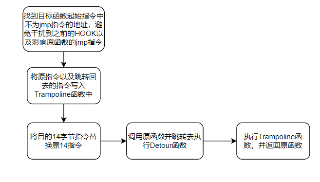

<center style="font-size:14px;color:#181818;text-decoration:underline">图33.64位InlineHook流程图</center> 

核心代码:

```c
// 检查目标函数起始指令是否存在jmp指令，有则跳过该指令，将Hook地址定位到下一条指令
pHookData->HookPoint = SkipJmpAddress(pHookData->HookPoint);
pHookData->JmpBackAddr = pHookData->HookPoint + pHookData->HookCodeLen;

// 将要替换的指令准备好，即jmp Detour地址指令的机器码
memset(pHookData->newEntry, 0, 14);
pHookData->newEntry[0] = 0xFF;
pHookData->newEntry[1] = 0x25;
*(ULONG_PTR*)(pHookData->newEntry + 6) = (ULONG_PTR)pHookData->pfnDetourFun;

// 将原函数指令保存好，并写入跳回原函数指令
PBYTE pFun = (PBYTE)pHookData->pfnTrampolineFun;
memcpy(pFun, (PVOID)pHookData->HookPoint, 14);
// 在原MessageBox中，存在一个cmp指令，该指令使用了一个相对地址，因此对相对地址要进行重定位
//cmp的目标地址与当前地址相差0x38600左右，
// 因此我们申请的128字节大小空间不能容纳 cmp取的地址，已经超出我们的范围
// 所以通过申请的内存空间中空余的空间作为该相对地址的目标地址
*(ULONG*)(pFun + 10) = (ULONG)(((ULONG_PTR)pFun + 20) - ((ULONG_PTR)pFun + 14));
pFun += 14;
pFun[0] = 0xff;
pFun[1] = 0x25;
*(ULONG_PTR*)(pFun + 6) = pHookData->JmpBackAddr;

// 挂钩
// 保存原指令
ReadProcessMemory(hProcess, OriginalAddr, pHookData->oldEntry, pHookData->HookCodeLen, &dwBytesReturned);
// 替换原指令
WriteProcessMemory(hProcess, OriginalAddr, pHookData->newEntry, pHookData->HookCodeLen, &dwBytesReturned);

// 脱钩
// 恢复原指令
WriteProcessMemory(hProcess, OrigianlAddr, pHookData->oldEntry, pHookData->HookCodeLen, &dwBytesReturned);
```

64位Hook前的MessageBox函数的指令截图为图24了，接下来我们将DLL注入进行Hook，并比较两者发生的变化。

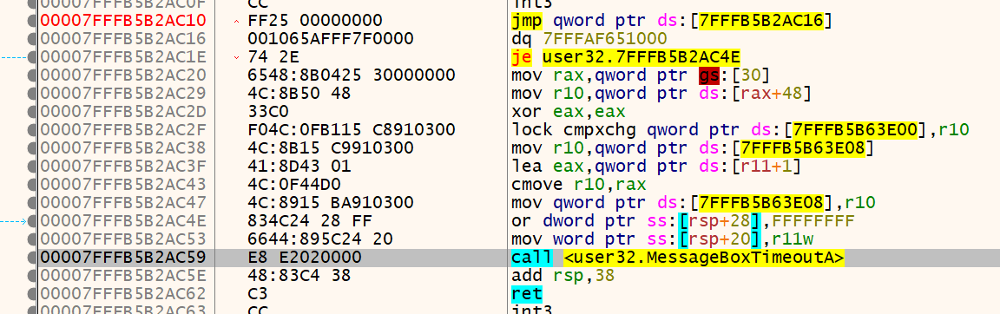

<center style="font-size:14px;color:#181818;text-decoration:underline">图34.64位InlineHook后的MessageBox</center> 

在以上代码有两个比较明显的问题，首先是为什么要在jmp指令(0xff25)起始地址 + 6 处写入目的地址，而不是 + 2 处直接写在jmp指令后呢？前面我们也说了 jmp指令加上目的地址总共6字节长，其中只有4字节存放目的地址，因此是不足够容纳64位的8字节长地址。如果直接在jmp指令起始地址+2处写入目的地址，那么该指令就会以该地址的低4字节作为目的地址跳转，就会出现错误。

如果0xff25后面接4个全0字节，此时jmp指令就会取下一地址的值作为目的地址，这样就可以实现8字节长的地址作为目的地址进行跳转了。具体看图34中的第一条和第二条指令。第一条指令中目的地址为全0，但却获取了下一地址的值。再跳转至第二条指令存放的数据作为地址的地方，检查发现为Detour函数地址。

另一个问题就是Hook前的64为MessageBox函数存在一个cmp指令，而该指令使用了一个相对地址，并取了该相对地址换算得到的目的地址的值进行比较。我们使用14字节刚好覆盖完cmp指令，因此我们会将该指令对应的机器码一同复制到trampoline函数中。这就会导致相对地址不变，而当前地址改变了，根据相对地址的计算公式就会发现换算出来的目的地址发生了变化。此时我们就必须对这种情况进行重定位。第一想法就是计算出原目的地址，减去当前指令所在地址再减去指令长度。但是这也会有一个问题，就是8字节计算相对地址时经常出现的问题，就是计算得到的值的位数大于4字节，那么截断后得到的数再拿来计算目的地址一样会计算错误，导致访问到非法内存空间。

该想法的计算代码如下:

```C
ULONG DataOffset;
// 计算原目的地址
ULONG_PTR pData = (ULONG_PTR)pHookData->HookPoint + 7 + 7 + *(ULONG*)(pHookData->HookPoint + 10);
// 计算相对地址 = 目的地址-当前地址-指令长度
DataOffset = (ULONG)(pData - ((ULONG_PTR)pFun + 14));
*(ULONG*)(pFun + 10) = DataOffset;
```

这样的思路并没有错误，但在64位环境下就会因为位数问题导致错误。

具体看我举的这个例子


<center style="font-size:14px;color:#181818;text-decoration:underline">图35.Hook前的cmp指令</center> 

图35为cmp指令Hook前的样子，目的地址为7FFFB5B632F0，相对地址为386D2。

接着注入DLL，再去查看Trampoline函数中计算出来的相对地址。我将计算相对地址的过程打印，可以用来对比是否是因为位数截断的原因导致内存访问错误。

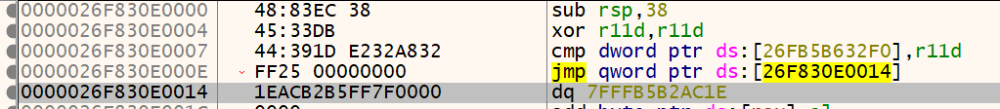

<center style="font-size:14px;color:#181818;text-decoration:underline">图36.64位InlineHook的Trampoline函数</center> 

可以看到 Trampoline计算出来的相对地址为23A823E2，指向的目的地址为26FB5B632F0。我们检测一下该地址是否合法

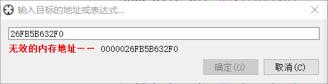

<center style="font-size:14px;color:#181818;text-decoration:underline">图37.目的地址非法</center> 

我们没办法跳至目的地址，因此该地址并不存在于目标进程的拥有的内存空间中。因此计算出的相对地址结果错误。

再检查下计算过程，

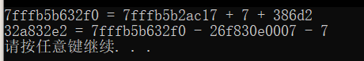

<center style="font-size:14px;color:#181818;text-decoration:underline">图38.相对地址计算过程</center> 

对比图35，第一个printf打印出的目的地址计算结果是正确的。对比图36，第二个printf打印计算出来的相对地址也和Trampoline函数中的cmp指令中的相对地址值相同。

那问题出现在哪呢？第二个printf打印出的被减数与减数可以很明显看出来计算结果也会是8字节的，但是因为截断导致数值发生了变化。正确的计算结果如下


<center style="font-size:14px;color:#181818;text-decoration:underline">图39.正确的计算结果</center> 

当把正确的结果截断4字节就会发现与得到的计算结果相同，因此该想法的错误是因为相对地址的计算结果大于4字节，从而导致数据丢失，进而计算出了错误的目的地址。

那该如何解决这个问题呢，我能想到的办法就是先从原目的地址处获取用来比较的数据，写入我们申请的内存空间中空闲的地址处，然后将目的地址改为该地址。虽然比较麻烦，但这样就可以解决问题了。

实现的代码:

```c
// 计算原目的地址
ULONG_PTR pData = (ULONG_PTR)pHookData->HookPoint + 7 + 7 + *(ULONG*)(pHookData->HookPoint + 10);
// 获取原目的地址的值并写入空闲空间
*(ULONG*)((ULONG_PTR)pFun + 30) = *(ULONG*)pData;
// 将重定位的目的地址计算出的相对地址写入cmp指令
*(ULONG*)(pFun + 10) = (ULONG)(((ULONG_PTR)pFun + 30) - ((ULONG_PTR)pFun + 14));
```

这里pFun+30为申请的内存空间中空闲的地址。将相对地址如此重定位之后，我们再查看Trampoline的cmp指令是否正常

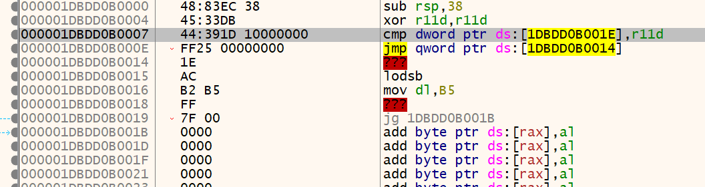

<center style="font-size:14px;color:#181818;text-decoration:underline">图40.修改后的相对地址重定位结果</center> 

很明显cmp中的目标地址指向的正是申请内存空间中第30个地址处，因此内存访问合法。

64位系统中Hook出现的问题比32位更多，主要体现在指令碎屑以及地址长度位8字节截断后导致的数据错误。在Hook的时候应该小心这些问题。

#### 0x4 基于异常处理的Hook

要想通过异常处理的机制来进行Hook，我们需要先了解Windows的异常处理机制，Windows用户态异常处理流程图如图41所示

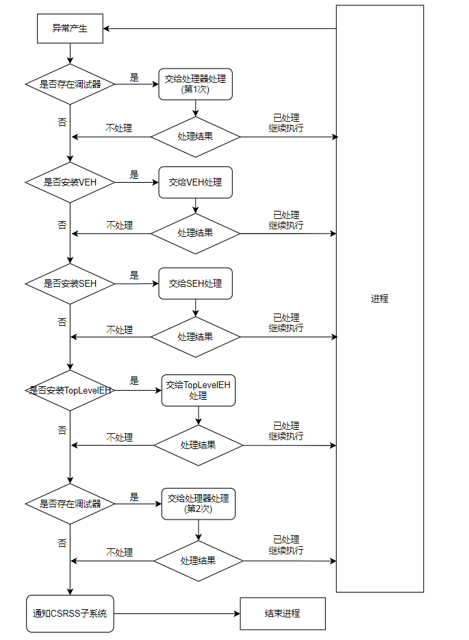

<center style="font-size:14px;color:#181818;text-decoration:underline">图41.Windows用户态异常处理流程</center> 

当程序执行过程中出现了异常时，系统内核的异常处理过程nt!KiDispatchException就会开始工作。在没有内核调试器存在且异常程序没有被调试的情况下，系统就会把异常处理过程转交给用户态的异常处理过程ntdll!RtlDispatchException，然后该异常处理过程根据图41的顺序查找系统是否安装了异常处理程序(例如SEH，VEH，TopLevelExceptionHandle)，如果安装了就会调用异常处理过程进行处理。

实际应用中，SEH的使用有较多限制，SEH是基于线程、非全局、基于栈的异常处理程序，我们可以通过TEB(线程环境块)结构体的第一个成员NtTib结构体中的第一个成员，即TEB.NtTib.ExceptionList成员获取进程的SEH链。SEH的添加方式是基于栈的，当需要添加新的SEH时就会将新的SEH地址push入栈，然后再将原SEH链中的首个SEHpush入栈，再将RSP(ESP)的值赋给GS[0] (FS[0])寄存器，也就是TEB的第一个成员NtTib结构体中的第一个成员ExceptionList中。综上SEH是只能处理自己线程的异常，所以使用的限制较多。

VEH是基于进程、全局并且优先于SEH处理的。其并不依赖于某一线程，在本进程中任何线程出现异常都可以被VEH处理。因此我们在进程中任意一处主动触发异常时，就能保证异常能进入异常处理程序中，这样极大方便了HOOK。

当使用VEH异常处理机制HOOK时，首先需要注册一个VEH异常处理程序，然后在要Hook的函数中设置INT3断点，当要Hook的函数被调用时就会触发中断导致异常，此时进程就会跳转至异常处理程序，我们只需要在异常处理程序添加我们的目的代码即可。

流程图:

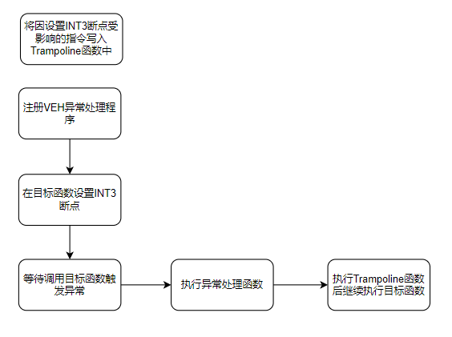

<center style="font-size:14px;color:#181818;text-decoration:underline">图42.VEH流程图</center> 

核心代码：

```c
// 获取目标函数地址
HMODULE hMod = LoadLibrary(hModToHook);
g_AddrofMessageBoxA = (PVOID)GetProcAddress(hMod, hFuncToHook);

// 获取trampoline函数地址
g_OriginalMessageBoxA = (PFN_MessageBox)InitTrampolineFunc();
// InitTrampolineFunc()函数
AddrofTrampoline = (PBYTE)VirtualAlloc(NULL, 128, MEM_COMMIT, PAGE_EXECUTE_READWRITE);
retAddrOfTrampoline = (ULONG_PTR)AddrofTrampoline;
memset(AddrofTrampoline, 0, 128);
memcpy(AddrofTrampoline, (PVOID)g_AddrofMessageBoxA, 4);
AddrofTrampoline += 4;
AddrofTrampoline[0] = 0xff;
AddrofTrampoline[1] = 0x25;
*(ULONG_PTR*)(AddrofTrampoline + 6) = (ULONG_PTR)g_AddrofMessageBoxA + 4;
return retAddrOfTrampoline;

// Detour函数
int result;
result = g_OriginalMessageBoxA(hWnd, "Hooked By VEH", lpCaption, uType);
return result;

// VEH异常处理函数
 ULONG_PTR* uRsp = 0;
// 可以直接更改参数后再次调用trampoline(已经跳过0xCC)
// 
//pContextRecord->Rdx = (ULONG_PTR)szNewText;
//pContextRecord->Rip = (ULONG_PTR)g_OriginalMessageBoxA;
// 
// 也可以把Rip改为自己写的Detour,但是要把Rsp对应变化 并在调用Detour后让Rip指向返回地址
// 刚调用目标函数时，栈顶为调用MessageBox时存的返回地址
//保存原RSP的值
uRsp = (ULONG_PTR*)pContextRecord->Rsp;
// 调用Detour
ret = MyDetour((HWND)pContextRecord->Rcx, (LPCSTR)pContextRecord->Rdx, (LPCSTR)pContextRecord->R8, (int)pContextRecord->R9);
// 手动保持栈平衡，模拟pop，因为将要手动设置异常处理结束后要执行的代码地址，程序就不会自动pop出去。
pContextRecord->Rsp += sizeof(ULONG_PTR);
// 将RIP设置为调用MessageBox时存的返回地址
pContextRecord->Rip = uRsp[0];

// 设置INT3断点
// 保存原指令
g_OldCode[0] = *pTarget;
MEMORY_BASIC_INFORMATION mbi;
// 写入0XCC
VirtualQuery(pTarget, &mbi, sizeof(mbi));
VirtualProtectEx(GetCurrentProcess(), mbi.BaseAddress, mbi.RegionSize, PAGE_EXECUTE_READWRITE, &dwOld);
*pTarget = 0xCC;
VirtualProtectEx(GetCurrentProcess(), mbi.BaseAddress, mbi.RegionSize, dwOld, 0);

// 脱钩
BYTE* pTarget = (BYTE*)pFuncAddr;
MEMORY_BASIC_INFORMATION mbi;
// 将INT3指令还原
VirtualQuery(pTarget, &mbi, sizeof(mbi));
VirtualProtectEx(GetCurrentProcess(), mbi.BaseAddress, mbi.RegionSize, PAGE_EXECUTE_READWRITE, &dwOld);
*pTarget = g_OldCode[0];
VirtualProtectEx(GetCurrentProcess(), mbi.BaseAddress, mbi.RegionSize, dwOld, 0);
// 卸载VEH异常处理程序
UninstallVEH();
```

我们通过x64dbg来观察该Hook技术的实际执行流程。

原64位环境的MessageBox函数的代码截图为图24，在注入DLL后对比两者的区别

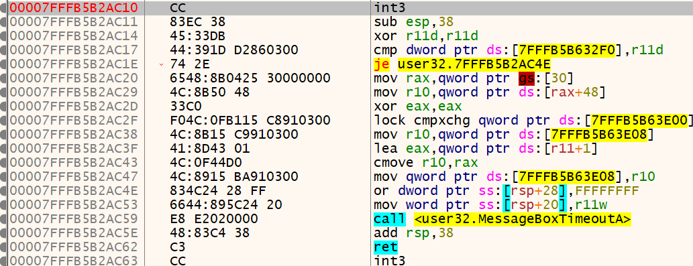

<center style="font-size:14px;color:#181818;text-decoration:underline">图43.VEHHook设置断点</center> 

对比图24和图43可知，当对目标函数设置INT3断点时，因机器码为一个字节0xcc所以只是把原函数第一条指令的机器码前缀给替换掉，指令从sub rsp,38变成了sub esp,38。我们从这里也可以获取一个信息，机器码前缀有48时修饰的是64位的寄存器，无48前缀则是32位的。

我们触发设置的INT3断点后再继续分析，

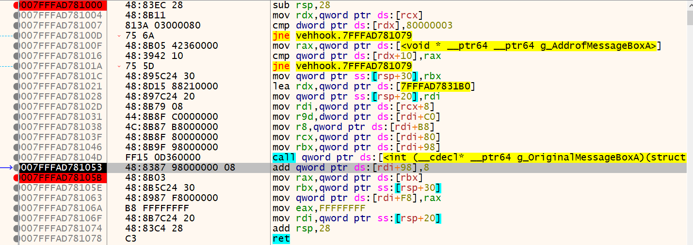

<center style="font-size:14px;color:#181818;text-decoration:underline">图44.VEH异常处理程序</center> 

在RIP当前所指的位置(被标黑的地址处)之前的两个jne对应为项目代码里的判断语句，jne与call之间的都是为继续调用MessageBox函数而保存的参数，其中mov rdi, [rcx+8]的语句就是代码中的uRsp = (ULONG_PTR*)pContextRecord->Rsp。而在RIP所指的语句，rdi+98的值为堆栈地址，该堆栈地址所存的就是调用MessageBox函数时的栈顶地址。

具体对比图46以及图47

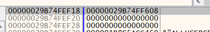

<center style="font-size:14px;color:#181818;text-decoration:underline">图45.rdi+98所指堆栈地址</center> 

进入该地址所保存的值查看

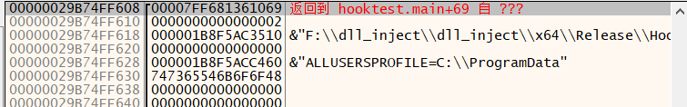

<center style="font-size:14px;color:#181818;text-decoration:underline">图46.rdi+98所指堆栈地址保存的堆栈数据</center> 

图47为调用MessageBox函数时的堆栈数据

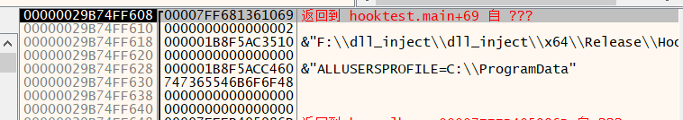

<center style="font-size:14px;color:#181818;text-decoration:underline">图47.设置INT3断点后进入MessageBox函数的栈数据</center> 

此时RIP指向的语句 add [rdi+98],8 正对应了代码中的 pContextRecord->Rsp += sizeof(ULONG_PTR)，执行语句后如图48，可与图45对比数据

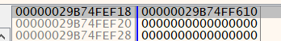

<center style="font-size:14px;color:#181818;text-decoration:underline">图49.原栈顶地址+8</center> 

后面的指令就把调用MessageBox函数时保存的返回地址存在rdi+F8中，最后在ret指令停下来，我们发现此时的栈数据与触发断点后进入VEH异常处理程序时的相同，因此其会继续按流程回到触发异常前的状态，又因为对返回地址做了处理，就是在程序代码中的这一句，pContextRecord->Rip = uRsp[0];，所以当处理完异常状态后，恢复进程继续执行的第一条指令就是执行RIP指向的地址处的指令，程序就会直接返回到MessageBox的返回地址处。

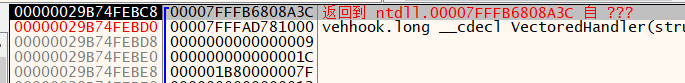

<center style="font-size:14px;color:#181818;text-decoration:underline">图50.VEH异常处理程序RET执行前的堆数据</center> 

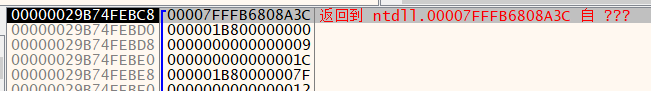

<center style="font-size:14px;color:#181818;text-decoration:underline">图51.触发断点后进入VEH时的栈数据</center> 

图51的栈顶地址指向的地址就是在做异常处理过程的收尾工作的代码地址，我暂时对这部分知识还很陌生，因此只能推测其再做判断异常是否处理完成，然后根据处理结果判断是根据记录的上下文继续执行进程，或是将异常上交给上一层的处理机制。

在这个例子中，ret后我跟着这部分异常处理收尾代码跑，不是很长，最后就会回到调用MessageBox时保存的返回地址处。

#### 0x5 总结

HOOK技术的博客还是有点难写，我在写的过程中就能感受到很难才能表达清楚我的意思，如果有写得不对不好的地方还请见谅并希望得到指正。所有的HOOK代码都是写在DLL文件中，并且是通过上一篇博客写的注入器注入的。

HOOK技术与DLL注入一样，都是可以获得程序控制权的手段。但是同样也能做很多有益的事情，例如对程序打补丁，添加新功能等。该博客涉及到的Hook技术还只是Ring3层级，还有非常多更加底层更加隐蔽的Hook技术，例如通过对系统服务描述符表、COM接口的功能函数表等进行Address hook。HOOK和DLL注入相同，都是通过操作系统的各种机制实现目的，HOOK的核心思想就是通过操作系统的机制控制程序跳转去执行我们的目的函数，在跳转以及还原程序执行流程时都必须保证程序指令的完整性，以及堆栈平衡，这样才能避免引发程序异常。

