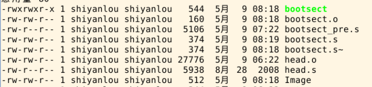

# 操作系统的引导


# lab 1

环境：通过bochs虚拟机运行的linux0.11

0x7C00是BIOS将主引导扇区（第一个扇区）内容载入进内存的一个地址。操作系统或者引导程序必须假设他们的汇编代码从内存的0x7C00地址开始

## task 1

更改系统启动的提示文字。

文件在boot/bootsect.s中。

直接用源码的这个文件在里面改也是可以的，也可以自己写一个如下内容的bootsect.s来进行实验，也是能正常运行。（记得备份）

```assembly
entry _start
_start:
！获得光标位置
    mov ah,#0x03
    xor bh,bh
    int 0x10   ！0x10中断的0x03功能是读取光标位置（百度该中断的功能）
    
！对输出信息的操作
    mov cx,#33  !要显示字符串的长度
    mov bx,#0x000c  !显示字符串的颜色（这为红色
    mov bp,#msg1	!向该寄存器读入msg1，向屏幕写入该字符串
！这里需要额外处理es寄存器，源码在这段代码前就处理过了，所以源码看不到这段。    
    mov ax,#0x07c0
    mov es,ax  ！es:bp是显示字符串的地址
    mov ax,#0x1301  !向屏幕写字符串并移动光标到末尾。如果写0x1300，你会发现光标返回到了起始位置
    int 0x10 ！和上一条指令相关，!0x1301是调用0x10中断的13号功能中的1号子功能
    
inf_loop: 
    jmp inf_loop  ！死循环让界面保持
msg1:
    .byte   13,10  ！回车换行
    .ascii  "Hey Doors system loading..."
    .byte   13,10,13,10  ！回车换行回车换行
.org 510   ！之后的语句从510地址开始
boot_flag:
    .word   0xAA55  ！磁盘引导标志0xAA55。引导扇区的最后两个字节，用来识别引导扇区
```

```shell
编译bootsect.s
1. cd 进入 bootsect.s文件所在文件夹
2. 通过如下命令分别编译和链接bootsect.s
    $ as86 -0 -a -o bootsect.o bootsect.s
    $ ld86 -0 -s -o bootsect bootsect.o
3. 通过 ls -s 命令查看 文件信息，会发现bootsect 为544字节，但一个扇区的大小为512字节
```



因为ld86产生的是Minix可执行文件，该类型额外包括MInix可执行文件头部，结构如下

```c
struct exec {
    unsigned char a_magic[2];  //执行文件魔数
    unsigned char a_flags;
    unsigned char a_cpu;       //CPU标识号
    unsigned char a_hdrlen;    //头部长度，32字节或48字节
    unsigned char a_unused;
    unsigned short a_version;
    long a_text; long a_data; long a_bss; //代码段长度、数据段长度、堆长度
    long a_entry;    //执行入口地址
    long a_total;    //分配的内存总量
    long a_syms;     //符号表大小
};
```

通过计算 char*6(6 byte)+short*1(2 byte)+long*6(24 byte)=32 byte，512+32=544.所以我们应该跳过bootsect的前32字节，再把他放入引导扇区中。

根据如下命令

```shell
$ dd bs=1 if=bootsect of=Image skip=32
```

将编译产生的Image文件复制到Linux-0.11目录下

```shell
当前工作路径仍然为Linux-0.11/boot/
$ cp ./Image ../Image

# 执行 oslab 目录中的 run 脚本（bochs的运行脚本）
$ ../../run
```

综上，得到如下界面


bootsect.s是操作系统最开始的部分，共512个字节，再0磁道0扇区位置，读入内存0x7c00。

现在系统还在实模式下运行，物理地址=代码段cs*16+偏移，所以代码里写BOOTSEG=0x07c0才能得到0x7c00（这里的代码没用到）

bootsect.s和setup.s是为了完成将内核加载到内存，并跳转到内核执行而写的。bootsect.s是由BIOS加载到内存中，无法完成跳转到内核执行的任务。而setup.s就能完成进入32位模式并跳转到内核执行的任务，还可通过BIOS中断获取硬件信息的任务。

所以接着我们应该编写setup.s文件，让其输出提示该文件开始运行的字符串，再让其输出光标位置，内存大小和磁参数等硬件信息

## task 2

首先输出字符串

我们直接将bootsect.s的代码复制过来，因为现在两者功能都是输出字符串。

但我们需要进行一些更改

```assembly
entry _start
_start:
！获得光标位置
    mov ah,#0x03
    xor bh,bh
    int 0x10   ！0x10中断的0x03功能是读取光标位置（百度该中断的功能）
    
！对输出信息的操作
    mov cx,#28  #要显示字符串的长度
    mov bx,#0x000c  #显示字符串的颜色（这为红色
    mov bp,#msg2  !(更改为msg2)	#向该寄存器读入msg2，向屏幕写入该字符串
！这个时候要修改es的值，用了cs的值。    
    mov ax,cs
    mov es,ax  ！es：bp是显示字符串的地址
    mov ax,#0x1301  ！向屏幕写字符串并移动光标到末尾。如果写0x1300，你会发现光标返回到了起始位置
    int 0x10 ！和上一条指令相关，#0x1301是调用0x10中断的13号功能中的1号子功能
    
inf_loop: 
    jmp inf_loop  ！死循环让界面保持
msg1:
    .byte   13,10  ！回车换行
    .ascii  "OK we are in SETUP now"
    .byte   13,10,13,10  ！回车换行回车换行
.org 510   ！之后的语句从510地址开始
boot_flag:
    .word   0xAA55  ！磁盘引导标志0xAA55。引导扇区的最后两个字节，用来识别引导扇区
```

上面是setup.s文件的内容，

此时我们还需要更改bootsect.s的内容让其能载入setup.s文件

我们需要确定setup所占用的扇区，bootsect.s只占用一个扇区，setup.s从下一个扇区开始，我们定义其占用两个（Linux0.11占用4个）。源码会将bootsect移动到0x9000处，此处我们不移动，所以bootsect.s在内存的0x7c00的位置，占512个字节，那么setup就载入0x7e00处，因为是实模式，所以逻辑地址应该为0x07e0.

bootsect.s代码如下

```assembly
SETUPLEN=2
SETUPSEG=0x07e0  ！setup载入地址
entry _start
_start:
    mov ah,#0x03
    xor bh,bh
    int 0x10   
    mov cx,#33
    mov bx,#0x0007 
    mov bp,#msg1
    mov ax,#0x07c0
    mov es,ax ！把es指向0x07c0有什么用？
    mov ax,#0x1301
    int 0x10
 ！以上和之前的bootsect一样   
load_setup:
    mov dx,#0x0000  ！设置驱动器和磁头：软盘0，磁头0，是因为调用了13号中断才能控制磁盘，不是0x0000地址的意思
    mov cx,#0x0002	！设置扇区号和磁道：磁头0 磁道0 扇区2
    mov bx,#0x0200	
    ！设置读入的内存地址：es:bx bx是偏移地址，BOOTSEG=0X0000+adress=512=0x0200，偏移512字节
    mov ax,#0x0200+SETUPLEN ！设置读入的扇区数
    int 0x13  ！调用0x13中断，功能是读入2个setup.s扇区
    jnc ok_load_setup ！读入成功就跳转到该函数
    mov dx,#0x0000 ！否则进入下段
    mov ax,#0x0000 ！复位软盘
    int 0x13
    jmp load_setup！重新循环再次尝试读取
ok_load_setup:
    jmpi    0,SETUPSEG ！跳到setup载入的地址执行该文件
msg1:
    .byte   13,10
    .ascii  "Hey Doors System loading..."
    .byte   13,10,13,10
.org 510
boot_flag:
    .word   0xAA55
```

以上 bootsect.s和setup.s就完成，接着是通过makefile共同编译

指令如下

```shell
$ make BootImage
```

然后会得到报错

```shell
Unable to open 'system'
make: *** [BootImage] Error 1
```

因为makefile会执行build.c，他要求命令行参数得到bootsect、setup和system内核的文件名。但我们只做了前两者，所以会报错，那我们直接将build.c第三个参数的部分代码注释掉即可。

如图所示。


接着再使用如下指令

```shell
$ cd ~/oslab/linux-0.11
$ make BootImage
$ ../run
```

将得到如下结果


## task 3

接着在完善setup.s文件让其还能再输出光标位置，内存大小和磁盘参数的信息

我们将这些信息载入内存0x9000的位置

```assembly
INITSEG = 0x9000

entry _start
_start:

! print string 
	mov ah,#0x03      ! cursor pos get
	xor bh,bh
	int 0x10
	mov cx,#28
	mov bx,#0x000c ！字符颜色
	mov bp,#msg2	
	mov ax,cs
	mov es,ax  ！修改es的值为cs
	mov ax,#0x1301
	int 0x10
	
	mov ax,cs
	mov es,ax

!init ss:sp  初始化栈
	mov ax,#INITSEG
	mov ss,ax ！栈指向0x9000
	mov sp,#0xFF00 ！设置512B偏移地址，arbitrary value>>512，因为刚开始后面的内存空间都没被使用（这啥解释嘛）

!cursor info
	mov ax,#INITSEG
	mov ds,ax  ！ds寄存器指向0x9000，下面开始让各数据载入0x9000位置
	mov ah,#0x03
	xor bh,bh
	int 0x10 ！获取光标位置信息
	mov [0],dx  ！[0]从0x9000开始，将获取的数据放入这个内存地址

!memory info
	mov ah,#0x88  
	int 0x15   ！通过0x15中断得到memory大小信息
	mov [2],ax ！存入0x9002位置

! disk parameter  磁盘参数表
	mov ax,#0x0000 
	mov ds,ax  ！将数据段移动到0x0000，也是ram开始的位置，这个地方（0-1024）的位置存放中断向量表。在41号中断处读取第一个磁盘的参数。（不懂，不知道对不对。0x0000之前不是磁盘的地址吗）！！该问题已解决，在后面会独立说明。
	！乘4是因为中断向量表每个表项占4B，那么41号中断的入口地址自然为4*0x41
	！乘4就是将0x41左移两位，lds有两步操作：si<-4*0x41,ds<-[4*0x41+2]，中断向量表存储的只是相应中断号中断服务程序的入口地址。
	！其构造是4个字节单元，第2字节位偏移量ip，高两字节为服务程序段地址，所以ds是中断服务程序段地址，si为中断服务程序偏移。因此可以执行0x41中断的服务程序，把第一个磁盘的参数表取出来。
	！相当于运行 mov si,[4*0x41] mov ds,[4*0x41+2]
	lds si,[4*0x41] 
	mov ax,#INITSEG
	mov es,ax
	mov di,#0x0004
	mov cx,#0x10 #拷贝16字节的数据。一个磁盘参数表大小为16字节，第一个磁盘的参数表地址为0x9080，第二个为0x9090
	rep
	movsb

!ready to print
	mov ax,cs
	mov es,ax ！es:bp是输出字符串存放的地址
	mov ax,#INITSEG	 ！让ds寄存器指向0x9000
	mov ds,ax

!cursor position
	mov ah,#0x03
	xor bh,bh
	int 0x10
	mov cx,#11
	mov bx,#0x0007
	mov bp,#msg_cursor
	mov ax,#0x1301
	int 0x10
	mov ax,[0]     ！将0x9000地址内容放入ax寄存器，print_hex函数用
	call print_hex ！输出msg_cursor内容
	call print_nl  ！输出个回车
！下面的都是相同的，不再注释
!memory size
	mov ah,#0x03
	xor bh,bh
	int 0x10
	mov cx,#12
	mov bx,#0x0007
	mov bp,#msg_memory
	mov ax,#0x1301
	int 0x10

	mov ax,[2]
	call print_hex
	call print_nl

!cyles
	mov ah,#0x03
	xor bh,bh
	int 0x10
	mov cx,#25
	mov bx,#0x0007
	mov bp,#msg_cyles
	mov ax,#0x1301
	int 0x10
	mov ax,[4]
	call print_hex
	
!heads
	mov ah,#0x03
	xor bh,bh
	int 0x10
	mov cx,#8
	mov bx,#0x0007
	mov bp,#msg_heads
	mov ax,#0x1301
	int 0x10
	mov ax,[6]
	call print_hex
	call print_nl
	
!sectors
	mov ah,#0x03
	xor bh,bh
	int 0x10
	mov cx,#8
	mov bx,#0x0007
	mov bp,#msg_sectors
	mov ax,#0x1301
	int 0x10
	mov ax,[12] ！18？不太明白这个怎么每个数据长度怎么算的，可能固定有直接百度就可以？这个应该没必要深究
	call print_hex
	call print_nl
	
inf_loop:
	jmp inf_loop

print_hex:
	mov cx,#4 ！16位二进制数以4位16进制表示，因为十六进制和ASCII有很好的对应
	mov dx,ax ！将0x900x位置的数放入数据寄存器

print_digit:
	rol dx,#4 ！从高位到低位显示4位16进制数
	mov ax,#0xe0f ！ah = 请求的功能值，al = 半字节(4 bit)掩码
	and al,dl ！取dl的低4 bit
	add al,#0x30
	cmp al,#0x3a ！数字的十六进制范围为0x30~0x39，小于0x3a
	jl outp ！al小于0x3a（为数字）跳转，
	add al,#0x07 ！否则就是字母，根据十六进制转ascii码的字母，字母要加上0x07，a~f的范围为0x41~0x46
outp:
	int 0x10
	loop print_digit ！每次loop，cx-1，判断cx是否等于0，不为0就继续循环，为0就顺序执行，共循环4次
	ret
print_nl:
	mov ax,#0xe0d
	int 0x10
	mov al,#0xa
	int 0x10
	ret
msg2:
	.byte 13,10
	.ascii "OK we are in SETUP now"
	.byte 13,10,13,10

msg_cursor:
	.ascii "Cursor Pos:"
msg_memory:
	.ascii "Memory Size:"
msg_cyles:
	.ascii "KB"
	.byte 13,10,13,10
	.ascii "HD Info"
	.byte 13,10
	.ascii "Cylinders:"
msg_heads:
	.ascii "Headers:"
msg_sectors:
	.ascii "Sectors:"

.org 510
boot_flag:
	.word 0xAA55
```

我们可以得到结果（我第一次试的时候不会弹两个窗口，但是第一次运行得到的数据出错）

第一次运行：


第二次运行


对第二次分析

memory size = 3c00KB+1MB=16MB

cylinders=00cc（H）=204（D）

一些问题：

首要问题 还是对汇编各种寄存器操作比较陌生，但还好慢慢啃，也能明白10%，知道基本的用法，需要抽时间好好学汇编。目前问题就是为什么有些寄存器能直接获得某些值，而不用赋值。不明白各种寄存器的用法和它本身会自己进行的操作有哪些。（提的问题也比较模糊，因为确实对汇编了解过少）例如为什么要把cs的值赋给es？之前也没有处理cs，他是代码寄存器，会默认存储代码段的地址吗？大概就是这类的问题。

之前提到一个问题就是 为什么在bootsect.s中 mov ds，0x0000 是控制磁盘，而在setup.s中mov ax，0x0000却是中断向量表的位置。 答案：前者的是在int 0x13 即BIOS中断上操作的0x0000是对某个寄存器设置相应的值来获得某种功能进而控制磁盘，不是内存地址的0x0000。而setup.s的0x0000是内存的地址。
