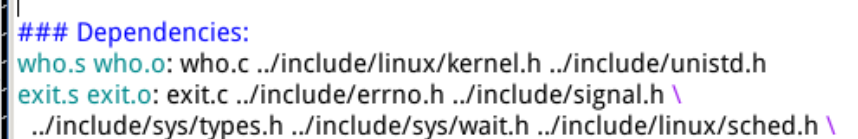

# 操作系统的系统调用


# LAB2

一、 任务内容：

在原有的linux0.11上添加两个系统调用，及其相应的响应函数，并通过API调用系统调用。

两个系统调用的原型和应该完成的功能如下

（1）iam()

```c
int iam(const char *name);
```

功能：将name的内容拷贝到内核中保存下来

要求：name长不能超过24个字符，包括最后的'\0'

返回值：拷贝的字符串name的长度。若name长超过24，则返回 -1，并置errno为EINVAL（errno是个头文件，即return -EINVAL,EINVAL是errno.h里的一个宏定义）

（2）whoami()

```c
int whoami(char *name,unsigned int size);
```

功能：将iam()保存到内核空间的字符串拷贝到name字符串指向的用户地址空间中，为了确保name不会越界访问，用size说明其大小

返回值：拷贝字符串name的长度。若size小于name所占空间，返回 -1，并置errno为EINVAL

二、明确何为系统调用。做什么的？如何做？

要谈系统调用，那我们还是先了解一下何为内核。(只是让我自己再复习一下概念，能否说清楚)

操作系统其实就是一个监控程序，对的，也是一个程序。它相当于单片机我们写的while(1)，而内核就是操作系统最核心的部分，也即这个程序里面最核心的代码。我们可以从linux源码看出其内核负责处理各种核心任务，比如I/O,进程管理，内存管理等。

所以内核即操作系统这个程序里面最关键的代码。也就是他是计算机资源的管理者，包括硬件，软件资源。软件资源就是各种形式的数据，比如各种文件，软件程序。硬件资源就是总线、CPU、内存、磁盘、网卡、显卡及各种IO。

那么系统调用是如何出现的呢？

我们假设如果没有操作系统来管理各种进程，举个栗子，每个进程需要放进内存才能执行，那么就会在占用内存空间，如果两个任务同时申请同一个内存空间会造成冲突。更为严重，如果一个任务占用了必须一直运行的程序或者非常重要的程序的内存空间，那么计算机就崩溃了。

同时，如果有操作系统，并且不对进程加以限制及控制，会发生什么情况？

在举几个栗子，对于单任务，他可能把他的空间占用到了原本分配给操作系统的空间，那么两者就混合了，没办法区分，并且用户程序可以访问大部分硬件设备，甚至改变操作系统，如果一个病毒(恶意进程)也连接到了操作系统的程序里面，那它就成了操作系统的一部分了，因为没办法区分嘛。

多任务呢？如果多个进程同时操控同一个硬件设备，数据传输就会错误，数据被污染，可以理解为一个程序的数据发送到了另一个程序。同时操作系统必须自己响应硬件中断，通过硬件中断来切换任务上下文，让合适的任务在合适时机运行。如果中断响应程序被更改了呢？操作系统又会如何运行呢？

综上，操作系统必须要清楚哪些程序占用那些资源，合理控制分配，才能有序运行下去。为了避免一个普普通通的进程将自己干掉取代，操作系统必然需要采取强硬措施保证自己的地位。核心问题在于保护关键寄存器和重要的物理内存。

既然操作系统是个监控程序，它要控制其下的进程，那么各种进程就必须要有分级制度，并且操作系统拥有最高控制权才能让其余的进程服从它的安排。这就引出了用户态和内核态。因此，只有有操作系统的前提，用户态和内核态这种概念才会存在。因为对于CPU来说不过是状态标志位的改变，即寄存器几个有特殊意义的位改变后，CPU有不同的工作方式。为了用户使用的方便，操作系统才衍生这用户态和内核态的概念

这个控制权由硬件来控制，当CPU引导进入保护模式后，会有一张全局描述符表，记录了各代码段的特权级别，在linux中特权级别为0-3，0级等级最高。CS寄存器中有两位(CPL，当前特权级)用来指明CPU当前的特权级，0最高，3最低，分别称为内核态和用户态。同时还存在请求特权级RPL，其存在请求者的程序代码里，代码里要提供一个选择子selector，RPL保存选择子的最低两位。访问时的特权检查根据：有效特权级EPL=max(RPL,CPL)<=CPL是否成立，所以用户程序最多访问CPL级别的代码段。

当用户态进入内核态，特权级升高，内核态回到用户态，特权级降低。这个进程切换的同时还会切换相应的栈，ESP从用户栈切换到内核栈，再从内核栈切换到用户栈。以上措施皆为限制程序的访问能力来保证操作系统的安全。

由上面我们也可以知道，用户态不能随随便便切换到内核态，要是随意切换，那操作系统不就也还是危险的了嘛。但是用户态必须要使用硬件设备，让操作系统来和硬件交互执行程序的各种功能，所以我们需要进入内核态啊，那么我们要如何做呢？这时候需要一个机制：用户态程序切换到内核态，但不能控制内核态中执行的指令。

这个机制就是系统调用(嘿嘿，说了那么多终于讲到它了)，而执行机制的方法就是中断（异常的一种，且不仅这一个方法，所以称为”异常“会更为准确，例如缺页也会进入内核态进行取页换页的操作），可以理解为中断是能够陷入内核态的有效手段。用户程序通过系统调用的这个方法，告诉内核他要去操控哪些计算机资源。所以系统调用是内核态与用户态的分界

例如我们使用printf函数，他就告诉了内核要控制显示器输出这样的字符串，所以我们可以在屏幕上看到字符串的输出，说明我们的程序已经进入过内核态并将数据传递给了显示器这个硬件。

系统调用即调用系统函数，通过系统函数来实现控制硬件。系统函数是调用系统库中为该系统调用编写的一个接口函数(API)，但API并不会自己完成系统调用，而是真正的系统调用被封装在API中，换句话说，API调用真正的系统调用。例如write()这个系统函数就是一个API，这个函数中还有指令真正用来实现在显示器上显示字符。

那么系统函数也是函数和我们用户态写的用户程序的函数有什么区别呢？调用用户程序的自定义函数，在汇编层面是通过call指令跳转到该函数地址，然后执行。

而调用API到API调用真正的系统调用的过程如下：

1. 将系统调用函数的编号存入EAX;
2. 把函数参数存入其他通用寄存器;
3. 触发int 0x80，请求处理系统调用的system_call来处理;


该次任务，我们在用户程序直接执行我们所写的系统调用函数。

这个过程如下：

1. 应用程序调用库函数(API)
2. API将系统调用号存入EAX，通过中断调用使系统进入内核态
3. 内核中的中断处理函数根据系统调用号，调用对应的内核函数（系统调用）
4. 系统调用完成相应功能，将返回值存入EAX，返回到中断处理函数
5. 中断处理函数返回到API
6. API将EAX的值返回给应用程序

三、分析及实现

我们会从一些系统函数进行分析来充分理解用户程序是如何进行系统调用的。

我们查看Linux0.11源码里的lib/close.c中close()的API

```c
#define __LIBRARY__
#include <unistd.h>

_syscall1(int, close, int, fd)
```

_syscall 是一个宏，其在include/unistd.h中定义

```c
#define _syscall1(type,name,atype,a) \
type name(atype a) \
{ \
long __res; \
__asm__ volatile ("int $0x80" \
    : "=a" (__res) \
    : "0" (__NR_##name),"b" ((long)(a))); \
if (__res >= 0) \
    return (type) __res; \
errno = -__res; \
return -1; \
}
```

将_syscall1(int，close，int，fd)进行宏展开有

```c
int close(int fd)
{
    long __res;
    __asm__ volatile ("int $0x80"
        : "=a" (__res)
        : "0" (__NR_close),"b" ((long)(fd)));
    if (__res >= 0)
        return (int) __res;
    errno = -__res;
    return -1;
}
```

这个就是API的定义，里面包含了调用真正的系统调用。将宏__ NR_close存入EAX ( 你是不是会疑惑__ NR_close怎么出来的？咱先按下不表)，然后将fd存入EBS，然后进行0x80中断调用。从EAX取出返回值存入__res中，判断后再决定传什么值给API调用者。对比API进行真正系统调用的过程，那么可知这个就是进行了API到真正系统调用的实例。

那么__NR_close是什么呢？它其实就是系统调用的编号，我们有一步要将系统调用号写入EAX让内核知道要调用哪一个内核函数嘛。所有系统调用的编号都在include/unistd.h里面定义。我们要自己写系统调用函数，也需要给我们的函数一个编号。

```c
#define __NR_close    6
/*
所以添加系统调用时需要修改include/unistd.h文件，
使其包含__NR_whoami和__NR_iam。
*/
```

因此对于我们写的用户程序调用系统调用需要有如下内容

```c
/* 有它，_syscall1 等才有效。详见unistd.h */
#define __LIBRARY__

/* 有它，编译器才能获知自定义的系统调用的编号 */
#include "unistd.h"

/* iam()在用户空间的接口函数，调用系统调用，是系统调用iam()的API，在这个宏里面完成真正系统调用 */
_syscall1(int, iam, const char*, name);

/* whoami()在用户空间的接口函数 */
_syscall2(int, whoami,char*,name,unsigned int,size);
```

所以我们在unistd.h文件中添加如下的内容


如此我们就将我们自己写的系统调用函数设置好了

我们调用close()API时调用了int 0x80，所以我们要从此进入内核。

首先来了解0x80中断执行的过程

首先我们看内核初始化的时候，主函数main()中调用了sched_init()初始化函数（现在是系统调用初始化的分析）

```c
void main(void)
{
//    ……
    time_init();
    sched_init();
    buffer_init(buffer_memory_end);
//    ……
}
```

sched_init() 在kernel/sched.c中定义

```c
void sched_init(void)
{
//    ……
    set_system_gate(0x80,&system_call);
}
```

set_system_gate()是个宏，在include/asm/system.h中定义。我们可以看到他传入0x80这个参数和system_call这个中断程序的地址。

```c
#define set_system_gate(n,addr) \
    _set_gate(&idt[n],15,3,addr)
```

而_set_gate定义为

```c
#define _set_gate(gate_addr,type,dpl,addr) \
__asm__ ("movw %%dx,%%ax\n\t" \
    "movw %0,%%dx\n\t" \
    "movl %%eax,%1\n\t" \
    "movl %%edx,%2" \
    : \
    : "i" ((short) (0x8000+(dpl<<13)+(type<<8))), \
    "o" (*((char *) (gate_addr))), \
    "o" (*(4+(char *) (gate_addr))), \
    "d" ((char *) (addr)),"a" (0x00080000))
```

这里展示的是将system_call函数地址写到0x80对应的中断描述符中，相当于执行int 0x80指令，会产生一个异常陷入内核空间并执行系统调用处理函数system_call，那么明白了0x80号中断如何和system_call产生联系后，我们简单看下system_call的代码，是纯汇编语言编写的

```assembly
!……
! # 这是系统调用总数。如果增删了系统调用，必须做相应修改，所以我们增加两个系统调用函数，这里数值+2
nr_system_calls = 72
!……

.globl system_call
.align 2
system_call:

! # 检查系统调用编号是否在合法范围内
    cmpl \$nr_system_calls-1,%eax
    ja bad_sys_call
    push %ds
    push %es
    push %fs
    pushl %edx
    pushl %ecx

! # push %ebx,%ecx,%edx，是传递给系统调用的参数
    pushl %ebx  # to the system call

! # 让ds, es指向GDT，内核地址空间（修改段选择子为内核段）
    movl $0x10,%edx
    mov %dx,%ds
    mov %dx,%es
    movl $0x17,%edx
! # 让fs指向LDT，用户地址空间
    mov %dx,%fs
    call sys_call_table(,%eax,4)
    pushl %eax
    movl current,%eax
    cmpl $0,state(%eax)
    jne reschedule
    cmpl $0,counter(%eax)
    je reschedule
```

并不需要完全理解每一句话，知道他整个程序是干什么的即可。当我们调用system_call这个函数后，可以看到他保存了“现场”，各种push将用户态的各种参数入栈，并让fs指向用户空间，都是为了从内核态回到用户态后，还能还原进入内核态前的状态。(这是操作系统完成的部分保存，硬件完成的还有一部分，比如ss、esp、cs等寄存器)

并且该函数让我们从用户态陷入到了内核态。其余的简单了解一下即可。

我们关注

```assembly
call sys_call_table(,%eax,4)
```

我们知道EAX存放的是系统调用号，即__NR_xxxx。根据汇编寻址方法为

```assembly
call sys_call_table + 4 * %eax
```

那么sys_call_table又是什么呢？我们可以在include/linux/sys.h中找到


那么可知它是一个函数指针数组的起始地址。

因此我们根据系统调用号算出系统调用相应的响应函数在表里的位置，并调用该函数。

所以我们要在sys.h中加上 sys_iam() ,sys_whoami()两个响应函数引用

更改如下图所示


这里函数表添加的位置要和__NR_xxxx的值对应上，因为我们是根据这个值来计算函数在表里的位置的。

那么因此可以知道我们执行 int 0x80 中断指令后就能保存现场->陷入内核->调用系统响应相应的响应函数。

所以，那么我们就该写系统函数sys_iam()和sys_whoami(),我们将这两个函数写成一个who.c文件，这样就只需要一次编译。在完成这两个函数完整功能前，我们先写个测试代码。

```c
int sys_iam(const char* name){
	printk("Hello from sys_iam");
}
int sys_whoami(char* name,unsigned int size){
	printk("Hello from sys_whoami");
}
```

可能会有小伙伴疑问了？欸，为什么是printk而不是printf呢？ 首先明确我们现在是系统函数，调用这个函数的时候我们处于内核态，而内核态是不能使用用户态的函数printf的，所以有printk函数给内核函数使用。这两个函数本质调用的都是tty_write这个函数，但printk是在内核态，对fs寄存器操作不同于printf，因为fs寄存器指向用户态，所以他要将fs寄存器的内容入栈，保存现场，然后指向内核段，出内核态后再pop出&fs恢复现场

然后我们运行 Linux0.11，并在上面编写test.c文件来调用系统函数。

```c
#define __LIBRARY__
#include <unistd.h>
//iam()和whoami()两个系统调用的入口参数
_syscall1(int, iam, const char *, name); 
_syscall2(int, whoami, char*, name,unsigned int,size);

int main(void){
    char buf[24];
    iam("test");  //这句和下句都只是满足需要传入参数，才能运行。
    whoami(buf,24);
    return 0;
}
```

那么这样我们就能调用iam()和whoami()两个系统调用的响应函数sys_iam和sys_whoami了。我们得到输出


因此我们可以确定我们增加系统调用和响应函数成功了，那么我们现在将响应函数更改为我们想要的功能。

我们知道指针传递的参数是程序所在地址空间的逻辑地址，如果在内核就直接访问这个地址，得到的是内核空间的数据，而不会是用户态的数据，所以要把name这个字符串被内核读取存入，还需要其他的方法。

我们从open(char *filename，…..)来分析open（）这个系统调用是如何处理内核态从用户态读取数据的。

```c
int open(const char * filename, int flag, ...)
{
//    ……
    __asm__("int $0x80"
            :"=a" (res)
            :"0" (__NR_open),"b" (filename),"c" (flag),
            "d" (va_arg(arg,int)));
//    ……
}
```

这段我们分析过了，就是把各种参数存在寄存器中。但这里open的文件名是通过EBX传递，就是进入内核后，通过EBX取出文件名字符串。但EBX指向的数据在用户空间，执行的却是内核代码。

```assembly
system_call: //所有的系统调用都从system_call开始
!    ……
    pushl %edx
    pushl %ecx
    pushl %ebx                # push %ebx,%ecx,%edx，这是传递给系统调用的参数
    movl $0x10,%edx            # 让ds,es指向GDT，指向核心地址空间
    mov %dx,%ds
    mov %dx,%es
    movl $0x17,%edx            # 让fs指向的是LDT，指向用户地址空间
    mov %dx,%fs
    call sys_call_table(,%eax,4)    # 即call sys_open
```

这段代码也分析过了，就是各种参数入栈来保存，然后通过fs获得用户数据段的数据。然后call sys_call_table，我们会得到sys_open响应函数

```c
int sys_open(const char * filename,int flag,int mode)  //filename这些参数从哪里来？
{
    ……
    if ((i=open_namei(filename,flag,mode,&inode))<0) {
        ……
    }
    ……
}
```

你可能会问我们不是查表找到的响应函数吗？那这些参数哪里获得呢？看看上面的汇编代码，我们pushl 了各种寄存器的值入栈，这些就是函数的参数。我们C语言函数调用另一个函数，就是要将传递的参数压栈，从右到左顺序压，然后call调用。如果要用汇编程序调用C函数就需要自己手动编写这些压栈代码。

最后我们看到这些参数传给了open_namei（），我们继续深究会发现他里面还传给了dir_namei(),get_dir()，我们从get_dir函数看到

```c
static struct m_inode * get_dir(const char * pathname)
{
    ……
    if ((c=get_fs_byte(pathname))=='/') {
        ……
    }
    ……
}
```

那么我们就可以知道可以通过 get_fs_byte()这个函数获得用户空间的一个字节的数据。

那么如何从内核态拷贝数据到用户态呢？

我们在include/asm/segment.h中查看：

```c
extern inline unsigned char get_fs_byte(const char * addr)
{
    unsigned register char _v;
    __asm__ ("movb %%fs:%1,%0":"=r" (_v):"m" (*addr));
    return _v;
}

extern inline void put_fs_byte(char val,char *addr)
{
    __asm__ ("movb %0,%%fs:%1"::"r" (val),"m" (*addr));
}
```

即put_fs_byte和其配套，可将内核态数据写入用户态。

我们是否可以获得一个规律put_fs_xxx() and put_fs_xxx()是用来连接内核态和用户态的呢？

那我们开始写sys_iam 和 sys_whoami函数

```c
#include <string.h>
#include <errno.h>
#include <asm/segment.h>

#define maxsize 24
char msg[maxsize];
int msglen;

int sys_iam(const char* name){
	int len=0;
	while(get_fs_byte(&name[len])!='0')
		len++;
	if(len>23) return -EINVAL;
	int i=0;
	for(;i<len;++i) msg[i] = get_fs_byte(&name[i]);
    msg[i] = '\0';
	msglen = len;
	return msglen;
}

int sys_whoami(char *name, unsigned size){
	if(size < msglen) return -EINVAL;
	int i=0;
	for(;i<msglen;++i) name[i] = put_fs_byte(msg[i]);
	return msglen;
}
```

当我们who.c完成后要在makefile里面增加对who.o的依赖

如下图：


然后在添加对who.c and who.o 的依赖的产生条件,如下图：



完成上述步骤后，执行下面指令

```shell
make all
```

进行整体编译

然后我们运行 Linux0.11，我们还需要在这里面添加iam和whoami两个系统调用号的宏定义。

```shell
cd /usr/include/
vi unistd.h
```

然后加上系统调用号


然后

```shell
cd /usr/root/
vi iam.c
vi whoami.c
```

进行我们用户程序iam.c代码的编写（将传入字符串写入内核空间）

```c
#define __LIBRARY__  //
#include <unistd.h>	// 要想调用系统调用需要这些两个
#include <stdio.h>
#include <string.h>

_syscall1(int,iam,const cahr*,name);//iam()系统调用的用户接口

int main(int argc, char **argv){
    int i;
    if(argc!=2){
        printf("Usage: %s <message>\n",argv[0],argv[1]);
        return 0;
    }
    i = iam(argv[1]); //这句系统调用就将我们传入的name写入了内核空间
    if(i != strlen(argv[1])){
        printf("set message error\n");
        return 0
    }
    return 0;
}
```

在进行whoami.c的编写

```c
#define __LIBRARY__
#include <unistd.h>
#include <stdio.h>

_syscall2(int,whoami,char *,name, unsigned int,size);

int mai(){
	char message[24];
	whoami(message,24);
	printf("%s\n",message);
	return 0;
}
```

我们采用如下命令编译iam.c和whoami.c两个文件

```shell
gcc -o iam iam.c
gcc -o whoami whoami.c
```

只要没有其他语句出现那么就算程序写对了

然后我们运行代码得到如下结果


至此我们的任务完成！！！

我们总结一下，

系统调用的步骤->明白系统调用需要添加哪些信息代码->编写系统调用的响应函数（就是系统调用iam()后他会执行的功能的函数）->用户程序调用执行。

了解系统调用过程要明白0x80号中断是如何陷入内核态的

这里我们__NR_xxxx是系统调用号，一个宏定义。在响应函数表里添加响应函数sys_xxx。编写响应函数（也称内核函数）。

用户程序需要#define __ LIBRARY __ ; #include <unistd.h> ; _ syscall1(type,name,type,parameter….)。分别是 使能 _syscallx函数，引入系统调用号的宏，创建系统调用的用户程序接口（系统调用的API）。

我们这里是直接调用系统调用，所以直接使用_syscallx，平时例如我们使用的printf作为系统调用的API

附：

errno是传统的错误代码返回机制。通常我们会返回0或1代表正确或错误，但不能说明哪错了，错了什么。所以全局变量errno就能保存错误值，调用者可以通过判断errno来决定如何应对错误。错误值的含义都有标准定义。
