# 进程运行轨迹的跟踪与统计


# lab3

### 一、任务内容

1. 基于模板process.c编写多进程的样本程序，实现以下功能：
   1. 所有子进程都并行运行，每个子进程实际的运行时间不超过30秒
   2. 父进程向标准输出打印所有子进程的id，并且在所有子进程退出后才退出
2. 实现进程运行轨迹的跟踪。在内核中维护一个日志文件process.log，把从操作系统启动到系统关机过程中所有进程的运行轨迹都记录在这一log文件中
3. 统计log文件记录该程序建立的所有进程的等待时间，完成时间(轮转时间)和运行时间，计算平均等待时间，平均完成时间，和吞吐量。
4. 修改进程调度的时间片，运行同样的样本程序统计同样的时间数据，和原有的情况对比，体会时间片带来的差异

### 二、明确进程的概念以及其生命周期内运行过程

那么何为进程呢？

操作系统为正在运行的程序提供的抽象，就是进程，是操作系统提供的基本抽象

非正式定义可以定义为，正在运行的程序。但程序本身是没有生命周期的，他只是存在磁盘上的一些指令或者静态数据，是操作系统让这些字节运行起来，让程序发挥作用。

我们通过清点一个运行的程序在执行过程中访问或影响的系统的不同部分，从而概括一个进程。

这里引入一个新的概念，进程的机器状态(machine state)：程序运行时可以读取或更新的内容。

因此我们要关注，任何时刻下，机器哪些部分对执行该程序很重要。

我们知道存放在内存的程序才能被运行，因此组成机器状态的重要的部分就是内存。指令存放在内存中，正在运行的程序读取和写入的数据也存在内存中，因此进程能访问的内存就是该进程的一部分。

进程的机器状态另一部分就是寄存器。因为很多指令都是明确的读取或更新寄存器，所以寄存器对程序的执行很重要。

进程创建的一些细节：

操作系统运行程序第一件事就是讲代码和所有静态数据加载到内存中，加载到进程的地址空间中。

早期操作系统中，加载这个过程需要尽早完成，即在运行程序之前全部完成。

但随着现在程序越来越大，内存根本不可能一次性存放如此大的程序。你看现在的游戏都是10G以上，而我们的内存可能是8G,16G等，所以大多时候内存的大小无法载入整个程序。

因此，现代操作系统惰性地(lazily)执行该过程，也就是仅在程序执行期间需要加载的代码或数据片段，才会加载到内存当中。换句话说我用谁我让谁进入内存，当内存满了之后我根据我的调度策略，将该换出去片段换出去，再把要用的片段加载进来。(这部分需要了解分页和交换的机制)

当我们把程序载入到内存后，操作系统还会自动为程序分配运行时栈(run-time stack or stack)

操作系统也可能会为程序的堆分配内存，这需要用户主动的显式的申请，例如malloc()这样的调用来申请空间，再通过free()释放内存。

在UNIX系统中，每个程序都会有三个文件描述符，分别是标准输入stdin，标准输出stdout，标准错误stderr。所以操作系统还会初始化一些其他的任务，例如I/O相关的任务。

完成上述任务后，PC指针就指向程序main函数入口地址，开始执行程序。

总结就是：操作系统要执行一个程序，首先将代码和静态数据载入内存，通过创建和初始化栈及执行与I/O设置相关的其他工作，最后OS开始执行程序入口函数。

我们这里简单提一下 堆和栈的区别：

我接触到栈和堆的时候，是学习数据结构的时候，当时对堆的说明只是能够自动排序的一种数据结构。与数据结构不同，这里的堆分配方式类似于链表，因此获得的地址空间可以不连续

在内存当中，

栈是由系统自动分配自动释放(出栈时)，且地址空间连续。用于存放函数的参数值，局部变量的值。因为是机器自动执行，且是系统提供的数据结构，机器语言层有专门的执行指令，所以栈的执行效率更高于栈。其地址增长方向是，高地址向低地址增长

堆一般由程序员分配释放，因此我们能申请任意多少的内存(受限于计算机系统中的虚拟内存)，动态内存的生存期也是由程序员自己决定的。如果在堆上分配的了内存地址就必须释放它，否则会导致运行的程序出现内存泄漏的情况。其地址增长的方向从下往上，即低地址向高地址增长。

我们知道进程是不断切换着运行的，但是我们的内存和寄存器只能留给需要执行的程序，当我们切换进程的时候自然就会需要保存"现场"，那么当我们再次切换回来的时候才能让程序继续以切换之前的状态运行。所以操作系统充满了各种数据结构用来处理各种情况，在我们讨论的这个情况，操作系统就有一个称为进程控制块PCB(Process Control Block)的数据结构，用来存储关于进程的信息的个体结构。

对于停止的进程，寄存器上下文(寄存器取值所基于的语境)将保存其寄存器的内容。所以当进程停止时，寄存器将被保存到这个内存位置。这句话可能说的不是特别清楚。

当程序挂起的时候，我们观察的寄存器都是存放在内存中的寄存器的值，而不是物理寄存器当前的值，当我们修改寄存器的时候也是修改内存中的寄存器值。

当线程切换时，系统会将要挂起线程的寄存器值保存到内存中，这个记录就被称为线程上下文，寄存器上下文即线程上下文的一部分。将现成的寄存器存放在内存中，称为上下文记录

根据PCB记录"现场"，我们就能还原"现场"，实现进程的切换。

至此，进程的一些基本内容就概述完成，那么我们该来想想如何才能创建多进程呢？

我们需要调用fork()系统调用来创建子进程。这里对fork()进行一些概述

fork()创建一个进程，该进程称为子进程，原进程称为父进程。当我们执行该调用，系统会分配出新的内存空间，并将父进程的所有值都复制给子进程，只有少量的值于原来的进程的值不同，以区分两个为不同的进程。我们可以理解是一个克隆。（这里提一点，如果我们不更改子进程的优先级，那他将和父进程的相同，我们也是通过父进程的优先级的值来赋值给子进程的时间片。）

我们写的process.c代码，计划在里面创建4个进程，那你可能会想，哎？我创建了4个子进程，他们会执行什么程序？和父进程相同，所以他们也在执行父进程的程序吗？

对的，子进程会从调用fork()的位置开始继续往下执行。也就相当于fork()只会拷贝下一段要执行的代码到子进程中。

这里需要说一下fork()的特别的机制。

fork()调用一次，并成功创建新进程，它能返回两个值，失败则返回一个负值(-1吧，不过这个暂时不重要)

那么这两个值分别是什么呢？在父进程中，fork返回新创建子进程的进程ID，在子进程中，fork返回0.你可以这么理解，父子进程是一棵多叉树(只有一个子进程可理解成一串链表），父进程指向子进程的id，而子进程指没有指向则为0.

所以我们会看到这样的判断

```c
pid_t pid;
pid = fork();
if(pid!=0){
	printf("I am parent %d",getppid());
}
else if(pid==0){
	printf("I am child %d of parent %d",getpid(),getppid());
}
```

然后屏幕两个输出都出现了，这里不用疑惑，我们还在执行另一个进程来跑相同的程序呢，父进程得到的是0，所以进入了第二个if，子进程得到的是他的进程id进入了第一个if，所以我们能看到两个输出都出现了。

那么多进程创建就解决了，我们再来想想如何让父进程等待子进程全部结束后再结束呢？

在这之前，我们需要知道为什么父进程会需要等待子进程结束再结束(当然，在这我们是想要他这么做，但也有值得这么做的理由)

我们使用wait()系统调用，让父进程立即进入阻塞状态，然后wait()自动分析当前进程的某个子进程是否已经运行完成，当wait找到这样的僵尸子进程后，wait就会收集子进程的信息(例如退出原因)和回收子进程残留资源，并将该子进程彻底销毁后返回该进程的进程id。当wait一旦被调用，就会一直阻塞，直到有一个子进程退出为止

何为僵尸子进程？

当一个进程运行结束后，会关闭所有文件描述符，释放在用户空间分配的内存，但进程留在PCB的信息没有被同步删除。而执行完却没从PCB中删去进程信息的子进程称为僵尸子进程.

那么为什么要删除僵尸进程呢？僵尸进程明明不做任何事，不会使用任何资源也不会影响其他进程了啊，为什么还要去管他呢。但PCB内的信息也都是存放在内存中的，如果存在太多僵尸进程也会导致一些问题。你可以想象一个工厂里面，有一些人啥也不做，你也不用支付工资，但人数多了后，仍让会导致你的工厂变得拥挤从而导致其他的人难以正常工作。

所以回到原来的问题，我们通过wait()让父进程阻塞，等待全部子程序结束后再结束父进程。

以上，我们创建多进程的程序就已经有了整体的框架和思路了。

我们现在要考虑，如何创建一个日志呢？如何让他从操作系统启动后就跟着启动并开始记录进程的活动轨迹呢？

容易想到，那我们在操作系统开机的时候就打开日志文件不就行了吗？对，确实是这样做，但问题在于要如何处理？

Linux中，一切都能抽象为文件，那么对于一个打开的文件，我程序应该如何找到呢？完成这功能的便是通过文件描述符，所以我们要打开日志文件就需要关联文件描述符。我们知道，在Linux中文件描述符0、1、2分别关联了标准输入stdin、标准输出stdout和标准错误stderr，因此我们将文件描述符3关联到process.log日志文件即可。有一点需要注意，因为我们要今早打开日志文件记录所有进程的运行轨迹，我们需要将关联的代码提前到进程0运行还没创建进程1的时候就完成，这部分会在实践部分详细展开说。

那么接下来就是我们要在什么地方加入写入日志文件的代码了。

我们要清楚，进程，它能处于几种状态？可以认为其有三种状态

运行：进程正在处理器上运行，进程在执行指令

就绪：进程已经准备好运行，但操作系统因为一些原因并不打算在此时运行

阻塞：一个进程执行了某种操作，知道发生其他事件时才会准备运行。例如一个进程需要操作IO设备时候，该进程就会进入阻塞状态，因为I/O设备反应时间远慢于CPU运行的速度，所以此时进程阻塞放出CPU的操作权，从而提高CPU的利用率

但我们在这里再加上两个状态：创建和退出

我们用如下字母进行替代：新建(N),就绪(J),运行(R),阻塞(W),退出(E)

最后我们就要考虑，再哪些位置进行进程的监测，并把检测信息输入到日志文件中。

因为fork()系统调用后，进入内核，所以进程的轨迹的监测，我们需要在内核中完成，那么write()这个系统调用我们就没办法使用了，所以写数据进文件的函数，我们需要解决。因为这部分编程较为困难，就直接使用现成的代码。

我们将重点放在在哪里进行进程轨迹监测。

对于创建(N)，我们需要找到创建进程的函数copy_process()，其位于fork.c内核文件中，并在创建的时候将信息写入日志文件

对于运行(R)，就绪(J)，阻塞(W)，我们需要考虑在涉及到调度策略的代码中进行，即内核文件中的sched.c

退出(E)就考虑再内核文件中的exit.c文件中这种状态才会出现。

### 三、实践部分

(代码是自己再打一遍的，可能会有一些人为错误，有的话还希望指出)

首先先编写能生成多进程的程序process.c

该程序包含两个部分，第一个部分是多进程创建的代码，第二部分是获取该进程使用CPU的时间以及模拟I/O操作的代码

下面这段是第二部分代码：

先放出第二部分代码是因为，第一部分的代码需要用到第二部分的

```c
/*
 * 此函数按照参数占用CPU和I/O时间
 * last: 函数实际占用CPU和I/O的总时间，不含在就绪队列中的时间，>=0是必须的
 * cpu_time: 一次连续占用CPU的时间，>=0是必须的
 * io_time: 一次I/O消耗的时间，>=0是必须的
 * 如果last > cpu_time + io_time，则往复多次占用CPU和I/O
 * 所有时间的单位为秒
 */
void cpuio_bound(int last, int cpu_time, int io_time)
{
	struct tms start_time, current_time;
	clock_t utime, stime;
	int sleep_time;

	while (last > 0)
	{
		/* CPU Burst ，指CPU执行指令的那一段时间区间*/
		times(&start_time);
		/* 其实只有t.tms_utime才是真正的CPU时间。但我们是在模拟一个
		 * 只在用户状态运行的CPU大户，就像“for(;;);”。所以把t.tms_stime
		 * 加上很合理。*/
        /*用来模拟cpu_time时间内使用CPU */
		do
		{
			times(&current_time);
			utime = current_time.tms_utime - start_time.tms_utime;
			stime = current_time.tms_stime - start_time.tms_stime;
		} while ( ( (utime + stime) / HZ )  < cpu_time );
		last -= cpu_time;

		if (last <= 0 )
			break;

		/* IO Burst ，指I/O设备被请求执行开始到执行结束的时间区间*/
		/* 用sleep(1)模拟1秒钟的I/O操作 */
		sleep_time=0;
		while (sleep_time < io_time)
		{
			sleep(1);
			sleep_time++;
		}
		last -= sleep_time;
	}
}
```

cpuio_bound(10,1,1)意思为该进程，轮转一次使用CPU时间为1s，I/O设备占用时间1s，占用CPU和I/O时间总共为10秒

下面是第一部分代码：

```c
#include <stdio.h>
#include <unistd.h>
#include <time.h>
#include <sys/times.h>
#include <sys/types.h>

#define HZ	100
#define CHILD_PROCESS_NUM 4
#define CHILD_RUN_TIME 30

void cpuio_bound(int last, int cpu_time, int io_time);
/*
1.  所有子进程都并行运行,每个子进程的实际运行时间一般不超过30秒;
2.  父进程向标准输出打印所有子进程的id,并在所有子进程都退出后才退出;
*/
int main(int argc, char * argv[])
{
	pid_t pid; /*子进程 PID*/
	int i=0;
	while(i<CHILD_PROCESS_NUM)
	{
		/*子进程*/
		if((pid=fork())<0)  /*fork 失败*/
		{
             fprintf(stderr,"error in fork()\n");
			return -1; 
		}
         /*成功创建子程序，子程序将执行下面的代码*/
		else if(pid==0)
		{
			fprintf(stdout,"create new process [%lu]\n",(long)(pid));
             cpuio_bound(CHILD_RUN_TIME,1,i);/*用i是为了不断改变I/O使用时间*/
			exit(0);  /*退出子程序*/
		}
         /*父进程执行下面代码*/
         else
         {
              fprintf(stdout,"child pid is [%d] and parent pid is [%d]\n",getpid(),getppid());
              i++;
         }
		/*父进程继续循环fork*/
	}
	/*等待所有子进程完成*/
    /*因为当一个子进程结束后就会返回他的id，如果没有子进程就会返回-1，所以当要等待多个进程结束，就需要while((pid=wait(NULL))！=-1)，这样当所有子进程结束后，父进程才会结束运行 */
    while((pid=wait(NULL)) != -1) 
    {
        fprintf(stdout,"process [%lu] terminated\n",(long)(pid));
    }
	return 0;
}
```

那么我们创建多进程的程序完成，现在要考虑创建日志文件process.log。

首先我们日志放在/var/process.log，作用使在每个进程发生状态切换的时候向log文件内写入一条记录，但因为在内核态写入，这个过程和用户态应用程序在一些细节上差别就很大。

首先是打开log文件，我们是要让操作系统第一次调用fork()建立进程1的时候就开始记录了，那么我们log要在这之前打开才能记录进程1的信息。

我们先查看操作系统第一次fork()的代码，内核入口为init/main.c 中的main()，里面有一段代码

```c
//...
move_to_user_mode();  /*切换到用户模式*/
if(!fork()){    /* we count on this going ok */
	init();
}
//...
```

这段代码是在进程0运行的，首先要切换到用户模式，才全系统第一次调用fork()建立进程1，进程1调用init()函数，我们进入init()中查看

```c
//...
/*加载文件系统 */
setup((void *) &drive_info);
/*打开/dev/tty0，建立文件描述符0并和/dev/tty0相关联 */
(void) open("/dev/tty0",O_RDWR,0);
/*让文件描述符1也和/dev/tty0关联*/
(void) dup(0);
/*让文件描述符2也和/dev/tty0关联*/
(void) dup(0);
```

dup(oldfd)用来复制参数oldfd所指的文件描述符。当复制成功时，返回最小的尚未使用的文件描述符，若有错误就返回-1，错误代码存入errno中。返回的新文件描述符和参数oldfd指向同一个文件，这两个描述符共享同一个数据结构，共享所有的锁定，读写指针和各标志位。

我们前面说过文件描述符分别代表了什么，这就不赘述。那么就应该紧接着建立文件描述符3和process.log日志文件相关联

建立方式同tty0文件

```c
/*O_CREAT如果文件不存在就创建，并使用参数3设置权限；O_TRUNC若文件存在则清除文件内容并设置文件大小为0;O_WRONLY以只写方式打开文件；0666就是文件操作的权限值，和第二个参数有关*/
(void) open("/var/process.log",O_CREAT|O_TRUNC|O_WRONLY,0666);
```

我们知道init()函数是在fork()后才进行，为了能记录进程1，我们需要将文件描述符关联文件的这步放到fork()前面，但必须在move_to_user_mode();后，因为必须先移动到用户模式，才能加载文件系统，因此需要在这之后添加代码，不能再在前面添加了。因此更改后如下

```c
//...
move_to_user_mode();  /*切换到用户模式*/
//...
/*加载文件系统 */
setup((void *) &drive_info);
/*打开/dev/tty0，建立文件描述符0并和/dev/tty0相关联 */
(void) open("/dev/tty0",O_RDWR,0);
/*让文件描述符1也和/dev/tty0关联*/
(void) dup(0);
/*让文件描述符2也和/dev/tty0关联*/
(void) dup(0);

(void) open("/var/process.log",O_CREAT|O_TRUNC|O_WRONLY,0666)
if(!fork()){    /* we count on this going ok */
	init();
}
//...
```

还要记得把init的这部分给注释掉，因为进程1继承了进程0这个父进程的绝大部分东西，所以进程1也会继承这些文件描述符.

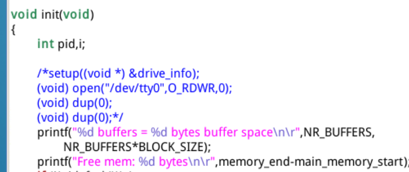

那么日志文件就能在全系统第一次调用fork()之前创建了，因此能监测各进程的各种状态变化了

日志文件建立了，那是不是该考虑如何写入log文件了呢？之前说过我们在内核中切换进程，导致进程状态改变，也就是说所有的状态转移是在内核进行的，那么我们也得在内核向日志文件写入这些改变信息，但是我们在内核没有办法使用write()这个系统调用，所以我们要考虑自己写一个写入函数，就像printf()在内核中有个printk()来替代它的功能，我们就要写一个在内核使用的write()。

因为内核函数的编写涉及到C内嵌汇编，编写难度较大，因此我们直接套用现成的代码，主要是参考printk()和sys_write()写出来的

```c
#include "linux/sched.h"
#include "sys/stat.h"

static char logbuf[1024];
int fprintk(int fd, const char *fmt, ...)
{
    va_list args;
    int count;
    struct file * file;
    struct m_inode * inode;

    va_start(args, fmt);
    count=vsprintf(logbuf, fmt, args);
    va_end(args);
/* 如果输出到stdout或stderr，直接调用sys_write即可 */
    if (fd < 3)
    {
        __asm__("push %%fs\n\t"
            "push %%ds\n\t"
            "pop %%fs\n\t"
            "pushl %0\n\t"
        /* 注意对于Windows环境来说，是_logbuf,下同 */
            "pushl $logbuf\n\t"
            "pushl %1\n\t"
        /* 注意对于Windows环境来说，是_sys_write,下同 */
            "call sys_write\n\t"
            "addl $8,%%esp\n\t"
            "popl %0\n\t"
            "pop %%fs"
            ::"r" (count),"r" (fd):"ax","cx","dx");
    }
    else
/* 假定>=3的描述符都与文件关联。事实上，还存在很多其它情况，这里并没有考虑。*/
    {
    /* 从进程0的文件描述符表中得到文件句柄 */
        if (!(file=task[0]->filp[fd]))
            return 0;
        inode=file->f_inode;

        __asm__("push %%fs\n\t"
            "push %%ds\n\t"
            "pop %%fs\n\t"
            "pushl %0\n\t"
            "pushl $logbuf\n\t"
            "pushl %1\n\t"
            "pushl %2\n\t"
            "call file_write\n\t"
            "addl $12,%%esp\n\t"
            "popl %0\n\t"
            "pop %%fs"
            ::"r" (count),"r" (file),"r" (inode):"ax","cx","dx");
    }
    return count;
}
```

我们将改代码放入kernel/printk.c文件中即可。

fprintk使用的格式有如下

```c
// 向stdout打印正在运行的进程的ID
fprintk(1, "The ID of running process is %ld", current->pid);

// 向log文件输出跟踪进程运行轨迹
fprintk(3, "%ld\t%c\t%ld\n", current->pid, 'R', jiffies);
```

第一个参数为文件描述符，第二个参数作为字符串输出，就和printf使用是一样的，但是前面第一个参数用来指定文件描述符。

我们还记录了进程切换，状态保持的一些时间，但是时间并不是我们常识的时间，而是以CPU时钟中断发生的次数，称为“滴答数”——jiffies

jiffies是定义在kernel/sched.c文件中定义为一个全局变量,记录了开机到当前时间的时钟中断次数

```c
long volatile jiffies=0;
```

在sched.c中sched_init()函数中，时钟中断函数被设置为

```c
set_intr_gate(0x20,&timer_interrupt);
/*在kernel.system_call.s中timer_interrupt定义有如下和jiffies相关的指令 */
timer_interrupt:
!    ……
! 增加jiffies计数值
    incl jiffies
!    ……
```

这也是jiffies能表示开机到现在发生的时钟中断次数的原因

在kernel/sched.c中定义一个宏 LATCH时用来设置每次时钟中断间隔的

```c
// 在 kernel/sched.c 中
#define LATCH  (1193180/HZ)

// 在 include/linux/sched.h 中
#define HZ 100
```

这个和计算机的定时芯片时钟频率有关。

最重要的部分来了，我们如何寻找状态切换点呢？

我们从每个状态转化的过程入手：

首先先列出我们需要改动的文件：

kernel/rork.c中的copy_process函数

kernel/sched.c的schedule()，wake_up()，sleep_on()，interrupt_sleep_on()，sys_pause()，sys_waitpid()函数

kernel/exit.c 的 do_exit()函数

1. ***无->创建：***

既然涉及到创建，那么我们就进入fork()去看，之前做的第二个实验我们知道系统调用里面才调用真正的内核函数，所以fork()里面会有一个sys_fork()来执行真正的系统调用，所以我们在sys_fork()寻找创建进程的函数

```c
sys_fork:
    call find_empty_process
!    ……
! 传递一些参数
    push %gs
    pushl %esi
    pushl %edi
    pushl %ebp
    pushl %eax
! 调用 copy_process 实现进程创建
    call copy_process
    addl $20,%esp
```

那么copy_process便是真正创建子进程的函数了

我们可以找到在这个函数中，创建了一个task_struct结构空间，然后将父进程各种信息赋值给新的结构空间，我们注意几个点就可以

```c
int copy_process(int nr,……)
{
    struct task_struct *p;
//    ……
// 获得一个 task_struct 结构体空间
    p = (struct task_struct *) get_free_page();
//    ……
    p->pid = last_pid;
//    ……
// 设置 start_time 为 jiffies
    p->start_time = jiffies;
//       ……
/* 设置进程状态为就绪。所有就绪进程的状态都是
   TASK_RUNNING(0），被全局变量 current 指向的
   是正在运行的进程。*/
    p->state = TASK_RUNNING;

    return last_pid;
}
```

我们添加在如下地方

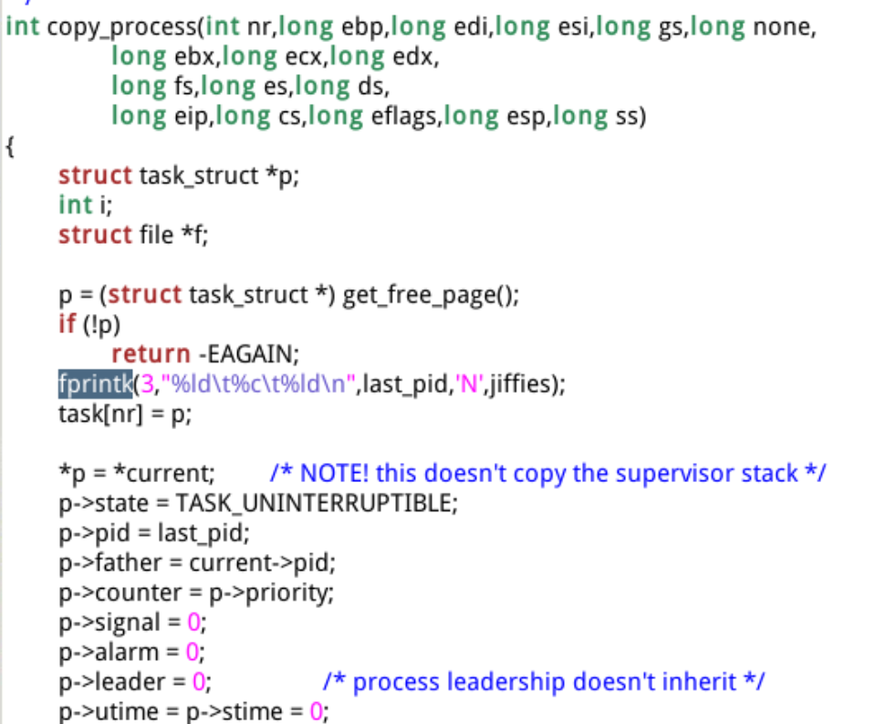

那么我们就能记录新子进程建立的id，状态为’N'，和CPU中断次数的信息了

1. ***新建->就绪：***

当子进程建立完成后，他就进入就绪状态，同一个文件下，那么我们在return last_pid；前一句加入写入log文件的语句即可。按道理来说新建子进程不会直接运行啊，应该还要等待schedule函数的调度才能到运行状态，我就不太明白为什么这段代码会把新建子进程的状态p->state = TASK_RUNNING;（答案：Linux中统一ready(就绪态）和running(运行态）为TASK_RUNNING状态）

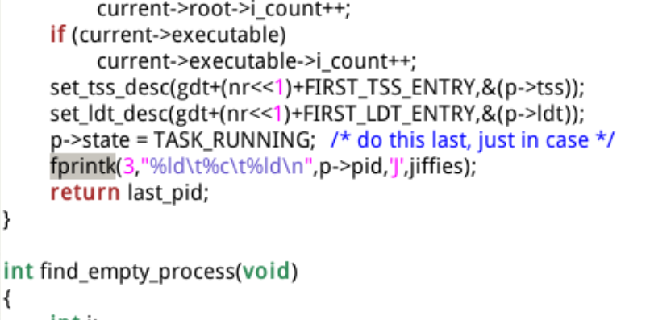

1. ***就绪->运行 | 运行->就绪：***

就绪到运行，那么就需要执行schedule()函数，那么我们进入kernel/sched.c里面找到schedule()函数。但这个时候我们需要判断current这个当前这个进程是属于什么状态，如果是TASK_RUNNING状态就需要现将转为就绪态，然后通过switch_to(next)将任务队列的第一个进程变为TASK_RUNNING。因此我们再次这样添加语句

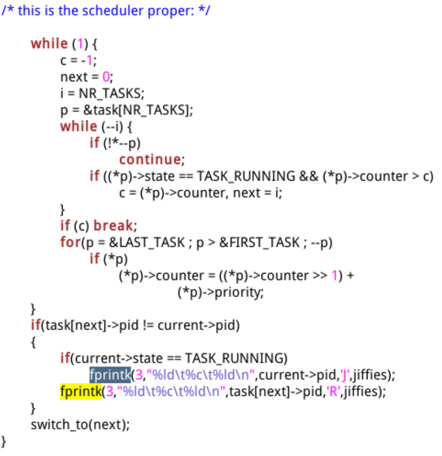

1. ***阻塞->就绪：***

同样是在schedule()函数里，在第三点代码段前面。有将阻塞态进程转为就绪态的函数(可能此时有操作I/O设备的进程完成了任务)，那么我们直接在他改为就绪态后添加语句即可

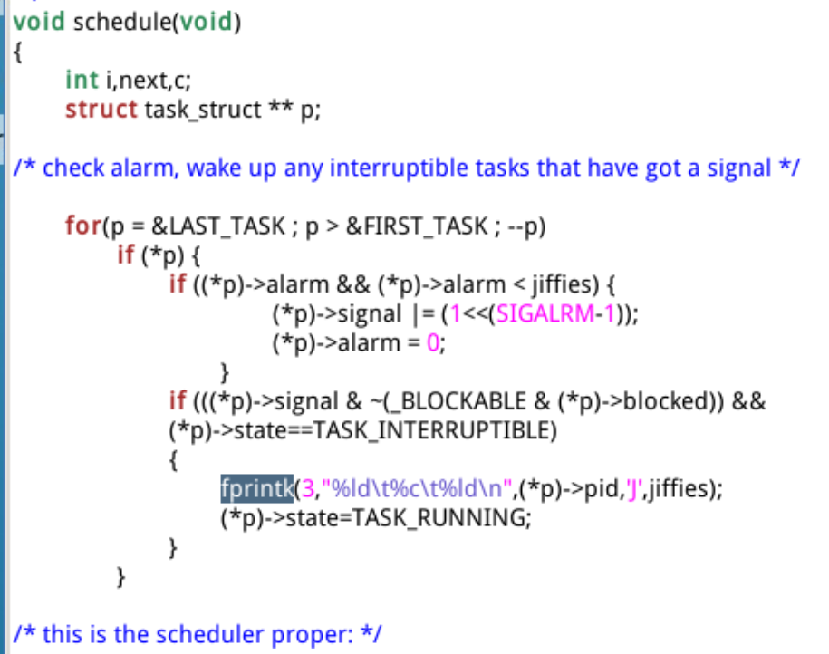

同样我们还有一个wake_up()函数也能将阻塞态转为就绪态，因此我们还需要在该函数中添加，该函数用到了 p->state！=0，0代表的是TASK_RUNNNING。

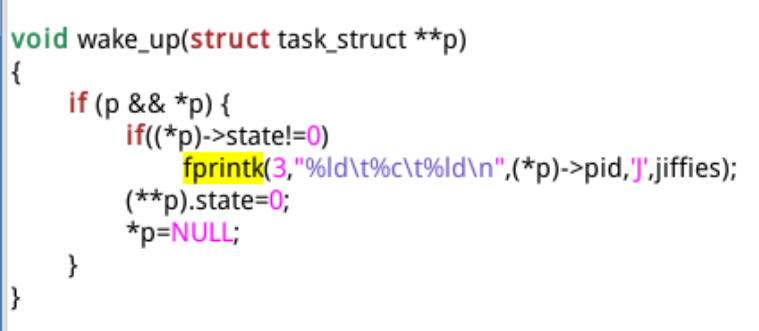

1. ***运行->阻塞：***

阻塞有两种情况，第一种为可被中断打断阻塞，第二种为不可被中断打断阻塞

不可被中断打断阻塞。只能由wake_up显示唤醒，再由schedule()语句后的if(tmp) tmp->state=0依次唤醒。不可中断的睡眠进程一定是严格从"队列"(一个依靠放在进程内核栈中的指针变量tmp维护的队列)的头部唤醒。

可被中断打断阻塞，他除了被wake_up唤醒，也可以被发一个信号唤醒，实际上就是进程PCB中维护的一个向量的某一位置的位，当进程需要再合适的时候处理这一位来唤醒，在schedule()中

```c
for(p = &LAST_TASK ; p > &FIRST_TASK ; --p)
if (((*p)->signal & ~(_BLOCKABLE & (*p)->blocked)) &&
         (*p)->state==TASK_INTERRUPTIBLE)
         (*p)->state=TASK_RUNNING;//唤醒
```

就是当进程是可中断睡眠时，遇到一些信号就会被唤醒，这样会导致，唤醒等待队列中间的某个进程，那这个队列就会需要进行适当的调整，会继续让该进程睡眠，并唤醒排在前面的进程然后再将该进程唤醒。

这就是两者的区别

不可被中断打断阻塞的状态转换位于sleep_on()函数，也在sched.c文件中

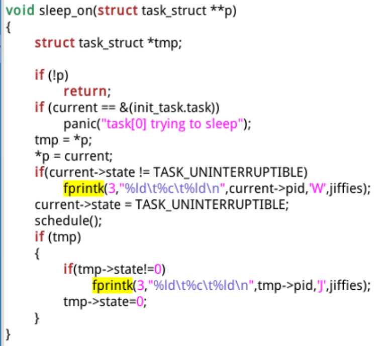

tmp指向当前进程的上一个被睡眠的进程，* p指向当前的进程，如果* p没有指向当前进程a，也就是说当前进程a前面又加入了一些进程bcd等，此时d的tmp->c，c的tmp->b，b的tmp->a，tmp是每个进程私有的，而* p是全局变量，此时*p指向 d.

所以schedule()要回到进程a的程序，需要等d的if(tmp执行)，c的if(tmp)，b的if(tmp)执行并被唤醒后，a的schedule()才会回来并执行a的if(tmp)并唤醒a进程。

该函数本意是失眠用的，那么我们就在current转换成阻塞态前加上该语句，此时睡眠队列头指针指向当前任务，当我们调用schedule后回到该程序继续执行if(tmp)的代码，将该进程变为就绪态。

我们添加if就是为了避免一些情况导致某些进程重复被记录防止出错

在interruptible_sleep_on()函数中

我们是在其状态更改前写入日志文件，代码如下

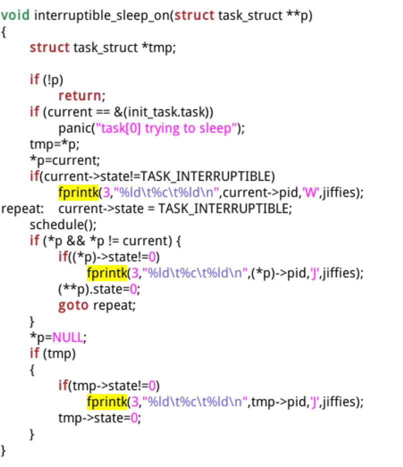

将当前任务放入等待队列中，同样该任务被唤醒后才能继续执行，如果* p指向的不是当前任务，说明其他任务加入进了等待队列，我们需要先唤醒前面的，等待后续进入队列的任务都被唤醒执行后再来唤醒本任务，因为该任务是可被中断唤醒的，所以先唤醒后面新加的等待任务，所以才会判断 if(* p&&* p！=current)如果p存在但不等于当前进程a，他就会让* p指向的进程d唤醒，然后然被某个信号唤醒的进程a继续睡眠（就是repeat回去的那条代码做的事）此时* p=NULL，所以后面都不会在进入 if(* p&&* p！=current)里面，而是通过tmp不断唤醒他连接的在他之前睡眠的进程，一直这样唤醒到tmp指向的是被某个信号唤醒的进程的程序a，然后执行schedule()后面的代码，此时if(tmp)的代码就是将本进程从阻塞态转换成就绪态。

所以我们调用该睡眠函数 就在一开始添加写入阻塞的信息，在后面添加写入就绪的信息

sys_pause()，sys_waitpid()函数也是可用于阻塞的，所以我们也需要再次加入写入阻塞信息的语句

改动分别如下图

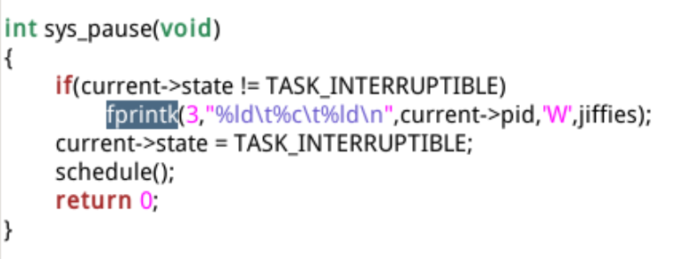

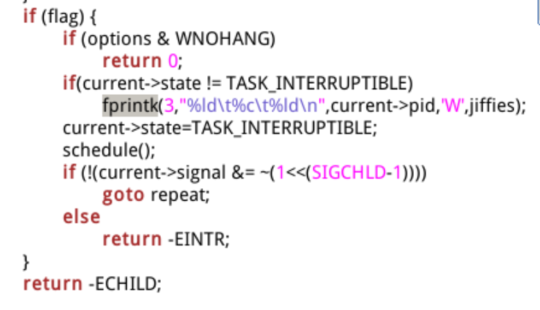

1. ***运行->退出***

在kernel/exit.c文件中的do_exit()函数中，改动如下：

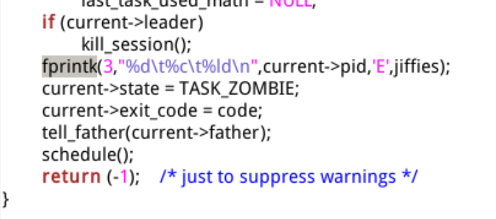

至此记录进程运行轨迹的任务完成。

### 四、进程运行轨迹的跟踪与统计结果

我们尽量在Linux0.11外写好process.c文件(因为Linux0.11装载的vi书写效率很低)，然后在bochs虚拟机装载的Linux根目录文件系统的镜像文件所在目录，通过这个方式我们能进行文件交通信，通过

```shell
sudo ./mount-hdc
```

打开访问权限，然后将process.c文件放入hdc/usr/root/ 文件夹里。

然后输入(目录不要变，不是在hdc里面，而是hdc外一层目录，就是输入第一个指令的目录)

```
sudo umount hdc
```

卸载该文件系统。

在然后在上述目录下运行Linux0.11，并编译运行process.c

```shell
./run //运行Linux0.11
ls  //可以查看/usr/root有没有加入process.c文件
gcc process -o process.c  //编译
./process  //运行
```

我们会看到如下运行结果

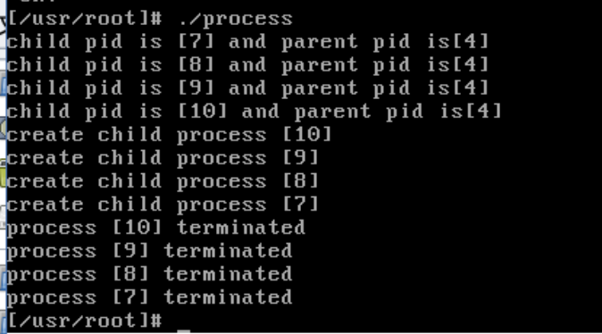

此时process.log文件已经记录好了各进程的运行轨迹，因此我们退出Linux0.11

process.log文件如下：

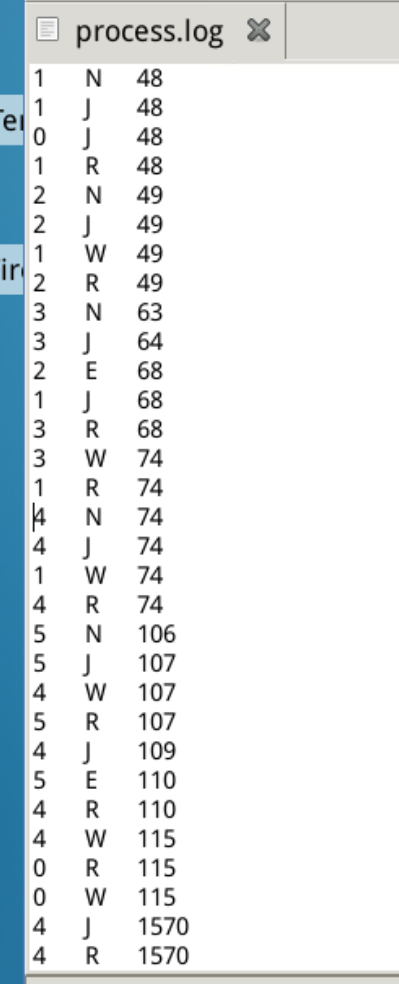

我们通过上面说过的 打开我们bochs虚拟机装载的Linux的文件系统，从/hdc/var中找到process.log文件，拿到我们系统的文件夹中。

因为我们重点不在书写统计结果的代码，所以我们现在利用现有的统计结果的代码直接统计，改代码的逻辑思路就是通过 ID号进行结果分类，再通过jiffies 和状态的关系进行简单的加减运算即可。

统计代码是python写的，名称为stat_log.py，将该文件和process.log日志文件放在一起，从命令行进入该文件夹输入指令

```shell
chmod +x stat_log.py
```

给该文件加上执行权限，在输入如下指令直接执行数据统计

```shell
./stat_log.py process.log
```

得到如下结果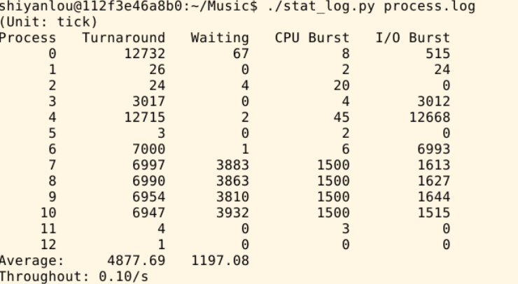

Turnaround 为进程的轮转时间，即进程执行的总时(任务完成时间减去任务开始时间)

waiting 就是进程睡眠时间

CPU Burst为该进程执行指令的用时，I/O Burst为该进程使用I/O设备的用时。

如果遇到

```shell
Error at line xxx:It is a clone of previous line.
```

大概率是某个记录进程状态的添加的语句出现了错误或者少了if判断语句导致重复记录一个进程的状态或状态冲突了。

上述的结果是在时间片设置为15的结果，接下来我们要更改为30，然后再来观察进程运行的时间有何变化。

进程的调度算法是采用的“时间片轮转调度”，每个进程都有一个时间片的时间来执行，也就是时分复用。

在sched.c文件中，调度函数schdule()定义如下

```c
while (1) {
    c = -1; next = 0; i = NR_TASKS; p = &task[NR_TASKS];

// 找到 counter 值最大的就绪态进程
    while (--i) {
        if (!*--p)    continue;
        if ((*p)->state == TASK_RUNNING && (*p)->counter > c)
            c = (*p)->counter, next = i;
    }

// 如果有 counter 值大于 0 的就绪态进程，则退出
    if (c) break;

// 如果没有：
// 所有进程的 counter 值除以 2 衰减后再和 priority 值相加，
// 产生新的时间片
    for(p = &LAST_TASK ; p > &FIRST_TASK ; --p)
          if (*p) (*p)->counter = ((*p)->counter >> 1) + (*p)->priority;
}

// 切换到 next 进程
switch_to(next);
```

我们寻找counter最大的就绪进程进行调度，每个进程的counter会在时钟中断时减1，因此如果我没找不到大于0的就绪态进程，就会执行下列指令

```c
// 如果没有：
// 所有进程的 counter 值除以 2 衰减后再和 priority 值相加，
// 产生新的时间片
    for(p = &LAST_TASK ; p > &FIRST_TASK ; --p)
          if (*p) (*p)->counter = ((*p)->counter >> 1) + (*p)->priority;
}
```

通过将counter从负值缩小两倍，然后加上其优先级，直到获得一个大于0的counter的进程。不过要注意，这里是对所有的进程都执行这样的操作，包括阻塞态，因此阻塞的越久的进程，counter越大，且优先级越高，counter越大。

你可能会想，既然是通过counter来判断调度哪一个处于就绪态的进程，那新建的子进程的counter如何设置呢？

我们查看fork.c文件中的copy_process()函数

```c
// 用来复制父进程的PCB数据信息，包括 priority 和 counter
*p = *current;

// 初始化 counter
p->counter = p->priority;
// 因为父进程的counter数值已发生变化，而 priority 不会，所以上面的第二句代码将p->counter 设置成 p->priority。
// 每个进程的 priority 都是继承自父亲进程的，除非它自己改变优先级。
```

该实验并不涉及更改子进程的priority，因此创建的进程的初始counter都被设置为进程0的priority.

那么我们找到进程0的priority设置的文件，其在include/linux/sched.h中INIT_TASK宏中定义为：

```c
#define INIT_TASK \
    { 0,15,15,
// 上述三个值分别对应 state、counter 和 priority;
```

我们更改如下：将15->30

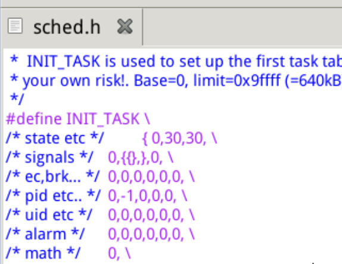

最后再次执行process.c，再次通过stat_log.py文件统计process.log文件，得到如下结果

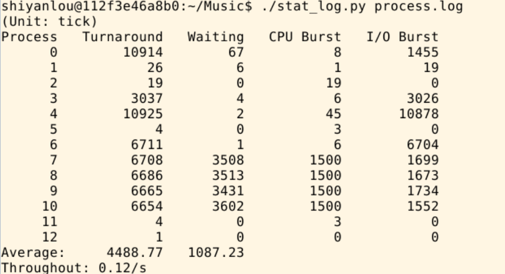

平均的轮转时间和等待时间比15时间片和优先级更短了一些。

先把结论说了：

时间片变小，导致产生进程调度次数变多，从而导致进程等待时间越长

时间片变大，导致进程因中断或睡眠进入的进程调度次数也增加，等待时间也越长

那为什么上面时间片变大了，执行和等待时间变小了呢？

因为在最大和最小之间有个平衡，会是最优的选择，30可能碰巧在这了。说白了就是我的测试用例少了(主要是懒了)。

所以要合理设置时间片的大小，太小太大都会影响CPU效率。

那么单进程和多进程编程最大区别是什么呢？

单进程程序我们写的多了，顺序执行，逻辑单线，在没有其他程序干扰下，数据是同步的。

而多进程程序却在宏观时间看是同时执行的，正因为共享文件，而进程之间的执行顺序没法控制，因此要考虑进程之间的关系和互相影响的情况，要做好数据的异步处理，避免数据污染，进程之间同步，通信，互斥等关系也要在编程时有个清晰的框架。

结束~~！
