# PE文件结构解析


#### PE文件基本概述

PE文件可分为PE头与PE体。DOS头到节区头都是PE头部份，其下节区合称为PE体，并且PE节区紧跟在NT头后。

对于PE文件结构的分析，我们需要明确如下几个概念

**虚拟地址**：内存中使用Virtual Address来表示位置，VA指的是进程虚拟内存的绝对地址。

**相对虚拟地址**：要与虚拟地址区别开来，相对虚拟地址(Relative Virtual Address)指的是从某个基准位置(ImageBase)开始的相对地址。VA与RVA存在一个换算关系

​            							**<center>RVA + ImageBase = VA</center>**

为什么要这样做？这样做有个好处，当PE文件的内部数据都以相对虚拟地址存在的时候，当文件从硬盘加载到内存，若加载出存在了文件，那么该文件就应该进行重定位，如果使用RVA，文件进行重定位后并不影响该文件数据的定位，因为此时只需要根据重定位的定制变更ImageBase就可以正常定位到所有原来的地址。如果是使用VA，当重定位后，每个地址都需要一起改变，否则就会定位失败，读取不到正确的信息。

**映像(Image)**：PE文件加载到内存时，文件不会全部加载，而是根据节区头起始地址、节区大小等属性值来加载。因此内存和磁盘中的PE具有不同的形态。把加载到内存的形态称为映像加以区别。

**节**：节是PE文件中代码或数据的基本单位。可分为三个大类，代码(.text)、数据(.data)、资源(.src)节。

**最小基本单位**：我们知道内存中的数据存放时是按照最小基本单位的倍数进行放入，也就是**段**、**页**的概念，如果数据被按照这样存入内存，当数据的大小不能刚好填充满最小基本单位的倍数时，就会用NULL填充，因此在PE头与各节区的尾部都存在一个区域，称为**NULL填充**。最小基本单位是为了提高处理文件、内存、网络包的效率。具体可以自行去了解。

各节区头定义了各节区在文件或内存中的大小、位置、属性等。

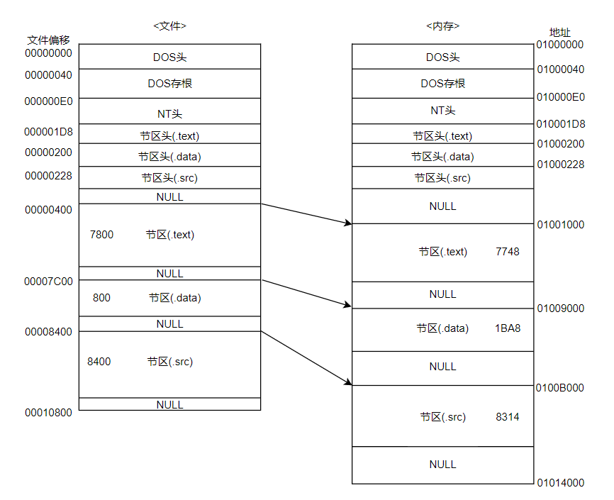


***需特别说明，在Intel的CPU以小端序保存数据，即高位字节保存在高位地址***

#### DOS头

DOS头存在的目的是为了让PE文件兼容DOS文件。

DOS头为一个名为IMAGE_DOS_HEADER的结构体，用来扩展已有的DOS EXE头

该结构体总共64字节，成员有19个，

```c
（最左边是文件头的偏移量。） 
IMAGE_DOS_HEADER STRUCT 
{ 
+0h WORD  e_magic    //  MZ(4Dh 5Ah)   DOS可执行文件标记 
+2h WORD  e_cblp      
+4h WORD  e_cp             
+6h WORD  e_crlc           
+8h WORD  e_cparhdr   
+0ah  WORD  e_minalloc    
+0ch  WORD  e_maxalloc 
+0eh  WORD  e_ss      
+10h  WORD  e_sp    
+12h  WORD  e_csum   
+14h  WORD  e_ip    
+16h  WORD  e_cs    
+18h  WORD  e_lfarlc    
+1ah  WORD  e_ovno     
+1ch  WORD  e_res[4]    
+24h  WORD  e_oemid     
+26h  WORD  e_oeminfo  
+29h  WORD  e_res2[10] 
+3ch  DWORD  e_lfanew   ``// RVA   指向PE文件头 
} IMAGE_DOS_HEADER ENDS
```

但我们只需要了解两个成员即可。

分别是

**e_magic**：DOS签名(DOS signature：4D5A=>ASCII值"MZ")，固定为MZ，MZ为MS-DOS的设计者Mark Zbikowski的缩写

**e_lfanew**：指示NT头的偏移，不同文件值可能不同。

其余的参数都是在MS-DOS下运行改成需要用的到。

e_lfanew的偏移为0x3C，第60个字节，我们可以看到其保存了一个地址E0，而这个地址就是PE文件的开始的位置，并且这个地址的数据默认为"PE00"，我们后面会进行更详细讲解。

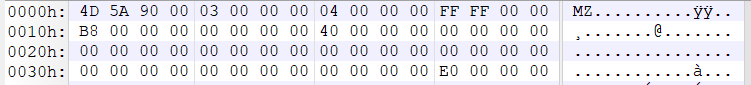

#### DOS存根

在DOS头后面紧接着就是MS-DOS程序。被称为DOS存根，是可选项，即有没有DOS存根程序都可以运行，并且其大小不固定。

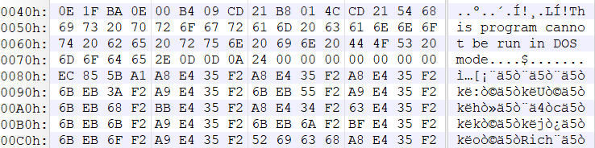

40-4D区域为16位的汇编指令，一个可执行文件在Windows中由于被识别为PE文件，所以DOS存根的代码不被执行；在DOS环境下运行即可执行该代码。该段汇编代码就是输出"This program cannot be run in DOS mode（此程序不能在DOS模式下运行）”这条消息，然后终止程序。

我们可以通过对DOS存根的修改，在EXE文件中创造出另一个文件，使它能在DOS和Windows都能运行，但分别运行的是16位DOS代码，32或64位window代码

**若希望程序尽可能小，可以把DOS存根删除。**

#### NT头

DOS存根后紧接着NT头

NT头为一个IMAGE_NT_HEADERS结构体，大小为F8

```c
IMAGE_NT_HEADERS STRUCT 
{
   DWORD  Signature 
   IMAGE_FILE_HEADER  FileHeader //偏移0x04
   IMAGE_OPTIONAL_HEADER32  OptionalHeader  //偏移0x18
} IMAGE_NT_HEADERS ENDS
```

Signature成员被设置为4550=>ASCII码为"PE00"，Signature的地址也即NT头开始的地址，在DOS头的e_lfanew中表明了。

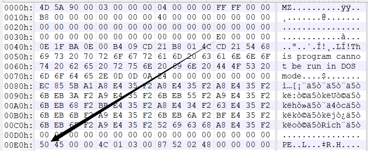

另外两个成员分别是文件头与可选头

##### NT头：文件头

```c
struct IMAGE_FILE_HEADER
{
  WORD Machine; //运行平台
  WORD NumberOfSections; //区块表的个数
  DWORD TimeDataStamp;//文件创建时间，是从1970年至今的秒数
  DWORD PointerToSymbolicTable;//指向符号表的指针
  DWORD NumberOfSymbols;//符号表的数目
  WORD SizeOfOptionalHeader;//IMAGE_NT_HEADERS结构中OptionHeader成员的大小，对于win32平台这个值通常是0x00e0
  WORD Characteristics;//文件的属性值 偏移为0x12
}
```

1. **Mechine** 成员是根据每个CPU拥有的唯一的Machine码进行填写，在winnt.h文件中定义了每个CPU对应的Machine码

2. **NumberOfSection** 为节区的数量，该值一定要大于0，并且如果与实际的节区数量不同会产生错误，Windows加载器限制的节的数量最大为96
3. **TimeDateStamp** 用于说明该文件被创建的时间
4. **PointerToSymbolicTable** 已经被废除
5. **SizeOfOptionalHeader** 值用来指出为可选头IMAGE_OPTIONAL_HEADER32结构体的长度，但结构体设置的时候大小已经固定，这样做的原因是Windows的PE装载器需要查看该成员的值，从而识别出IMAGE_OPTIONAL_HEADER32结构体的大小，并且PE32+使用的IMAGE_OPTIONAL_HEADER64大小与PE32的IMAGE_OPTIONAL_HEADER32不同，需要用该成员变量的值进行指示说明。对于32位来说其值是224字节，对于64位来说是240字节。
6. **Characteristics** 用来标识文件的属性，即文件是否是可运行状态，是否为DLL文件等信息，通过BIT OR进行组合。需要特别记住0002h和2000h两个值，分别代表文件是可执行的，文件是DLL类型

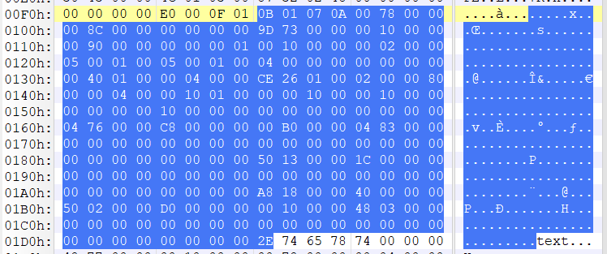

前四个字节为Signature，文件头从E5开始F8结束。我们一对一的进行分析

1. Machine码的值为0x014C，查看宏定义，其代表的是Intel386或后继CPU及其兼容的CPU

2. NumberOfSection为0x0003，节区数量为3，我们用PE编辑器查看，节区数量确实为3

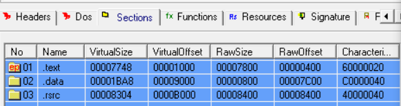

3. TimeDataTemp为0x48025287

4. 后面全为0的8个字节分别是PointerToSymbolTable**，**NumberOfSymbols

5. SizeOfOptionalHeader的值为0x00E0，十进制为224。

6. Characteristics为0x010F，该值为IMAGE_FILE_RELOCS_STRIPPED | IMAGE_FILE_EXECUTABLE_IMAGE | IMAGE_FILE_LINE_NUMS_STRIPPED | IMAGE_FILE_LOCAL_SYMS_STRIPPED | IMAGE_FILE_32BIT_MACHINE宏定义的值相或得到的结果

##### NT头：可选头

```c
typedef struct _IMAGE_DATA_DIRECTORY{
	DWORD VirtualAddress;
	DWORD Size;
} IMAGE_DATA_DIRECTIORY, *PIMAGE_DATA_DIRECTORY;

#define IMAGE_NUMBEROF_DIRECTORY_ENTRIES 16
```

```c
typedef struct _IMAGE_OPTIONAL_HEADER
{
  //
  // Standard fields. 
  //
  WORD  Magic;          // 标志字, ROM 映像（0107h）,普通可执行文件（010Bh）
  BYTE  MajorLinkerVersion;   // 链接程序的主版本号
  BYTE  MinorLinkerVersion;   // 链接程序的次版本号
  DWORD  SizeOfCode;       // 所有含代码的节的总大小
  DWORD  SizeOfInitializedData;  // 所有含已初始化数据的节的总大小
  DWORD  SizeOfUninitializedData; // 所有含未初始化数据的节的大小
  DWORD  AddressOfEntryPoint;   // 程序执行入口RVA
  DWORD  BaseOfCode;       // 代码的区块的起始RVA
  DWORD  BaseOfData;       // 数据的区块的起始RVA
  
   //NT additional fields.  以下是属于NT结构增加的领域。
 
  DWORD  ImageBase;        // 程序的首选装载地址
  DWORD  SectionAlignment;    // 内存中的区块的对齐大小
  DWORD  FileAlignment;      // 文件中的区块的对齐大小
  WORD  MajorOperatingSystemVersion; // 要求操作系统最低版本号的主版本号
  WORD  MinorOperatingSystemVersion; // 要求操作系统最低版本号的副版本号
  WORD  MajorImageVersion;    // 可运行于操作系统的主版本号
  WORD  MinorImageVersion;    // 可运行于操作系统的次版本号
  WORD  MajorSubsystemVersion;  // 要求最低子系统版本的主版本号
  WORD  MinorSubsystemVersion;  // 要求最低子系统版本的次版本号
  DWORD  Win32VersionValue;    // 莫须有字段，不被病毒利用的话一般为0
  DWORD  SizeOfImage;       // 映像装入内存后的总尺寸
  DWORD  SizeOfHeaders;      // 所有头 + 区块表的尺寸大小
  DWORD  CheckSum;        // 映像的校检和
  WORD  Subsystem;        // 可执行文件期望的子系统
  WORD  DllCharacteristics;  // DllMain()函数何时被调用，默认为 0
  DWORD  SizeOfStackReserve;   // 初始化时的栈大小
  DWORD  SizeOfStackCommit;    // 初始化时实际提交的栈大小
  DWORD  SizeOfHeapReserve;    // 初始化时保留的堆大小
  DWORD  SizeOfHeapCommit;    // 初始化时实际提交的堆大小
  DWORD  LoaderFlags;       // 与调试有关，默认为 0 
  DWORD  NumberOfRvaAndSizes;   // 下边数据目录的项数，这个字段自Windows NT 发布以来一直是16，到这个成员共偏移0x5c
  IMAGE_DATA_DIRECTORY DataDirectory[IMAGE_NUMBEROF_DIRECTORY_ENTRIES];  
// 数据目录表
} IMAGE_OPTIONAL_HEADER32, *PIMAGE_OPTIONAL_HEADER32;
```

在IMAGE_OPTIONAL_HEADER32结构体中，需要特别注意下面的成员

1. **Magic** 可执行文件得可选头结构体为IMAGE_OPTIONAL_HEADER32结构体的时候是10B，为IMAGE_OPIONAL_HEADER64结构体的时候为20B。ROM镜像就把B改为7.

2. **AddressOfEntryPoint** 持有程序入口点(EntryPoint)的RVA值，用来指出程序最先执行的代码的起始地址。为0的时候就从ImageBase地址执行。对于DLL文件来说是可选的

3. **ImageBase** 用来指出文件优先装入的地址，即程序装入内存后的第一个字节的首选地址，必须为64K的倍数。DLL默认为10000000H，EXE默认为00400000H。当文件载入内存后，EIP寄存器会设置为ImageBase+AddressOfEntryPoint

4. **SectionAlignment，FileAlignment** 其中的FileAlignment指定了节区在磁盘文件中的最小单位，值应该为200h到10000h之间的2的幂；而SectionAlignment指定了节区在内存中的最小单位，其必须大于等于FileAlignment的值。一个文件中SectionAlignment和FileAlignment的值可能相同也可能不相同。这两个量的值与之前说过的内存中最小基本单元的概念相同，节区在文件和内存所占的空间必须为FileAlignment和SectionAlignment的整数倍

5. **SizeOfImage** 当PE文件被加载到内存中的时候，加载的文件大小与整个文件的大小不同，该值就指定了Image在虚拟内存所占的大小，必须为SectionAlignment的倍数。

6. **SizeOfHeaders** 用来指出整个PE头的大小，该值必须是FileAlignment大小的整数倍。第一个节区相对该文件开始的地址的偏移量就是这个值的大小。向上舍入为FileAlignment的整数倍。PE头大小的计算方式为 

   ```c
   SizeOfHeaders = [e_lfanew /*DOS头部*/ + 4 /*PE签名*/ + sizeof(IMAGE_FILE_HEADER) + SizeOfOptionalHeader /*NT头*/ + sizeof(IMAGE_SECTION_HEADER) * NumberOfSections /*节区头的大小*/]/ FileAlignment * FileAlignment + FileAlignment;
   ```

7. **Subsystem** 该值用来区分系统驱动文件(\*.sys)和普通可执行文件(\*.exe)。值为1代表系统驱动(Drive)文件，2代表窗口应用程序GUI文件，3代表控制台应用程序CUI文件

8. **NumberOfRvaAndSizes** 用来指定DataDirectory数组的长度，翻看前面的结构体定义我们会发现DataDirectory的长度是用了一个宏IMAGE_NUMBER_DIRECTORY_ENTRIES来定义的，长度为16。但这个值同样也用来指定DataDirectory的长度，不会冲突吗？PE装载器是通过该值来识别数组的大小，因此DataDirectory的长度可以不是16

9. **DataDirectory** 是IMAGE_DATA_DIRECTORY结构体组成的数组，也就是结构体数组，其结构体的定义也在该节开始处给出了。

```c
DataDirectory[0] = EXPORT Directory //导出表的地址和大小
DataDirectory[1] = IMPORT Directory //导入表的地址和大小
DataDirectory[2] = RESOURCE Directory //资源表的地址和大小
DataDirectory[3] = EXCEPTION Directory	//异常表的地址和大小
DataDirectory[4] = SECURITY Directory //证书表的地址和大小
DataDirectory[5] = BASERELOC Directory //基址重定位表的地址和大小
DataDirectory[6] = DEBUG Directory //调试信息的起始地址和大小
DataDirectory[7] = COPYRIGHT Directory //特定于体系结构数据的地址和大小
DataDirectory[8] = GLOBALPTR Directory //全局指针寄存器相对虚拟地址
DataDirectory[9] = TLS Directory 	//(线程本地存储)TLS表的地址和大小
DataDirectory[A] = LOAD_CONFIG Directory //加载配置表地址和大小
DataDirectory[B] = BOUND_IMPORT Directory //绑定导入表的地址和大小
DataDirectory[C] = IAT Directory //导入地址表的地址和大小
DataDirectory[D] = DELAY_IMPORT Directory //延迟导入表的地址和大小
DataDirectory[E] = COM_DESCRIPTOR Directory //CLR运行时头部数据地址和大小
DataDirectory[F] = Reserved Directory //保留
```

其中最重要的是EXPORT和IMPORT Directory，前者是存放了EDT 导出目录表的虚拟地址和大小，从该文件导出的函数；后者是存放IDT导入目录表的虚拟地址和大小，从其余文件导入的函数。


上图是可选头的数据，总共0xE0的大小，我们对上面提到的几个较为重要的值进行分析

最开始的两个字节0x010B就是Magic的值，

1. AddressOfEntryPoint从108h处开始到10Bh总共4个字节，为0x739D，即该程序的入口地址的虚拟地址为0x0000739D

2. ImageBase从114h开始到117h，值为0x01000000。

3. SectionAlignment从118h到11Bh，值为0x00001000，所以节区在内存存放时要按照1000的倍数进行对齐存储

4. FileAlignment从11Ch到11Fh，值为0x000002000，所以节区在磁盘存放时要按照200的倍数进行对齐

5. SizeOfImage从130h到133h，值为0x00014000，当文件加载到内存后的总体大小，14000h也为1000h(SectionAlignment)的整数倍

6. SizeOfHeaders 从134h到137h，值为0x00000400，即PE头的大小

7. NumberOfDirectories 从154h到157h，值为0x00000010，是十六进制，换成十进制就为16

后面每八个字节就是DataDirectory数组的一个元素，前四个字节为相应的Directory的虚拟地址，后四个为该Directory的大小。在这里EXPORT Directory的虚拟地址从158h到15Bh，全为0；其size从15Ch到15Fh，为0。IMPORT Directory的虚拟地址从160h到163h，为0x00007604，size从164h到167h，为0x000000C8.

#### 节区头

定义节区头的结构体为IMAGE_SECTION_HEADER，包括了对应节的具体位置、长度、属性信息。总共0x24大小

```c
#define IMAGE_SIZEOF_SHORT_NAME     8
typedef struct _IMAGE_SECTION_HEADER 
{
    BYTE Name[IMAGE_SIZEOF_SHORT_NAME]; // 节表名称,如“.text”
    //IMAGE_SIZEOF_SHORT_NAME=8
    union
     {
        DWORD PhysicalAddress;  // 物理地址
        DWORD VirtualSize;     // 真实长度，这两个值是一个联合结构，可以使用其中的任何一个，一般是取后一个
    } Misc; //偏移0x08
    DWORD VirtualAddress;        // 节区的 RVA 地址    
    DWORD SizeOfRawData;        // 在文件中对齐后的尺寸   
    DWORD PointerToRawData;       // 在文件中的偏移量    
    DWORD PointerToRelocations;     // 在OBJ文件中使用，重定位的偏移 
    DWORD PointerToLinenumbers;     // 行号表的偏移（供调试使用地)
    WORD NumberOfRelocations;      // 在OBJ文件中使用，重定位项数目
    WORD NumberOfLinenumbers;      // 行号表中行号的数目
    DWORD Characteristics;       // 节属性如可读，可写，可执行等 偏移0x24
} IMAGE_SECTION_HEADER, *PIMAGE_SECTION_HEADER;
```

1. **Name** 是一个8字节的ASCII字符串，但并没有"必须用ASCII值"的限制，并且没有规范明确的节区name，因此Name成员不能保证其百分百就用作某种信息，.code名的也可能是数据节区。如果字符串不足8字节用0x00填充，且并不遵守必须以"\0"进行结尾，如果不是"\0"结尾，则会截取8个字节的长度进行处理。可执行文件不支持长度超过8字节的节名。对于支持超过字节长度的文件来说，此成员会包含斜杠"/"，并在后面跟随一个用ASCII表示的十进制数，该数字是字符串表的偏移量。
2. **Misc.VirtualSize** 这个成员指定了该节区装入内存后的总大小，如果该值大于SizeOfRawData的值，那么大出的部分用0x00进行填充。这个成员只对可执行文件有效，如果是OBJ文件，此成员为0.
3. **VirtualAddress** 指定了该节区装入内存虚拟空间后的节区起始地址，这个地址是一个相对虚拟地址，一般为SectionAlignment的整数倍。他加上ImageBase才是真正的虚拟地址
4. **SizeOfRawData** 指定了该节区在硬盘上初始化数据的大小，必须是FileAlignment的整数倍，如果该部分仅包含未初始化的数据，那么这个值为0
5. **PointerToRawData** 指出该节区在硬盘文件中的地址，这个数值从文件开始算起的偏移量，也就是这个地址是一个文件偏移地址，磁盘文件中节区的起始位置，必须是FileAlignment的整数倍，如果包含未初始化的数据，该成员为0
6. **Characteristics** 指出该节区的属性特征，不同的数据位代表不同属性，多个属性通过bit OR进行组合

节区头紧跟在NT头后，可以理解为就是一个IMAGE_SECTION_HEADER的结构体数组，成员个数就被定义在IMAGE_FILE_HEADER中的NumberOfSection成员上，需要注意的是在最后一个节区头后最好应该有一个与节表同样大小的用0x00填充的空白数据。

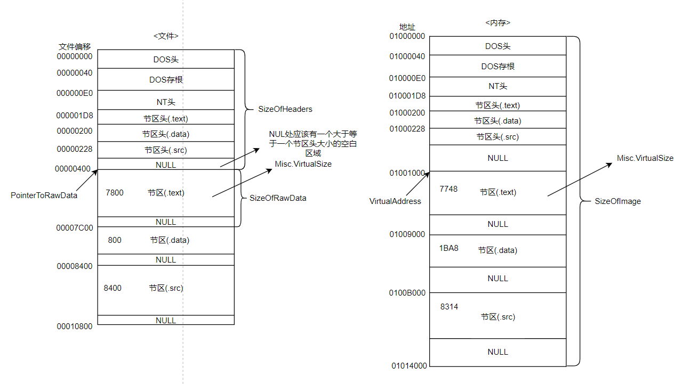

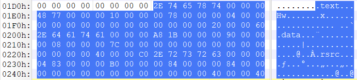

拿一个节区进行说明，

1. 0x2E74657874000000=>ASCII=".text"，为什么这里不是小端序的表示方式。因为数组在内存中是连续的，无论大端序还是小端序，存储顺序都相同

2. 0x00007748为VirtualSize为内存中节区的大小，0x00001000为该节区在内存的起始相对虚拟地址

3. 0x00007800 为SizeOfRawData，为节区在磁盘的大小，0x00000400为节区在磁盘的起始地址，是相对文件起始地址的偏移地址

4. 在1FCh，0x60000020为Characteristics成员的值，是由IMAGE_SCN_CNT_CODE | IMAGE_SCN_MEM_EXECUTE | IMAGE_SCN_MEM_READ bitOR得到的

#### RVA to RAW


我们看到，当PE文件从磁盘加载到内存中会发生的变换。

因此我们需要学习节区是如何完成内存地址与文件偏移间的映射换算，根据公式：

​    **<center>RAW - PointerToRawData = RVA - VirtualAddress</center>**

​	 **<center>RAW = RVA - VirtualAddress + PointerToRawData</center>**

其中PointerToRawData 与 VirtualAddress 为节区头结构体中的成员

举个例子：当RVA=ABA8时，File Offset = ？

```
1. 首先查找RVA ABA8位于的节区，这里位于节区.data
2. 根据公式换算 RAW = ABA8(RVA) - 9000(VA) + 7C00(PointerToRawData) = 97A8
```

观察发现，ABA8在第二个节区，而97A8在第三个节区。这种就属于"无法定义与RVA相对应的RAW值"。**这种情况是因为.data节区的VirtualSize值要比SizeOfRawData值大**。

#### IAT

IAT(Import Address Table) 导入地址表，此部分是PE头非常困难也是非常重要的知识点

##### DLL

DLL(Dynamic Link Library)动态链接库，其是为了解决不同程序使用相同库而需要重复加载库的冗余操作，可以避免严重的内存和磁盘浪费。

DLL的概念描述：

1. 不要把库包含到程序中，单独组成DLL文件，需要时调用
2. 内存映射技术使加载后的DLL代码、资源在多个进程中实现共享
3. 更新库时只要替换相关的DLL文件即可，简单易行

加载DLL的方式有两种：第一种是"显式链接"，程序使用DLL时加载，使用完毕后释放内存。第二种时"隐式链接"，程序开始时即一同加载DLL，程序终止时再释放占用内存。

##### IMAGE_IMPORT_DESCRIPTOR

IMAGE_IMPORT_DESCRIPTOR导入表的结构体定义如下：

```c
typedef struct _IMAGE_IMPORT_DESCRIPTOR {
  union {
    DWORD  Characteristics;
    DWORD  OriginalFirstThunk;       //导入名称表(INT)的RVA地址
  } DUMMYUNIONNAME;
  DWORD  TimeDateStamp;           //时间戳多数情况可忽略 如果是0xFFFFFFFF表示IAT表被绑定为函数地址
  DWORD  ForwarderChain;
  DWORD  Name;                //导入DLL文件名的RVA地址
  DWORD  FirstThunk;             //导入地址表(IAT)的RVA地址
} IMAGE_IMPORT_DESCRIPTOR;
typedef IMAGE_IMPORT_DESCRIPTOR UNALIGNED *PIMAGE_IMPORT_DESCRIPTOR;
```

```c
typedef struct _IMAGE_THUNK_DATA32 {
  union {
    DWORD ForwarderString;   //PBYTE
    DWORD Function;       //PDWORD
    DWORD Ordinal;
    DWORD AddressOfData;    //PIMAGE_IMPORT_BY_NAME
  } u1;
} IMAGE_THUNK_DATA32;
typedef IMAGE_THUNK_DATA32 *PIMAGE_THUNK_DATA32;
//注：这个结构体是联合类型的，每一个成员都是4字节，所以为了编程方便，完全可以用一个4字节的数组取代它。
```

```c
typedef struct _IMAGE_IMPORT_BY_NAME {
  WORD  Hint;
  CHAR  Name[1];
} IMAGE_IMPORT_BY_NAME, *PIMAGE_IMPORT_BY_NAME;
//注：这个结构体由两个成员组成，大致一看它的大小是3个字节，其实它的大小是不固定的，
//因为无法判断函数名的长度，所以最后一个成员是一个以0结尾的字符串。
```

PE文件使用来自其他DLL的代码或者数据，称为导入。当PE文件装入时，PE装载器的工作之一就是定位所有被导入的函数和数据，并且让正在被装载的文件可以使用这些地址。这个过程就是通过PE文件的导入表来完成。

导入表保存的是函数名和其驻留的DLL名等动态链接所需的信息

1. **OriginalFirstThunk** 是一个4字节的RVA地址，指向导入名称表(INT)，INT是一个IMAGE_THUNK_DATA结构体数组，这个结构体最后一个成员内容为NULL时数组结束。数组的每一个结构体成员又指向了一个IMAGE_IMPORT_BY_NAME结构体，这个结构体包含两个成员函数序号和函数名，这个序号一般没什么用，有的编译器会把其置0，函数名可以当作一个以0结尾的字符串。(INT表地址不在DataDirectory中)

2. **Name** DLL名字的指针，是一个RVA地址，因为是DLL文件名字这个字符串的地址，因此这个地址指向了一个以0结尾的ASCII字符串
3. **FirstThunk** 是4字节RVA地址，指向了导入地址表(IAT)，这个IAT和INT也是一个IMAGE_THUNK_dATA结构体数组，不过它在程序载入前和载入后有两种状态，在程序载入前它的结构和内容和INT表一样，但却是两个不同的表，指向了IMAGE_IMPORT_BY_NAME结构体。在程序载入后，它的结构和INT表一样，但内容不同了，里面存放的都是导入函数的地址 。(IAT表地址在DataDirectory中) 

IAT提供的机制与隐式链接有关

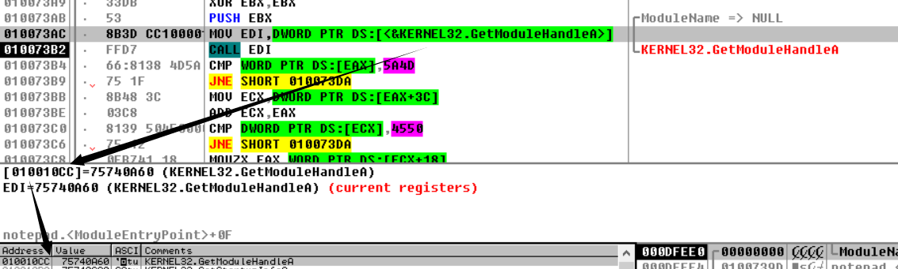

GetModuleHandle函数位于KERNEL32.dll中，我们可以看到010073AC地址的这一指令**MOV EDI,DWORD PTD DS:[<&KERNEL32.GetModuleHandleA>]**，后面接着CALL EDI里的数据，也就是函数地址。

这两句指令就是获取GetModuleHandleA函数的地址，然后调用它。可以看到EDI保存的是75740A60这个地址，这个地址保存在010010CC处，这里获取函数地址是通过读取该函数的地址所存放的地址，也就是读取IAT表中，存放的该函数的地址。为什么要这么绕一圈，而不是直接读取呢？

这是因为不同系统上、不同版本的KERNERL32.dll，其里面的函数的地址都可能会发生变化，因此每次加载DLL时通过将函数地址写入固定的地址，就可以避免函数地址不同导致的错误。

DLL重定位也是造成这一问题的原因，如果两个DLL的ImageBase都相同，当一个DLL先把该地址占用了，第二个DLL加载的时候就需要移动到其他的空闲内存空间。因此如果直接读取DLL函数地址，当DLL发生重定位后，函数地址就会改变。

还有一个原因就是PE头中表示地址的时候使用的时RVA而不是VA

综上三个原因，最大的问题就是硬编码无法保证能读取到正确的不断变化的函数地址，因此需要额外的不会变化的内存空间来保存函数地址。

从上面我们操作可以看出，被调用的函数的地址所存放的地址就位于IAT数组的地址上，因此**加载后的IAT数组存放的是函数的地址**。

**EXE文件载入后**对应的导入表结构图

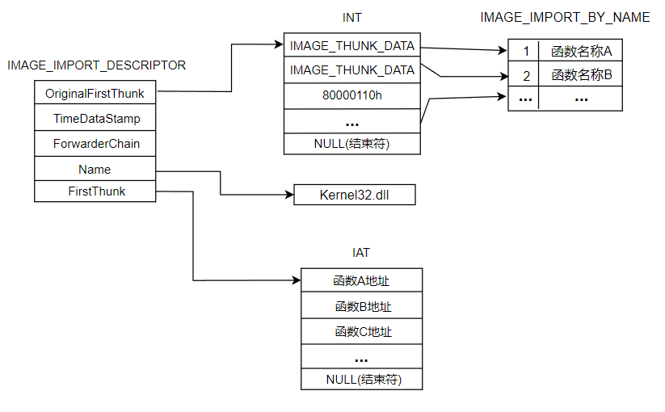

书上提到"**INT中个元素的值为IMAGE_IMPORT_BY_NAME结构体指针(有时IAT也拥有相同值)**"，网上资料和书上给的**EXE文件载入前**对应的导入表结构图如下图

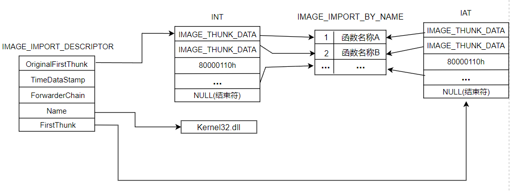

但我实际上用十六进制编辑器查看一个IMAGE_IMPORT_DESCRIPTOR的IAT和INT数组内容时，两者其实是不一样的。这部分我比较**迷惑**，**IAT在加载前是不一定和INT一样都指向IMAGE_IMPORT_BY_NAME结构体数组吗**，**如果有错误还望得到指正**

首先通过DataDirectory找到Import Directory的地址，在前面对可选头学习的时候已经提到了，此处为00007604，这个为RVA地址，但是我们查看的是PE文件载入前的数据，因此需要从RVA换算成为RAW地址，7604 - 1000 + 400 = 6A04，6A04便是IMAGE_IMPORT_DESCRIPTOR结构体数组在磁盘中的起始位置，根据DataDirectory结构体中的Import Directory的Size数据可知，导入表的大小为C8，因此导入表的数据如下

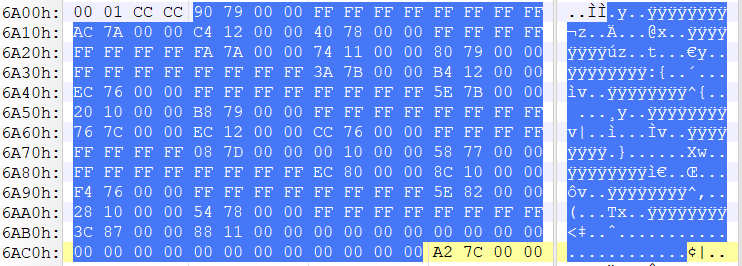

其中6A04h - 6417h为IMAGE_IMPORT_DESCRIPTOR结构体数组的第一个元素的数据，各个成员的值如下

| 文件偏移 | 成员                    | RVA      | RAW      |
| -------- | ----------------------- | -------- | -------- |
| 6A04     | OriginalFirstThunk(INT) | 00007990 | 00006D90 |
| 6A10     | Name                    | 00007AAC | 00006EAC |
| 6A14     | FirstThunk(IAT)         | 000012C4 | 000006C4 |

通过十六进制编辑器查看6D90和6C4的内容如下

INT(RAW = 6D90)

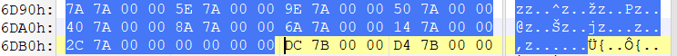

IAT(RAW = 6C4)

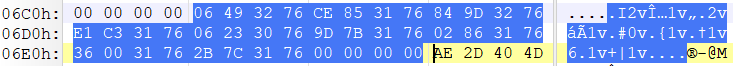

两者的值并不相同。

我们再通过Ollydbg，直接查看IAT数据，以如下图的函数为例


我们在十六进制编辑器查看RAW = (010010CC - 01000000 - 1000 +400) = 4CCh的数据

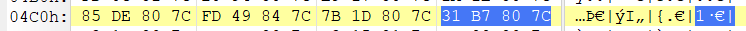

可以发现4CCh处的数据为7C80B731，与ollydbg的不同。

**我考虑到是不是这个用来练习的EXE文件有问题，于是换了一个EXE文件进行查看**

与之前同样的步骤，先从DataDirectory的获取IMPORT Directory的地址，在获得一个IMAGE_IMPORT_DESCRIPTOR结构体信息，这里就直接略过。

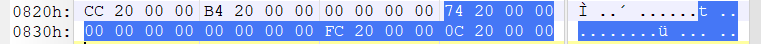

其中INT的RVA为2074，转化为RAW为874。IAT的RVA为200C，转化为RAW为80C

INT(RAW = 874)

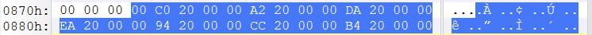

IAT(RAW = 80C)

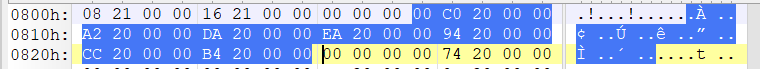

**从这个EXE文件可以看到INT与IAT数据和长度相同，都指向了IMAGE_IMPORT_BY_NAME结构数组。**

#### EAT

EAT是一种核心机制，可以使不同的应用程序可以调用库文件中提供的函数。也就是说，只有通过EAT才能准确求得相应库中导出函数的起始地址。

PE文件中有且仅有一个用来说明EAT的IMAGE_EXPORT_DIRECTORY结构体。用来说明IAT的IMAGE_IMPORT_DESCRIPTOR结构体以数组形式存在，且拥有多个成员。是因为PE文件可以导入多个库

##### IMAGE_EXPORT_DIRECTORY

```c
typedef struct _IMAGE_EXPORT_DIRECTORY {
  DWORD  Characteristics;    // 未使用，总为0
  DWORD  TimeDateStamp;    // 文件创建时间戳
  WORD  MajorVersion;      //未使用，总为0
  WORD  MinorVersion;     // 未使用，总为0
  DWORD  Name;           //重要  指向一个代表此 DLL名字的 ASCII字符串的 RVA
  DWORD  Base;         // 重要  函数的起始序号
  DWORD  NumberOfFunctions;  // 重要  导出函数地址表的个数
  DWORD  NumberOfNames;    // 重要  以函数名字导出的函数个数
  DWORD  AddressOfFunctions;   // 重要  导出函数地址表RVA
  DWORD  AddressOfNames;      //重要  导出函数名称表RVA
  DWORD  AddressOfNameOrdinals;  //重要  导出函数序号表RVA
} IMAGE_EXPORT_DIRECTORY, //PIMAGE_EXPORT_DIRECTORY;
```

前四个成员基本没有用，我们需要特别关注后面的成员。

导出函数就是将功能提供给外部使用的函数，如果一个PE文件导出了函数，那么这个函数的信息就会记录在PE文件的导出表中，方便外部程序加载该文件进行动态调用。

有时函数在导出表中只有一个序号而没有名字，也就造成了导出表中有了三个字表的存在，分别是**导出地址表、导出函数名称表、导出函数序号表**，这样外部就可以通过函数名称和函数序号两种方式获取该函数的地址

1. **AddressOfFunctions** 4字节的RVA地址，可以用来定位导出表所有函数的地址表，这个地址表可以当作一个成员宽度为4的数组进行处理，长度由NumberOfFunctions进行限定，地址表中的成员也是一个RVA地址
2. **AddressOfNames** 4字节RVA地址，可以用来定位导出表中所有函数的名称表，可以用来当作成员宽度为4的数组进行处理，长度由NumberOfFunctions进行限定，在FileBuffer状态下需要进行RVA到RAW的转换才能真正找到函数名称
3. **AddressOfNameOrdinals** 这个值是一个4字节的RVA地址，他可以用来定位导出表中所有函数的序号表，这个序号表可以当作一个成员宽度为2的数组进行处理，它的长度由NumberOfNames进行限定，名称序号表的成员是一个函数序号，该序号用于通过名称获取函数地址。
4. **NumberOfFunctions** 这个值并不是真的函数数量，而是通过函数序号表中最大的序号减去最小的序号再加上1得到的，例如，一共导出3个函数，序号分别是：0、2、4，NumberOfFuctions = 4 - 0 + 1 = 5

**通过导出表查找函数地址的两种方法：**

1. **通过函数名查找函数地址：**

   1. 首先定位函数名表，然后通过函数名表中的RVA地址定位函数名，通过比对函数名获取目标函数名在函数名表中的索引
   2. 通过获取函数名表的索引获取函数序号表中对应索引中的数组元素，也就是函数序号
   3. 通过把该序号当作函数地址表的下标，就可以获得下表中的函数地址。

   详细过程如下图

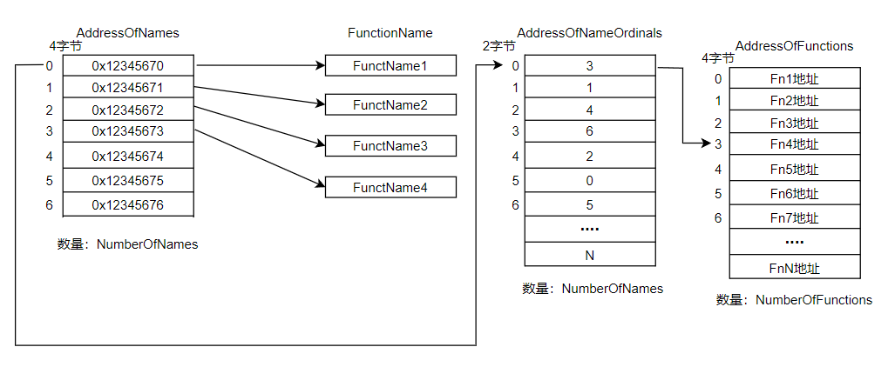

2. **通过函数序号查找函数地址**

   1. 首先计算函数地址表的索引：idx = 目标函数的函数序号 - 导出表的Base(结构体的一个成员)
   2. 通过计算出的索引就可以在函数地址表中获取到目标序号的函数地址。

   此方法不需要使用函数名称表和函数序号表就可以直接获取函数地址。

   过程如下图

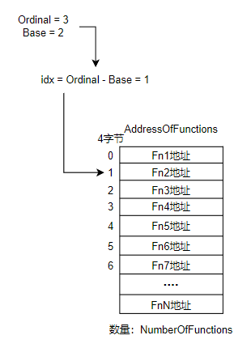

我们通过例子来熟悉导出表查找函数的过程

1. **查找函数名称表**

首先需要查到EXPORT Directory的RVA，然后转化成RAW。这一步就查看DataDirectory即可。跳过，得到的IMAGE_EXPORT_DIRECTORY的结构体数据如下

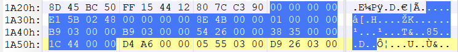

2. **查找函数名称并获得其在函数名称表的索引**

NumberOfNames为 3B9，AddressOfNames 成员值为 RVA = 3538，RAW = 2938，查看该地址

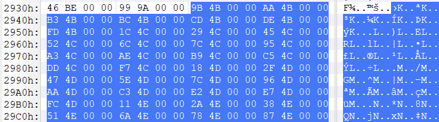

选择RVA = 4BBC => RAW = 3FBD的数据进行查看，

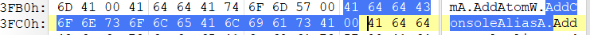

即为AddConsoleAliasA这个库函数的名称，其在函数名称表里索引为2.

3. **查看函数名称序号表**

再将索引作为函数名称序号表的索引，并获取这个索引下数组的内容，这里AddressOfNameOrdinals 的 RVA 为441C => RAW 为381C，查看函数名称索引表内容如下

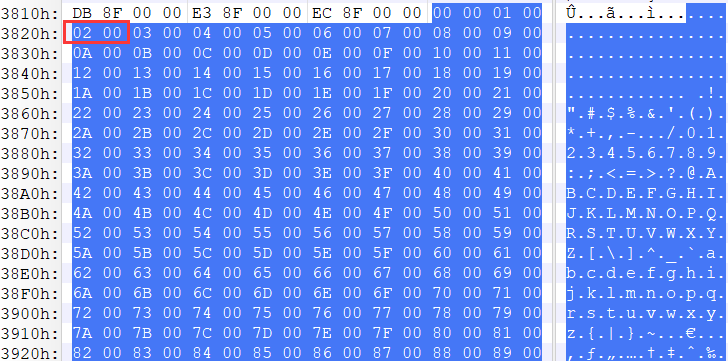

因为索引为2，因此在函数名称序号表读取数组第三个元素的值，为02 

4. **通过函数地址表查找计算实际虚拟地址**

AddressOfFunctions成员的值为RVA = 2654 => RAW = 1A54，查看该地址数据如下

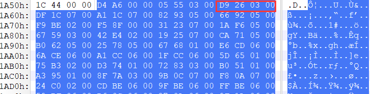

获取的函数序号为02，查找函数地址表的第三个数组内容，RVA = 000326D9 

我们通过查看Kernel32.dll的ImageBase = 7C800000 (ImageBase的值存在可选头的结构体中)，然后计算AddConsoleAliasA函数的实际虚拟地址，(7C800000 + 326D9 = 7C8326D9)，使用Ollydbg查看0x7C8326D9地址的指令得到如图

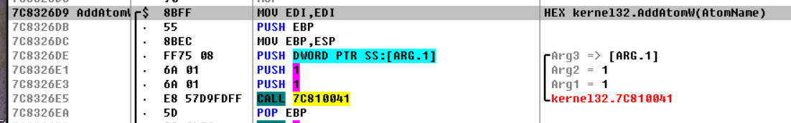

则该处就为AddConsoleAliasA函数的实际虚拟地址。

#### 结束

到此，PE文件结构就学习结束了，自己学习一段时间后再回过头来通过博客的方式复习和加强PE文件结构的知识点，为逆向进阶打好基础，但又因为时间缘故，还有其他较为重要的事情需要做，不能完成做一个自己的控制台PE查看器的任务。对于PE文件来说还有重定位表，绑定导入表，资源表等，我还没学！！！我学了我加上来！！！！写不动了！！！！学不动了！！！


